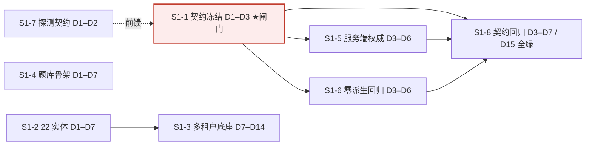

# GTL1 · Sprint 1~2 详细排期与验收标准

**日期**：2026-09-19
**出具**：路径（Roadie）· 路线图规划师 · 产品战略团队
**性质**：**可排期开工件**（非交付物，非范围变更）—— 把《Sprint 1 开工派工单》的 8 项任务细化到 **day-level**，供工程直接认领开工
**基准**：派工单（2026-09-19）· PRD **v1.25** · 路线图 **v1.28** · 裁定单（**未签署**）· 协议层测试报告（2026-09-19）
**触发指令**：业务方「你把文档要做的事赶紧全部做完，不能耽误开发」

---

## 📌 TL;DR（3~5 行）

- **第 1 批今天即可开工**：S1-1~S1-8 逐项已细化到 D1~D15，唯一闸门 = **D3 三端契约冻结（M1）**。
- **关键路径**：`S1-1 契约冻结(D3) → S1-5/6/7/8`；**S1-2 → S1-3 是第二条长链（多租户 D14 收口）**。四条线可并行（后 2 人 / 前 1 人 / 测 1 人 = 假设）。
- **第 2 批（改善率/判定/退款门禁/状态机）** 全部 **等 Q10/Q11/Q17 签字**，本件只给**条件排期骨架**，不假定签字已到。
- **手环支线（第 3 批）单独一块、明确「不上关键路径」**：真机最小 4 步一枪定生死，任一步不通回退 M-APP。
- **未取证项一律 TBD**（N / s / f、厂商真包、224 题、裁定单签字时点），**不编数**。

---

## 🎯 核心结论卡片

| 项目 | 内容 |
|------|------|
| 本件覆盖 | Sprint 1（D1~D15，8 项 day-level）+ Sprint 2 骨架（条件排期）+ 手环支线独立排期 |
| 排期前提 | 后端 2~3 / 前端 1 / 测试 1（**假设值**，未经资源确认） |
| 唯一硬闸门 | **D3 契约冻结（M1）**——所有下游契约消费者的闸门 |
| 可并行度 | S1-1/S1-2/S1-4 **完全并行**；S1-5/6/8 待 S1-1；S1-3 待 S1-2 |
| Sprint 1 阻塞 | **无外部阻塞**（不依赖签字、不依赖真机） |
| Sprint 2 阻塞 | **Q10 / Q11 / Q17 签字**（无兜底 = 带 3~5 周返工风险）（⚠️ 「3~5 周」为 **Q10+Q11 合计量级**；Q11 已于 2026-09-19 授权冻结、返工风险归零，现存敞口 = **Q10 单项工程返工 ≈1~2 周**；量级已于 2026-09-20 统一） |
| 手环支线 | 单独排期、**不上关键路径**；4 把钥匙中 3 把在厂商侧 |
| 风险等级 | Sprint 1 低；Sprint 2 中高（裁定迟定）；手环 中（生死项单一） |

---

## 一、排期前提与约束

### 1.1 人力假设（⚠️ 假设值，须资源方确认）

| 角色 | 假设人数 | Sprint 1 承担 | 备注 |
|------|----------|---------------|------|
| 后端主程 | 1（含在下列后端内）| S1-1 契约冻结 | 闸门责任人 |
| 后端 A（数据/多租户）| 1 | S1-2 / S1-3 | 第二条长链主力 |
| 后端 B（引擎/契约）| 1 | S1-4 / S1-5 / S1-7 | 与 A 可并行 |
| 前端 | 1 | S1-6 | 小程序字段白名单回归 |
| 测试 | 1 | S1-8 / S1-3 越权用例 | 权限/契约专项 |

> **合计假设 = 后端 2~3 + 前端 1 + 测试 1**（与人日估算口径无关，仅作**岗位编制假设**）。若后端仅 2 人，S1-3 与 S1-4 需串行，`D14 双里程碑（M3/M4）` **有滑至 D16~D17 的风险**（见 §六 缓冲）。

### 1.2 日历约束

| 约束 | 内容 | 影响 |
|------|------|------|
| 迭代长度 | Sprint 1 = **D1~D15**（约 3 周）；D1 = 派工日 2026-09-19 次日 | 本件所有 Dn 相对 D1 |
| 内容日历 | **224 题定稿 6~8 周**（经络师出题）| **不落在 Sprint 1~2 关键路径内**，但是 P0-17 验收硬前置 → 见 TBD |
| 56 题改写 | Q14：56 题**必须先改写**方可入库 | 内容层，**研发统计无法补救**；阻断 P0-18 |
| 裁定日历 | Q10/Q11/Q17 签字时点 **未定** | 决定 Sprint 2 能否开；**建议本周内** |

### 1.3 外部依赖（Sprint 1 不阻塞、Sprint 2/3 阻塞）

| # | 外部依赖 | 归属 | 阻塞对象 | 状态 |
|---|----------|------|----------|------|
| 1 | 厂商 SDK **真包**（非 RAR 占位）| 厂商 | 手环真机验证 | ❌ 未取得 |
| 2 | **安卓真机 + 微信小程序体验版** | 我方 + 厂商 | 手环真机验证 | ⚠️ 待排窗口 |
| 3 | **裁定单签字**（Q10/Q11/Q17）| 业务方 | Sprint 2 全部 | ❌ 空签字栏 |
| 4 | **224 题定稿** + 56 题改写 | 经络师/业务方 | P0-17 收口 / P0-18 | ❌ 未开始 |
| 5 | 法务协议文本 + 电子签第三方 | 法务/采购 | ③ 签署门禁收口 | ❌ 未取得 |
| 6 | `getValidHistoryDates` 运行时实测值 **N** | 真机 | 采集 SOP 口径 | TBD |

---

## 二、Sprint 1 详细排期（day-level）

> **口径**：D1 = 开工首日；本表 Dn 为**相对日**，日期待开工日锚定后换算（**未编绝对日期**）。

### 2.1 任务明细表

| # | 任务 | 起止 | 负责角色 | 前置依赖 | DoD 验收标准（可验证/可演示）| 关键路径 |
|---|------|------|----------|----------|-------------------------------|:--------:|
| **S1-1** | 三端契约冻结（T-6）| **D1–D3** | 后端主程 | 无 | ① OpenAPI 3.0 文件 + 三端 SDK 生成配置入仓；② 客户/调理师·经络师/管理员三端接口**一次冻结并版本化**；③ 契约评审**通过（签字/评审记录）**；④ 字段可见性矩阵与原型 D1 四端矩阵**逐格一致**（119 项回归 0 冲突）| ✅ 闸门 |
| **S1-2** | 后端 22 实体建模 | **D1–D7** | 后端 A | 无 | ① ER 图 + DDL + 迁移脚本入仓；② **22 实体全覆盖**；③ 所有业务表 **100% 带 `tenant_id` 外键**；④ 迁移脚本**可重复执行**（连跑 2 次结果幂等、无报错）| ✅ 串至 S1-3 |
| **S1-3** | P0-15 多租户底座 | **D7–D14** | 后端 A + 测试 | **S1-2** | ① 租户隔离测试用例**全绿**；② 三级权限（总部/区域/门店）越权请求**返 403**（含换账号复验）；③ 跨店通兑结算链路**端到端可跑通**；④ **跨租户查询被存储层直接拒绝 + 审计日志留痕**| ✅ 长链尾 |
| **S1-4** | P0-17 题库引擎骨架 | **D1–D7** | 后端 B | 无 | ① 224 题**可导入**（用**样例题**验证，非真实定稿）；② 可**组卷**；③ 可**计分**；④ 评分口径**外置为配置项**（代码内 grep 无硬编码分值）| ❌ 并行 |
| **S1-5** | 服务端唯一权威（X-1）| **D3–D6** | 后端 B | **S1-1** | ① 依从性/AS/效果判定**只在服务端计算**；② 客户端请求派生字段**一律 403**（真请求断言）；③ 派生字段不出现在任何响应体 | ✅ |
| **S1-6** | 客户端零派生回归 | **D3–D6** | 前端 | **S1-1** | ① 小程序包内 **grep 无**派生字段与禁止字样（沿用原型 D1 断言）；② 白名单字段与契约一致；③ 产物可用于 CI 回归 | ✅ |
| **S1-7** | 手环数据接入桩 + 日期探测契约 | **D1–D2** | 后端 B | **无**（**↓见注**）| ① 手环入参/出参契约落盘；② 契约中含**「设备可用日期枚举」接口**（`getValidHistoryDates` 探测结果上报）；③ **N 取运行时探测值，代码/契约内无硬编码 N** | ✅ 前馈 S1-1 |
| **S1-8** | 契约回归测试框架 | **D3–D7**（框架）/ **D11–D15**（全绿）| 测试 | **S1-1** | ① 三端 SDK 与契约字段**逐一比对**，不一致即**失败**；② 用例集入 CI；③ **D15 契约回归全绿**（0 失败）| ✅ 收口 |

> **注（对本件蓝本的 1 处细化）**：派工单把 S1-7 的依赖标为 S1-1，但 S1-7 的产出（探测接口）**必须被 D3 冻结的契约包含**。故本件将其调整为 **D1–D2 前馈 S1-1**（先起草、D3 并入冻结），避免「契约要含它、它却等契约」的环路。此为排期细化，**不改变任务内容与范围**。

### 2.2 缺口原因/可见性字段组（S1-1 冻结内容，一次定死）

| 字段组 | 客户(小程序) | 调理师·经络师(APP) | 管理员(Web) | 门店客服 |
|--------|:---:|:---:|:---:|:---:|
| 手环原始数据（步数/心率/睡眠…）| ✅ 仅数据本身 | ✅ | ✅ | 无端 |
| 依从性 / AS / 效果判定 | ❌ 403 | ✅ | ✅ | 无端 |
| 缺口原因 `gap_reason` | ❌ 403 | ✅ | ✅ | 无端 |
| 手环接入状态（未接入/同步中/失败）| ✅ | ✅ | ✅ | 无端 |
| 服务调整类文案 | ❌ | ⚠️ 仅经络师 + 管理员 | ✅ | 无端 |

> 契约**不得**与本表冲突；本表与原型 D1「四端可见性矩阵」一一对应，**CI 已作为回归基线（119 项全绿）**。

### 2.3 措辞纪律（第 1 批即生效，S1-6 交付前自检）

| 场景 | 禁止 | 替代 |
|------|------|------|
| 客户可见文案 | 「退款」类字样 | 服务调整 / 资金处理 |
| 客户可见文案 | 「诊断」类字样 | 评估 / 判定 / 建议 |
| 客户可见文案 | 派生结论 | 仅数据本身 + 中性正向计数 |
| 同步时间 | 精确到分秒 | **精确到日** |
| 未接入态 | 0 值/空图表/示例数据 | 明示「手环未接入」|
| 派生结论颜色 | 表述"不利"的色 | 中性色 |

---

## 三、依赖关系图

### 3.1 时序（mermaid）

### 3.2 并行/串行判定（文字表）

| 关系 | 任务对 | 说明 |
|------|--------|------|
| **可完全并行** | S1-1 ‖ S1-2 ‖ S1-4 | 三条线互不依赖，D1 同时启动；S1-7 并入 S1-1 这条 |
| **必须串行** | S1-2 → S1-3 | 多租户底座依赖实体建模（含 `tenant_id`）|
| **必须串行（闸门）** | S1-1 → {S1-5, S1-6, S1-8} | 契约不冻结，下游无参照，启动即返工 |
| **收敛点** | {S1-5, S1-6, S1-7} → S1-8 | 三端产物齐备后回归才可能全绿（D15）|
| **无外部依赖** | 全部 S1-* | 第 1 批**不依赖**裁定单签字 / 手环真机（路线图正文级条款）|

---

## 四、Sprint 2 展望（条件排期骨架 · 不假定签字已到）

> **总原则**：Sprint 2 全部任务 **等待裁定单签字**，本件只给**骨架与前置条件**，给出「若 A 则 / 若 B 则」条件排期，**不替业务方判定**。

### 4.1 任务骨架与前置条件

| # | 任务 | 编号核对 | **前置条件（硬）** | 签发前可否动骨架 | 预期量级 |
|---|------|----------|---------------------|:---:|----------|
| SW2-1 | 状态机 + 门禁 + 准入向导 | P0-01/02/07/08/17 | **Q11 签字**（疗程口径）+ 法务协议文本（外部）| ⚠️ 可动骨架，**不能收口** | L |
| SW2-2 | 判定引擎参数落库（四分支）| P0-12 / P0-13 | **Q10 签字** + 回测数据（≥80% 一致率校准）| ⚠️ 可动，门槛未校准 | L |
| SW2-3 | 改善率引擎（同源/baseline_zero/负值不截断）| ⚠️ **命名待核**（见注）| **P0-17 收口 + P0-18 题组锁定 + 224 题定稿 + Q14 56 题改写** | ❌ 内容未定不可收口 | L |
| SW2-4 | 退款门禁 / 工单挽留 | P0-14 | **Q10 签字**（对外承诺口径）| ⚠️ 可见性已冻结，**无返工风险**可动 | L |
| SW2-5 | 退款诉求代录与 24h 回执（代录纪律）| 正文 **P0-19** | `refund_visibility` **冻结时点已达成**（客服❌/督导✅）→ **可无返工风险开工**；**开工后改口 = +2~4 人日** | ✅ 可动 | M（11~17 人日）|
| SW2-6 | 移动端（调理师/经络师 APP 作业面）| A1 增项账 | **Q17 签字**（端形态）；**逾期未签按默认 A 立项、不回溯** | ❌ 移动端开工前必签 | 8~16 / 13~27 / 3~9 人日（三选项）|

> **注（编号冲突提示，务必核对）**：派工单所称「**P0-19 改善率引擎**」在路线图 v1.2+ 中已统一为 **P0-22 改善率引擎**；而 **正文 P0-19 = 退款诉求代录纪律**（Phase 1）。两者**同名不同物**。本件 SW2-3 按「改善率引擎」实体处理，**编号以 PD/工程评审时点为准**，请 team-lead 在汇总时统一口径。

### 4.2 条件排期（若签字有时点）

| 情形 | 触发 | 可开工项 | 排期后果 |
|------|------|----------|----------|
| **A · 签字本周内到** | Q10/Q11/Q17 圈选 + 批准 | SW2-1~6 全量 | Sprint 2 可按期铺开，**返工风险 ≈0** |
| **B · 仅 Q17 到** | Q10/Q11 未签 | 仅 SW2-6 移动端 + SW2-5 代录 | 判定/状态机/退款门禁**顺延**；带 **≈3~5 周返工风险**（⚠️ 为 **Q10+Q11 合计量级**；Q11 已于 2026-09-19 授权冻结、返工风险归零，现存敞口 = **Q10 单项工程返工 ≈1~2 周**；量级已于 2026-09-20 统一） |
| **C · 全未签** | 空签字栏 | 仅 SW2-5（可见性已冻结）| **Q17 逾期即按默认 A 立项并计费**；Q10/Q11 无兜底 = **明知返工仍开工** |

---

## 五、手环支线独立排期（第 3 批 · **不上关键路径**）

> **路线图正文级条款**：**「手环不上关键路径」**——自愿、缺失不阻断、只进依从性。**手环未实测项不得拖住主链路开工。** 故本节**独立排期，不与 Sprint 1/2 混排**。

### 5.1 真机验证最小 4 步（一枪定生死）

| 步 | 动作 | 判定「通过」| 判定「不通」→ 分岔 |
|:--:|------|-------------|--------------------|
| ① | **配对**（真机 BLE 扫描 + 连接 GTL1）| 设备可被发现并连接 | 回退 **M-APP** |
| ② | `getVersion()` | 返回 `bufferSize=4000` / `version` / `model` | 回退 M-APP |
| ③ | `getStepHistory({今日})` | 返回 `interval` + `year/month/day` + 数据数组 | 回退 M-APP |
| ④ | `getValidHistoryDates(HistoryType)` | 返回 `validHistoryDates[]`（**实测 N**）| ④ 单独不通 = **降级为「N 不可探测」，回问询 #19**，未必整条出局 |

**全通判定**：`M-WX-FG` 可开工 → **③④ 的实测 N 反哺 A3 模型**，补拉起始日 `max(last_synced+1, today−N)` 用**运行时值**。
**任一前 3 步不通**：`M-WX-FG` 需**回退到 M-APP**（config #44 已保留该选项，**回退成本可控**）。

### 5.2 支线排期（相对日，独立于 D1~D15）

| 阶段 | 内容 | 前置 | 归属 | 量级 |
|------|------|------|------|------|
| P3-0 | 厂商索取 **SDK 真包** + 小程序支持书面确认 | 发函 | 采购/对接 | 今天发函 |
| P3-1 | 排**安卓真机 + 微信小程序体验版**窗口 | 真包 | 工程 | 本周内 |
| P3-2 | 编写真机验证脚本（按 §5.1 最小 4 步）| — | 工程 | 与 P3-1 同步 |
| P3-3 | 真机 BLE 实测（**生死项**）| P3-1/P3-2 | 工程 | 1 枪（半日~1 日）|
| P3-4a | 通 → 采集 SOP + 补拉接入 | P3-3 通过 | 工程 | +6~15 人日（手写协议层，若编译不通）|
| P3-4b | 不通 → **回退 M-APP**（config #44）| P3-3 不通 | 工程/产品 | 走 M-APP 方案，成本可控 |

### 5.3 支线 4 把钥匙（3 把在厂商侧）

| # | 钥匙 | 归属 | 拿不到的后果 |
|:--:|------|------|--------------|
| 1 | uniapp → mp-weixin 编译 + 真机 BLE 实测 | 厂商 + 我方 | 编译不通 → 手写协议层 +6~15 人日，或退回装即米 App |
| 2 | 是否强制**厂商账号激活**（A13）| 厂商 | 强制 → `M-WX-FG` **整体出局** |
| 3 | 留存窗口 **N**（问询 #19）| 厂商 | 「多久必须打开一次」无法定稿 → 采集 SOP 卡住（**`getValidHistoryDates` 已降级为可实测**）|
| 4 | **A6 无数据语义**（问询 #21）| 厂商 | 无法区分「超窗口」与「客户没戴」→ **冤枉客户风险** |

---

## 六、风险与缓冲

### 6.1 排期风险登记（本件范围内）

| # | 风险 | 触发信号 | 影响 | 缓冲 / 缓解 |
|---|------|----------|------|-------------|
| P-R1 | **Q10/Q11/Q17 迟定** → 最贵三处返工点 | Phase 0.5 启动时仍未签 | **≈3~5 周返工**（Q10 退款口径 / Q11 状态机 / Q17 端形态）（⚠️ 为 **Q10+Q11 合计量级**；Q11 已于 2026-09-19 授权冻结、返工风险归零，现存敞口 = **Q10 单项工程返工 ≈1~2 周**；量级已于 2026-09-20 统一）| 设**裁定截止日**（建议本周内）；字段**双口径双写**（`visible_to_customer` 开关 + `service_phase` 并存）；状态机**预留配置位** |
| P-R2 | **224 题定稿滑期**（6~8 周日历约束）| 距 Phase 0.5 末 4 周完成率 < 60% | P0-17 验收被卡死 → Phase 0.5 顺延 → 拖累 Phase 1 | **内容先行、研发并行**；分批冻结（先 M1–M4 常用维度，M5 后补）；**题库定稿日设硬里程碑** |
| P-R3 | **厂商真包/真机迟到** | 真包未到 / 无真机 | 手环支线无法一枪定生死 | **不与主链混排**；到即测（半日）；不通即回退 M-APP |
| P-R4 | **人力下限（后端仅 2 人）** | 资源未确认 | S1-3 与 S1-4 争同一后端 → D14 双里程碑滑 | 见 6.2 缓冲；或 S1-4 降级为「Schema 先行、组卷延后」 |
| P-R5 | **S1-1 契约冻结超 D3** | D3 评审未过 | **所有下游（S1-5/6/8）停摆** | D1 启动、D2 内部预审、**D3 硬冻结**；争议项**先冻结主流、边缘字段走 v1.1 增量** |
| P-R6 | **命名冲突（P0-19/P0-22）** | 需求追溯错位 | 交付物挂错编号 | 汇总时统一口径（见 §4.1 注）|

### 6.2 缓冲建议

| 缓冲位 | 建议 | 说明 |
|--------|------|------|
| 契约冻结 | **D3 硬闸门 + D2 预审** | 不接受顺延；边缘字段走版本增量 |
| 多租户底座 | **D14 收口，预留 D15 缓冲** | 越权用例不绿不进 M3 |
| 契约回归 | **D11–D15 独立窗口** | 待 S1-5/6/7 产物齐备后一次性跑全绿 |
| Sprint 2 | **签字未到即不启动重活** | 仅 SW2-5 可先行；避免「带返工风险开工」|
| 手环 | **不占主链缓冲** | 支线独立，不通即回退 |

### 6.3 「若签字迟到」应对预案

| 场景 | 预案 |
|------|------|
| Q10 迟到 | SW2-2/SW2-4 **只搭参数骨架**（阈值/公式外置配置），**不落对客文案**；待签再收口 |
| Q11 迟到 | 状态机**预留配置位 + 双口径字段双写**；禁止把 15~45 次 / 2 期口径写死 |
| Q17 迟到 | **逾期按默认 A 立项、不回溯**（路线图条款）；移动端不启动实际开发量 |
| 全部迟到 | 主链 **Sprint 1 照常跑完**；Sprint 2 仅推进 SW2-5（无返工风险）；其余挂起待签 |

---

## 七、里程碑表

| 里程碑 | 时点 | 内容 | **可演示标准（Demo-able）** |
|--------|:----:|------|------------------------------|
| **M1 契约冻结** | **D3** | S1-1 三端契约冻结 | 三端接口一次冻结 + SDK 生成配置入仓；契约评审通过；字段矩阵与原型 D1 **逐格一致** |
| **M2 实体可跑** | **D7** | S1-2 实体 + 迁移 | 22 实体 DDL 入仓；**迁移连跑 2 次幂等**；所有业务表带 `tenant_id` |
| **M3 底座越权** | **D14** | S1-3 多租户底座 | **换账号**演示：A 租户查 B 租户客户被**存储层拒绝（403 + 审计日志）**；三级权限越权 403 |
| **M4 权威闭环** | **D14** | S1-4 题库骨架 + S1-5/6 服务端权威 | 样例题可导入/组卷/计分；客户端请求派生字段**真返 403**；小程序包 grep 无派生字样 |
| **M5 契约全绿** | **D15** | S1-8 契约回归 | 三端 SDK 与契约**逐一比对 0 失败**；用例入 CI |

---

## 八、TBD 占位清单（排期上未决，**不得编数**）

| # | TBD 项 | 现状 | 谁取证 | 阻塞对象 |
|:--:|--------|------|--------|----------|
| T-1 | 设备留存窗口 **N** | 可运行时实测（`getValidHistoryDates`）| 真机 | 采集 SOP 口径（**代码不填假值**）|
| T-2 | 单次同步成功率 **s** | 未取证 | 运行时/真机 | A3 模型 |
| T-3 | 观测率 **f** | 未取证 | 运行时/真机 | 缺口判定 |
| T-4 | 厂商 **SDK 真包**交付时点 | 未取得（现有为 RAR 占位）| 厂商 | 手环支线 P3-3 |
| T-5 | **224 题定稿**时点 | 未开始（6~8 周日历）| 经络师/业务方 | P0-17 收口 / SW2-3 |
| T-6 | **裁定单签字**时点（Q10/Q11/Q17）| 空签字栏 | 业务方/产品负责人 | Sprint 2 全部 |
| T-7 | D1 绝对开工日 | 未锚定 | PM | 全表日期换算 |
| T-8 | 「P0-19」编号口径（改善率 vs 代录）| 冲突 | PD/工程评审 | 需求追溯 |

---

## ✅ 行动清单

| # | 行动 | 负责方 | 时间窗 |
|:--:|------|--------|--------|
| 1 | 认领 S1-1~S1-8，按 §二 day-level 排班 | PM + 工程 | 今天 |
| 2 | **D3 前冻结三端契约**（闸门项，含 S1-7 探测接口并入）| 后端主程 | D3 |
| 3 | 后端 22 实体出 ER + DDL + 可重复迁移 | 后端 A | D7 |
| 4 | 多租户底座 + 越权用例（换账号复验）| 后端 A + 测试 | D14 |
| 5 | 契约回归框架入 CI，D15 全绿 | 测试 | D11–D15 |
| 6 | 发函厂商索取 **SDK 真包** + 排真机窗口 | 采购/对接 | 今天发函 |
| 7 | 编写真机验证脚本（§5.1 最小 4 步）| 工程 | 与真机窗口同步 |
| 8 | **催裁定单签字（Q10/Q11/Q17）** | 产品 | 本周内 |
| 9 | 224 题出题立项 + 分批冻结（先 M1–M4）| 业务/经络师 | 立即启动 |
| 10 | 统一「P0-19」编号口径（改善率 vs 代录）| team-lead | 汇总时 |

---

## ⚠️ 待确认 / 假设 / Non-goals

- **假设**：人力 = 后端 2~3 / 前端 1 / 测试 1（**未经资源方确认**）；D1 开工日待锚定。
- **假设**：S1-2「22 实体」边界以 DDL 评审为准（当前为分组建议）。
- **待确认**：SW2-3 编号（P0-19 改善率引擎 vs P0-22）；S1-7 依赖关系本件已细化为「前馈 S1-1」。
- **不越权**：Q10/Q11/Q17 的选择**由业务方裁定**，本件只做「若 A 则 / 若 B 则」条件排期。
- **Non-goals（Sprint 1 不做）**：判定引擎正式逻辑、改善率引擎、门禁规则收口、手环真机联调、SDK 源码审计。
- **TBD（不得编数）**：N / s / f、厂商真包、224 题定稿、裁定单签字时点 —— 见 §八。

---

## 📚 数据来源

| 来源 | 路径 |
|------|------|
| Sprint 1 派工单 | `_work/dev-sprint1-kickoff-2026-09-19.md` |
| 开工就绪度核对 | `_work/dev-kickoff-readiness-check-2026-09-19.md` |
| 协议层测试报告 | `_work/gtl1-wx-open-sync-sdk-proto-test-2026-09-19.md` |
| 路线图 v1.28 | `roadmap-health-mgmt-saas-2026-09-16.md` |
| 原型自检基线 | `prototype/_proto_verify_result.txt`（119 PASS）|
| 裁定单（未签署）| `ruling-sheet-2026-09-16.md` |

---

> 本件由产品战略团队 AI 协作生成，重要决策请由产品负责人审定。**所有未取证的时点/指标一律 TBD，排期数字为假设值，不得作为对外承诺。**