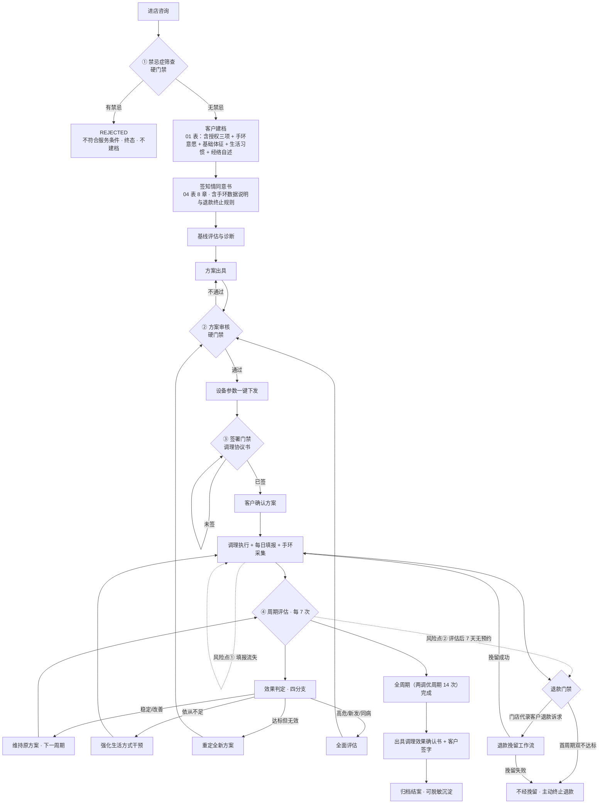

# 调元云 · 连锁健康管理调优 SaaS —— 产品功能规格书（PRD）

| 项目 | 内容 |
|---|---|
| **文档类型** | PRD（产品需求文档）/ 功能规格书 |
| **产品名（暂定）** | 调元云 · 连锁健康管理调优 SaaS |
| **日期** | **2026-09-16** |
| **版本** | **v1.33**（对齐原型 v0.4；变更记录见附录 B） |
| **参与成员** | 析客（需求分析师）· 瑞思（用户研究员）· 竞析（竞品分析师）· 数析（数据分析师）· 路径（路线图规划师） |
| **主理人** | 产品总监 |
| **源文档** | 《健康管理功能流程图 v2.1 会议修订·走线优化版》（连锁中医调理门店线下服务作业流程） |

---

## 📌 TL;DR

把线下"禁忌排查 → 评估 → 出方案 → 审核 → 签协议 → 调理 → 再评估"的人工闭环，做成**跨门店不可绕过的系统状态机**：4 道硬门禁由系统阻断而非人工提示，判定阈值总部集中配置、门店只读，客户属于品牌可跨店通兑。

**核心目标**：把"效果判定"从各店口径不一的自由裁量，变成**可审计的「对内判定建议 + 置信度」**（核心指标为主判据 + 依从性门槛）——**对外不直出结论**，最终结论保留 06 表的「□协议 □负责人判定 □双方协商」。**产品定位：不是"判定该不该退"的引擎，而是"让每一次协商都有据可依"的系统；对外卖点 = 证据链完整率 / 周期复评完成率 / 争议一次举证通过率。**

**关键决策**：① 效果判定 = 门槛制（`有效 = 核心指标改善/稳定 且 AS_refund ≥ 0.8`），不做加权总分；② 手环数据只进「依从性」、绝不进「效果主判据」，结构性缺失不扣分；③ 门禁一律系统级硬阻断，旁路即违规且留痕可稽核；④ **手环数据四端皆可见，但客户端只给「数据本身」、不给「由它推导出的依从性与退款结论」**（§2.6 W-1 硬约束）；⑤ **手环采集的"自动/定时"能力受微信平台限制，「由小程序自动定时采集」不成立**；⑥ **业务方 2026-09-19 拍板：先做小程序、不新增原生 App ⇒ 采集模式冻结为 `M-WX-FG`（打开小程序即自动发起同步，无需点击）** —— **可保证"打开即自动触发"，不可保证"打开必同步成功"**；**须以「设备端历史补拉」解耦"数据产生时刻"与"同步时刻"，把"每天必须打开"降为"每 N 天内打开一次"**（§2.8.7，Q-G5 已收敛）。

**下一步**：研发评审需求池工作量 → 对齐待确认问题（尤其是经络师"自出自审"内控弱点）→ 进入路线图与 Sprint 规划。

---

## 🎯 核心结论卡片

| 维度 | 结论 |
|---|---|
| **推荐方案** | 自用优先、多门店 SaaS 形态。先在自有连锁跑通标准作业与数据资产，再把"**证据链完整率 / 周期复评完成率 / 争议一次举证通过率**"三项可计量能力打包对外交付（**效果判定本身仅作对内能力，不对外直出**）。 |
| **优先级** | P0 共 19 项（硬门禁 + 判定引擎 + 题库质量校验 + 代录纪律 + 多租户底座），构成不可分解的最小可运行闭环；P1 9 项（沉淀与治理）；P2 3 项（增值与商业化）。 |
| **预期影响** | 退款争议从"各店口径不一"转为"规则前置 + 判定留痕"，退款率、争议率可被统一度量与管控；ECC 北极星把效果与风控绑进同一指标。 |
| **资源需求** | 粗估 **P0 ≈ 132~200 人日**（19 项，粗略量级，需研发评审）；另需法务共建协议/授权文本、设备厂商适配层（无标准协议）。 |
| **风险等级** | **中高**。主要风险：① 流程过重导致门店执行率下降（需移动化 + 极简交互对冲）；② 中医效果判定缺循证标准，规则易被质疑主观（须人工终审 + 全程留痕）；③ 效果类退款协商可能引发集中索赔，以及**销售端口头承诺与协议口径落差**（已通过 Non-goals #9 对外禁用绝对化承诺性表述缓解，落差检测见 Q15）。 |

---

## ✅ 行动清单

| # | 行动 | 负责方 | 时间窗 |
|---|---|---|---|
| 1 | 研发评审 P0 需求池工作量与新协议集成可行性 | 研发负责人 | 第 1 周 |
| 2 | 确认 3 个高优先级待确认问题（判定引擎口径 / 审核流形态 / 计费口径） | 产品负责人 + 法务 | 第 1 周 |
| 3 | 法务共建《知情同意书》《调理协议书》文本（含授权范围、**退款/终止条款（对外不出现绝对化/承诺性表述）**、数据使用授权） | 法务 + 析客 | 第 1~2 周 |
| 4 | 对接手环数据源（对齐 HUAWEI Health Service Kit 字段 Schema）+ 设备厂商参数下发适配层初评 | 研发 + 硬件 | 第 2 周 |
| 5 | 数据基础设施：`tenant_id` 存储层隔离方案 + 判定依据落库规范评审 | 架构 + 数析 | 第 2 周 |
| 6 | 依从性阈值（0.8）与判定规则用门店历史数据做初步回测校准 | 数析 | 第 3 周 |
| 7 | 拟制门店冷启动 SOP 与"四道闸门"培训材料，抑制门店绕过系统的动机 | 运营 + 瑞思 | 第 3~4 周 |
| 8 | 建立 **ECC、退款率、签署合规率、可判定覆盖率** *四条* 护栏指标的月度复盘机制（**原三条 → 加「可判定覆盖率」**，数析 §11.2 纳管建议，v1.11 落） | 数析 + 总部运营 | 上线前 2 周 |

---

## ⚠️ 待确认 / 假设 / Non-goals

**关键假设（未验证）**
- 自有连锁的门店数量与单店月均活跃客户数足以支撑 HSI 排名（<20 结案疗程的门店不参与排名，见 C5 护栏）。
- 门店愿意接受"系统级硬门禁"带来的流程刚性，而非绕过系统继续用纸质/微信作业。
- 设备厂商可提供（或可被适配层桥接）参数下行的接口能力。

**非目标（Non-goals，详见第 9 章）**
- 不做挂号/收费/进销存/发药（与 ABC 诊所管家等并存而非替代）。
- 不出具医疗诊断结论（合规边界：定位为服务履约与风控层，非诊疗系统）。
- 不强制手环佩戴（源文档明确"手环佩戴完全自愿"）。
- 不允许门店自行修改判定阈值与效果判定分支规则。

**待确认问题**：见第 10 章（Q1–Q8 + Q15/Q16；业务侧待裁定 Q10–Q14/Y1–Y4 见附录 C.6）。

---

## 📚 数据来源 & 成员产出索引

| 成员 | 角色 | 核心贡献（本文中对应章节） |
|---|---|---|
| **析客** | 需求分析师 | PRD 全文框架、需求池 P0/P1/P2 与验收标准、数据模型、判定引擎决策表、可配置项清单、范围管理与 Non-goals（第 6/7/8/9/10 章 + 收口区） |
| **瑞思** | 用户研究员 | 5 类角色画像与 JTBD、痛点 Top5、三个反直觉洞察（含置信度）、8 条设计启示、5 则关键用户故事（第 2/3 章）；**追加"多门店用户侧硬约束 3 条"（档案归属客户/服务次数全局账本/退款为内部事务不对外露出）并已织入 P0-03/11/14/15/19 与数据模型（第 3 章补充 + 第 6/8 章）；**v1.9：U3 按业务方规则反转为"退款不向客户端露出"，配套新增 §2.2 可见性矩阵 + P0-19 代录纪律** |
| **竞析** | 竞品分析师 | 8 个真实竞品全景、功能对比矩阵关键结论、市场数据与趋势、SWOT、5 条差异化机会、vs ABC Battle Card（第 4 章） |
| **数析** | 数据分析师 | ECC 北极星定义、6 类/15 个指标树、11 步漏斗含 3 硬门禁、依从性模型 AS v2（门槛制 + 缺失值分流）、效果判定规则表 B6、HSI 模型、跨店责任拆分规则（第 5 章 + 第 7 章状态机/决策表） |

**外部事实来源（沿用汇编已标注来源，未新增）**：中研普华（2024/2025）中医养生市场规模；IDC 2025 腕戴设备出货；《中国全科医学》2026 NMPA DTx 器械统计；Hermsen et al. JMIR mHealth 2017（手环依从衰减，PMID 29084709）；Nowell et al. JMIR Human Factors 2023；AppsFlyer/Adjust 2023 移动健康留存；AEA Research Highlights（满意保证兑现率）。

---

---

# 正文

## 1. 产品目标

三个**正交**目标，每个可独立衡量：

| # | 目标 | 衡量指标（目标值） |
|---|---|---|
| **G1** | **安全合规零旁路** —— 4 道硬门禁成为系统级阻断，人工无法绕过 | 协议签署合规率 = **100%**（已签协议疗程 / 已出方案疗程）；禁忌筛查留痕率 = 100%；变更后 24h 重签及时率 ≥ 90%（**建议值，需真实数据校准**） |
| **G2** | **退款风控可度量** —— "无效"口径统一、判定依据落库、争议可归因 | 北极星 **ECC**（有效结案疗程数）环比增长；退款争议率 < 5%（**建议值**）；挽留成功率 ≥ 30%（**建议值**） |
| **G3** | **服务过程可复制** —— 门店 SOP 不依赖"老员工靠谱"，新店可冷启动 | 总部模板采纳率 ≥ 70%；小程序每日填报率 ≥ 80%；方案一次审核通过率 ≥ 70%（**均为建议值，需真实数据校准**） |

> **北极星指标定义（数析）**：`ECC = Σ 疗程 ([已结案] × [效果 ∈ {稳定,改善}] × [退款=否])`；按结案时间归月，跨月不重复计，同一客户多疗程分别计数。反博弈：不用续费率/GMV（诱导压单拒退）；效果判定双轨（人工录入 + 系统计算）；依从性对"未同意佩戴"不计分。
>
> **【v1.11 裁定 · 分子分母口径（数析 §11.1）】**：**分母 = 本期结案且基线创建于上线后的全部疗程（含 `migratable=false`，不剔除任何一例）**；**分子 = `[effect_verdict ∈ {E1,E2,E3}] AND [退款=否]`**。`migratable=false` → 效果**不可判定** → `effect_verdict = NULL` → **不满足分子条件 → 自然不入分子**（**无需额外写排除规则**）。**一句话理由：ECC 主张"有效果"就必须能举证效果；举证不了的疗程不能进分子，但也不能从分母里消失** —— 否则分母可被清洗，ECC 立刻变成可粉饰的指标。**只扣一次，且扣在分子。**
>
> **【v1.13 措辞硬性禁止】**：**禁止**出现"分母 = 全部已归档结案疗程"这类**裸表述** —— 它可两读（legacy 留分母 / legacy 移出分母），是本条歧义的历史源头。**必须**写成「**分母 = 本期结案且基线创建于上线后的全部疗程（含 `migratable=false`，不剔除）**」。
>
> **【v1.13 裁定 · `legacy` 的定义与边界（数析 §11.1 护栏 + v1.4.1 更正）】**：
> - **定义**：`legacy = baseline_assessment.created_at < 上线日` —— 依据是**基线创建时点，不是结案时点**。
> - **为什么必须是基线时点**：按结案时点定义，则"**上线前建档、上线后结案**"的疗程会**漏进当期分母** —— 它们基线没有元数据、却结案于本期，**legacy 污染一点没堵住**。决定"能否判定"的是**基线元数据是否经系统采集**，而基线在**疗程开始时**就已固定。
> - **落法 = 界定统计总体，不是写排除规则**：本指标的统计总体**从一开始**就被定义为「本系统流程产出、且本期结案的疗程」，legacy 是**從一開始就沒進池**，**不存在"把疗程从分母里拿掉"的动作** —— 因此与上文"分母不可清洗"原则**不矛盾**（该原则约束的是**总体内部**不得因 `migratable=false` 而剔除，不是说必须把任何历史遗留物都纳进分母）。
> - **处理**：`legacy` **单独成组，不进任何比率的分子与分母**；**报表底部显示 legacy 数量**（防止"老赖在的漏识别"）；**历史欠账 ≠ 现行过程缺陷**，故不进入上线后的 ECC 趋势基线。
>
> **【禁止单独汇报 ECC】**：ECC 报表卡片**默认同时展示三个数** —— **ECC 数 / 分母（结案疗程数）/ 可判定覆盖率**；**只报 ECC 一个数 = 只报分子不报分母，等于半个指标**（数析 §11.2，阈值见 config **#41**）。
>
> **【两个覆盖率（v1.13 定稿 · 数析 v1.4.1）】**
> - **主指标 · 期间可判定覆盖率（告警用）** = `本期结案 且「基线创建于上线后」的疗程中 migratable=true 的数量 / 本期结案且基线创建于上线后的疗程数`；**legacy 不进本式分子与分母**。
> - **副指标 · 累计覆盖率（含 legacy，仅展示不告警）** = `上线至今全部已归档结案疗程中 migratable=true 的数量 / 上线至今全部已归档结案疗程数`；分母**含 legacy 自己**（不按基线时点过滤），**legacy 若元数据被补齐也计入分子** → 天生是**欠账清理进度指示器**（补齐一条，分子 +1）；归期为**累计（上线至今）**，不按月。
> - **同卡片展示两者差值**：`累计覆盖率 − 期间覆盖率 = 历史欠账残留量的显影`，两者随时间收敛，**差值归零即欠账清完**（两数已同卡片展示，**差值为 0 人日**；收敛趋势图属新增开发项，不在本版范围）。

> **ECC 口径修正（v1.7，v1.11 复核无冲突）**：`效果 ∈ {稳定,改善}` 展开为 `effect_verdict ∈ {E1,E2,E3}` 且须**同源可测**（0–4 五级）；因 0–4 为 02 表**原生量程**、历史基线迁移率 **100%**，**取消"不可迁移疗程不计入 ECC"**（全量历史 ECC 可重算）；仅 `source_unverifiable`（缺题组 ID / 测量人）**不得单独作退款判定依据**（同源问题，非量程问题）。
>
> **【v1.11 明确】**：上句"仍可计入纵向趋势"**不再含糊** —— `source_unverifiable` / `migratable=false` 的疗程**计入 ECC 分母、不计入分子**（因效果不可判定），与 C.4 P0-23 验收口径**同一条规则、只扣一次**。
>
> **【双面原则（v1.11 新增 · 数析 §11.3，写进 PRD 设计约束）】**：**证据不足时，既不罚客户，也不奖自己。**
> - **退款侧**：缺同源元数据者**不得用作对客户不利的依据**（走协商制、不走公式直退；04 表 §四、06 表 §五 原话精神）。
> - **ECC 侧**：同时也**不得计入我们的有效产出**（不入分子）。
>
> 二者**同源于"证据不足者不得作为任一方的主张"，方向相反、互不矛盾**。

---

## 2. 用户故事

覆盖三级组织 + 客户，每条含 SaaS 维度。核心场景摘录自瑞思 A5，并织入多门店语境：

| # | 角色 / 层级 | 用户故事 | 关键验收要点 |
|---|---|---|---|
| **US-1** | 门店/客服（门店层） | 作为门店客服，我要在客户到店时完成结构化禁忌筛查，**未通过者系统直接拦截**，避免禁忌客户进入调理环节造成不可逆风险 | 未通过排查 → 建档/出方案/下发参数**系统级硬阻断（非提示）**；答案、操作人、时间戳全量留痕可导出；禁忌项可配置，改题后对在服客户触发重筛 |
| **US-2** | 经络师（门店层） | 作为经络师，我要把方案提交—审核—驳回—通过做成有签名的状态跃迁，**不允许同一账号无痕自助通过** | 审核人与出方案人可配置为不同账号；同人自助通过需二次确认并留痕；驳回必填意见、版本号递增、历史可对比；变更后自动生成"客户重签"任务，未重签则执行页锁定 |
| **US-3** | 客户（跨店） | 作为客户，我要用 ≤30 秒的点选完成每日填报并立刻看到反馈，**换店后不必重讲病史** | 全点选无开放输入，首屏可完成；提交即回显"本周 X/7 天 + 上周对比 + 一条可执行建议"；连续 2 天漏填双推客户与调理师待办；调理师可代核/补录（须标注来源）；扫码即调全品牌档案与周期进度 |
| **US-4** | 经络师（门店层） | 作为经络师，我要在**第 7 次服务时被系统提醒**并拿到预填的三类数据，而不是靠人记第几次 | 按服务次数自动触发（7 次可配置）；支持手工提前触发；预填核心指标/依从性/设备数据并显式标注"手环缺失 N 天"；四分支选择后自动路由，分支与依据必须落库 |
| **US-5** | 门店负责人（门店层） | 作为门店负责人，我要把退款做成工单，**四种结局全部强制归档**，且首周期双不达标时系统主动止损 | 退款生成工单、原因码必填，未经原因分析不可进入终止；首周期双不达标 → 系统主动推"建议主动终止退款"，不经挽留；四种结局全部强制归档 |
| **US-6** | 区域督导（区域层） | 作为区域督导，我要看到辖区门店的健康度排名与稽核信号，**及时发现"看起来好但判定放水"的门店** | 稽核信号（判定宽松度、判定过快、方案雷同度）对门店/加盟商**不可见**；门店<20 结案疗程强制标注"样本不足"不参与排名 |
| **US-7** | 总部运营（总部层） | 作为总部运营，我要一次性修改判定阈值/禁忌清单并留变更日志，**门店只读、变更不回溯已生效判定** | 政策型配置总部唯一可改；变更写「谁改/何时/为什么/影响哪些在服务客户」；门店侧入口只读 |
| **US-8** | 加盟商（门店层） | 作为加盟商，我要在**任何门店**为客户提供服务并让业绩按贡献分配，避免跨店截客与推诿 | 客户归属品牌；ECC 以结案门店为主计，≥30% 次数在他店完成则按各店服务次数占比拆分（允许小数）；退款损失按次数占比分摊；转店必须走系统工单 |

---

### 2.1 跨店场景的三条关键设计决策（连锁特有，来源：瑞思）

| # | 场景 | 最容易怎么搞砸 | **必须这样设计** |
|---|---|---|---|
| **CS-1** | 到新店能否不重复讲病史 | B 店按"新客"重走禁忌 + 健康史，客户复述导致口径漂移、甚至漏报禁忌项 —— **硬门禁在跨店环节被绕过** | 档案归属**客户而非门店**，跨店只读共享；禁忌与健康史由首诊**锁定**，后续只能"补充 + 修订留痕"，门店无权覆盖 |
| **CS-2** | 服务次数以谁为准 | A 店承诺 45 次、B 店记录不同步，客户说做了 8 次系统只有 6 次 → **7 次评估触发点错乱 → 退款判定失真** | 服务次数是**客户维度的全局唯一账本**，跨店累计；每次核销须客户确认并标记服务门店；**评估触发只认中央计数**，门店本地记录只作对账 |
| **CS-3** | 想退款找谁 | B 店推给 A 店、A 店说"谁服务找谁"，客户被两边推 —— 这恰好打在门店对外**"效果类退款"诉求**上（该招牌表述对外已禁用，见 Non-goals #9） | **退款是内部事务，不在客户端露出**：客户端**无退款入口、无"退款"字样**；客户提出的退款诉求**由门店代为录入**（经络师 / 门店负责人，见 §2.2 可见性矩阵 + P0-19 代录纪律）；工单按"签约门店 = 责任主体"自动派单，服务店为协办，SLA 倒计时**门店与总部双向可见** |

> **CS-3 是整套设计的枢纽，但 v1.9 已按业务方规则反转。**
> **原设计（已作废）**：把退款申请入口从门店侧移到客户端，让门店的留客努力只能投向"提升效果与体验"而非"拦截诉求"。理由：加盟商收益与退款天然对立，而"劝说"发生在无第三人在场的私域对话里 —— **不可观测**，制度只能约束"会被发现"的行为。
> **业务方 v1.9 规则（生效）**：「**退款字样在客户端、调理师端都不显示，只在经络师和管理员端显示操作**」，即**退款定性为内部事务**，客户端无入口、无字样，客户诉求由门店代录（§2.2）。
> **代价（必须记账）**：入口从客户端撤走，**等于放弃"客户何时提出退款"的自动时间戳**，退款诉求的**观测权归零** —— 总部失去"哪家店在拖、拖了多久"的自动信号。因此**代录纪律（24h）+ 异常名单 + 超时自动升级是这条规则能否成立的前提**，已升为硬需求 **P0-19**（依据与来源见 P0-19；风险见 §11.4 **R4a / R4b**）。

### 2.2 退款可见性矩阵（业务方规则）

> **业务方原话（2026-09-16）**：「**退款字样在客户端、调理师端都不显示，只在经络师和管理员端显示操作。**」
>
> ⚠️ 本条**取代**原 CS-3 / U3 的"退款入口在客户端唯一"。**退款定性为内部事务，不在客户端露出。**

| 角色 | 退款可见 | 说明 |
|---|---|---|
| **客户（小程序端）** | **❌** | 不出现"退款"字样、不出现任何退款入口 |
| **调理师** | **❌** | 同上 |
| **门店客服** | **❌** | **完全不可见** —— 连"退款"字样都不出现；**不代录**（**业务方 2026-09-16 裁定**，比团队倾向"可见代录、不可审批"更严）；**且该角色不使用系统（无端 · 无系统账号）**（**业务方 2026-09-16 补充裁定**，端形态见 §2.3，连带影响见 §11.4 R4c） |
| **经络师** | **✅** | 可见可操作（**业务方指定**） |
| **门店负责人（管理员）** | **✅** | 可见可操作（**业务方指定**） |
| **区域督导** | **✅** | **可见**（可看工单与异常名单），**不参与审批**（**业务方 2026-09-16 裁定**） |
| 总部运营 | **✅** | 可见 + 稽核 |

> **上述两项原待确认项已于 2026-09-16 经业务方裁定为定值（客服 ❌ / 督导 ✅），本节不再是待确认状态。**
>
> **沿革（正文明细；标题不钉版本，时点由本注承载）**：**本矩阵的可见性规则起于 v1.9；两项曾悬空的可见性已于 v1.15 经业务方裁定为定值**。
>
> ⏳ **冻结时点（v1.10 定）· 原条款含两条性质不同的规则，现分列（不得一次标记把两条一起撤）**：
> - **条款 A（时点要求）·【已达成】**：~~两项输入必须在 `P0-19` 开工前定稿，不得延至 M4 验收前~~ → **✅ 已达成**：两项输入于 2026-09-16 定稿，早于 P0-19 开工。**保留原委（条款 A 为何重要）**：门店客服的可见性表面问"看不看得见"，实质问的是**能不能代录** —— 它决定 P0-19 的**操作人集合**、异常名单的**行级可见范围**、超时升级的**第一跳跳给谁**，三者均为**编码前输入**，不是验收前补一句即可；若留到 M4 前再定，等于让 P0-19 返工。
> - **条款 B（返工规则）·【继续有效、另行保留】**：若业务方在 P0-19 开工之后改口（**泛化：允许任何新角色（含调理师）在系统内登记 / 转交客户诉求**）→ **P0-19 增项 +2~4 人日 + 已完工部分返工**，须**重走 `refund_visibility` 冻结**；此类提议一律按「**变更业务裁定**」处理，**不得按「体验优化」处理**。**条款 B 是 R4c 的全部牙齿** —— 没有"+2~4 人日 + 返工"的代价撑着，"客服端不得有转交入口"就退化成没有威慑的建议。

**可配置项 `refund_visibility`**（见 config **#40**）：矩阵按**角色**配置，新增/调整角色时**不改代码**；**两项定值已于 2026-09-16 冻结（见上）**。

**连带影响**：① 客户提出的退款诉求**由门店代为录入**（P0-14 + **P0-19 代录纪律**）；② 客户端**不展示**退款进度与到账倒计时；③ 履约类直退的**发起方改为门店（经络师 / 门店负责人）**，算法不变（见 P0-14 / config #38）；④ **【代录唯一性】退款工单只能由经络师 / 门店负责人代录创建** —— **客户在小程序不提交、不创建、不发起任何退款动作**。**判定口径（防旧设计复发）**：**客户"表达诉求"不算动作发起方，「代录」才是**；凡把客户写成"提交 / 发起 / 创建 / 申请退款"的表述，均属 v1.9 已推翻的"入口移到客户端"原设计残留，**一律按违规改**（v1.20 按此口径全文扫描，见附录 B v1.20 行）。

**与 06 表 §二的表述存在落差，建议业务方确认**（三条并列事实）：
① **06 表 §二要求"由接待人先完整记录客户原话"，而现行裁定让客服完全不可见** —— 务必记住**「接待人（= 前台/客服，≠ 调理师）」**，这正是两份文本为何打架的根源；
② §二"**不要先反驳**"—— 反证业务方自己预期**接待人的第一反应是先反驳**；
③ 表单字段写"**接待人**"，而事实上的**第一知情人 = 调理师**（业务方 2026-09-16 澄清「客户只会和调理师说，然后调理师告诉经络师」）。

**团队建议（已升级为唯一可行解 · 仍建议业务方确认，团队不下结论）**：下一版 06 表 §二 由「由接待人先完整记录客户原话」改为「**由接待人立即转介、由经络师记录**」—— **一句话的表单修订即可与现行裁定 + 硬边界对齐，不需要任何开发**。**为何由"可选建议"升级为"唯一可行解"**：**门店客服不使用系统、无系统账号**（**业务方 2026-09-16 补充裁定**，见 §2.3 端形态矩阵）—— **接待人在系统内既无账号、也无表单 → 只能转介、无法记录**；故原表述中"由接待人完整记录"这一支**在现行端形态下不成立**，"转介"是系统内**唯一可落地的写法**。（**性质与上述三条不同：三条是并列事实，本条是团队建议**。）

> **【超级管理员（`super_admin`）定义 · 业务方 2026-09-19】**
> **定位 = 租户内最高权限（tenant 级），不跨租户** —— 跨租户会直接击穿 **P0-15「跨租户查询存储层直接拒绝」** 的隔离根，故不取平台级。
> **关系 = `super_admin ⊃ 总部运营`**（总部运营的**强化上位子集**，**非新增平行第四层** —— 否则会出现两套"唯一可改"，破坏既有 config 范式）。
> **可改 = 协议/须知全文**（config #46）；
> **不可碰 = 判定阈值/分支、退款门禁、禁忌清单、周期节奏等已定案口径**（Non-goals #4/#5）及 **#40~#46 已冻结矩阵**；
> **不得改已签快照**（不回溯）。**端形态挂接见 §2.3（超管为「总部运营」Web 端的强化权限位）**。

### 2.3 端形态矩阵（端 × 角色 × 能力）

> **业务方 2026-09-16 补充裁定（端形态）**：**客户 = 小程序；调理师 / 经络师 = APP；管理员（门店负责人 / 区域督导 / 总部运营）= Web；门店客服 = 不使用系统（无端）。** 另：**客户回执走小程序订阅消息（中性文案）**；**门店现场网络基本可用、不做离线同步**。
>
> **范围声明（边界）**：端形态是**既定事实，不是新功能** —— 本节**不新增任何需求条目、不计人日**；端形态引发的额外工程一律标「**待路径评估**」，清单见本节末尾。

| 端 | 角色 | 退款能力 | 代录 / 转交 | 其它核心能力 | 备注 |
|---|---|---|---|---|---|
| **小程序** | 客户 | **无** —— 无"退款"字样、无入口、**无退款接口** | 不适用（客户不代录） | 每日填报（≤30 秒全点选）与回显、档案 / 周期进度查看（跨店只读共享）、**接收中性回执** | 受 §2.4 **X-1 / X-2** 约束 |
| **APP** | 调理师 | **无退款能力**（不可见、不可录入、不可审批） | **仅中性转交「记录异常 / 反馈经络师」**（C1-1′：生成"转交代办"、**不生成**退款工单） | 执行核销、填报代核 / 补录、05 表「异常 / 备注」 | 受 §2.4 **X-3** 约束（退款能力不加载） |
| **APP** | 经络师 | **有完整代录与提交能力（不审批）** | 代录客户诉求（落 `requested_at` / `recorded_at` / `recording_delay_h`，原话 append-only） | 方案出具与提交、周期评估、受理转交代办 | 代录者不可审批（R4b ④） |
| **Web** | 门店负责人（管理员） | **完整**（代录 + 审批 + 本店看板） | 可代录 | 审批（出口集中：终止 / 打款须总部审批）、本店异常名单 | 超阈自动上收总部 |
| **Web** | 区域督导 | **可见**（工单 + 辖区异常名单）、**不审批** | **不代录** | 辖区看板、稽核信号查看 | 超时升级**第一跳**（>24h）；2026-09-16 业务方裁定"可见、不审批" |
| **Web** | 总部运营 | **完整** + 稽核 | 可代录 | 配置中心（政策层总部唯一可改）、稽核看板、全量异常名单 | 升级终跳（>48h） |
| **无端** | 门店客服 | **无系统账号 → 任何能力均不成立** | **不代录、不登记、不转交**（硬边界） | 无 | **依据：业务方 2026-09-16 补充裁定「门店客服不使用系统」**；连带：§11.4 R4c 定性升级 + 06 表 §二 团队建议升级 |

> **与 §2.2 的关系（两节互链，不得互相替代）**：**§2.2 管"哪个角色能看见退款"（角色级可见性，配置化见 config #40）；§2.3 管"这些能力落在哪一端、以什么形态承载"。** 两者冲突时**以 §2.2 为准**，并由 §2.4 的 **X-1（服务端判定 + 后端 403 兜底）** 兜底。
>
> **超级管理员（`super_admin`）挂接（v1.28 · 业务方 2026-09-19）**：`super_admin` = **租户内最高权限（tenant 级、不跨租户）**，为「总部运营」Web 端的**强化权限位**（`super_admin ⊃ 总部运营`，非新增平行第四层）—— 除总部运营既有能力外，**增"协议/须知全文编辑"**（config #46 / P0-27）。定义见 §2.2；**不改变本矩阵其余角色的端形态**。
>
> **门店网络假设（业务方 2026-09-16 补充裁定）**：**门店现场网络基本可用 → 本版不做离线同步**（无离线队列 / 本地缓存 / 冲突合并）。**若该假设被推翻 → 属新增需求，走变更流程，不在本版范围。**

**【端形态增项账（与封版基数分列 · 部分已定价，其余待路径评估）】**

> ⚠️ **记账规则**：以下 6 项**均不进正文需求池、不计入 132~200 / 165~258 任何封版基数**；**已定价的两项（T-1 / T-3）记在「端形态增项账（13~27）」名下，与封版基数分列**，不得混报。

| # | 事项 | 触发源 | 定价 / 待评估点 | 状态 |
|---|---|---|---|---|
| **T-1** | 角色级 UI / 代码隔离（同一 APP 内按角色装载：菜单 / 路由 / 接口 / 推送订阅） | §2.4 **X-3** | **↔ 路径 A3 = 1.5~3 人日**（与 P0-15 权限模型的复用关系已由路径在定价中考虑） | ✅ **已定价**（端形态增项账） |
| **T-2** | 小程序资源隔离的**构建期检查**（关键词 + 接口清单扫描，命中即阻断） | §2.4 **X-2** | 扫描词表与维护责任归属（含 i18n 文案表 / 枚举名 / 常量 / 报错文案 / 埋点名） | ⏳ 待路径评估 |
| **T-3** | 服务端字段级下发裁剪 + **403 统一兜底层** | §2.4 **X-1** | **↔ 路径 X-1 的或有项 = +1~2 人日**；**当前记 0** —— **触发条件：现有接口是"按端切分"而非"按角色返回"时才产生**（与 P0-01 / P0-08 既有 403 机制是否同一套，由路径在定价中已判定） | ✅ **已定价（或有 · 当前记 0）**（端形态增项账） |
| **T-4** | 小程序订阅消息的**模板与额度治理**（模板申请 / 额度监控 / 失败重试） | P0-19 回执子项 / **P1-10** | **1.5~3 人日**（**含于 P1-10 的 7~14.5，打包未拆分**） | ✅ **已定价**（P1 账 · Phase 2） |
| **T-5** | 订阅失败转线下的**留痕字段与稽核取数** | P0-19 回执兜底 / **P1-10** | **1~2 人日**（**含于 P1-10 的 7~14.5，打包未拆分**） | ✅ **已定价**（P1 账 · Phase 2） |
| **T-6** | 三端（小程序 / APP / Web）**接口契约与版本协同** | §2.3（§11.2 已提"小程序端接口契约先冻结"） | 端形态明确后契约冻结范围与归属是否单列 | ⏳ 待路径评估 |

### 2.4 跨端硬约束（三条）

> 与 §2.2 / §2.3 互链：**§2.2 定"谁可见"、§2.3 定"落在哪一端"，本节定"凭什么保证一定不可见"。**

| # | 约束 | 验收（可测试） | 若无此条 |
|---|---|---|---|
| **X-1** | **可见性一律由服务端判定（后端 403 兜底）** —— 任何端（小程序 / APP / Web）都**不得仅靠前端隐藏**来决定显不显示；退款相关字段一律**不下发**给无权限角色，接口层对无权限调用返回 **403** | **换账号 + 抓包双验**：客户 / 调理师 token 调用任何退款相关接口 → **403**，且响应体**不含**退款字段 | 前端隐藏可被绕过 → §2.2 可见性矩阵失效、退款对外露出 |
| **X-2** | **小程序代码包内不得包含"退款"字样、文案资源与退款接口** —— 含 i18n 文案表、枚举名、常量、报错文案、埋点名；**构建期扫描，命中即阻断** | 构建流水线对小程序产物做**关键词 + 接口清单扫描**，命中 → **构建失败** | 反编译 / 抓包即可暴露内部事务，与业务方 2026-09-16 裁定直接冲突 |
| **X-3** | **同一 APP 内必须角色级差异化** —— 退款能力（菜单 / 路由 / 接口 / 推送）**仅在经络师角色下加载**；调理师端**不加载、不注册路由、不订阅相关推送** | **同一 APP 包体换账号验收**：调理师账号下退款路由 / 接口不可达（403）且 UI 无入口；经络师账号下完整可用 | "一个 APP 两个角色"退化为"谁装谁可见" → 调理师端露出禁用字样 |

> **三条为何缺一不可**：**X-1 = 判定权在服务端（运行时）**；**X-2 = 包体内根本不存在（构建期 · 小程序）**；**X-3 = 同一包体内按角色装载（运行时 · APP）**。只有 X-1 而无 X-2，字样仍在包里、可被反编译；只有 X-2 而无 X-3，APP 内调理师仍可能加载经络师能力。
>
> **上述三条涉及的额外工程（T-1 / T-2 / T-3）人日归属「端形态增项账」，与封版基数分列**（清单见 §2.3 末尾）。

### 2.5 端的技术实现约束与回退条件

> **默认选型**：调理师 / 经络师 **APP 默认采用跨端框架**（Flutter / React Native 一类）—— **端形态仍是"可上架的 APP"，业务方"APP"这一措辞得到满足**，不因实现方式而改变。

| # | 项 | 内容 |
|---|---|---|
| **1** | **原生能力清单（只有三项）** | **推送到达 / 扫码核销 / 拍照存证** —— **其余全部是表单 + 列表**，跨端框架足以承载 |
| **2** | **回退条件（必须写，不是 footnote）** | 上列三项**任一不达标 → 回退原生双端（iOS + Android 各自原生）**。**尤其推送到达率：若要求 ≥95%，通常需接第三方厂商推送 + 厂商通道适配** —— 该项一旦不达标即触发回退，**不得以"下调到达率要求"代替回退**（那等于用一个更低的承诺去掩盖一个能力缺口） |
| **3** | **与 §2.4 的关系（不得互相豁免）** | **跨端框架不改变任何一条跨端硬约束** —— **X-1（服务端判定）/ X-2（小程序包体）/ X-3（APP 内角色级差异化）在跨端与原生两种实现下都必须成立**。**⚠️ 特别提醒**：**"同一个代码库"不等于"同一套能力"** —— 别把跨端做成"谁装谁可见"，角色级装载（X-3）必须显式实现 |

> **为什么回退条件要预先写死**：先定回退线，评审时才有判断"跨端够不够用"的尺子；否则争议会发生在"**已经写完一半才发现推送不达标**"的时刻 —— 那时回退成本最高、也最容易被"降级承诺"糊过去。

### 2.6 手环数据在「客户管理详情」的跨端可见性（业务方 2026-09-18 要求）

> **业务方要求（2026-09-18 原话）**：「在客户端，调理师端的客户管理详情里面，经络师端的客户管理详情里面，还有管理端的客户管理详情里面，**都得能看到智能手环反馈的数据**。」
>
> **范围**：四端（客户 / 调理师 / 经络师 / 管理）的**「客户管理详情」**这一屏均须呈现手环数据。**端形态不变**（客户=小程序 ｜ 调理师·经络师=APP ｜ 管理=Web ｜ 门店客服=无端），**本节不新增端、不改 §2.3 端形态矩阵**。

#### 2.6.1 可见性矩阵（四端 × 能力）

| 端 / 角色 | 手环原始数据<br/>（睡眠 / 步数 / 心率 / 静息心率 / 血氧 / 运动） | 采集状态<br/>（已采集天数 / 同步时间） | 缺口**原因**分类 | **依从性 A3 / AS 值 / 判定结论 / 退款资格** |
|---|---|---|---|---|
| **小程序** · 客户（本人） | ✅ **可见**（仅本人） | ✅ 可见 | **❌ 不可见**（仅"该日暂无数据"中性描述） | **❌ 一律不可见**（**W-1 硬约束**） |
| **APP** · 调理师 | ✅ 可见（限服务关系内客户） | ✅ 可见 | ✅ 可见（用于到店核对与排障） | ⚠️ 可见缺口天数，**但不得作为不利依据**（见 §2.6.3） |
| **APP** · 经络师 | ✅ 可见（限负责客户） | ✅ 可见 | ✅ 可见 | ✅ 可见（其职责含代录与判定输入核对） |
| **Web** · 门店负责人 / 区域督导 / 总部运营 | ✅ 可见（**行级 scope：本店 / 辖区 / 全量**） | ✅ 可见 | ✅ 可见 | ✅ 可见（按 §2.2 现有权限） |
| **无端** · 门店客服 | **❌ 无系统账号 → 任何能力均不成立**（沿用 §2.3 硬边界） | ❌ | ❌ | ❌ |

> **可见性一律由服务端判定（后端 403 兜底）** —— **本节矩阵直接受 §2.4 X-1 约束，不另立机制**：手环字段对无权限角色**一律不下发**，任何端都**不得仅靠前端隐藏**。**验收沿用"换账号 + 抓包双验"**。
>
> **跨店**：手环数据属**客户级属性**（随客户跨店移动，与 `band_telemetry.customer_id` 一致），**不做门店锁定** —— 客户转店后新服务门店可见其历史手环数据（与 P0-03「档案归客户、跨店只读共享」同规则）。
>
> **〔健康资产损益视图（§2.9）的手环字段另按白名单收窄〕**：**本节矩阵是"客户管理详情"这一屏的通用可见性口径**；**「健康资产损益」视图（§2.9）内的手环字段另以 §2.9.5 白名单为准** —— **静息心率在该视图归 🟡 仅内部**（因无可交付数据，见 §2.9.9 U-17，**非本项作出的取舍裁定**；本表「小程序 · 客户（本人）」行"客户端（本人）✅ 可见"的裁定**未撤销**）、**血氧沿用既有裁定客户端可见**（config #43 ① / 本表「小程序 · 客户（本人）」行）。**两处口径不同属"同一字段在两个视图的不同呈现"，不是裁定冲突。**

#### 2.6.2 客户端展示边界（三条硬约束 · **本节核心，防"顺手多给一点"**）

> ⚠️ **为什么必须单列三条**：手环数据在依从性模型中占 **A3 = 0.20 权重**，而 `AS_refund` **直接是退款门槛（≥0.8）的输入**。**客户一旦能反推 A3，就能反推退款判定的输入** → 与 §2.2「**退款是内部事务、不在客户端露出**」**正面冲突**。**这是本次需求最容易被"体验优化"名义破坏的一条线。**

| # | 约束 | 验收（可测试） | 若无此条 |
|---|---|---|---|
| **W-1** | **客户端可见「手环数据本身」，不可见「由它推导出的一切」** —— 客户可看睡眠 / 步数 / 心率等原始值与采集状态；**不得出现依从性维度分（含 A3 佩戴率）、`AS` 值、`effect_verdict`、退款资格、任何形式的达标 / 未达标评价** | 客户 token 调任何手环 / 依从性接口 → **响应体不含**上述字段；**换账号 + 抓包双验**；客户端页面**无任何"达标率""依从评分"控件** | 客户可反推退款判定输入 → §2.2 失效；且客户会**自行比照门槛**，把"今天没戴"读成"要退不了款了" |
| **W-2** | **客户端一律用正向计数 + 中性描述** —— 只显示「已采集 **N** 天」与「**该日暂无数据**」；**不得出现"缺失 N 天""未佩戴""未达标""数据不全"等负向计数与归因措辞** | 客户端 i18n **文案表与埋点名**逐条扫描：命中负向措辞表 → 构建失败（**并入 §2.4 X-2 扫描范围**） | **合规使用会被读成"我没戴好"** —— GTL1 说明书**要求客户淋浴 / 桑拿 / 游泳时摘下手环**（IP68 限制），客户照做却看到"未佩戴"，是**把厂商要求判成客户过错**（同型问题见 `gtl1-integration-brief-2026-09-18.md` §五 M4） |
| **W-3** | **客户端展示必须同屏带两项告知**：①「手环数据为**参考之一**，不用于单方判定」②**「数据同步时间」**（精确到日） | 客户端手环视图**存在该两条文案节点**；**无同步时间即验收失败** | ① 04 表原文"**不作为单方判定依据**"、ARC-11 要求"参考之一"口径落纸；② 缺同步时间 → **延迟会被读成缺失**（形态③经健康平台中转时**延迟最长**，客户会拿"昨天没数据"来质问门店） |

> **W-1 与 W-2 的分工**：**W-1 管"不给什么"（推导结果）**，**W-2 管"怎么说"（原始数据的措辞）**。二者**缺一不可** —— 只做 W-1，客户仍会因"缺失 8 天"自行归因；只做 W-2，依从性分仍可能漏到客户端。
>
> **规则⑤检查（"取消客户可见项须配替代物"）**：本节**没有取消任何客户可见项**，而是**新增**（客户原先看不到手环数据）。W-2 把「缺失 N 天」换成「已采集 N 天」属**等量替换**（客户仍能知道采集情况），**非削减** —— 故不触发规则⑤的"必须先给替代物"条件。

#### 2.6.3 缺口不得作为不利依据（沿用既有合规约束，不得因"上了展示"而松动）

**四端展示手环缺口时，一律适用以下口径**（与 §5.3 依从性模型、P0-25 归档校验、ARC-07/08/11 同源）：

| 缺口类别 | 定义 | 计入依从性 | 展示口径 |
|---|---|---|---|
| **结构性缺失** | 未同意佩戴 / 客户可控制且可观测之外的原因 | **不扣分**（`applicable=False` 或中性） | 中性描述，**不标注客户责任** |
| **合规摘除** | 按说明书摘除（淋浴 / 桑拿 / 游泳 / 住院） | **不扣分** | **明确标注"按说明摘除，不影响任何判定"** |
| **技术性缺失** | 安卓杀进程 / iOS 系统蓝牙自动回连 / 同步失败 | **不扣分** | 中性描述 + 显示同步时间 |
| **行为性缺失** | 同意佩戴且可控制，却持续未执行 | 计 0（既有规则） | **仍不得用于对客户的不利举证** —— 手环**只进依从性、绝不进效果主判据**（§5.3 硬约束） |

> 🛑 **三条不得触碰**：① **`band_telemetry` 缺失标 `coverage_flag=null`、不得自动补 0**（数据模型既有约束）；② **客户端不得展示缺口原因分类**（见 W-1 / 2.6.1 矩阵）—— **原因分类是门店排障工具，不是客户问责凭据**；③ **任何"手环缺项反转为阻断"的写法一律违规**（P0-25 + ARC-07/08/11）。**展示层上线不构成对上述三条的任何豁免。**

#### 2.6.4 载体依赖与降级（**展示层 ≠ 接入层**）

| # | 项 | 口径 |
|---|---|---|
| **1** | **展示与接入分离** | 本节的**展示层**（字段 / 接口 / 四端 UI / 措辞规范）**可独立开发**；**接入层**（手环数据来源）**受接入形态裁定约束**（见 §2.6.5） |
| **2** | **无数据源时不得伪造** | 接入未就绪时，四端**一律显示「手环未接入」**，**不得显示 0、不得显示空图表、不得显示示例数据** —— 与"不得补 0"同根 |
| **3** | **必须显示同步时间** | **W-3②**；形态③（健康平台中转）**同步延迟最长**，无此字段则"延迟"与"缺失"在四端**不可分辨** |
| **4** | **形态未定前的默认姿态** | 接入形态（§2.6.5）未裁定前，**展示层按"数据可能存在缺口"设计**（每屏必备空态与中性态），**不得按"数据齐全"预设布局** |

#### 2.6.5 ⚠️ 前提依赖：接入形态未裁定（**本节不能脱离该裁定落地**）

> **关联文件**：`gtl1-integration-brief-2026-09-18.md`（星迈 GTL1 接入评估）。

| 依赖项 | 状态 | 对本节的影响 |
|---|---|---|
| **接入形态**（① SDK 直连 / ② 厂商云 API / ③ 健康平台中转） | 🔴 **未裁定**（Q-G2） | **形态①要求客户装我方原生 App，与「客户 = 小程序」硬约束冲突、须变更业务裁定** → **客户端手环视图的可行性随形态裁定而变**；形态③数据延迟最长，**W-3② 同步时间为必做** |
| **客户端载体**（小程序 / 原生 App） | 🔴 **未裁定**（Q-G2 前提） | 决定客户端手环视图**是否成立** |
| **SDK 字段完备性** | ⚠️ 待厂商确认 | 决定 2.6.1 矩阵**首列能填几项**（`glucose` / `uric_acid` 等 GTL1 明确不具备） |

> **本节与 Q-G1 / Q-G2 的关系（不得颠倒）**：**本节是"数据到手后怎么展示"的规范**，**不是"数据一定能到手"的承诺**。**形态与厂商字段未确认前，本节按"展示规范先行、数据填充后置"落地**；**不得因"要上客户端展示"而反向压缩接入方案的论证**。

#### 2.6.6 人日归属（**待评审增项 · 不回改封版基数**）

> ⚠️ **记账规则**：本节新增的开发项**登记为「待评审增项」（附录 C.4 · P0-26）**，**不进正文需求池、不计入 132~200 / 165~258 任何封版基数**；**端形态增项账（封顶 35.5）另计**，与本项**分列、不得混报**。

| 项 | 归属 | 说明 |
|---|---|---|
| **P0-26 四端手环数据展示**（字段 + 接口 + 四端 UI + 措辞扫描规则） | **待评审增项** | 见附录 C.4；配置化见 **config #43** |
| **config #43 `band_visibility`** | 总部唯一 | 按**角色 × 字段组**配置可见性，新增 / 调整角色**不改代码**（沿用 config #40 `refund_visibility` 机制） |
| **W-2 负向措辞扫描词表** | 并入 **§2.4 X-2 构建期扫描**（T-2） | 扫描词表 owner 见 §2.3 T-2；**不单列人日** |

#### 2.6.7 本需求引入的风险（**登记，不掩盖**）

| # | 风险 | 性质 | 缓解 |
|---|---|---|---|
| **R14** | **客户端可见手环数据 → 客户咨询量与争议上升**（"为什么这天没数据""是不是影响退款"） | 执行性 | **W-2 中性措辞 + 同步时间**（从源头消灭追问）；**门店培训包新增第 5 条「手环代配与排障」**（见 GTL1 评估 §行动清单 #10）；**运营侧成本，非研发人日** |
| **R15** | **A3 / AS 值静默泄漏到客户端** | 🔴 **结构性**（一旦口径松动即复发） | **W-1 硬 + 服务端 403 双保险**（X-1）；**换账号 + 抓包双验**；**防复发：任何"给客户看依从性评分"的提议一律按业务裁定变更处理**，不得按体验优化处理（同 §2.2 条款 B 精神） |

### 2.7 汇聚式数据流与载体中性（**业务方 2026-09-18 澄清后新增**）

> **业务方澄清（2026-09-18 原话）**：「我的要求是**小程序获取**智能手环数据，然后**推送到 app 端和管理员端**。」
>
> **本节要处理的是这句话里的一个数据流向偏差点**，以及由此确定的架构姿态。**需求的意图正确，但"从哪个端获取"与 GTL1 的既有链路约束不符** —— 见下。

#### 2.7.1 ⚠️ 偏差点：数据并非「小程序获取后再推送」（**须与既有事实对齐**）

| # | 业务方表述 | 与事实的差异 | 依据 |
|---|---|---|---|
| **1** | 「**小程序获取**手环数据」 | ⚠️ **GTL1 不从小程序取数**。厂商明示「**必须经厂商 App 连接，不能走手机系统蓝牙**」（评估 §1.1）；且配套 App 为**即米运动健康**（厂商自有）。→ 数据实际的**首个落点 = 客户手机上的厂商 App → 厂商云** | `gtl1-integration-brief` §1.1 / §2.1 |
| **2** | 「然后**推送到** app 端和管理员端」 | ⚠️ **小程序不是数据源，也不是中转站**。三端（小程序 / APP / Web）**都是同一份数据的消费方**，各自从**我方服务端**拉取 —— 小程序不应"持有数据再转发"，否则① 每端各存一份、口径必然漂移（违反 config #12「手环字段 Schema 总部唯一」）；② 违反 §2.4 **X-1「可见性一律由服务端判定」** | §2.4 X-1 / config #12 |

> ⚠️ **〔2026-09-19 更正 · 上方第 1 行部分被取代〕**：取证显示厂商**另提供一份 uniapp 版纯 JS BLE 协议库**（评估 §2.1.3）→ **「小程序在技术层完全无法取数」不再准确**；准确表述是：**小程序技术层可取（前台 BLE 直连），但"自动/定时/后台"受微信平台级限制，故运行层仍不可采用**。**表格保留原判以留痕，现行口径以 §2.8 为准**（见 §2.8.2 / §2.8.5）。

> **结论**：业务方要的**结果（三端都能看到手环数据）完全成立且已落地为 §2.6**；需要修正的只是**"谁取数、谁转发"的表述** —— 正确表述是 **「手环 → 厂商 App → 厂商云 → 我方服务端 → 按角色分发给三端」**，**四个消费方（客户 / 调理师 / 经络师 / 管理员）从同一服务端取数**。

#### 2.7.2 「客户小程序直连手环」这条路：**当前不成立**（且有独立旁证）

> ⚠️ **〔2026-09-19 更正〕本节标题与第 1 行「厂商是否开放未证实」已被取证取代** —— 厂商 **uniapp 版纯 JS SDK 即以 `uni.onBLECharacteristicValueChange`（通用 BLE）对接**，等于**厂商已以官方库自证开放通用 BLE**（评估 §2.1.3）。**故"技术侧待证"一项已关闭**；**但"当前不成立"这一结论本身维持不变**，**理由从"厂商不允许"改为"微信平台不允许后台蓝牙 + 采集率不足"**（详见 **§2.8**）。**本节保留原判以留痕。**

| 判定项 | 结论（**原判，留痕**） | **2026-09-19 现行口径** |
|---|---|---|
| **技术侧**（小程序能否自行 BLE 直连） | 微信**确有** BLE 接口，**但**须厂商开放标准 GATT → **厂商是否开放未证实** | ✅ **已证实开放**（uniapp SDK 即通用 BLE 封装）→ **技术可行（前台）** |
| **厂商侧（决定性）** | 🔴 厂商明示「**必须经厂商 App 连接，不能走手机系统蓝牙**」→ **这条独立于 GATT 是否开放，直接否掉"小程序直连"** | ⚠️ **表述过强** —— 该约束针对**厂商 App 的链路**；**厂商同时提供通用 BLE 库，两者并存**。**改判：「可前台直连，但不可后台持续」** |
| **业务侧** | 若强行成立，须变更「客户 = 小程序」不代表不需要 App 的裁定 —— **团队不代选**（Q-G4） | **不变**（Q-G4 仍须业务方裁定） |
| **平台侧**（2026-09-19 新增，**新的决定性项**） | — | 🔴 **微信 `requiredBackgroundModes` 官方仅支持 `audio`/`location`，无 `bluetooth`** → **"自动/定时/后台"不可实现**（§2.8.2 P-1~P-3） |

> 🛑 **判定（2026-09-19 更新）**：**「小程序直连」在"客户停留在前台"时技术可行（厂商已提供 SDK），但"自动定时后台采集"不可行** —— **瓶颈从"厂商链路"移到"微信平台"**。**该条不再等同于"不可开工"，而是"可开工但能力受限"** —— 具体路径选择见 **§2.8.3**。

#### 2.7.3 端 C 的「待建载体兜底」—— **功能不阻塞，通道需功能级兜底**

> 这条是本节对 **Q17（APP 是否被保留）** 的**架构级回答**：**即便 Q17 最终不选 APP，管理端依然能看到手环数据** —— 因为按 §2.7.1，**手环数据的所有者是「客户」，三端都只是消费方**，删掉任一消费方**不影响数据落点**。

| 项 | 口径 |
|---|---|
| **数据所有者** | **客户级**（`band_telemetry.customer_id`，跨店随客户移动）—— **不是端级、不是门店级** |
| **三端消费模式** | 均为**只读消费**，从同一服务端接口取数，**各端不持有"权威副本"** |
| **Q17 若裁「不做 APP」** | 🟡 **功能级兜底成立**：管理端（Web）与客户端（小程序）**照常可见手环数据**，**无需为"手环可见性"而保留 APP** |
| **Q17 若裁「不做 APP」时的代价** | ⚠️ **通道级缺失（须单列，不得混同）**：**调理师 / 经络师失去唯一作业端** → 现场作业、代录、手环排障**退回到"联系电话/纸质"**，退回通道的等价性须另行评估（不属本节范围） |
| **结论** | **本需求的可行性不依赖 Q17**；但**"APP 是否保留"仍须业务方签字**，且**理由不应是"为了看手环数据"** |

> ✅ **对本节的意义**：手环数据的**可见性设计**（§2.6）与**端形态选型**（Q17）**解耦** —— 前者由"数据所有者是客户"决定，后者由作业效率决定。**两者不得互相绑架。**

#### 2.7.4 交叉引用（**本节不新增编号、不动任何封版基数**）

| 关联项 | 关系 |
|---|---|
| **§2.6 / P0-26 / config #43** | 本节为 §2.6 的**数据流与载体前提补充**，**不新增需求项**；P0-26 人日归属**不变**（4~8 人日，待评审增项） |
| **§2.3 端形态矩阵** | **不变** —— 客户=小程序 ｜ 调理师·经络师=APP ｜ 管理=Web ｜ 门店客服=无端 |
| **路线图 Q17 / AP9 / A1** | 本节为 Q17 提供**架构级输入**（"可见性不依赖 APP"），**不改 A1 区间（8~16 / 13~27 / 最坏 29~57）** |
| **评估 §2.1.1 / 问询 #9b / #1** | 本节与之一致；#9b 为"最后确认"而非"希望所在"。**〔2026-09-19 更正〕`#9b`（厂商是否开放通用 BLE）已由取证关闭 —— 厂商 uniapp SDK 即通用 BLE 封装；`#1`（是否支持 uniapp）亦已关闭且须拆写（评估 §七）** |

### 2.8 手环采集时序与微信平台限制（**业务方硬要求专项回应 · 2026-09-19 新增**）

> **业务方硬要求（原话）**：「我的要求只有一个**必须想办法做到让小程序自动定时获取手环数据**。」
> 本节回答该要求。**结论：该要求中的"自动 + 定时"部分，在"由小程序执行"这一前提下无法满足 —— 原因是微信平台级限制，非我方选择、亦非厂商 SDK 缺失。**

#### 2.8.1 ⚠️ 拆题：「自动定时获取」含 4 个独立约束，须分开回答

| # | 约束 | 判定 | 依据 |
|---|---|---|---|
| **C-1** | **由小程序**发起获取 | ⚠️ **技术可行（前台），但须业务裁定** | 厂商 uniapp 版纯 JS SDK 可对接通用 BLE（评估 §2.1.3）；**但须变更"客户=小程序"裁定含义（小程序承担采集职责）** |
| **C-2** | **自动**（无需客户操作） | ❌ **不可** | 端侧：安卓 14 后台扫描被终止 / iOS 授权框不可逆；厂侧：厂商 App 链路 |
| **C-3** | **定时**（按周期触发） | ❌ **不可** | 小程序**退后台即挂起 JS 线程**，`setInterval` 不执行；**且无 `bluetooth` 后台模式可申请** |
| **C-4** | **手环数据**（真实、可算 A3） | ⚠️ **前台可用、后台断链** | 厂商文档提供 13 条逐日历史接口 + `isWear`（评估 §2.1.4）→ **数据本身没问题**；**但拿不到"连续曲线"** |

> 🔴 **一句话结论**：**「由小程序 + 自动 + 定时 + 后台」四者无法同时成立；能成立的组合是「由小程序 + 手动 + 前台」。**

#### 2.8.2 微信平台侧三条硬事实（**决定性，非我方选择**）

| # | 事实 | 出处 |
|---|---|---|
| **P-1** | 小程序进入后台 **5 秒后挂起 JS 线程**，约 **30 分钟被销毁**；`setInterval` 在挂起期**不执行** | 微信官方运行机制 |
| **P-2** | **`app.json` 的 `requiredBackgroundModes` 官方仅支持 `audio` 与 `location` 两个值 —— 没有 `bluetooth`** | 微信官方配置文档**原文** |
| **P-3** | BLE 后台属**白名单特批能力**（须邮件 `wx_iot@tencent.com` 申请），批复措辞为「退出后**一定时间内**」→ **降级持续，非常驻** | 微信硬件平台 |

> ⚠️ **外网大量「`requiredBackgroundModes: ["bluetooth"]`」教程是错的**（该值不存在）。**技术评审不得引用。**
> ⚠️ **P-3 的申请结果不在我方掌握**，**不得作为方案前提默认可得**（同 Q18 处置纪律：未确认项不得默认可得）。

#### 2.8.3 三条候选路径（**业务方可选，团队不代选**）

| 路径 | 内容 | 人日 | 采率（乐观） | 与 `f*`（≈91.5%）比 | 判定 |
|---|---|---|---|---|---|
| **A** 小程序前台 BLE 直连 | 用 uniapp SDK + `wx.*Bluetooth*`，**客户打开小程序时同步** | **17~38** | 0.80~0.90 | **≤ f\*** ❌ | **技术可行但采率不足** —— 后台断链使 A3 观测率**达不到判定阈值** |
| **B** 服务端定时拉取厂商云 | 服务端定时同步，**不依赖小程序** | **10~23** | 0.90~0.97 | **≥ f\*** ✅ | **唯一能过阈值的技术路径**，**前提 = 厂商云 API 存在（问询第 15 条，大概率不成立）** |
| **C** 客户装「即米运动健康」App 自动回传 | 厂商 App 完成自动采集与回传 | — | — | — | ✅ **唯一同时满足「自动 + 定时」的形态**（**代价 = 客户须装厂商 App，放弃"零安装"**） |

> 🔴 **关键判定**：**路径 A 的死因不是 SDK，而是采率 0.80~0.90 < 临界值 0.915** —— **"能连上"不代表"连得够"**。**A3 只进依从性、绝不进效果主判据**；若因采率不足导致结构性不可观测，应按**既有重归一化规则**（评估 §4.3）置 `applicable=False` 而非记 0 —— **这才是"不冤枉客户"的正确落地**，而非硬凑一个自动采集方案。

#### 2.8.4 🛑 取证带来的新风险：**能力溢出不得变成需求**（防误用）

厂商文档含**血糖 / 女性健康 / 血压 / GPS / 消息推送 / 天气 / 音乐 / 表盘**等大量能力。**纪律如下**：

| # | 纪律 |
|---|---|
| **1** | **SDK 有 ≠ 产品要** —— 血糖 / 女性健康**不在** PRD 口径内（§3 R-1/R-2），**禁止因 SDK 暴露即写入 PRD** |
| **2** | **文档有 ≠ 设备有** —— `getVersion` 返回 `supportSugar` 等**布尔能力位**，**须以设备上报为准**，不可按文档假设；`model` / `protocolVersion` **须逐台核对** |
| **3** | **厂商官网明示「非医疗设备、不用于诊断」** —— 与 §9 既有免责声明一致，**不得因 SDK 能取偏向值就升级为"健康指标"** |
| **4** | **联系人 / 短信 / GPS 等行为数据一律不采集** —— 最小必要原则，**列入 Non-goal** |

#### 2.8.5 本节结论（**可直接向业务方汇报**）

| # | 结论 |
|---|---|
| **1** | **「自动定时」用小程序做不到**（平台不让）；**唯一可行是让客户装「即米运动健康」App（路径 C）**，由厂商 App 完成自动回传 |
| **2** | **小程序能做的**：客户**打开小程序时前台同步一次**（用 uniapp SDK），**但须接受四条硬伤**（评估 §2.1.1 B-1~B-4），且 **A3 采率大概率不足** |
| **3** | **建议折中**：**主链路 = 路径 C**；**小程序 = 只读展示端**（从**我方服务端**拉取）—— **这正是 §2.7.1 已定的汇聚式架构，不需要改架构** |
| **4** | **若业务方坚持"客户不装任何 App"** → 只能接受**「打开小程序才同步」**，**并须同时接受 A3 按 `applicable=False` 重归一化**（否则会冤枉客户） |
| **5** | 🔴 **须业务方裁定（Q-G5，新增）**：**是否接受"客户装即米 App"** vs **"客户零安装但采率不足"** —— **两者不可兼得**，团队不代选 |

#### 2.8.6 交叉引用（**本节不新增需求编号、不动任何封版基数**）

| 关联项 | 关系 |
|---|---|
| **§2.6 / §2.7** | 本节为二者的**执行可行性补充**，**不新增需求项、不动 P0-26 人日（4~8）** |
| **config #43 / P0-26** | **不变** |
| **§2.3 端形态矩阵** | **不变** |
| **评估 §2.1.3 / §2.1.4 / §八** | 本节结论与之一致；**详细取证与厂商问询改写见该文件** |
| **路线图 / Q17** | **不改 A1 区间**；**Q-G5 为独立新裁定项**，与 Q17 可分别裁定 |

#### 2.8.7 业务方裁定落盘：**M-WX-FG「打开即自动同步 + 设备端历史补拉」**（**业务方 2026-09-19 拍板 · 本节为 v1.25 新增**）

> **业务方原话（裁定）**：「**先做小程序吧，必须保证打开小程序自动获取智能手环数据。**」
> **本小节回应该裁定**：**载体 = 微信小程序（不新增原生 App，§2.3 端形态矩阵不变）**；**采集模式 = config #44 的 `M-WX-FG`**；**时序 = 客户打开小程序即自动发起同步（无需点击）**。**Q-G5 由此收敛（见 §10）**。

**① 「保证」的可实现边界（三句话，须照此对外表述）**

| 层级 | 能否保证 | 依据 |
|---|---|---|
| **「打开即自动触发同步」（无需点击）** | ✅ **能保证** | `onShow` 冷启动 + 热启动（从后台返回）**均触发**，属纯客户端逻辑（路线图 §A.1） |
| **「打开必同步成功」** | ❌ **不能保证** | 成功依赖 6 类不可控变量：未开蓝牙 / 拒绝授权（iOS 不可逆）/ 手环没电 / 被厂商 App 占用连接 / 客户停留 < 同步时长（退后台 5 秒挂起 JS，P-1）/ 超留存窗口（路线图 §B.2） |
| **「同步失败必可解释、且不转化为对客户不利」** | ✅ **能（且应作硬承诺）** | 三分类失败 + 同步状态四态可见 + 失败不计 A3 行为性（本条为本节核心机制） |

> 🛑 **对外措辞纪律**：**可说**「打开小程序时，它会**自动尝试**读取您的手环数据」／「**打开即自动发起同步，无需额外点击**」／「**同步结果对客户可见**」／「**同步失败不会对客户产生不利影响**」。
> **不可说**「保证打开即成功同步」／「自动采集（无需客户操作）」／「保证数据准确」／「保证连续监测」；**"可回捞最近 N 天"在厂商确认 N 前不得对外给具体天数**。
> **理由（随裁定保留）**：**"保证"二字一旦落到客户耳朵里，失败时的追责对象是门店，不是平台** —— **过度承诺的代价由门店承担**。

**② 核心机制 —— 三类失败必须可分辨（本节的实质改进）**

| 类别 | 定义 | 是否可扣分 | 归属 |
|---|---|---|---|
| **① 未触发** | 客户**根本没打开小程序** | **否**（不是失败，是"客户没来"） | 仅作覆盖率分母说明 |
| **② 触发但同步失败** | 技术性（蓝牙/授权/电量/占用/干扰/平台） | **否** —— **不怪客户** | 并入既有技术性缺失（G7） |
| **③ 同步成功但确实没戴** | 行为性 | **是 —— 唯一可扣分情形** | 进 A3 行为性 |

> 🔴 **本方案最大的静默风险**：**把"客户没打开"读成"客户没戴"**（与 M2 / U1 同根）—— **必须用上表三分类挡住**。
> 🔴 **同构失效必引**：既有 **R4c =「客户认为他已提出过、而系统里什么都查不到」**；本方案对应物 = **「客户以为已同步、而系统里没有他今天的数据」** —— 同一条传递性失效链。故 **`W-3②`（同屏显示同步时间，精确到日）在本方案下由"必做"升为"不可省"**：它把"看起来没同步"改写成"**时点不同**"的可见事实。
> 🔴 **客户端四态（可直接进验收）**：`同步中` / `同步已同步（含最近一次同步时间，精确到日）` / `同步失败（原因类别 + 可执行下一步）` / `该日暂无数据`。**②类失败必须给「可执行的下一步」（打开蓝牙 / 去授权 / 重试），不得只给一句"同步失败"**；**②类失败绝不显示"没戴/未佩戴/缺失"**（技术失败与未佩戴须在文案层彻底分开）。

**③ 关键能力 —— 设备端历史补拉（把"每天必须打开"降为"每 N 天内打开一次"）**

| 项 | 规则 |
|---|---|
| **依据** | 厂商 uniapp 文档提供 **13 条逐日历史接口**（入参 `{year,month,day}`）+ §5.44 分页游标（`sportLength`）+ `getVersion().bufferSize`（示例 4000）→ **数据可事后按日期回捞，不必实时采**（`_work/gtl1-uniapp-sdk-forensics-2026-09-19.md`，**文档自证、待真机复核**） |
| **起始日** | `start = max(last_synced_date + 1, today − N_retain)`；**上界 = today（含当日）**；🔴 **不得回溯超过 `floor`**（超窗口日期设备不返回 → 只会制造**假缺失**） |
| **分页/游标** | 逐日 × 13 接口；单接口内以 `sportLength > 1` 判定继续；**每日每接口设最大翻页上限**（防死循环） |
| **幂等** | **业务唯一键 = `(device_id, metric, date, hour, minute)`**（日聚合接口退化为 `(device_id, metric, date)`）；**上报前 upsert（服务端权威）** → 重复拉取 = 覆盖、非追加。✅ 与「缺失不得被平均或清洗」原则**不冲突**（该原则不约束重复记录去重；去重属正当清洗） |
| **断点续传** | **每完成一天即持久化 `date_done`**（不等全部完成才写）；失败日入 `pending_dates` + 指数退避，**不阻断其余日期**，下次 `onShow` 继续；连续失败达阈值 → 标 `sync_failed` 并进下沉提示，**不静默** |
| **节流** | `onShow` 在"切客服会话再切回""扫码再回来"时也会触发 → **须时间窗节流（建议 5 分钟内不重复发起）**；扫描/连接/订阅须**与首屏渲染解耦**（否则客户感觉"小程序卡住"） |

> ⚠️ **补拉抬起了一个从未解的小项：A6「无数据语义」由"小项"升为关键项。** 补拉必然遇到"某些天设备不返回数据"；**若无法区分"超出留存窗口"与"客户确实没戴"，就会把"窗口外丢失"误记为"客户没戴"**。
> **→ 处置**：**A6 未解前，超窗口无数据一律按技术性缺失/不可观测处理，不得用于行为性判定**（§2.8.7⑤）。

**④ 采集率（A3 观测率）—— 补拉改善但"必然达标"不成立**

| 项 | 结论 |
|---|---|
| **补拉的实质** | 把"必须每天打开"降为"**每 N 天内至少打开一次**"（N = 设备留存窗口）→ **打开越稀疏的客户获益越大**（λ=1 次/周时提升约 +0.77，数析 §三） |
| **观测率上限（保守模型）** | `f = s · min(1, λN/7) ≤ s`（`s` = 单次前台同步成功率）→ **要跨 `f*`≈91.5% 需 `s > 0.915`** |
| **诚实结论** | 🛑 **"补拉必然跨 `f*`"不成立；"可能跨"成立且有明确前提（`N` 与 `s`）**。**`N`（留存窗口）与 `s`（单次同步成功率）均未取证** → **不得写成"补拉可让 A3 达标"** |
| **未达标时的口径后果** | 按既有规则 **整维 `applicable=False`、权重重归一** → **实际生效的依从性模型退化为三维（`0.80·A1 + 0.20·A4`）** —— **这是"零安装"的真实定价，须在裁定书上写明** |
| **`f*` 引用纪律** | `f*`≈91.5% **对应真实合规水平 `c`≈0.82 这一临界客户，非普适阈值**；引用时须带上 `c`（数析 §7.2） |

> ✅ **复核确认成立**：`ΔAS = 0.286 × ΔA3`（0.571+0.286+0.143 = 1.000）；`f*`≈91.5% ↔ `c`≈0.82 可复算。

**⑤ A3 三重缺失判定表（**必须分开**）**

| # | 缺失类型 | 识别信号 | 性质 | A3 处置 |
|---|---|---|---|---|
| **①** | 客户未同意佩戴 | 意愿字段 = 暂不佩戴 | **结构性** | **`applicable=False`、权重重归一、不扣分** |
| **②** | 客户同意但长期不戴 | 有前置有效记录 ∧ **有脱腕记录 `isWear=0`**/长段规律性零数据 ∧ 无技术性信号 | **行为性** | **缺失天计 0（扣分）** —— 唯一应扣的一类 |
| **③** | 设备/同步取不到（含 `isWear=(-1,255)` / 未同步 / 打开间隔 > N / A6 静默不返回） | 有前置有效记录 ∧ 无 `device_unbind` ∧ 断点突变（**识别特征须扩为"锯齿状断续 / 连接失败"**） | **技术性** | **`applicable=False`、不扣分**（并入 G7） |
| （附） | 合规摘除（住院/洗浴/桑拿按说明书摘下） | 有 `pause_period` 申报 | 合规摘除 | **暂停期从分母剔除** + 不扣分 |

> 🔴 **`isWear` 双刃性处置**：`1`=佩戴（正常）／`0`=脱腕（行为性）／**`(-1,255)`=技术性缺失 → 一律不判行为性（宁可少扣、不可错扣）**，并**须向厂商索要"设备异常原因码"**把"传感器失败"与"客户脱腕"分开。
> **分子/分母**：**分母 `T` = 台账应戴天（不得用"数据存在性"当分母，否则 A3 恒 1.0 静默虚高）**；**分子 = 补拉历史天 + 当天中判为"有效佩戴天"的天数（历史天计入分子）**。
> **A6 未解时的保守记账（C1~C6）**：不补 0 ／ 标 `missing_reason=unknown` 优先归技术性 ／ 未知缺失天不进分子 ／ **分母仍按台账应戴天保留、不得逐天剔除** ／ **设"未知缺失占比"门（建议初始 30%，待校准），超阈 → A3 整维 `applicable=False`** ／ 评估页显式暴露「原因未知缺口 N 天」（中性措辞）。

**⑥ 外部依赖「钥匙」清单（未取得前一律按"未缓解"记账）**

| # | 钥匙 | 归属方 | 拿不到如何降级 | 阻塞什么 |
|---|---|---|---|---|
| **①** | **uniapp SDK → mp-weixin 编译 + 真机 BLE 实测**（厂商文档「小程序」命中 **0 次** → **未声明支持**） | 厂商 + 我方实测 | ⓐ **手写 `wx.*` 协议层（+6~15 人日）**；ⓑ 退回路径 B/C | **整条 `M-WX-FG` 的可行性（支线内生死项）** |
| **②** | **是否强制经厂商 App/账号激活**（**A13，未解**） | 厂商 | 若强制 → **`M-WX-FG` 出局** → 退回 `M-APP` | **潜在生死项** |
| **③** | **设备留存窗口 N**（`bufferSize` 单位/口径未明） | 厂商 + 我方实测 | 未实测前按**保守假设（≤7 天）**、UI 明示"最多可回捞 N 天"；**不得对外承诺具体天数** | **决定补拉覆盖几天 → 决定采率上界** |
| **④** | **A6「无数据语义」**（返回"无记录"标记 vs 静默不返回） | 厂商 | 无法区分 → **补拉结果不得用于行为性判定** | **补拉可解释性** |
| **⑤** | **帧格式 / 指令集细节**（RAR5 私有压缩，未能逐行读源码） | 厂商 + 我方实测 | 文档不足 → 手写协议层需厂商补文档 | SDK 解包精度 |
| **⑥** | ~~微信 BLE 后台能力申请~~ | 微信 | ✅ **本方案不依赖后台**（打开即**前台**同步）→ **降级为"可选增强"** | **否** |

> 🔴 **钥匙②（`#9b` 复核结论，team-lead 指定复核项）**：**"厂商已自证开放 GATT"成立但须加限定** —— uniapp SDK 以 `uni.onBLECharacteristicValueChange` 对接通用 BLE，**证明的是"厂商侧不阻挠第三方 BLE 通信"**；**不等于「GTL1 的服务/特征 UUID 与帧格式对第三方公开可用」**。**精确表述：「不阻挠」已自证；「可用」待文档/实测。**

**⑦ 工作量与人日（**封版五值一律不动**）**

| 段 | 内容 | 人日 | 归属账 |
|---|---|---|---|
| **①** | 小程序 BLE 链路（openAdapter→扫描→连接→特征发现→订阅） 4~7 ＋ 上报接口 + 汇聚式对接 1.5~3 | **5.5~10** | **P0-10 内吸收**（手环接入账本已在 P0-10 内；**P0-10 总量不动**） |
| **②** | 同步状态 UI 增量（超出 P0-26 已计"空态/中性态"之上的增量） | **0.5~1.5** | **P0-26 内吸收**（P0-26 的 4~8 不动；**总量不动**） |
| **③** | **待评审增项 12~25.5** = SDK 集成 + mp-weixin 编译真机打通 4~9 ＋ 补拉引擎 4~9 ＋ 授权与降级引导 2~3.5 ＋ 测试与真机 2~4 | **12~25.5** | **登记「待评审增项」**（第二本账） |
| **合计（推定重构）** | | **≈18~37** | 复核既有 17~38 → **下沿 +1 / 上沿 −1，量级持平** |

> 🛑 **账目裁定（三条）**：① **封版基数全部不动**（132~200 / 165~258 / P0-19 14~24 / Phase2 分支① 5.5~8.5 / +0~2）；② **不计入「端形态增项账」**（**15.5~35.5 / 3.5~9 / 10.5~24.5 一律不动**）—— 本方案**不改端形态**，属"某个端内的功能实现"，性质不同；③ **`M-WX-FG` 手环采集不上关键路径**（自愿、缺失不阻断、只进依从性）。
> **条件分支（不并入主估）**：若 uniapp 编译 mp-weixin 失败 → 手写 `wx.*` 协议层 **+6~15**（上沿将突破 38，达 ~52）→ **登记触发条款，另行评估**。

**⑧ 客户侧与门店侧配套（`M-WX-FG` 的必备配套，非可选体验项）**

| # | 配套 | 要点 |
|---|---|---|
| **1** | **授权引导时机** | **不在首次打开就弹** → **在「手环意愿 = 自愿佩戴」确认之后、由客户主动点击触发**（微信 API 要求授权类调用仅在点击行为时触发）；**主场景 = 第 1 次调理后（门店在场）** |
| **2** | **iOS 授权不可逆处置** | iOS 拒绝后**不再弹系统框**、**无 API 一键跳系统蓝牙设置**（`wx.openSystemBluetoothSetting` **仅安卓**）→ ① 拒后只留**常驻轻提示**（不反复弹窗）② 补救挂到**下次到店核销**由调理师当面指导（**复用 T1 文案层，0 人日**）③ 仍不可得 → 退回路径 B/C |
| **3** | **安卓定位权限** | 部分安卓 BLE 扫描需定位权限（厂商文档已注）→ **须如实说明 + 声明"不采集位置"**（话术须经法务确认），**不得为让客户点"允许"而误导性索取，也不得虚说"完全不需要定位"** |
| **4** | **合流设计（降低"打开"门槛）** | **把同步触发挂到客户本来就会做的动作上**：① **到店核销**（首选，门店在场可兜底）② **每日填报（P0-09）**（最高频）③ 查看方案/回执 → **不新增客户动作** |
| **5** | **门店侧排障话术** | 调理师 / 经络师 **新增一句中性排障话术**（"手环有时候手机蓝牙没开或没连上，数据就暂时没过来 —— 这不影响您的任何服务，我帮您看看"），挂在**既有到店接触点**；**门店客服无端、不介入技术解释**；门店端"缺失原因推断"须区分 `no_open` / `sync_failed`（**不得二者同形计入"未佩戴"**） |
| **6** | **自愿佩戴边界（三条护栏）** | ① **同步失败 / 未触发一律不计入 A3 行为性**；② **"必须打开小程序"不得升级为获得服务的任何前置条件**；③ **无有效同步数据 → `applicable=False` 权重重归一**；**`applicable` 判定时点后移到"首次有效数据出现之后"**（从未成功同步一次的客户，统计上视同结构性缺失） |

**⑨ §2.8.7 待确认问题（业务方 / 厂商，均属阻塞或高优）**

| # | 待确认 | 归属 | 优先级 |
|---|---|---|---|
| **Q-W4** | **N（设备留存窗口）由厂商确认** → 决定"多久必须打开一次"的口径与 SOP/话术定稿 | 厂商 | 🔴 **阻塞口径** |
| **Q-W5** | **安卓定位权限说明话术**是否经法务确认（"不采集位置"须与实现一致） | 法务 | 🟠 |
| **Q-W1** | **是否接受"客户每 N 天须打开一次"作为"零安装"的定价**（并接受 A3 可能长期按三维生效） | 业务方 | 🔴 |
| **Q-W2** | **客户端"今天同步成功了吗"状态卡是否立项**（复用 P0-26 / config #43） | 业务方 | 🔴 |
| **Q-W3** | **门店端"缺失原因推断"是否区分 `no_open` / `sync_failed`** | 业务方 | 🟠 |

> ✅ **本小节不新增需求编号、不动封版基数、不改端形态矩阵**；**§2.8.7 为 §2.8 的执行方案细化**（对应取证实物 `_work/gtl1-wx-open-sync-roadmap-2026-09-19.md` / `-metric-` / `-ux-` 三件）。

---

### 2.9 健康资产损益（量表派生正向指数 · 四端可见性分层）（**v1.31 新增 · 设计件回写**）

> **本节性质**：把设计件 `_work/health-asset-pnl-design-2026-09-20.md`（v3 定稿）的**实质结论回写进 PRD 受管基线**。此前 PRD 全文 grep「健康资产损益」= **0 命中**，该功能对开发而言等于不存在。
>
> **业务方 2026-09-20 已就实质作出决定**（客户端可见「原始值 + 评分 + 结论」、**可见边界只到健康类**、显示当前值 + 变化量、对外同名「健康资产损益」）；**缺的全是形式**（回写 + 登记 + 台账）。**本节不新增数据、不新增指标** —— 它新增的是一个**表达层**（把症状分翻转为正向指数，并把期初 / 期末摆成一个对照结构）。
>
> **不做方向翻转则恶化被读成增值** —— 这是本概念落地前**必须先解决的唯一硬技术问题**（见 §2.9.1）。

#### 2.9.1 概念定义与方向翻转（**必须先做，不可省**）

**量表方向为症状向**（`item_direction` 仅允许 `symptom`，config #34；量程统一 0–4 五级、维度满分 0–16、总分 0–112，config #35）：**0 分 = 无症状 = 最佳，112 分 = 最重**。

> **方向陷阱**：若把症状总分 `T` **直接**命名为"健康资产"，则 **`T` 下降（症状减轻 = 变好）会被读成"资产减值"，`T` 上升（症状加重 = 变坏）会被读成"资产增值"** —— **全体读反**。更危险的是：**恶化被读成增值**会让"效果最差的门店"在看板上排到最前，而看板读者是区域督导与总部运营 —— **一个把恶化读成增长的看板，比没有看板更有害**。

**定义（正式）**：

> **健康资产**（口径 `internal_health_asset`；**内部 / 对外同名**）：`H = T_max − T`，其中 `T` = 客户锁定分龄题组的 7 维症状总分，`T ∈ [0, 112]`，`T_max = 112`。**`H` 与 `T` 同宽（0–112），`H` 越大表示症状负担越轻。**
>
> **资产损益**（口径 `internal_health_asset_pnl`；**内部 / 对外同名**）：`ΔH = H_cur − H_base`。**它是两个时点之差，不是服务次数之和**（正面回应业务方原话「和调理次数没有关系」）。

**翻转公式（总分级）**：

```
H(t)   = 112 − T(t)          ，T_max = 112
H_base = 112 − T_base        （期初余额）
H_cur  = 112 − T_cur         （期末余额）
ΔH     = H_cur − H_base = T_base − T_cur = −ΔT
```

**`ΔH` 与症状分变化 `ΔT` 绝对值相同、符号相反；翻转是零信息损失的线性镜像。**

> ⚠️ **必须并列声明一条**：服务次数**不出现在公式里**，却**出现在可比性前置条件里** —— 周期评估节点由"每 7 次服务触发"（config #1 / #3）。**故"和次数无关"应精确表述为「损益的量与次数无关；损益的可测性与次数有关（次数不足则无期末读数）」** —— 把两层混为一谈，会在"客户做了 3 次就想看资产损益"时无法回答。

**粒度纪律（两层不得互替）**：**展示层用总分级（0–112）正向指数；判定层沿用模块级（0–16）现成的 IR + MCID**。用一个总分 `ΔH` 去套模块级 MCID（≥3 分）是**量纲错误**（`ΔH` 的 3 分可能来自 7 个模块各降 0.43 分，而 MCID 要求的是**某一个模块降 ≥3 分**）。

**派生口径卡（P-1~P-7 · 本项唯一会改变数值结果的规则；建议与 config #32 同级收口、可测试）**：

| # | 规则 |
|---|---|
| **P-1** | **`T` 的唯一来源**：期初取 `baseline_assessment` 总分（= `total_score`）；期末取 `cycle_assessment.module_scores` 中**本期已测模块**之和 |
| **P-2** | **同源前置**：题组 ID 同源 ∧ 量程 = 0–4 ∧ 测量人同一；任一不满足 → **不输出 `ΔH`，输出"不可比"**（与 `IR = NULL` 同处置、同出口） |
| **P-3** | **`H` 的输出条件**：`migratable = true`（题组 ID / 量程版本 / 测量人 / 时间戳**四要素齐备**）；`false` → 不输出 |
| **P-4** | **量纲**：`H ∈ [0, 112]`，**不给百分比** |
| **P-5** | **模块集合对齐**：输出总分级 `ΔH` 时，`T_base` 必须**重算为与期末相同的模块子集**，不得用全 7 维基线总分对期末子集总和 |
| **P-6** | **`baseline_zero`**：某模块 `S_base = 0` → 该模块**不进 ΔH 计算**，标 `baseline_zero`，走"新发症状"路径 |
| **P-7** | **负值不截断**：`ΔH < 0` 一律保留，**不得截断为 0**（截断会系统性掩盖恶化，是二次失真） |

> 🛑 **P-5 是本项新增的唯一一条会改变数值结果的规则** —— 若不加 P-5，"期末总分"这一层派生若在两个小组各写一遍，就会算出两个不同的数。

#### 2.9.2 四端可见性分层（**"全平台可见"落成"看见什么形态"**）

> 业务方要求「全平台都要看见客户的资产损益数据」。**本节把它拆成"看见什么形态"** —— 四端都看见同一份数据的某个形态，**形态不同**。**这不是打折扣，而是唯一能同时满足"全平台可见"与"合规"的写法。**

| 端 / 角色 | 端形态 | **看到什么形态** |
|---|---|---|
| **客户（本人）** | 小程序 | **① 原始值**（本次评估的题项读数）｜**② 健康指数**本期值（形如 `88 / 112`）｜**③ 当前值 + 变化量**（形如 `88（较期初 +15）`）｜**④ 各维度分**（7 维 / M1–M5 模块级明细）｜**⑤ 手环趋势**（**字段以 §2.9.5 白名单为准**，含"过程线"逐日趋势与采集状态）｜**⑥ 结论（仅到「健康类」** —— 健康状态层面的描述）｜**⑦ 强制免责声明（§2.9.3 D-1 逐字主文案 + D-3 配套第二句）**。<br>🛑 **仍不可见（「只到健康类」这条边界不因裁定 A 而放开）**：A3 佩戴率 / `AS` 值 / 依从性维度分 ｜ `effect_verdict` / `improvement_rate` / MCID 判定 ｜ **退款资格** ｜ **任何形式的达标 / 未达标评价** ｜ 门槛数字（`3` / `18.8%`）｜ 缺口原因分类（`gap_reason`）｜ 不进展示层的手环字段（血压 / 体温 / 血糖 / 尿酸）+ 🟡 仅内部字段（静息心率）+ 能力溢出字段（MAI / 梅脱 / 呼吸率 / 中高强度与站立）|
| **调理师** | APP | **模块级损益明细**：① `ΔH`（期初 / 期末）｜② **M1–M5 逐个模块**的期初 / 期末 / `ΔH_m` / 方向（**限本期已测模块**）｜③ 已测模块集合 + 可比性状态（"同源可比 / 不可比"）。🛑 **不给**：`improvement_rate` / MCID 判定结论 / `effect_verdict` / 退款资格（**"健康类 vs 退款类"切分**） |
| **经络师** | APP | **完整内部口径**：① `ΔH` + ② 模块级明细 + 模块级 `IR` + MCID 判定 + ③ 同源状态 / `migratable` / `threshold_version` + ④ `effect_verdict`（沿用既有可见性，**本项不新开**） |
| **管理员**（门店负责人 / 区域督导 / 总部运营） | Web | **完整内部口径 + 客户级明细**：① 同经络师全部内容 ｜ ② **行级 scope**（本店 / 辖区 / 全量，沿用既有 scope，**不新开**）。🛑 **不新建"门店损益率"聚合指标**（见 §2.9.6） |
| **门店客服** | **无端** | **不适用** —— 无系统账号、不使用系统，**任何能力均不成立**（沿用 §2.3） |

> **分层机制**：**一律服务端判定 + 后端 403 兜底**（§2.4 **X-1**），字段不下发（非 null）；**任何端不得仅靠前端隐藏**。验收沿用「**换账号 + 抓包双验**」。
>
> **🛑 "全平台可见"的边界落在「健康类 vs 退款类」这条线上，而不是落在"给不给期初分"上**：业务方裁定客户端给「原始值 + 评分 + 结论」，客户**确实会同时拿到 `H_base` 与 `H_cur`**（算术上可自行得到 `ΔH`）。**这不构成安全缺口** —— 原因是 §2.9.4 的 **L3（结构性防护）**：效果类退款本就是人工在环的协商制，`ΔH` 即使被完整算出也无法兑换成退款结果。
> **⇒ 「只到健康类」四个字就是本项对客露出的真正边界条款** —— 它把**「退款类结论」整块挡在外面**（`A3` / `AS` / 依从性维度分 / `effect_verdict` / `improvement_rate` / MCID / 退款资格 / 达标评价），把**「健康类读数」整块放开**（原始值 / 健康指数 / 变化量 / 维度分 / 手环趋势）。
> **建议：把它写成配置化判定条件（可测试、可留痕、fail-closed），即 config #48 的条件项 `health_pnl_client_boundary`** —— 否则它会在实现期退化为"看情况"。

#### 2.9.3 命名与措辞纪律（**控搭配、不控名词**）

> **业务方 2026-09-20 裁定"对外同名"（含"资产损益"），并已在选项说明中知情接受代价。本节按裁定执行，以"名词安全 / 承诺词危险"精确约束。**

| 层 | 词 | 处置 |
|---|---|---|
| **名词（可对外）** | **「健康资产损益」** | ✅ 可用（作结构隐喻，指"健康数据的期初 / 期末 / 变动"；"资产""损益"是中性名词，本身不含承诺） |
| **数值名（可对外）** | **「健康指数」** | ✅ 用这个（"资产""损益""健康指数"均**不在三张词表内**，即使对外亦不触发构建期扫描） |
| **变化标签（可对外）** | **「向好」/「平稳」/「与期初接近」** | ✅ 沿用 |
| **🛑 承诺性表述（禁）** | 增值 / 收益 / 收益率 / 回报 / 保值 / 复利 / 亏损 / 涨 / 跌 | ❌ 一律禁（见下"搭配词黑名单"） |
| **🛑 比率（禁）** | 任何 `%` 形态的变化率（含"健康指数变化率"） | ❌ 禁 —— "率"的形态落入附录 **C.7.1**（《医疗广告管理办法》第七条禁"宣传治愈率、有效率"） |
| **🛑 门槛数字（禁）** | `3` 分 / `18.8%` / MCID 判据说明 | ❌ 禁（`112` 作为**量程满分**可给，**不得与 MCID 的 3 分同屏**） |

**⚠️ 搭配词黑名单（"资产 / 损益"的搭配约束 —— 防财务语义外溢成承诺）**

> **原理**：名词本身安全，**危险发生在"名词 + 承诺动词"的搭配上**。「资产」+「增值」= 承诺；「资产」+「损益」= 结构描述。**故控搭配，不控名词。**

| 类别 | 黑名单（不得与"资产 / 损益"同句 / 同屏出现） | 允许的搭配 |
|---|---|---|
| **承诺动词** | 增值 / 增值率 / 收益 / 收益率 / 回报 / 回报率 / 保值 / 复利 / 翻倍 | —— |
| **盈亏类** | 亏损 / 赚 / 赚了 / 亏了 / 涨 / 跌 / 盈亏 | —— |
| **账户类** | 账户 / **余额** / 存款 / 提现 / 转让 / 继承 / 变现 / 折现 | —— |
| ✅ **允许的搭配（白名单）** | —— | 「健康资产损益」／「健康指数」／「期初与期末」／「向好 / 平稳 / 与期初接近」／"积分对照"类结构描述 |

**★ 强制免责声明（逐字文案 · 客户端必带，不可省）**

> **主文案（客户端同屏必带，逐字）**：
>
> > **「本指数仅作状态记录，不构成任何服务结果的判定依据，不代表任何收益承诺」**
>
> **配套第二句（防"资产"财产属性误解，建议同屏）**：
>
> > **「健康数据属于您的个人信息，此处仅作记录与展示」**

| # | 约束 | 说明 |
|---|---|---|
| **D-1** | **必带位置**：客户端「健康资产损益」视图**同屏**；**构建期扫描须能检测该文案节点存在** | 与 **W-3**（§2.6.2）同型：「**无同步时间即验收失败**」→ 本项同理：**无免责声明即验收失败** |
| **D-2** | **主文案不可改写、不可拆分、不可缩短** | 逐字固定，避免"改写后丢了关键限定" |
| **D-3** | **配套第二句不可省** —— 它承接 PIPL 财产属性风险（明示个人信息属性，正面消解"这是我的资产、你凭什么用"） | 见 §2.9.4 风险 B |
| **D-4** | 免责声明**不替代** §2.9.4 的 L2 / L3 防护 | 免责声明是**补强**，不是主防线 |

**命名纪律（裁定后 · 三条）**：

> ① **可对外用「健康资产损益」+「健康指数」（名词安全）**；**不得**出现搭配词黑名单中的任何承诺词 / 盈亏词 / 账户词；
> ② **对外不得出现任何比率** —— 既不给"改善率"，也不给"健康指数变化率"；
> ③ **对外不得出现门槛数字** —— `3` 分 / `18.8%` 与 MCID 判据说明一律不给（`112` 作为**量程满分**可以给，但**不得与 MCID 的 3 分同屏**）。

**归因纪律（写死）**：**不得作因果归因** —— 只能说「**两次记录显示的健康指数变化**」，**不得**说「经过调理，您的状态……」；**客户端不得出现时间承诺**（"X 天""X 次后""见效周期"）与其变体。依据：附录 **C.7.1**（禁"X 天见效"）+ **C.7.2**（**效果写进书面凭证 = 合同条款，且经营者负举证责任**）。

#### 2.9.4 三个风险与 L3 结构性防护（**"可做"结论的支点**）

> **三源融合（手环 / 评测 / 客户反馈）不发生在"一个分数"里，而发生在其展示层的"四栏并列"上**（见 §2.9.6）。**「健康指数」是纯量表派生量；手环与客户反馈都不进入它的数值。**

**风险 A · 疗效承诺（最重）** —— 把"资产增值 12%"这类**带数值的书面记录**给客户，**比"X 天见效"更危险**（后者是陈述、可辩称宣传口径差异；前者直接落入 C.7.2 情形）。**防线 = A-1~A-6**：

| # | 规则 |
|---|---|
| **A-1** | 🛑 **不给任何 `%` 形态的比率**（含"改善率""健康指数变化率""增值率"）—— `ΔH` 用**绝对值 + 方向**表达即可 |
| **A-2** | **显示"当前值 + 变化量"**（裁定 A 要求）→ **数值幅度可给**（**限制"怎么说"，不再限制"给多少"**） |
| **A-3** | **不做门槛对比** —— 客户端不得出现 `3` / `18.8%` / MCID 判据说明，也不得做"是否达标"的对照 |
| **A-4** | 🆕 **不得作因果归因**（见 §2.9.3 归因纪律）—— **给了变化量之后，最危险的不是数字本身，而是"这个数字是我的服务带来的"这句因果句** |
| **A-5** | 🆕 **客户端不得出现时间承诺**（"X 天""X 次后""见效周期"）—— 需扩词表（见 §2.9.7） |
| **A-6** | **对外命名下，客户端同屏必带 §2.9.3 D-1 的逐字免责声明 + 搭配词黑名单零命中** —— 两者**同为验收项**：**无免责声明即验收失败** |

**风险 B · PIPL 财产属性** —— 叫"资产"会引入「谁拥有、能否处置」的问题，而健康数据是**敏感个人信息**，不是财产。**处置（五条）**：① 对外可用「健康资产损益」，但**必须同屏附 D-3 配套第二句，且搭配词黑名单零命中**；② 内部与对外**均须附注记**「"资产"是隐喻，不产生任何权属含义、不改变健康档案的个人信息属性、不产生任何处置权」；③ **不因本项扩大授权范围**（若要把 `ΔH` 用于门店排名 / 稽核，须先复核 `consent.auth_scope_json` 与 PIPL 单独同意的覆盖范围 —— **登记为前置依赖，不默认已覆盖**）；④ 客户侧"处置请求"走既有口径、**不因本项新开口子**；⑤ **对外同名的代价登记（如实记账）**：原"内部一套名、外一套名"的分离优势已放弃，代价 = 免责声明成为唯一第一道防线 + 客户更可能提出导出 / 带走 / 转让请求；承接 = D-3 + 搭配词黑名单（账户类词禁）+ 不扩大授权。

**风险 C · 退款门槛反推 —— "给不给期初分"的完整论证**：

```
若客户端同时给出期初值与期末值：
  步骤1-3  客户可算 T_base = 112 − H_base / T_cur = 112 − H_cur / ΔT = T_base − T_cur（112 是公开满分）
  步骤4    客户见过「≥3 分」← 若 config #33 在任何一处对客户披露过
  步骤5    客户自行比照 → 得到"达标 / 未达标"的自我评价
```

**关键判断**：**步骤 4 是链条的软肋，而步骤 5 之后是断头路** —— 客户完成步骤 5 得到的是"自我评价"，**不是"退款结果"**（效果类退款根本不自动出结论）。**不能依赖"客户不知道门槛"来防反推 —— 依赖客户不知情的安全设计，等于没有安全设计。**

**防反推设计（L1~L4）**：

| 层 | 措施 | 强度 |
|---|---|---|
| ~~**L1 硬切断**~~ | ~~客户端不给期初分 —— 只给期末分 + 方向标签~~ | 🛑 **已撤下**（裁定 A 要求"显示当前值 + 变化量"）→ **改记 L1 记账项**（见下） |
| **L2 不给门槛与比率** | 客户端**不得出现** `3` / `18.8%` / `改善率` / `达标` / `门槛` 等；`112` 作为**量程满分**可给（不泄露门槛） | **中（纵深防御的一层，非主防线）** —— 它挡的是"把门槛直接说出去"，**挡不住"客户自己猜"** |
| **L3 切断"反推 → 退款结果"（🛑 本项主防线 · 结构性防护）** | **明确写死：健康指数不是退款判定输入；效果类退款走门店代录 + 经络师协商（人工在环、不自动出结论）** | 🛑 **结构性（不依赖客户是否知情）** |
| **L4 同屏告知** | 客户端同屏：§2.9.3 D-1 逐字主文案 + D-3 配套第二句 | 中（补强项，与 L2 同层） |

**L3 为何是"结构性"而非软防护（判据）**：它**不依赖客户是否知情、是否聪明、是否算得出 `ΔH`**，约束的是**系统侧行为**（退款资格不自动出结论），而非客户侧认知。

**★★ L3 成立的前置条件（三条 · 缺一即 L3 失效）**：

| # | 前置 | 若被推翻的后果 |
|---|---|---|
| **①** | **效果类退款保持人工在环** —— 即效果类走**协商工单**，**人在环、不自动直出资格结论**（依据 P0-14） | 🛑 **L3 直接失效** → "客户的自我评价"变成"与系统结论直接对照" → **必须回到 L1** |
| **②** | **`ΔH` 明写为"展示量"，不是"判定输入"** —— 在契约、数据字典、判定引擎三处都要有这个明确表述；`ΔH` 不得出现在 `effect_verdict` / `MCID` / 退款资格的任何计算路径上 | 🛑 **L3 退化** → 客户算出的数就与系统结论同源同形 → **反推当日成立 → 须回到 L1** |
| **③** | **门槛数字绝不下发客户端** —— `3` 分 / `18.8%` / MCID 判据说明，**不在任何客户端通道出现**（含 i18n、埋点名、错误提示、客服话术模板） | ⚠️ **L3 仍然成立**，但客户"自我评价"的准确性上升 → **触发 W-1 末句风险的通道变宽**（不是立即失效，但必须修） |

> **🔒 L1 记账项（撤下但必须留账）**：**L1（客户端不给期初分）在 2026-09-20 业务方裁定 A 下不再成立**（裁定明确要求"显示当前值 + 变化量"）。**但它不是被否定的设计，而是被更高优先级的业务选择覆盖的设计** —— **触发条件：若上述前置条件 ① 或 ② 任一条被推翻（效果类退款改为公式直出 / `ΔH` 被接入判定路径），则 L1 升级为唯一可行方案，本项对客露出须停工复议。** 这处记账把"业务裁定"与"技术前提"绑在一起 —— 若不记账，这条依赖关系会在下一次改规则时被静默切断。

#### 2.9.5 手环字段白名单与过程线（**"能取到"≠"可展示"**）

> 手环**不进 `H` / `ΔH`**（PRD 关键决策②：「手环数据只进「依从性」、绝不进「效果主判据」」；§5.3 手环定位收紧），只进**展示层**。

**★ 展示层白名单（可直接用于验收）**：

```
✅ 客户端可展示（本项「健康资产损益」视图）：
    睡眠（含分期）｜步数｜心率｜运动类型｜压力｜血氧
    ＋ 采集状态（正向计数「已采集 N 天」）＋ 同步时间（精确到日）
    ＋ 四态中性文案（同步中 / 已同步 / 同步失败 / 该日暂无数据）

🟡 仅内部（客户端不可见）：
    静息心率（无规格与 SDK 依据，见 U-17）｜
    MAI / 梅脱 / 呼吸率 / 中高强度与站立（能力溢出）

🛑 不进展示层：
    血压 bp ｜体温 body_temp ｜血糖 blood_sugar ｜尿酸 uric_acid ｜
    （以上四项即 scan3 已入表的完整字段名；禁加裸 temp）
    经期 / 女性健康 / 表盘 / 音乐 / 消息 / 天气推送

🛑 永不进客户端（与字段无关，属派生结论）：
    A3 佩戴率 ｜ AS 值 ｜ effect_verdict ｜ improvement_rate ｜ MCID 判定 ｜
    退款资格 ｜ 达标 / 未达标评价 ｜ 门槛数字 ｜ gap_reason（缺口原因分类）
```

> **⚠️ 与既有口径的两处关系**：
> ① **血氧**：**沿用既有裁定，客户端可见**（config **#43 ①** / §2.6.1 客户端（本人）= ✅ 可见）—— **本项视图一并展示**。理由：**"血氧对客户可见"本就是既有裁定的一部分**，本项单方面收窄的**收益 = 0**（客户端在手环数据页本就能看到，换页照样看到）、**成本两项**（造出"同一客户端、两个视图、两套字段"的不一致；且收窄既有客户可见项会触发**规则⑤检查**（§2.6.2），而此处**没有替代物可配**）。**⇒ 唯一须防的是措辞**（🛑 禁"正常 / 异常 / 偏低 / 偏高"判定性措辞；同屏带 **W-3** 两项告知：参考之一 + 同步时间，**无同步时间即验收失败**）。
> ② **静息心率**：属 🟡 仅内部（**这不是本项作出的取舍裁定** —— 原裁定（§2.6.1 可见性矩阵 · 小程序 · 客户（本人）行）是"客户可见"，本项**因无数据可交付而暂不展示**；**若将来厂商确认提供，须回到 §2.6.1 该行口径**，见 **U-17**）。

**★ 过程线（四栏并列，互不合成）**：

```
「健康资产损益」客户视图（四栏并列，互不合成）
┌────────────────┬────────────────┬────────────────┬────────────────┐
│  ① 健康指数    │  ② 各维度分    │  ③ 手环趋势    │  ④ 服务记录    │
│  （量表派生）  │  （量表派生）  │  （手环原始值）│  （含自述文本）│
│ 88（较期初+15）│ M1..M5 各自    │ 睡眠/步数/心率 │ 逐次记录 /     │
│                │ 期初→期末      │ + 已采集 N 天  │ 客户自述       │
│                │                │ + 同步时间     │                │
├────────────────┴────────────────┴────────────────┴────────────────┤
│  ⚠️ 强制免责声明（§2.9.3 D-1 逐字主文案 + D-3 配套第二句）        │
└──────────────────────────────────────────────────────────────────┘

🛑 四栏之间：不求和、不加权、不做"综合评分"、不做因果归因
🛑 ① / ② 与 ③ / ④ 之间：视觉上应有清晰分区（防被读成"一个总分由多部分构成"）
🛑 ③ 栏字段以本节白名单为准；③ 栏必须画"过程线"（逐日、缺段断开），
   ② 栏只画"端点"（期初 / 期末两个标记点）
```

**为什么必须"并列而不合成"**：① **合规** —— 合成一个"三源综合分" = 把自愿的、不可归因的、不进入判定的数据全部升格为判定组成部分 → 违反 PRD 关键决策②与 Non-goals #6；② **量纲** —— 三源量纲不可通约，任何加权求和都必须先人为定义权重，而该权重没有业务依据；③ **可维护性** —— 合成分会成为重复建设，并列展示则零新增指标。

**时间粒度对齐规则（AL-1~AL-6 · 可直接用于验收）**：

| # | 规则 |
|---|---|
| **AL-1** | **三条时间轴共用同一横轴**（同一日期尺度），**但各自画在自己的行**（三行并列，不叠在同一坐标系） |
| **AL-2** | **量表端点只画"标记点"**（期初 / 期末），**不画成折线**（只有两个点，连线会暗示"中间是线性变化"，无依据） |
| **AL-3** | **手环过程线只画"已有数据"的日** —— **缺段必须显式断开**，不得插值 / 平滑 / 跨缺段连线 |
| **AL-4** | **手环过程线的纵轴刻度不得与量表共用**（量纲不同：分钟 / 步 / 次 / bpm vs 题项 0–4×4） |
| **AL-5** | **手环可视区间与量表周期不必等长**（手环可回溯更长，受厂商留存窗口限制），**但必须在图上标明数据可得区间** |
| **AL-6** | **两轴之间保持"视觉空白"** —— 不得用箭头 / 连线 / 阴影 / "导致"类措辞把过程线与端点连起来 |

**"并列而不互相解释"的落地判据（三条可验收）**：**P-1** 手环栏内不得出现任何量表字段名（维度名 / 模块名 / "健康指数"）；**P-2** 量表栏内不得出现任何手环字段名；**P-3** 两栏之间不得出现因果连接词 / 关联词（因为 / 导致 / 带动 / 体现了 / 说明）。

**缺口与缺失处置（写死）**：**`coverage_flag = null` 严禁补 0**（数据字典加粗禁令）；**缺数据段不得插值 / 平滑 / 跨缺段连线 / 补 0 后连线**；**期末评测缺失（未到周期 / 未复评）→ 不输出 `ΔH`，输出"暂无可比数据"，不得用基线值代替期末值**；**期末只测了部分模块 → 按 P-5 对齐模块子集**；客户端**不得展示缺口原因分类**（`gap_reason` 是门店排障工具，不是客户问责凭据）。**建议把"不可补零"写成数据库层约束 + 服务端派生层断言 + 验收反向验证项（注入 `0` 替代 `null` → 必须被测试抓住），三层同时落** —— 仅写进文档不足以防止实现期"顺手补 0"。

**睡眠单列（建议）**：睡眠是唯一"手环有、量表与客户反馈都没有"的**客观连续量**（量表 7 维是症状向主观作答；客户反馈是点选 / 自由文本），建议在 ③ 栏内单列。🛑 **但"单列"≠"互相解释"** —— 睡眠栏位与量表「睡眠质量」维度**并列展示，不做一致性校验、不做"客观印证主观"的表述**（否则会触发 A-4 因果归因，并把两源读成互为证据，间接让手环成为效果判据的一部分）。🛑 **不可给**任何"睡眠得分""睡眠评分"（本项不新建睡眠分）。

#### 2.9.6 三源身份分配、模块映射与科目表（**不新增指标**）

**三源身份（逐源回答"进不进 `H` / `ΔH`"）**：

| 源 | 进不进 `H` / `ΔH` | 身份 |
|---|---|---|
| **评测数据**（`baseline_assessment` 期初 / `cycle_assessment` 期末） | ✅ **唯一构成源** | `H` 的分子、`ΔH` 的两个端点，全部来自它 |
| **手环数据**（`band_telemetry`，白名单见 §2.9.5） | ❌ **不进 `H` / `ΔH`**；✅ 进"展示层"（趋势 / 过程线） | 旁证与趋势，不是分数 |
| **客户反馈数据** | ⚠️ **部分进、且只以结构化形态进** | 佐证 / 上下文，需按形态分流 |

> **一句话**：**「健康指数」是纯量表派生量；手环与客户反馈都不进入它的数值** —— 把三源都塞进一个分数，会同时违反 PRD 关键决策②（手环不得进效果主判据）与 Non-goals #6（自由文本不能进判定引擎）。**但融合发生在展示层的"四栏并列"上（§2.9.5），不发生在"一个分数"里。**

**客户反馈分三类（形态不同、处置不同）**：

| 类 | 代表字段 / 出处 | 是否可进 `H` / `ΔH` |
|---|---|---|
| **① 结构化点选反馈** | `daily_report.answers_json`（**全点选，无开放输入**）；`baseline_assessment.core_problem_identify` | ⚠️ **可进"佐证 / 上下文"，但不进 `H` 的数值** —— 它本身不是评分题组（不在 7 维 112 分量表的计分范围内），加进去会破坏同源断言；**正确落点是"判定链路的既有入口"**（`effect_verdict` 的输入含「核心困扰复评」），而非"`ΔH` 的分子" |
| **② 自由文本反馈** | `visit.pre_feedback` / `post_feedback` / `abnormal_note`（**类型 = `text`**） | 🛑 **不进 `H` / `ΔH`；也不进任何判定链路** —— Non-goals #6 末句「**自由文本无法进入判定引擎**」是无条件的一般性结论；且自由文本**无同源断言** |
| **③ 客户侧手环相关反馈**（`abnormal_note` 中的异常反馈） | `visit.abnormal_note`（备注「异常须反馈经络师」） | ✅ **走既有通道：异常 → 反馈经络师（人工）**；🛑 **不得**把它接进 `ΔH`（否则等于把一条人工异常上报路径变成自动扣分路径） |

> **🛑 关于自由文本的三条写死**：**F-1** `visit.pre_feedback` / `post_feedback` / `abnormal_note` **一律不进 `H` / `ΔH` / `effect_verdict` / IR / MCID 的任何计算路径**；**F-2** 自由文本**可进"展示层"，但必须与 `ΔH` 视觉分区、不得并列成"因果链"**（若把"客户自述'腰不疼了'"与 `ΔH = +12` 同屏紧邻，极易被读成"因果"→ 触发 A-4 与 C.7.2）（建议：客户自述仅在"服务记录"页呈现，不进「健康资产损益」视图）；**F-3** 本项**不新增任何"客户反馈 → 评分"的自动化通道**（现有系统没有这个通道，本项不打开它；若业务方要求"把客户反馈也计入损益"，属一条新的判定链路，**须单独立项**）。

**7 维 → M1–M5 模块映射（"7 维各自损益"不可全量落地）**：

| 02 表 7 维度 | 03/05 表模块 | 映射状态 |
|---|---|---|
| 睡眠质量 | M1 睡眠 | ✅ 完整 |
| 肩颈腰背筋骨 | M2 疼痛筋骨 | ✅ 完整 |
| 代谢体态消化 | M3 代谢消化 | ✅ 完整 |
| 情绪抗压与抵抗力 | M4 情绪压力 | ⚠️ **部分**（抵抗力 → M5） |
| 体能精力 | M5 疲劳体能 | ✅ 完整 |
| **面部气色肤质** | （M5 观察项含"气色"） | ⚠️ **孤儿（部分承载）** —— 补题前期末无读数，只可显示"基线档案值，暂无对照" |
| **记忆专注** | — | ❌ **孤儿** —— **明确不参与效果判定**（仅基线档案留存，须在协议 / 告知单明示，见 P0-13）；🛑 **禁止给它一个"损益"**（等于把一个不可归因的指标放上判定台） |

> **模块级的可比性前置**：`baseline_assessment` 的模块分**并非直接存在** —— 基线存的是 `dimension_scores[7]`，**要得到基线模块分必须先做 7 维 → M1–M5 映射**（该映射有 2 个孤儿维）；**模块级 `ΔH_m` 必须携带"映射版本"**（建议把"模块映射版本"并入 `threshold_version` 的语义，而非新开字段）。

**科目表 = 现场字段（本项不新增存储）**：**期初余额** = `baseline_assessment.total_score`（0–112）；**期末余额** = `cycle_assessment.module_scores` 求和（**`cycle_assessment` 无总分字段 → 期末总分只作派生中间量，不落库**）；**本期损益** = `ΔH`（派生，不建议新增存储）；**损益方向** = `effect_verdict` / `verdict` / `好转判断`（模块级现成，但客户端不可见）；**重大性门槛** = MCID（config #33，**模块级**）；**可比性准则** = 同源断言 + `migratable`；**审计留痕** = `threshold_version` / `evidence_snapshot`。**🛑 科目表不改：手环数据不进 `H` / `ΔH`。**

**与既有指标的关系（防重复建设）**：**本项在指标层零新增** —— `H` 与 `T` 是同一件事的镜像、`ΔH` 与 `ΔT` 是反号、`ΔH` = 各模块 `ΔS_m` 之和（对本期已测模块），**不新建"健康资产增值率"**（它新引入除零点 `H_base = 0`，即基线极重者；且一旦要对外展示就只能是百分比，落入风险 A）。**与 HSI 绝对不得混淆**：HSI 是**门店级**加权综合分（`Σ(权重ᵢ × 归一化指标ᵢ)`，8 项，P1-03），本项是**客户级**时点状态；**本项不加入 config #18 的 8 项权重**（HSI 权重表不动）、**不产生任何门店级指标**、**任何把本项命名为"客户健康指数 HSI-c"的做法一律阻断**（与 HSI 同名前缀会造成跨文档口径漂移）。**不与 `AS_refund` 互换、不相加**（见 **附录 B · 口径一致性声明**）。

**🛑 不新建"门店损益率"聚合指标（封死建议）**：① **与 HSI 重复建设**（HSI 第 1 项 ECC 已通过 `effect_verdict` 吃到客户级效果数据）；② **方向相反、语义打架**（HSI 8 项 6 项 ↑ 为优 / 2 项 ↓ 为优，混入"门店平均 `ΔH`"会让 HSI 从"门店健康度"漂移为"门店疗效分"）；③ **反博弈**（用"门店平均损益"排名会诱导门店挑客户 / 挑数据）。**若要门店级视图，应复用 P1-09「门店端数据视图容器」作为一个卡片，并明确标注"非 HSI、不进排名"。**

#### 2.9.7 词表扩充落地说明（**照 a6 已有成果写，别重做**）

> 本项是三张词表（ADR-12）的**使用方**，不是 owner。落地细节照 `a6-compliance-engineer` 已有成果写。

| 面 | 落地 |
|---|---|
| **scan3_derived.words · 标识符扩充** | 已扩 **`blood_sugar` / `uric_acid` / `blood_pressure` / `body_temp`**（**scan3 L58-L61**，**完整字段名，不加裸 `temp`** —— 避免命中 `template` / `temporary` / `tempDir`） |
| **scan2_negative.words** | 新增**时间承诺类**词条 + **搭配词黑名单**组（承诺动词 / 盈亏类 / 账户类 —— §2.9.3） |
| **🛑 明确不加** | **「正常 / 异常 / 偏低 / 偏高」不加入 scan2** —— 该表对 CJK 词条为**子串匹配**（`scan2_negative.words` **L16-23** 匹配契约明文禁加短 CJK 词），加入「正常」这类**高频无害词**会立即制造永久误报（客户端必然出现「手环状态正常」「数据正常同步中」）；该表 **L25-31** 已有同类 `CURATION DECISION ON RECORD`（裸词「判定」被明确拒绝，理由 = "**一个没人信任的门禁比没有门禁更糟**"）。**⇒ 属"记录一个不该加什么"的决定，改由"设计期 i18n 文案白名单 + 评审"承担该防线**（防下一个人重复提议） |
| **🛑 不得改动** | **`scan3_derived.words` L39「退款资格」保留不动**（不得移除） |
| **🛑 明确不加** | **不得给 `scan3_derived.words` 加「健康指数」** —— 它是裁定允许对外的名词，加进"派生结论"禁用组会**自相矛盾**；`health_index` 作为标识符亦不加（避免与对外名词冲突） |

> **🛑 措辞纪律（U-18 已闭环 · 见 §2.9.9）**：**可写**「**词条已入表（scan3 L58-L61）且相邻段序列匹配已生效**」；**不得再写**"已由 scan3 词表拦截"这类**未加限定的无条件表述**。旧设计件记录的**匹配器覆盖强度缺陷已由任务 #22 修复、双向回归已锁定**：`compliance/tests/compliance_injection_test.py` **11/11 PASS**（**T5** 断言"相邻段序列内嵌命中 + 乱序 / 被打断保持安静"、**T9** 断言 **19 个无辜标识符保持安静**）。**本项按"已由 scan3 词表拦截、且漏报面已关闭"表述。**

#### 2.9.8 人日台账（**不回改封版五值**）

**本项 = 情形二（对客户露出）**（业务方裁定 A 已放开信息量），人日 **≈4~9 人日**（另 **+0~1 或有**，v2 已从 +2~4 下调）：

| # | 分块 | 内容 | 人日 |
|---|---|---|---|
| ① | **客户端字段与接口** | 客户可见字段的下发口径 + 服务端裁剪 + 403 兜底（复用 X-1 既有兜底层，不新建） | **1~2** |
| ② | **客户端 UI** | 「健康资产损益」块（当前值 + 变化量 + 维度 / 趋势 + 结论）+ **强制免责声明（逐字，D-1 + D-3）** + **空态 / 不可比态 / 未测态**三态 | **1~2** |
| ③ | **配置** | config **#48**（含「只到健康类」边界条件 `health_pnl_client_boundary` 配置化，可测试、fail-closed） | **0.5~1.5** |
| ④ | **合规词表扩充** | 构建期照扫现有三张词表、**不新增判定性词条**；scan3 标识符评估（已落盘 L58-L61）；设计期 i18n 文案白名单；跑词表回归 | **0.5~1** |
| ⑤ | **验收** | 换账号 + 抓包双验；**"退款类字段零下发"反向验证**（注入 `A3` / `AS` / `effect_verdict` / `improvement_rate` / 退款资格 / 门槛数字 到客户端响应 → **必须被测试抓住**）+ **"只到健康类"边界的反向验证** | **1~2** |
| | **合计（研发）** | | **≈4~9 人日** |
| | **另计（返工风险）** | | **+0~1（或有）** |

> 🛑 **封版五值一律不动**：`P0 正文 132~200` / `全量 P0 165~258` / `P0-19 14~24` / `Phase 2 分支① 5.5~8.5` / `端形态增项账 35.5` **一律不动**（依据 **附录 C.4 · P0-26 记账裁定块的〔跨文档锚点句〕** + **附录 B 概述段的〔历史值标注规则〕**）。**本项不回改任何封版基数。**
>
> **归属 = 待评审增项（附录 C.4 · P0-28）+ Phase 2**。**理由（体例一致性）**：与 **P0-26（手环跨端展示）/ P0-27（文书模板）同体例** —— 均为"业务方新增要求 → 待评审增项 → 另立账、与封版基数分列"（即"另立账"而非直接并入封版基数）。**Phase 归属 = Phase 2**（本项性质是"表达层"，依赖 P0-11 周期评估 / P0-12 判定引擎的产出）。**不进正文 132~200 / 不进全量 165~258 / 不进端形态增项账 35.5 / 不进 P1 账。**

#### 2.9.9 本项未决事项（U-13~U-18）

> 登记源：设计件 §7.2 未决表。**本项不拍板，除已裁定者外须业务 / 团队裁定。**

| # | 未决项 | 归属 | 🛑 不定的后果 / 状态 |
|---|---|---|---|
| **U-13** | **手环验收字段口径裁定** —— **清单 A**（P0-10 七字段，照 HUAWEI Health Service Kit：睡眠 / 步数 / 心率 / 静息心率 / 压力 / 血氧 / 运动类型）/ **清单 B**（附录 C.1.6 六字段 `{sleep, steps, resting_hr, bp, glucose, uric_acid}`）/ **清单 C**（**附录 C.1.6 · 05.§三 手环趋势**，字段集与 B 相同**但多一个 `band_trend_note`**）—— **以哪套为准**；含 `bp` 的取舍 | **业务方裁定** | ① 若按 B / C 实施 → 会要求接入 GTL1 **根本不具备**的 `glucose` / `uric_acid` → **无法落地**；② 若按 A 实施 → `band_telemetry` 的 DDL 与验收标准**不闭合**；③ §2.9.5 展示层白名单无法定稿；④ PRD 内部三处口径持续不一致。（**本项倾向以 P0-10 七字段为验收口径**；`resting_hr` 不进本条 —— 已单列 U-17） |
| **U-14** | **客户侧手环字段集的"最小覆盖"是否应低于 config #43 ①** —— **✅ 已裁定：维持默认否**（沿用既有裁定、血氧对客户可见）。若业务方要求收窄，属 **config #43 变更 + 规则⑤检查**（§2.6.2） | 业务方（仅在主动要求收窄时触发） | **已裁定·默认值生效** —— 收窄收益为 0（客户端在手环数据页本就可见血氧）；成本为"两个视图两套字段"的不一致，且**无替代物可配** |
| **U-15** | **`cycle_assessment.band_trend_note`（**附录 C.1.6 · 05.§三 手环趋势**）是补进数据字典、还是从 PRD 移除** —— **✅ 已裁定：补进数据字典**（理由 = PRD 与数据字典须闭合，且该字段承载"缺失标 `null` 不补 0 / 未佩戴不记不利 / 自愿"四条备注语义） | 研发 + 数据字典维护 | **已裁定、已落盘** —— 落点：`_work/data-dict-entities-ddl-2026-09-19.md` 的 `cycle_assessment` 字段表**已补该字段并标注来源 PRD 附录 C.1.6 · 05.§三 手环趋势** |
| **U-16** | **A6（SDK 无数据语义）的实测补证** —— 它是"不补 0"与"三类失败分列"的**共同前置**（返回"无记录"标记 vs 静默不返回） | **厂商 / 硬件** | 不补证 → 数据字典"超窗口无数据一律按技术性处理"须长期生效（**保守侧兜底，可行但会低估可判定覆盖率**） |
| **U-17** | **静息心率 `resting_hr` 的可交付性 —— 一条"已生效的可见性裁定"悬空**：**被要求**（P0-10 七字段之一）+ **已被写成客户可见**（§2.6.1 可见性矩阵表头 + 「小程序 · 客户（本人）」行 = ✅ + config #43 ①）+ **拿不到**（规格页参数表未列；SDK 文档未自证；A9 = ❓ 未知） | **厂商 / 硬件**（确认可交付性）→ **PRD 正文维护**（若确认不提供） | **🛑 三条处置**：① 若厂商最终确认不提供 → **PRD §2.6.1 可见性矩阵（表头 + 小程序 · 客户（本人）行）与 config #43 ① 须同步修订**（**这是 PRD 正文改动，不是本项可以兜底的**）；② 若确认提供 → 回到 U-13 的验收口径；③ 🛑 **不得用"当前心率"或"日最低心率"顶替静息心率**（已判"最多近似、非真静息心率"，顶替会造成口径失真） |
| **U-18** | **scan3 匹配器对多字 ASCII 标识符的覆盖强度缺陷**（旧实测：`blood_sugar` 仅"整字面量"命中，`band_blood_sugar` / `mp_blood_sugar_tap` / `getBloodSugar()` / `CLIENT_BLOOD_SUGAR_KEY` 全部漏；scan3 全部 14 个 ASCII 词条均含下划线） | 合规工程（`a6-compliance-engineer`） | **✅ 已闭环** —— **已由任务 #22 修复（相邻段序列匹配）、双向回归已锁定**：`compliance/tests/compliance_injection_test.py` **11/11 PASS**（T5 断言"相邻段序列内嵌命中 + 乱序 / 被打断保持安静"、T9 断言 **19 个无辜标识符保持安静**）。**本项设计不受影响**（属门禁覆盖强度，非展示层设计）；措辞纪律见 §2.9.7 |

### 2.10 文书模板渲染：占位符白名单机制（**v1.33 新增 · 数据边界闸门**）

> **落点说明**：本节与 **§2.4 X-2（小程序包体扫描）** 同属"数据不出界"一类硬约束；与 **配置表末【QC-6 · 协议/文书正文不下发客户端】** 直接互补 —— **QC-6 管"正文不下发到客户端"，本节管"下发到签署稿的正文里能出现哪些动态值"**。二者合起来构成文书链路的完整边界：**形态（`doc_template.source_type` 双形态）+ 内容（正文唯一落点服务端）+ 动态值（占位符白名单 fail-closed）+ 事后可证（`rendered_snapshot` / `rendered_hash`）**。实体见附录 C.1 `doc_template`；能力入口见 **P0-27 / config #46**；上传支约束见下节末尾。

**2.10.1 允许的占位符 —— 全集仅此 6 个，不得扩展**

| 占位符 | 取值来源 | 渲染示例 | 说明 |
|---|---|---|---|
| `${store.name}` | `store.name`（经 `customer.serving_store_id`） | 竹溪旗舰店 | 门店名 |
| `${customer.name}` | `customer.name` | 李** | 客户姓名 |
| `${customer.phone_masked}` | `customer.phone` 派生 | 138****8800 | **强制脱敏**（前 3 后 4）；原名不得出现在文书内 |
| `${agreement.sign_date}` | 签署动作发生时点 | 2026年9月23日 | 签署日期 |
| `${plan.cycle_count}` | `plan` 疗程次数 | 14 | 疗程次数 |
| `${plan.version}` | `plan.version` | V1.0 | 方案版本 |

**渲染规则（fail-closed，逐条）**：

- **未在白名单内的占位符 → 渲染期报错，不得静默留空**（模板声明 `placeholder_schema` 时）；**未声明 `placeholder_schema` 时只允许零占位符**（沿用能力规格 §三 · I8 渲染规则）。
- `customer.phone` **强制脱敏**（前 3 后 4），原名一律不得进渲染结果。
- **渲染结果必须落快照 + hash**（`rendered_snapshot` / `rendered_hash`）—— 否则事后无法证明"当时签的是哪一版"（沿用 `agreement.refund_clause_snapshot` 同款纪律，模板改版**不回溯**已签协议）。
- 渲染期**只做文本占位符替换**，**不做 DOCX 内嵌逻辑求值**、**不做宏解析**（上传件只做字节存储 + 哈希，见 2.10.3）。

**2.10.2 🛑 禁止的占位符 —— 从机制上堵死，不得开任何例外**

**一律不得注册为占位符**（含但不限于）：

- 任何**健康类**取值：**禁忌结论 / `screening_result` / 健康指数 / `AS` / 依从性维度分 / `effect_verdict` / 退款资格 / 达标判定**；
- 任何**手环数据**：**睡眠 / 步数 / 心率 / 静息心率 / 血氧 / `gap_reason`**；
- 任何**退款类结论**：**退款金额 / 退款比例 / 退款判定**。

> **设计意图（必须写进文档，不得只写在代码里）**：
> **占位符白名单本身就是一道数据边界闸门** —— 它使「禁忌结论等健康数据被无意渲染进送签 PDF」**在机制上不可能发生**，而**不依赖人工在写模板时自觉**。
> ⚠️ **但白名单不构成 Q-E1 的裁定**：Q-E1（送签 PDF 是否回显禁忌结论）**仍是业务方 + 法务的问题**；本机制只是**使"方案 a"成为默认可实现路径**，**不得写成"Q-E1 已关闭"**（🛑 **两方案 a / b 不得合并表述**，见配置表末【QC-6】块 + 附录 C.6 · Q-E2）。

**2.10.3 上传支（双形态）的边界（与 P0-27 验收互链）**

- **形态 = 双形态**：`source_type = editor`（在线编辑全文）/ `upload`（上传文件）；**上传件与编辑件同走版本机制**（`version` 递增、旧版不可覆盖）。
- **上传约束**：`mime_type` **仅允许三值**（PDF / DOCX / Markdown）；`file_size` **≤ 10 MiB**；**落盘前先算 `file_hash`（SHA-256）**、**同 hash 重复上传幂等**。
- **上传件只做字节存储 + 哈希** —— **不得作为可执行内容被服务端解析执行**、**DOCX 不得解压执行宏**（复用 §2.4 X-2 同一"反脚本"立场）。
- ⚠️ **对象存储实现（bucket / CDN / 加密方式）待研发评审** —— **本 PRD 不把未取证内容写成结论**。

---

## 3. 用户研究洞察（来源：瑞思）

### Top 5 痛点（频次 × 损失排序）

| 排序 | 痛点 | 频次 | 损失 |
|---|---|---|---|
| **Top 1** | 退款判定无统一数据底座，"无效"口径不一致 → 争议与任意赔付 | 中 | 高 |
| **Top 2** | 禁忌排查与两份文书靠人工把关，无硬阻断无留痕 → 安全 + 合规风险 | 高 | 高 |
| **Top 3** | 经络师"自己出自己审"，审核无留痕、调整易绕过重签 → 质量与责任失控 | 高 | 高 |
| **Top 4** | 填报/手环依从性衰减，评估时数据残缺 → 判定失真 | 高 | 中 |
| **Top 5** | 方案调整后设备参数需重下发，门店机型不同易错配 | 中 | 中 |
| 合规必做 | 健康史等敏感个人信息无授权与脱敏机制（不按频次排） | 低 | 高 |

### 三个反直觉洞察（保留置信度标注）

**① 效果争议的最大敞口，不在"售后判定"，而在"销售承诺与协议口径的落差" —— 它应是可审计的数据底座，而非对外承诺。**
依据：Andreoni《Satisfaction Guaranteed》(AEJ: Microeconomics)—— 可被执行的满意保证显著提升买方信任与成交效率；但境内把"效果"写进书面凭证/宣传的案例（海南乐东 2024、武汉蔡甸 2025）**全部被惩罚性赔偿**，且全行业规模化玩家（美团/有赞/ABC）**一律把退款锚在履约状态、而非效果**。推论：① 对外承诺"效果兜底"**既拿不到信任红利（不可执行）、又必然在争议中全额赔付（不可抗辩）**；② 正解是把"效果"从**承诺**降格为**可审计的数据底座 + 协商依据**（对内判定建议 + 置信度），并把真正的争议源头（**销售口径落差**）做成稽核项（见 Q15）。**置信度：中高**（行业证据充分，门店服务业本土外推仍待验证）。

**② 手环是自愿的，任何硬性依赖手环数据的判定必然失效 —— 依从性底线必须由小程序填报 + 调理师代核兜底。**
依据：Hermsen et al., JMIR mHealth 2017（n=711）：Fitbit 使用指数衰减，100 天留存 73.9%、320 天仅 16.0%，平均使用 129 天；停用主因设备故障/没电/丢失占停用者 56.7%（PMID 29084709）。两调优周期（14 次）、跨数月的疗程大概率落在衰减区间。**置信度：高**。

**③ 把"每 7 次评估"做准，比把"两调优周期（14 次）"做全更值钱 —— 首周期是唯一止损窗口。**
依据：文档明确"首周期 7 次后主动评估，不达标 → 不经挽留主动终止退款"，这是全流程唯一"系统主动止损"节点。〔推断〕前 7 次判定质量直接决定退款成本。**置信度：中高**。

### 8 条设计启示（已落实为验收标准）

| # | 启示（必须 / 必须不能） | 落点 |
|---|---|---|
| 1 | 必须把"禁忌通过/知情同意书已签/调理协议已签/方案已确认且在有效期"做成 4 个**系统级硬闸门** | 需求 P0-01/02/07/08 |
| 2 | 必须把"无效"写成可执行公式并同时出现在协议与小程序；不能把判定权完全留给人 | P0-12/13 |
| 3 | 必须让判定引擎支持"手环缺失"降级，评估页显式暴露缺口天数 | P0-10/12 |
| 4 | 必须实现方案"提交—审核—驳回—版本留痕—变更强制重签"闭环；不能允许同账号无痕自助通过 | P0-06 |
| 5 | 必须把周期评估从"人想起才做"改成"次数触发 + 预填 + 四分支强制路由" | P0-11 |
| 6 | 必须把退款做成工单：原因码必填、挽留记录必填；不能允许"未记录原因即结案" | P0-14 |
| 7 | 必须让每日填报 ≤30 秒并给即时反馈，连续漏填双推待办 | P0-09 |
| 8 | 必须建立门店级设备台账与参数模板，参数下发绑定方案版本并留痕 | P0-16 |

### 补充：多门店用户侧硬约束 3 条（瑞思追加，2026-09-16）

| # | 约束（用户视角硬要求） | 理由 | 落点 |
|---|---|---|---|
| **U1** | **档案归属客户，不归属门店**：禁忌排查结果与健康史由**首诊门店锁定**，跨店**只读共享**，其他门店只能"补充 + 修订留痕"，**无权覆盖** | 跨店重录病史会让禁忌硬门禁在 A→B 店流转时被绕过，并造成口径漂移 | P0-03 / P0-15 / `customer` |
| **U2** | **服务次数是客户维度的全局唯一账本**：跨店累计，每次核销须**客户确认**并标记服务门店；"每 7 次触发评估""首周期 7 次""两调优周期"**只认中央计数**，门店本地记录仅作对账 | 计数分歧会直接导致评估触发点错乱，进而使退款判定失真（对应 Top1 痛点 P1） | P0-11 / `visit` |
| **U3** | **退款是内部事务，不在客户端露出**（业务方 v1.9 规则，**取代原"退款入口唯一在客户端"**）：客户端与调理师端**无退款入口、无"退款"字样**；**经络师 / 门店负责人（管理员）/ 总部可见可操作**；**门店客服完全不可见、不代录；区域督导可见（可看工单与异常名单、不参与审批）**（**2026-09-16 业务方裁定**，见 §2.2 可见性矩阵）；工单按"签约门店 = 责任主体"自动派单，跨店服务时**服务店为协办**，SLA 倒计时**门店与总部双向可见** | 业务方明确要求"退款字样在客户端、调理师端都不显示，只在经络师和管理员端显示操作"。**代价**：退款诉求的**观测权归零**（失去"客户何时提出"的自动时间戳），须以**代录纪律 + 异常名单**兜底 | P0-14 / **P0-19** / P1-04 |

**配套权限定调（已并入 P0-15 / P1-06）**：
- **判定标准**：标准集中（指标 / 阈值 / 次数窗总部配置）**+** 执行放权（门店在区间内选档并填理由）。
- **退款权限**：入口放权（门店即时受理并出挽留方案）**+** 出口集中（终止与打款须总部审批）。**关键口径：阈值设"让步幅度"、不设"退款资格"** —— 资格判定零阈值、系统自动直出；让步金额按已消耗次数服务成本分段上收；首周期主动终止全额免审批（详见第 10 章 Q8）。

---

## 4. 竞品对比（来源：竞析）

> ⚠️ **合规更正与定位（v1.7 起 · v1.8 定稿；来源：竞析 `integration-competitive-brief-2026-09-16.md`）**
> 本章原把「效果判定 + 退款门禁」列为**对外差异化护城河**，经外部案例复核后**正式下调为「对内能力」**，并据此**改写了本章的护城河清单与差异化机会**（见下）：
> - **判定引擎定位**：由"对外直出结论"下调为「**对内判定建议 + 置信度**」，**对外不直出结论**；最终结论字段保留 06 表的「**□协议 □负责人判定 □双方协商**」；退款改**双通路**（履约类规则直退 / 效果类协商工单，见 P0-14）。
> - **依据**：全行业规模化玩家（美团/有赞/ABC/博卡）均把退款锚在**履约状态**而非效果；境内把效果写进书面凭证/宣传的案例（海南乐东 2024、武汉蔡甸 2025）**全部被惩罚性赔偿**；唯一成功的效果挂钩案例（复星凯特 CAR-T）依赖**影像学客观终点 + 第三方评估理赔**，我们不具备。
> - **修正后定位**：**「我们不是"判定该不该退"的引擎，而是"让每一次协商都有据可依"的系统。」**

### 8 个真实竞品全景

| 产品 | 厂商 | 定位 | 与我们的重叠面 |
|---|---|---|---|
| 博卡美业系统 | 上海博卡软件 | 中高端美容/养生连锁 ERP，疗程核销、技师提成最深 | 疗程卡核销、多门店、权限 |
| 有赞美业 | 杭州有赞 | 门店一体化经营，覆盖养生馆/中医馆/艾灸馆/推拿馆 | 会员档案、次卡疗程卡、连锁版三级管理、小程序端 |
| ABC 诊所管家 | ABC 数字医疗云 | 诊所/中医馆云 HIS（客户含承启堂、叶开泰） | **重叠最大**：连锁经营、执行站划扣、慢病管理、随访、患者档案 |
| 中医四诊仪 + 健康管理平台 | 上海道生医疗 | 中医诊断客观化（舌/脉/面/体质辨识） | 基线评估、体质辨识、AI 辅助诊断 |
| 智云医汇 / 智云互联网医院 | 智云健康（09955.HK） | 医院+药店 SaaS、慢病全病程管理 | 健康档案、随访计划、指标追踪、依从性 |
| 妙+ / M值 | 妙健康 | 健康数据开放平台，17 品类 300+ 穿戴设备 | 穿戴接入、每日任务、依从性计分 |
| HUAWEI Health Service Kit | 华为 | 运动健康数据开放与设备接入 | 手环睡眠/运动数据合规接入底座 |
| 医签宝 | e签宝 | 医疗文书电子签名与存证 | 两份文书电子签 + 证据链 —— **注：现拟为我方电子签供应商主选（见 `_work/esign-vendor-eval-2026-09-21.md`）；保留于本表仅作能力对照，非竞争关系**（**QC-1**） |

### 功能矩阵关键结论

**我们具备、且全部 8 家竞品都不具备的（多为对内能力，不再作为对外护城河宣称）**：**效果数据底座 + 磋商依据链**（原"效果判定 + 退款门禁"，8/8 ❌，**已下调为对内能力**）、多级方案审核流（8/8 ❌ 或 ⚠️）、周期评估引擎（每 7 次触发，仅智云 ⚠️）、禁忌症筛查硬门禁（8/8 ❌ 或 ⚠️）、退款挽留工作流（8/8 ❌ 或 ⚠️）、脱敏案例库/归档结案（8/8 ❌ 或 ⚠️）。

**竞品具备、我们需要补齐的底座能力**：可穿戴数据接入（妙+ ✅ / 华为 ✅）、电子签与存证（**能力项** · 候选供应商 e签宝 ✅）、多门店加盟连锁管理（博卡/有赞/ABC ✅）。

> **结论**：门店 SaaS 管"收钱核销"，慢病平台管"随访"，中间的**"服务过程与风控层"是空白**。

> **⭐ 定位（v1.8 定稿）**：**我们不是"判定该不该退"的引擎，而是"让每一次协商都有据可依"的系统。**
> - **对内能力**（不对外直出、不作为卖点宣称）：效果数据底座 · 磋商依据链 · 判定建议 + 置信度。
> - **对外卖点改为三项可计量指标**：**证据链完整率 / 周期复评完成率 / 争议一次举证通过率**。

### 差异化机会（对外可见 1 条 + 对内能力 5 条）

**★ 对外差异化点**

1. **销售承诺一致性稽核** — 成交时的**效果口径**与《协议》口径的**落差检测与归因**（成交记录 / 承诺录音 vs 协议文本）｜**竞品 8/8 全空**，且**不触碰任何疗效合规红线**｜风险：需销售侧配合留痕（见 Q15）。

**对内能力**（支撑判定与协商，不对外作为卖点）

2. **效果数据底座 + 磋商依据链**（原"效果判定引擎"） — 所有竞品都不碰"承诺—判定—赔付"的**数据闭环**｜我们握有核心指标 + 依从性 + 穿戴填报三类数据｜**用途为对内判定建议 + 协商举证，不对外直出结论**。
3. **服务过程强门禁编排（四道硬卡）** — 门店 SaaS 只有开单核销，无临床风控｜源流程已定义门禁｜风险：流程过重导致执行率下降，需移动化 + 极简交互。
4. **次数驱动的周期评估引擎** — 无人按"服务次数 + 指标"双触发｜刚性业务规则，竞品改造成本高｜风险：门店周期口径不一，需配置能力支撑。
5. **门店级设备台账 + 参数一键下发** — 设备厂商只管自家云，门店 SaaS 不碰设备｜唯一打通"方案→设备"的角色｜风险：厂商无标准协议，需适配层 + 降级人工方案。
6. **敏感个人信息合规 + 脱敏案例资产化** — 健康档案沉睡在 HIS｜结案《调理效果确认》天然产出案例资产｜风险：PIPL 单独同意获取难，脱敏规则需法务共建。

---

## 5. 数据依据（来源：数析）

### 5.1 指标树（北极星 → 一级 6 类 → 二级 15 个）

| 一级驱动 | 二级可观测指标 | 口径 | 方向 |
|---|---|---|---|
| A 获客转化 | 进店→签约转化率 | 签约数/进店咨询数 | ↑ |
| A | 首周期 7 次留存率 | 完成≥7次疗程/签约疗程 | ↑ |
| B 交付质量 | 方案一次审核通过率 | 首次通过/提交 | ↑ |
| B | 协议签署合规率 | 已签协议疗程/已出方案疗程 | ↑（=100%） |
| B | 设备参数下发成功率 | 成功下发/应下发 | ↑ |
| C 依从性 | 小程序每日填报率 F | 实填天/应填天 | ↑ |
| C | 手环有效佩戴率 W | 有效佩戴天/应戴天 | ↑ |
| C | 依从性总分 AS | 见 5.3 | ↑ |
| D 效果达成 | 核心指标改善率 | 改善疗程/已评估疗程 | ↑ |
| D | 首周期达标率 | 首周期达标/首周期评估 | ↑ |
| D | 依从达标但无效率 | 达标无效/评估总数 | ↓ |
| E 商业风控 | 退款率 | 退款疗程/结案疗程 | ↓ |
| E | 挽留成功率 | 挽留成功/挽留发起 | ↑ |
| E | 退款争议率 | 争议退款/总退款 | ↓ |
| F 履约效率 | 周期完成率 | 两调优周期（14 次）内完成转基础服务/开启周期 | ↑ |

### 5.2 关键漏斗（12 步，含 3 硬门禁 + 2 风险点）

| # | 步骤 | 埋点事件 | 卡点 |
|---|---|---|---|
| 1 | 进店咨询 | `store_consult_started` | — |
| 2 | 禁忌症筛查 | `screening_submitted` / `screening_contraindication_pass` | **硬门禁①** |
| 3 | 客户建档 | `profile_created` | — |
| 4 | 签署知情同意书 | `consent_signed` | — |
| 5 | 基线评估 + 诊断 | `baseline_assessment_submitted` | — |
| 6 | 方案出具 + 审核 | `plan_submitted` → `plan_review_passed` | **硬门禁②** |
| 7 | 签调理协议书 | `agreement_signed` | **硬门禁③** |
| 8 | 客户确认方案 | `plan_confirmed` | — |
| 9 | 设备参数下发 | `device_param_dispatched` | — |
| 10 | 调理执行 + 每日填报 | `visit_completed` / `daily_report_submitted` | **风险点① 填报流失** |
| 11 | 周期评估（每 7 次） | `cycle_assessment_submitted` / `refund_gate_checked` | **风险点② 评估后中止** |
| 12 | 归档结案 | `case_closed` | — |

> 预警：① 单疗程连续 3 天无 `daily_report_submitted`；② 评估后 7 天内无下次预约 `visit_booked`。
>
> **转化口径（整体定义不变）**：整体转化率 = `case_closed / store_consult_started`；**但建档率（`profile_created / store_consult_started`）与同意书签署率（`consent_signed / profile_created`）须分列**——新顺序下二者是两道独立的失去点（**建档半途而废** vs **拒签**），合并会把两种流失混成一个数。

### 5.3 依从性模型 AS v2（门槛制，非加权总分；**口径拆两套：`AS_refund` 判定用 / `AS_ops` 运营用**）

`AS = Σ(wᵢ × sᵢ) / Σ(wᵢ)`，仅对 `applicable=True` 的维度求和。

**① `AS_refund`（判定 / 退款门禁用 · 三维重归一 · 固定不含 A2）** —— **判定一律用此口径**（见 §7.3 D1/D2/D3、config #4/#5）：

| 维度 | 口径 | 权重（**建议值，需真实数据校准**） |
|---|---|---|
| A1 到店履约率 | 实际到店 / 应到店 | **0.571** |
| A3 手环有效佩戴率 | 有效佩戴天 / 应戴天（仅"同意佩戴者"适用） | **0.286** |
| A4 生活方式执行核对达标率 | 到店间隙核对达标 | **0.143** |

> `AS_refund` = 原 {A1,A3,A4} 权重重归一（0.40/0.20/0.10 → 0.571/0.286/0.143，**0.571+0.286+0.143 = 1.000**）；**与采集模式无关** → 有端 / 无端门店同一客户得**一致结论**，消除 §4.2 合规分歧。**A2 因"无端门店结构性不可得"被排除于判定之外**（§4.3）。

**② `AS_ops`（运营考核用 · 四维）** —— **仅用于门店运营看板，不进退款门禁**：

| 维度 | 口径 | 权重（**建议值，需真实数据校准**） |
|---|---|---|
| A1 到店履约率 | 实际到店 / 应到店 | **0.40** |
| A2 小程序每日填报率 | 实填天 / 应填天 | 0.30 |
| A3 手环有效佩戴率 | 有效佩戴天 / 应戴天（仅"同意佩戴者"适用） | 0.20 |
| A4 生活方式执行核对达标率 | 到店间隙核对达标 | 0.10 |

> **A2 仅存在于 `AS_ops`**；有端门店照常考核填报率（**PRD G3 小程序填报率 ≥80% 保留为运营目标**），但**A2 不参与效果判定**（依从性模型 AS v2.1 定稿，数析 §4.3）。

**缺失值分流（必须严格区分，不可合并）**：
- **结构性缺失**（未同意佩戴手环 - 合规自愿）→ `applicable = False`，权重重归一化，**不计扣分**；
- **行为性缺失**（同意却漏戴 / 漏填 / 未到店）→ `applicable = True`，缺失天按 **0** 计入分母。

**护栏**：应填天数 < 7 → AS 标记"样本不足"，**不得用于退款门禁**。**门槛**：**判定口径 `AS_refund` ≥ 0.8 为达标**（`AS_ops` ≥0.8 仅供运营考核，不作判定，见 config #4/#5）（**建议值，需真实数据校准**）。

**效果公式（定调 · 对内判定建议；对外不直出结论，见 P0-13 / Non-goals #9）**：
> **有效 = 核心指标在「基线 → 周期」同源题组、0–4 五级（0–112）同源测量下「改善或稳定」且 `AS_refund` ≥ 0.8；否则按四分支处理。**

**手环定位收紧**：手环**只进"依从性"输入，绝不进"效果核心指标"主判据**；指标卡需含「数据完整度 / 缺口天数」字段 + 覆盖率不足自动降权护栏。（**「健康资产损益」视图内的手环展示口径见 §2.9.5 —— 手环不进入健康指数 `H` / `ΔH` 的数值，只作展示层的趋势 / 过程线。**）

**两条合规硬约束**：
1. **核心指标"测量可比性"前置**：基线点与周期点必须**同源测量**（同测量人/同工具/同时点）；不可比 → **效果判定挂起，转人工**，不得直接判定。（依据：NMPA 已批 235 个 DTx 器械，96.6% 需处方 —— 疗效证据正成为准入前提）
2. **穿戴字段 Schema 照 HUAWEI Health Service Kit**：睡眠/步数/心率/静息心率/压力/血氧/运动类型；降级路径严格按源文档 D2（手环自愿）执行。

### 5.4 效果判定规则表 B6（可直接实现的判定逻辑，详见 7.3）

| 条件 | 结论 | 系统动作 |
|---|---|---|
| 核心指标 ∈ {稳定,改善} 且 `AS_refund` ≥ 0.8 | 稳定·改善 | 维持原方案，生成下一周期 |
| `AS_refund` < 0.8 | 依从不足 | 强化生活方式干预 + 追踪任务，推送提醒 |
| `AS_refund` ≥ 0.8 且核心指标无改善 | 依从达标但无效 | 自动提醒经络师重定全新方案；设备路由（秦皇岛→杠2，其他→现有） |
| 经络师录入标签 ∈ {高危,新发,同病} | 全面评估 | 生成全面评估任务 → 新方案 → **回炉审核 + 客户重签** |
| 条件不满足 / 数据不足 | 人工复核 | 挂起，待经络师决策 |

---

## 6. 需求池（P0 / P1 / P2）

> **工作量口径**：S ≤3 人日 / M 4-8 人日 / L 9-15 人日 / XL >15 人日。**粗略量级，需研发评审。**

### P0 · 最小可运行闭环（19 项）

| 编号 | 需求 | 优先级 | 验收标准（可测试） | 估算 |
|---|---|---|---|---|
| **P0-01** | **禁忌筛查硬门禁** | P0 | - [ ] 命任一项禁忌 → 档案置 `REJECTED`，建档/评估/出方案入口**系统级置灰（后端返回 403，非前端提示）**<br>- [ ] 筛查记录含操作人/时间戳/结果快照，**不可删除**<br>- [ ] 禁忌项清单可配置；改题后对在服客户自动生成重筛任务 | M |
| **P0-02** | **知情同意电子签** | P0 | - [ ] 一页承载：禁忌结论回显（只读）+ 个人信息授权（分项勾选，可单独拒绝脱敏沉淀）+ 手环佩戴意愿（愿意/暂不佩戴）<br>- [ ] 拒绝佩戴手环**不得成为拒绝服务理由**，不得降低服务等级；数据源标记 `self-report`<br>- [ ] 电子签含时间戳与证据链，可导出 PDF | M |
| **P0-03** | **客户建档** | P0 | - [ ] 必填项校验（个人基本信息 + 健康史 + 主诉症状**结构化多选**）<br>- [ ] 后端 `POST /archive` **仅校验 `screening_result`（禁忌通过）存在**，缺失返回 403；**不再在建档环节校验 `consent_signed_at`**（同意书按新顺序在建档之后签署，其校验移至 `PROFILED → CONSENTED` 守卫）<br>- [ ] **档案归属客户不归属门店**：禁忌结论与健康史由首诊门店锁定，跨店只读共享，他店仅可"补充 + 修订留痕"、**无权覆盖**<br>- [ ] 修改保留版本 | S |
| **P0-04** | **基线评估与诊断** | P0 | - [ ] 量表推荐规则：身体不适表现类优先，年龄段量表兜底<br>- [ ] **提交阻断校验**（与 P0-17 准入向导衔接）：题组须取自 `scale_item_bank`（`item_direction=symptom`）、量程=0–4、含分龄题组锁定信息；任一不满足 → **后端 403 阻断**<br>- [ ] **分龄题组锁定**（02 表 §使用原则）：服务期不因生日跨段更换题组，并生成该客户**复评题组 ID**（供 P0-11 调取）<br>- [ ] 基线快照生成后**锁定为只读**，作为全周期趋势参照系<br>- [ ] 诊断结论为**结构化多选 + 优先级排序**，非自由文本<br>- [ ] 记录"已排除风险信号"字段 | M |
| **P0-05** | **方案出具** | P0 | - [ ] 三联结构：治疗方案 + 生活方式干预（用药/饮食/运动三项必填，可填"暂无调整"）+ 设备参数（**意图参数**，非型号）<br>- [ ] 方案版本号自增，历史可对比 | M |
| **P0-06** | **多级方案审核流** | P0 | - [ ] 审核人为独立状态跃迁 + 签名，非同意书勾选框<br>- [ ] 校验维度：完整性/有效性（与诊断一一对应）/可行性/安全性（自动比对禁忌与用药史）<br>- [ ] 退回必填原因；**同一账号自助通过需二次确认并留痕**，支持配置为不同账号<br>- [ ] 审核留痕上链到方案版本；变更后**强制回炉审核 + 客户重签** | L |
| **P0-07** | **签署门禁** | P0 | - [ ] 未签《调理协议书》→ **不产生任何执行记录**（后端拦截）<br>- [ ] 协议书含：周期定义（两调优周期 14 次 + 基础服务期）、评估节奏、**退款/终止条款（对外不出现绝对化/承诺性表述，见 Non-goals #9）**、数据使用授权、双方电子签<br>- [ ] 方案版本升级后自动生成"客户重签"任务，未重签则执行页锁定 | M |
| **P0-08** | **四道闸门执行校验** | P0 | - [ ] 执行前校验：禁忌通过 / 知情同意书已签 / 调理协议已签 / 方案已确认且在有效期<br>- [ ] 任一缺失 → 执行入口返回 403 并**给出缺失项名称（非模糊报错）**<br>- [ ] 校验覆盖设备参数下发与服务次数记录两个动作 | M |
| **P0-09** | **每日填报（≤30 秒全点选）** | P0 | - [ ] 全部题目为选择题/三档选项，**无开放输入**，首屏可完成<br>- [ ] 提交即回显"本周 X/7 天 + 上周对比 + 一条可执行建议"<br>- [ ] 补填窗口可配置（默认 2 天），超窗不可补<br>- [ ] 连续 2 天漏填 → 同时推客户与调理师待办；调理师可代核/补录并标注来源 | M |
| **P0-10** | **手环数据接入与缺失降级** | P0 | - [ ] 字段 Schema 照 HUAWEI Health Service Kit（睡眠/步数/心率/静息心率/压力/血氧/运动类型）<br>- [ ] 同步失败或未佩戴 → 标记**空缺，不得自动补 0**<br>- [ ] 未佩戴期间依从性按"中性"处理（结构性缺失不扣分）<br>- [ ] 评估页显式暴露"手环缺失 N 天 / 覆盖率" | L |
| **P0-11** | **周期评估引擎（每 7 次可配置）** | P0 | - [ ] 按服务次数**自动触发**评估任务并提醒（阈值可配置）<br>- [ ] **服务次数为客户维度全局唯一账本**（跨店累计）：每次核销须客户确认并标记服务门店，触发计数**只认中央账本**，门店本地记录仅作对账<br>- [ ] 支持手工提前触发<br>- [ ] 预填三类数据（核心指标 + 依从性 + 设备/填报）并标注数据缺口<br>- [ ] **同源复评**：自动调取该客户基线锁定的**同一分龄题组（28 题 = 7 维 × 4 题，约 5–8 分钟）**；改善率改**同源公式（量程 0–4）**；05 表 6 条"核心观察项"**降为定性备注、不进改善率公式**<br>- [ ] 每 7 次 = 1 个评估节点（两调优周期共 2 个固定节点：第 7、14 次），支持手工提前触发 | L |
| **P0-12** | **效果判定引擎（四分支）** | P0 | - [ ] 输出四分支：稳定·改善 / 依从不足 / 依从达标但无效 / 全面评估；数据不足 → 人工复核<br>- [ ] 判定结论 + **判定依据快照必须落库**（含 **`AS_refund`**、核心指标、权重版本）<br>- [ ] 判定即动作：重定方案自动提醒 + 设备路由；分支与依据落库<br>- [ ] **同源/量程前置断言（0–4）**：核心指标判定前须满足 `同源题组 ∧ 量程 = 0–4 ∧ 测量人同一`，任一不满足 → 判定挂起转人工；**判定出口 = `effect_verdict`（E1–E5）× `adherence_state` × `risk_flag` 组合 → `disposition`**，不得混入单一 enum（E5 强制人工录入）<br>- [ ] 测量不可比 → 自动挂起转人工<br>- [ ] **上线前回测（联合门槛 · 任一阶段未过则判定引擎仅内部参考、不得对外开放为退款依据）**：① **阶段一 · 人工信度前置**——同一批单据交 2~3 位经络师独立盲判，报 Cohen's/Fleiss' Kappa 与绝对一致率：`κ ≥ 0.70 且 绝对一致率 ≥ 85%` 通过（人工结论可作金标准）/ `κ 0.60~0.70` 条件通过（先做判定卡培训再重测）/ **`κ < 0.60` 不通过，判定引擎降级为内部参考**；② **阶段二 · 公式校准**——公式 vs 已收敛人工结论：**总体一致率 ≥ 80%（参考项）**、**漏判率 ≤ 5%（硬门槛）**、误判率 ≤ 15%（软门槛）；漏判 = 人工金标准判"应退款"但公式判"不退款"；③ **样本**：N≥100 个判定单元，按 D5 四分支分层每分支 ≥15，**争议件强制 ≥30 件且占比 ≥20%**（历史退款争议/投诉/协商赔付单据），覆盖 ≥3 门店、≥5 经络师；④ **常设机制：公式或权重变更必须重新回测，旧报告作废** | L |
| **P0-13** | **效果判定结论（对内）** | P0 | - [ ] 判定结论定位为「**对内判定建议 + 置信度**」，**不面向客户展示、不可作为对外举证材料**；最终结论字段保留 06 表「□协议 □负责人判定 □双方协商」（合规依据见 Non-goals #9 + 附录 C.7）<br>- [ ] 内部公式表述须含「**同源测量 + 0–4 五级（0–112）**」；依从性标准前置告知**仅用于内部口径统一，不对外直出结论**<br>- [ ] **记忆专注维度明确不参与效果判定**（仅基线档案留存，须在协议/告知单明示）<br>- [ ] **业务侧原文依据（2026-09-16）**：业务方原话「**经络师再根据客户得数据看是否同意退款事宜**」—— 印证**效果类退款走协商制、人工在环、不自动出结论**（见 P0-14）<br>- [ ] **置信度四项合成（0–1）须落库并随 `verdict` 输出**：同源状态（一票否决）/ 题组完成度 / 依从样本量（<7 天 `applicable=False` 重归一）/ MCID 裕度；输出 0–1 连续分 + 三档展示；`s=0` 时 C=0 且强制转人工（**详见 config #45**） | S |
| **P0-14** | **退款工单与挽留** | P0 | - [ ] 双入口：**A 门店代客录入**客户退款诉求（受理 → **原因码必填** → 挽留 → 成功继续/失败终止；客户不在客户端发起，代录纪律见 **P0-19**）；B 首周期双不达标 → **不经挽留主动终止退款**<br>- [ ] **退款通路二分（新增字段 `refund.refund_route` ∈ {履约类, 效果类}）**：**履约类**（未交付 / 错交付 / 停交付）走**规则直退**（算法 = 未消耗次数 × 单次均价（实付），**由门店代客发起**、可自动、无需人审）；**效果类**（改善不明显 / 与购买前期待不符）走**协商工单**，**人在环、不可自动直出资格结论**（依据：全行业把退款锚在履约状态而非效果，见附录 C.7）。**入口位置变了，两条通路的划分不变**。**效果类"人工在环、不自动出结论"的业务侧原文依据（2026-09-16）**：业务方原话「**经络师再根据客户得数据看是否同意退款事宜**」<br>- [ ] **退款不向客户端与调理师端露出**（无入口、无"退款"字样，见 §2.2）；**发起方 = 门店（经络师 / 门店负责人）**；工单按"签约门店 = 责任主体"自动派单，跨店服务时服务店为协办，SLA 倒计时**门店与总部双向可见**<br>- [ ] **退款三层结构（阈值只管让步、不管资格）**：① **资格判定=零阈值、系统自动直出**，门店/总部无权否决，仅可发起须举证的"争议复核"；② **让步金额=按已消耗次数的服务成本分段阈值上收**，阈内门店自决挽留，超阈或客户拒绝挽留才进总部审批；③ **首周期主动终止=全额免审批**<br>- [ ] **依赖前置**：第①层资格判定**依赖判定公式已配置**（见 §5.3 效果公式 + §7.3 判定决策表）；**公式未配置前资格判定不得上线**，"零阈值自动直出"与"公式已配置"绑定同一开关<br>- [ ] 未经原因分析不可进入终止；原因分类为结构化必填<br>- [ ] 四种结局全部强制归档；健康风险事件类不走挽留直接终止 | L |
| **P0-15** | **多租户与三级权限** | P0 | - [ ] 三级模型 `tenant → region → store`；全部业务数据带 `tenant_id`，**存储层隔离**（跨租户查询存储层直接拒绝）<br>- [ ] 权限分层：总部/区域/门店/加盟商四类可见范围；**稽核类指标对门店与加盟商不可见**<br>- [ ] 客户归属品牌，`owner_store` 与 `serving_store` 分离<br>- [ ] **退款权限：代录放权**（门店代客录入 + 即时受理并出挽留方案）**/ 出口集中**（终止与打款须总部审批，超阈值自动上收）；**客户端与调理师端不露出**（§2.2），代录纪律见 **P0-19** | L |
| **P0-16** | **门店级设备台账与参数下发** | P0 | - [ ] 设备型号注册在门店档案（秦皇岛→杠2 / 其他→现有）；方案只声明意图参数，系统做映射<br>- [ ] 审核通过事件**自动触发**下发（不新增角色），回执与参数快照写入服务档案<br>- [ ] 下发失败不阻塞流程，转待办 + 记录 `device_push_failed` 事件（可追责） | M |
| **P0-17** | **准入向导与连续性守卫** | P0 | - [ ] **禁忌筛查 → 建档 → 签署知情同意书**三步在**同一"准入向导"流内连续完成**，含进度指示（对应业务方澄清："禁忌筛查完就立即建档、签署知情同意书"）<br>- [ ] 中断（返回/关闭）后**状态停留在未完成步**、生成"未完成准入"待办，可续办但不可跳步<br>- [ ] 任一前置未完成 → 后续入口 API 返回 **403 并给出缺失项名称**（未 `PROFILED` 不可签同意书；未 `CONSENTED` 不可进基线评估）<br>- [ ] 有禁忌 → 向导**立即收敛为拒诊路径（`REJECTED`）且不建正式档案**（仅保留 `screening_record`，不生成 `intake_profile`） | M |
| **P0-18** | **题库质量校验（阻断式）** | P0 | - [ ] **题面方向一致性**（数析 §8）：题库入库前强制校验题面措辞方向 = 不适/症状向；`scale_item_bank.item_direction` **仅允许 `symptom`**，非 `symptom` → **拒绝入库**<br>- [ ] **低龄组 56 题内容前置**：男 16-32 / 女 14-28 两组共 **56 题**（2 组 × 7 维 × 4 题）改写为症状向后方可入库；未交付则该两组分龄题组入库为空、无法出题（**内容层缺陷，统计无法补救**）<br>- [ ] **逐题人工方向签核留痕**：改写须经**总部临床负责人**逐题对照 02 表 §三 0–4 锚点签核（`reviewer_id + reviewed_at`），缺签核记录 → 拒入库<br>- [ ] 极性关键词检测（正向词"充足/红润/快"）**仅作告警辅助，不替代人工签核** | M |
| **P0-19** | **退款诉求代录与 24h 回执（代录纪律）** | P0 | - [ ] **门店须在客户提出退款诉求后 24 小时内，把口头 / 微信提出的诉求录入系统**（`requested_at` 客户提出时间 + `recorded_at` 代录时间 + `recording_delay_h` 延迟时长）<br>- [ ] **代录操作人集合 = 经络师、门店负责人（管理员）**；**门店客服不在集合内**（**业务方 2026-09-16 裁定客服完全不可见 → 不可见即不可代录**，见 §2.2）<br>- [ ] **回执客户（客户回执子项）**：录入即生成受理回执；**客户端不展示退款字样与进度**（见 §2.2），**回执文案不含"退款"二字**；客户可索取纸质 / 线下回执<br>- [ ] **回执通道 = 小程序订阅消息**（**业务方 2026-09-16 补充裁定**）；**§2.2「客户端不出现退款字样」同样适用于推送通道** —— **推送是最容易被漏掉的一类"客户端呈现"，页面改了、推送没改等于没改**<br>- [ ] **【授权点 · 已修正】订阅授权点 = 绑定「本次服务反馈 / 到店核销」，由客户自助完成，每次到店补一次额度**；**不得以"签约时那一次授权"作为依赖**（签约时顺手做**可以**，但**必须写明：不得计入授权覆盖率承诺** —— 它是补充，不是依赖）。**理由（三条，随需求保留）**：① 挂在**既有动作**上，不为授权单独造弹窗 → 消解"客户为什么要点这个"的疑虑；② **客户自助** → 门店不必每次多说一句话（原担心的执行成本被自助消掉），**仅无线上操作能力的老年客户落回线下兜底**；③ **与"最可能提出诉求的时刻"同频** —— 刚做完服务正是想说点什么的时候。**❌ 已否决的旧写法**：「授权点置于建档 / 签协议」—— 死穴**不是"额度被稀释"**（那可由"回执独占一个模板 ID"化解），而是「**只有一条且补不上**」—— 授权发生在签约时、距真正提出诉求可能隔数月（客户换手机 / 换微信、模板被挪作他用、用过一次即归零），**在需要的时刻无法补充，是结构性的**。**引导话术（瑞思出具，直接取用）**：「后面有处理进展，我们**在微信里通知您**，您点一下『允许』就好 —— **不会收到别的打扰消息**。」（**不解释订阅 / 授权 / 额度机制**；**主动承诺不会有别的打扰**；包装成"您会收到进展"而非"我们需要您的许可"）<br>- [ ] **文案本体以瑞思成稿为准，本 PRD 不另行拟写**：模板 A / B / C 与线下兜底三句见 **P1-10**（来源 `user-memo-refund-cs-gap-2026-09-16.md` v2.2 C-2-2 节 + v2.3 授权机制节）；本条只锁**验收口径** —— **5 条硬约束**（① 全句无"退款"二字；② 必须带时间锚点；③ 不暴露内部措辞：无金额、无"工单/诉求/受理单/升级/稽核"、不提经络师/管理员/督导；④ 不承诺结果，只承诺"有人联系 + 何时联系"；⑤ **可见性规则覆盖推送通道**）+ **4 条文案要求**（无退款字样 / 表达"已受理 + 有专人负责" / 时间锚点可核实 / 不含承诺性绝对化表述，见 Non-goals #9 / #10）<br>- [ ] **发送留痕进证据链 · 【三态全覆盖、三态都落库】**：回执留痕**必须是三态之一，且三态都要落库** —— **`已推送` / `未授权（转线下）` / `推送失败`**（随工单落库、**不可删除**；中山中院 2026-04 判词：凭证须可提交，见附录 C.7.5）<br>- [ ] **⚠️「未授权」是一个独立留痕记录，不是一个"发送失败的到达状态"** —— **未授权 = 推送事件根本没发生**（客户无订阅额度 → 在**尝试发送之前、判定无额度时**即落一条 `未授权（转线下）` 记录）。若系统只在"已推送"之后才记"到达 / 未到达"，**未授权就根本不会产生一条记录**，留痕里查无此事<br>- [ ] **旧措辞「到达状态」必须按三态理解，不得只剩"已推送的到达 / 未到达"** —— **分母缺失的后果（随需求保留）**：P1-10 的覆盖率分母 = `已推送 + 未授权 + 推送失败`；若"未授权"从不落库，**分母缺一块 → 覆盖率系统性偏高，且偏高得看不出来**<br>- [ ] **为何必须在 P0 落（字段级，零额外人日）**：**根因不在 P1-10 的 Phase 归属，而在本条的留痕定义** —— 三态从 **Phase 1 起就在库里**，P1-10 上线时**直接聚合历史，回溯问题零成本解决**；**本条为字段级改动，不动 P0-19 = 14~24 基数，也不提前 P1-10**<br>- [ ] **⚠️ 分工（防重复计价）**：**本条只管"单条证据留痕"（P0，三态）**；**状态位在经络师端可见 + 聚合覆盖率统计属 P1-10**，二者不重复建设<br>- [ ] **兜底（订阅失败 / 额度用尽 / 未授权）**：**自动转门店电话 / 当面告知** + 系统**留痕"已转线下告知 + 操作人 + 时间"**；**不得因订阅失败而漏发回执**（漏发视同未回执）；**兜底是底线不是方案** —— 若绝大多数客户无额度，兜底会事实上变成主路径，A5「我找谁要个凭证」的空白并未被填上（只是从"系统没给"变成"系统想给但给不出"，**对客户而言完全一样**）<br>- [ ] **"录入延迟"纳入总部可查的异常名单**（**行级可见范围：门店看本店 / 区域督导看辖区 / 总部看全量**）；**超时自动升级**（>24h → 推门店负责人 + 区域督导；>48h → 总部运营介入）—— **第一跳含区域督导，且督导已于 2026-09-16 由业务方确认可见（可看工单与异常名单、不参与审批），升级链路成立**<br>- [ ] 代录人、代录时间、客户原话（`customer_statement`）**全程留痕、不可删除**；**已提交原话不可编辑**（如确需更正，追加更正记录而非覆盖）<br>- [ ] **代录者不可审批**（风险 R4b 第④条 —— **动机阀门**：无此条，"原话不可编辑 / 延迟进异常名单 / 超时升级"三条可被同一人自建自批绕过）：**经络师代录的工单，审批归门店负责人 / 总部**；**若将来放开任何角色代录，本条自动成为对该角色的强制约束**（保留触发机制，防止以后重开代录时条款悬空）<br>- [ ] **【分侧边界 · 两条挨着写、不得合并】**：**客服端无任何退款诉求录入 / 登记 / 转交入口（硬边界 —— 即便文案不出现"退款"二字，"转交入口""诉求草稿""中性登记栏"实质仍是承接并录入 → 违规）** ｜ **调理师端中性转交为硬需求（业务方 2026-09-16 已确认"可以，且必须留客户原话"）**<br>- [ ] **C1-1′（调理师端中性转交 · 硬需求 · 复用业务方已有表单入口，不新增入口）**：**复用 05 表已有的「异常 / 备注」列**（业务方 05 表 §二已要求"若客户出现明显不适、症状加重或要求调整，应立即备注并反馈经络师"）；调理师在该列落条即**由系统识别标记自动路由、生成"转交代办"**，动作对外命名 **「记录异常 / 反馈经络师」**；**全链路不出现"退款"字样（含枚举 / 文案 / 报错文案）**；**客户原话必填、append-only 不可编辑**（更正须追加）；提交**生成"转交代办"（待办）、不生成退款工单**；**换账号验收**（调理师账号全程无"退款"字样且能完成转交；经络师账号可见转交代办并带时间戳）<br>- [ ] **C1-2（`requested_at` 锚点 + 来源标注 · 两字段拆分）**：**`requested_at` = 最早且可核实** —— 可核实集合 = { **客户可自证的时间**（截图 / 通话记录，**须附凭据引用字段**）、**调理师转交提交时间** }，**取较早者**；**客户无凭据时用调理师转交时间**。**24h 一律从 `requested_at` 起算。**<br>- [ ] **`requested_at_claimed` = 客户主张的时间，仅留存、永不进 24h 计时、不进任何超时判定。**<br>- [ ] 保留 **`requested_at_source`** 标注来源（客户自证 / 调理师转交 / 经络师受理）。<br>- [ ] **【为何必须是两个字段 · 防日后被"简化"】**：只要允许把**不可核实的主张**写进 `requested_at`，我们就是在**自证"时间戳可以随手改"**、反被质疑；而只留"最早"又会让"**门店未记录、客户却能自证更早**"的情形**逃掉责任**。**「最早」必须锁在「可核实」集合内，主张另行留档。**<br>- [ ] **C1-3（转交段独立计时）**：**调理师转交代办创建后，经络师未在 X 小时内受理**（**建议值 4h，需真实数据校准**）→ 推门店负责人；**>24h 未受理 → 并入现有升级链上推总部**。**理由（随需求保留）**：不做则门店可让诉求**在调理师处自然停留两天再代录**、重置计时，**形式上完全合规**。**留痕硬约束**：转交待办**必须落业务表实体**（落 `created_by` + `created_at`），**禁止只写日志 / 埋点** —— 否则 P1-04 的派生查询（"服务记录存在 + 无转交 + 后续退款"）将来做不成<br>- [ ] **C1-4（稽核信号两条，进 P1-04、对门店不可见）**：① **"转交 → 代录"时间差中位数**（按门店）；② **调理师转交量 ÷ 经络师代录量**（按门店）—— **长期趋近 0 = 规避已发生**；**判读规则须写入看板说明**。**（v1 只保证转交事件入库、供 P1-04 派生查询；不做告警工作流 —— "服务记录存在 + 无转交 + 后续退款"的**交叉信号检漏归停车场**，见 P1-04）**<br>- [ ] **排除说明（客服侧）· 客服版 C1-1 已作废**：**客服端不得新增任何转交 / 登记入口** —— 原 v1 备忘提出的"客服端中性转交入口"（C1-1）**因违反"客服不代录"裁定，已作废 · 0 人日 · 不得复活**；若业务方将来放宽裁定允许客服登记，**按"变更业务裁定"处理**（触发条款 B：P0-19 +2~4 人日 + 已完工返工 + 重走 `refund_visibility` 冻结）<br>- [ ] **【人日 · v1.18 定价（锚点句配套）】**：**P0-19 = 14~24**（**11~17（代录纪律本体）+ C1-1′ 2~4 + C1-2 0.5~2 + C1-3 0.5~1 = 14~24**）；**C1-4 归 P1-04 账、不计入**；**原"待路径回填"已消除**。<br>- [ ] **【复用 ≠ 降价 · 必须给「省在哪 / 加在哪」】**：**省在**门店与客户的学习成本、门店阻力；**加在**结构化标记位 / 自动路由（含留痕 + 指派 + `created_by` / `created_at`）/ 原话 append-only 权限收口 / 换账号复验。**结论：省的是「人」，加的是「代码」——人日账面上基本抵消。**<br>- [ ] 延迟时长作为稽核信号进 P1-04 看板（**对门店不可见**，见 config #20） | M |
> **理由（随需求保留，本条能否过评审的关键）**：客户端没有退款入口 = **我们失去了"客户何时提出退款"的自动时间戳**，**代录纪律 + 异常名单是唯一的时间证据来源**。依据：中山中院 2026-04 养生预付案判词明确——**经营者须留存消费记录、服务单据、合同文本等全部凭证，无正当理由拒不提交的，法院可作出对经营者不利的事实认定**（见附录 C.7.5；判词原文待法务核实）。另：06 表 §二"先完整记录客户原话"在无客户端入口时**全靠代录人自觉**，故本条由原裁定单 Q12 ⑤ 的"建议"**升为硬需求**。
> **② 业务方 2026-09-16 原话（传递人澄清）**：「客户端也是没有退款字样得，**客户只会和调理师说，然后调理师告诉经络师**，经络师再根据客户得数据看是否同意退款事宜」→ **R4c 的传递人由"客服"更正为"调理师 → 经络师"**；客服侧只保留"客户不经客服，客服不参与"（见 §11.4 R4c）。
> **③ 业务方 2026-09-16 原话（效果类协商制依据）**：「**经络师再根据客户得数据看是否同意退款事宜**」→ 补作 **P0-13 / P0-14 效果类退款走协商制、人工在环、不自动出结论的业务侧原文依据**。
> **④ 与 06 表 §二的表述存在落差，建议业务方确认**（三条并列事实）：① **06 表 §二要求"由接待人先完整记录客户原话"，而现行裁定让客服完全不可见**——**「接待人（= 前台/客服，≠ 调理师）」**；② §二"**不要先反驳**"——反证业务方自己预期**接待人的第一反应是先反驳**；③ 表单字段写"**接待人**"，而事实上的**第一知情人 = 调理师**。
> **⑤ 团队建议（已升级为唯一可行解 · 仍建议业务方确认，团队不下结论）**：下一版 06 表 §二 由「由接待人先完整记录客户原话」改为「**由接待人立即转介、由经络师记录**」——**一句话的表单修订即可与现行裁定 + 硬边界对齐，不需要任何开发**。**为何由"可选建议"升级为"唯一可行解"**：**门店客服不使用系统、无系统账号**（**业务方 2026-09-16 补充裁定**，见 §2.3）——**接待人在系统内既无账号、也无表单 → 只能转介、无法记录**；故"由接待人完整记录"这一支**在现行端形态下不成立**。（**性质与 ④ 不同：④ 是并列事实，本条是团队建议**。）
> **⑥ 业务方 05 表 §二 原文依据（C1-1′ 不是新流程）**：「每次调理结束后由调理师填写。**若客户出现明显不适、症状加重或要求调整，应立即备注并反馈经络师。**」→ **调理师 → 经络师的转交义务，在业务方自己的表单里本就有出处**（呼应 04 表 §五「客户提出调整需求，经络师应重新评估并调整方案」）。**故 C1-1′ 只是把这条已有书面义务做成一个可点、可留痕的动作，显著降低落地沟通阻力**；对业务方口径建议为「**把 05 表已有的'立即反馈经络师'做成一个可点、可留痕的动作**」。（**性质：表单原文引用，非推断。**）
> **⑦ 客户回执子项的【范围判定】（先判定、后落笔）**：**判定 = 属 P0-19 原有范围的细化 → 不登记为「待评审增项」，不回改 P0-19 = 14~24 基数**。依据：① P0-19 需求名即「24h 代录与**回执**」；② 原验收已含「录入即生成受理回执」；③ 本轮只是把"回执如何送达客户"由"纸质 / 线下"细化为**小程序订阅消息通道 + 中性文案要求 + 授权点 + 留痕 + 兜底**，**未新增 P0-19 名目之外的能力**。**若研发的通道实现超出"细化"边界（如需新建消息中台 / 模板治理平台）→ 标「待路径评估」**（见 §2.3 清单 **T-4 / T-5**），**仍不回改基数**。

### P1 · 沉淀与治理（9 项）

| 编号 | 需求 | 优先级 | 验收标准（可测试） | 估算 |
|---|---|---|---|---|
| **P1-01** | 脱敏案例库 | P1 | - [ ] 结案后可授权沉淀，脱敏在**客户单独授权**前提下执行（知情同意书单列，可拒绝）<br>- [ ] 案例按诊断标签可检索，全连锁复用 | M |
| **P1-02** | 标准方案模板库 | P1 | - [ ] 总部维护模板，门店可复制不可改模板本体<br>- [ ] 记录模板采纳率（采用总部标准方案数/总方案数） | M |
| **P1-03** | 门店健康度 HSI | P1 | - [ ] `HSI = Σ(权重ᵢ × 归一化指标ᵢ)`，**8 项指标按「绝对值归一」到 0~100**（有界百分比类指标取 `归一值 = clamp(指标%, 0, 100)`；**禁用门店间相对 min-max** —— 否则最差门店恒为 0 分、且得分随门店数波动；**非百分比类指标（计数/比率形态，如第 1 项 ECC 绝对量+环比、第 7 项稽核问题数）的归一法另行定义，不得套用 clamp 百分比式**）（**v1.12：7 → 8**，新增**质量项「可判定覆盖率」**；依据数析 §11.2 纳管建议 + 路径排期确认）<br>- [ ] **分步实施（不阻塞 Phase 2）**：**先按 7 项建设 + 预留第 8 项配置位**（config **#18** 已配置化）；**8 项归一化权重已回填（见 config #18）**；**第 8 项配置位预留，业务确认权重后开启第 8 项、不改代码**<br>- [ ] **第 8 项纳入理由（随需求保留）**：只看 ECC 时，数据质量差的店（`migratable=false` 多 → `effect_verdict=NULL` → 不入分子）会**表现为"ECC 低"，但原因可能是数据不可判、而非效果差** —— 不区分既冤枉门店、又掩盖真实数据问题<br>- [ ] 分层线绿 ≥80/黄 60~79/红 <60（**建议值**）<br>- [ ] **指标不适用时权重运行时重归一（AC3）**：任一指标 `applicable=False`（典型场景：**首月**或**上期 ECC=0** → 环比项不适用）时，**该指标退出本次计算，其权重按比例重归一到余下适用项**，**不得出现权重和 ≠100、0 分母或 ∞**；**重归一是运行时动态执行的，不是 config #18 的一次性静态归一化** —— 若只做静态归一化，剔除不适用项后权重和 ≠100，冷启动期 HSI 会系统性偏低、门店排名失真（模式沿用数析 AS 模型 `applicable` / 重归一，规格 §4.1）<br>- [ ] **〔防复发注记，非待办〕**：**HSI 第 1 项 ECC 为「计数形态」**（绝对量 + 环比 = **两个计数之比，非比率**），legacy 进不了 ECC 的 `Σ`（`effect_verdict=NULL` 不贡献计数）→ **absolute 量与环比均不受 legacy 污染，`legacy → ECC → HSI → 门店排名` 的传导链不成立，P1-03 无需改期间口径**。写在本条以防将来有人翻到此处误当作未关闭缺陷再提一遍<br>- [ ] 当月结案疗程 <20 的门店强制标注"样本不足"不参与排名 | M |
| **P1-04** | 稽核信号看板 | P1 | - [ ] 6 类信号（判定宽松度/判定过快/方案雷同度/受理延迟/原因集中/挽留缺省）<br>- [ ] **对门店与加盟商完全不可见**<br>- [ ] 阈值触发后自动生成处置任务 | L |
| **P1-05** | 跨店通兑与责任拆分 | P1 | - [ ] 转店必须走**系统转店工单**，禁止私下转<br>- [ ] ECC 以结案门店为主计，≥30% 次数在他店完成则按各店服务次数占比拆分（允许小数）<br>- [ ] 退款损失按次数占比分摊为各店退款成本<br>- [ ] 跨店异常：30 天内服务门店数 ≥2 标记 / >3 冻结；单客户跨店占比 >30% 反刷审查 | L |
| **P1-06** | 总部配置中心 | P1 | - [ ] 政策层配置（阈值/判定分支/退款门禁/禁忌清单/周期节奏/**方案模板库**）总部唯一可改，门店只读<br>- [ ] **文书/协议文本模板纳管**（含富文本排版 / diff / 回滚；**基础编辑能力见 P0-27 · config #46，不新开编号、防双算**）<br>- [ ] 每次变更写「谁改/何时/为什么/影响哪些在服务客户」，默认**不回溯**已生效判定<br>- [ ] 运营层配置（排班/提醒频次/本地参数微调/考核权重）可下放，须版本审计 | L |
| **P1-08** | **ECC 报表卡片（三数同显）** | P1 | - [ ] **三数同显、任何视角都不拆数**：**ECC 数 / 分母（结案疗程数）/ 可判定覆盖率** 必须同时呈现，**门店铺撚总部一律三数全给** —— 区别只在**行级范围**（门店仅本店、区域/总部全量 + 跨店对比），**不得出现"只给 ECC 数与分母、不给覆盖率"的视图**<br>- [ ] **期间口径（主指标，告警用）**：`可判定覆盖率 = 本期结案 且「基线创建于上线后」的疗程中 migratable=true 的数量 / 本期结案且基线创建于上线后的疗程数`；**`legacy = baseline_assessment.created_at < 上线日`（基线创建时点，不是结案时点）** —— 按结案时点定义会使"**上线前建档、上线后结案**"的疗程漏进当期分母，**legacy 污染一点没堵住**<br>- [ ] **`legacy` 单独成组**，**不进任何比率的分子与分母**；**报表底部显示 legacy 数量**，**只展示、不告警**<br>- [ ] **副指标**：「**累计覆盖率（含 legacy）**」= `上线至今全部已归档结案疗程中 migratable=true 的数量 / 上线至今全部已归档结案疗程数`（分母含 legacy 自己，legacy 元数据补齐后也进分子，归期累计不按月）→ **可展示、不告警**；**同卡片展示 `累计覆盖率 − 期间覆盖率` 差值**（= 历史欠账残留量显影，**差值为 0 人日**；收敛趋势图不在本版范围）<br>- [ ] **样本护栏（两句都必须成立，不得合并）**：① **门店级**本期结案 **<20** → 标"样本不足"、**不触发**黄红告警、**不参与** HSI 排名；② **该护栏仅适用于门店级 —— 全网/租户级聚合覆盖率仍须按总体样本告警**（<90% 黄 / <80% 红，config **#41**）。**否则会出现"每家门店都 <20 → 全网数据质量塌方却一家门店都不告警"的监管盲区**<br>- [ ] **硬约束（验收条目，非注脚）· 严禁静默继承 P1-04 的可见性规则**：P1-04 稽核信号对门店与加盟商**完全不可见**，**本卡片可见范围须单独写死**，不得因"挂在看板下"而默认继承<br>- [ ] **告警动作与卡片分离**：覆盖率的**告警推送 / 稽核派单 / 进异常名单**归 **P1-04**，**对门店与加盟商不可见** —— 卡片可给门店看，**告警动作不给**<br>- [ ] **若业务方裁定门店不可见覆盖率 → 门店侧卡片整体不开放**，**不是隐藏覆盖率一项**（严禁拆数）<br>- [ ] **归属 Phase 2**（config **#41** 同）；依赖 **P1-09**（容器） | M |
| **P1-09** | **门店端数据视图容器** | P1 | - [ ] 提供**门店端数据视图入口与卡片挂载位**，支持挂载 **≥2 张卡片**（**首批实际挂载：P1-08 ECC 卡片**；**P1-03 HSI 门店本店视图经 2026-09-16 业务方裁定不建**，容器保留 ≥2 挂载位以容纳后续卡片）。**⚠️ 首批仅挂 ECC 一张，能力不得裁剪** —— 实现时**不得**按"只有一张卡"简化掉扩展位（否则**钱照付——仍 2~3 人日——扩展位却没了**）；"**新增/调整卡片不改代码**"能力条款**保留**<br>- [ ] **本店行级范围过滤**：默认仅本店（`tenant_id` + `store_id` 双过滤，跨店查询存储层拒绝，见 P0-15）；区域/总部角色可越级看全量。**能否复用 P0-15 既有 scope 待研发评审核实**（若可复用，本条成本可从 2~3 降至 1~2）<br>- [ ] **按卡片配置可见角色，且为配置化**（**新增/调整卡片不改代码**）。**理由（随需求保留）**：ECC 卡片（**改进信号**）与 HSI 门店视图（**排名考核**）的可见性**可能不同** —— 做成"门店端开了就全开"，任一政策翻转都要改代码；**这与 config #40 `refund_visibility` 是同一教训，不交两次学费**<br>- [ ] **fail-closed（最小权限）· 用一张测试卡演示**：**新增卡片未配置 `card_visibility` 时默认「仅总部可见」，不得默认全开** —— **未配置即全开 = 权限漂移的另一种形式**（是"严禁静默继承"的另一半）。**验收方法：用一张测试卡演示「未配置 `card_visibility` → 门店侧不可见」**（**理由**：首批仅 P1-08 一张已配置卡时，不存在"第二张卡未配置"的场景，**不演示则该条"写了但没验过"**）<br>- [ ] **可见性配置变更须留痕**（**谁改 / 何时 / 改了什么**），对齐 P1-06「变更写变更日志、默认不回溯」<br>- [ ] 卡片可**独立开关**：单张卡片隐藏/下架不影响其它卡片与容器<br>- [ ] **样本不足态**：本店结案疗程 <20 时卡片显示"样本不足"，**不得显示 0 或报错**（与 P1-03 护栏一致）<br>- [ ] **顺序约束**：**排 Phase 2 最前，早于 P1-03 与 P1-08 中较早者** —— **先建容器、后挂卡片**；否则先开工的需求要先垫付容器成本，单列就失去防重复计价的意义<br>- [ ] **条件项（不可删）**：若业务方对「ECC 卡片门店可见」与「HSI 门店本店视图」**均答否** → **本条不做**，回 ≈3~5 人日（仅总部侧）—— **避免建了没人用的基础设施**<br>&nbsp;&nbsp;&nbsp;&nbsp;↳ **防误读（v1.14）**：上句的 ≈3~5 **仅指 P1-08 的总部侧版本**，**不含 P1-03 的权重运行时重归一（AC3，+1 人日，属无条件建设，见 P1-03）** —— 故"两项均否"这一分支的 **Phase 2 实际增量为 4~6 人日**，**不得拿 3~5 当作该分支的总量汇报**<br>&nbsp;&nbsp;&nbsp;&nbsp;↳ **✅ 已定（2026-09-16 业务方裁定，条件项解除）**：业务方选择「**ECC 卡片对门店开放（仅本店）/ HSI 排名不对门店开放**」→ **P1-09 建设（为 P1-08 而建）**；**P1-03 的 HSI 门店本店视图不建**。P1-08 可见性按新拆法落：**ECC 卡片对门店开放、仅本店、三数全给**；**告警动作（推送 / 派单 / 异常名单）仍在 P1-04、对门店不可见**<br>- [ ] **备注 · `card_visibility` 不进主配置表**：它是**容器内部的技术配置项、非业务政策参数**（业务方只回答政策问题，不直接改它），挤进 config 表会稀释 #40 这类真正需业务裁定的项；**但上两条"配置化 + 变更留痕"必须在验收里写死，否则"不编号"等于没锁死**。**升格条件**：若将来要求**按门店/品牌逐个配置**（而非按角色），则升格编 **#42** | M |
| **P1-10** | **客户回执与订阅授权（覆盖率可观测）** | P1 | - [ ] **范围 = C-2-2 整体入册**（来源：瑞思 `user-memo-refund-cs-gap-2026-09-16.md` **v2.2 C-2-2 节 + v2.3 授权机制节**）：中性文案三模板 + 线下兜底三句 + 授权引导 + **回执状态位**；**入册时须与状态位成对出现，不得只写推送、不写状态位**（**主理人 2026-09-16 裁定：以 P1 入册，非 P0** —— 理由：属回执体验层，且已有线下兜底，**不构成开工阻塞**）<br>- [ ] **文案 = 瑞思成稿，直接取用，本 PRD 不另行拟写**：**模板 A（通用型）**「【调元云】您反馈的事宜我们已正式受理。负责您这块的老师会在 **24 小时内**与您联系，请留意来电或到店沟通。如有疑问可到店咨询。」｜**模板 B（到店当面 · 更强确定性）**「【调元云】感谢您刚才与我们沟通。您反馈的事宜**已转给负责您这块的老师**，老师会在 **XX 小时内**与您联系。请您放心，我们会跟进到底。」｜**模板 C（经络师不在店 / 需等候 · 最弱承诺版本）**「【调元云】您反馈的事宜我们已收到并记录。负责您这块的老师将于 **XX 月 XX 日 前**与您联系。给您带来不便，我们十分重视。」<br>**文案三条随附口径**：① 时间锚点取 **24h**（与 P0-19 的 24h 纪律同口径，**客户侧与系统侧说法一致**，避免"两套时间"）；② **给不出小时级承诺时绝不用"尽快"** —— "尽快"在客户耳中等同于"没有期限"，是 A1 的放大器；**具体日期（哪怕保守）胜过模糊的"尽快"**：既止焦虑，也让超期时客户**拿着它追问**成为可能 —— **可被客户追问 = 可被我们考核**；③ **"已正式受理 / 已转给…老师"是客户要的两件事**（我的话被正式收下 + 什么时候有人理我），通篇不提"退"字 —— **客户自己知道他说的是什么，不需要我们点破**（点破反在小程序这种随时可能被他人看到的载体上造成尴尬）<br>- [ ] **线下兜底三句**（未授权 / 关闭小程序消息 / 老年机 / 无小程序）：① **给承诺**「您说的我们已经记下来了，**负责您这块的老师会在 24 小时内联系您**」；② **给物件**（强烈建议）纸质服务单 / 回访卡上**当场写下 日期 + 客户姓名 + "已受理，24 小时内联系"**并交客户 —— **成本近乎为零，是无系统时唯一能替代订阅消息的"可见物"**，直接填上 A5「我找谁要个凭证」的空白；③ **给退路**「如果到时间没人联系您，您直接打门店电话 **XXXX**，报您的名字就行」—— **不要求客户复述诉求**（避免重述羞耻）。**兜底是底线不是方案**：不得因授权覆盖不足而**事实上成为主路径**<br>- [ ] **授权引导**：绑定**本次服务反馈 / 到店核销**、**客户自助**、**每次到店补一次额度**；引导话术与三条理由见 **P0-19**；**签约时那一次可顺手做，但不得计入授权覆盖率承诺**（它是补充，不是依赖）<br>- [ ] **回执状态位（必做 · 与推送成对）**：取值 **`已推送 / 未授权（转线下） / 推送失败`**，**在经络师端可见**（**不在客服端**，不触碰硬边界）；**`未授权（转线下）` 必须可统计** —— **它是 C-2-2 真实覆盖率的唯一指标**。**理由（随需求保留，本条能否过评审的关键）**：全文的核心损害一直是"**不可观测**"；**若连"回执没发出去"都不可观测，报表会显示"回执 100% 触发"、而客户手里其实空无一物** —— **没有这个状态位，C-2-2 会变成一个永远显示成功的开关，比不做更有害**<br>- [ ] **覆盖率口径（沿用 P1-08"三数同显"教训）**：`回执送达率 = 已推送 /（已推送 + 未授权（转线下）+ 推送失败）`；`授权覆盖率 = 1 − 未授权占比`；**两者须同卡片展示，禁止只报一个数**<br>- [ ] **两项平台未确认项 · ❗不得默认可得**：① **长期订阅是否对健康管理类目开放**（需类目资质）；② **订阅额度是否按模板 ID 独立计数**。**处置口径（不写成"待确认后再定"）**：**无论哪种口径，策略都是"每次到店补一次"，结论不变、不阻塞**；若长期订阅可用 → **授权引导 SOP + 每次到店补额度 + 覆盖率状态位整套作废**（该资质值得争取：**它不是优化体验，是删掉一整节流程**）<br>- [ ] **与 P0-19 的分工（防重复计价条款 · 逐字落）**：**P0-19 只管「单条证据留痕」（三态：`已推送 / 未授权（转线下） / 推送失败`，随工单落库）**；**本条只管「状态位可见化 + 聚合 + 覆盖率」**。**⚠️ 若评审发现 P0-19 的 14~24 已隐含状态位 → P1-10 下调，但 14~24 不动**（下调只发生在本条一侧，绝不回改封版基数） | **7~14.5**（≈0.4~0.8 人月；**P1 账 · Phase 2**；**含 T-4 模板与额度治理 1.5~3 + T-5 转线下留痕与稽核取数 1~2，两者与 P1-10 打包、未拆分**；**不含** P0-19 三态留痕，后者属 P0 账） |

> **编号说明（防误读）**：**P1-07「内容资产后台」位于附录 C.4 需求池增量表**（随题库/审核清单/原因码/checklist 一批增量落表），故本表 P1 序列为 01–06、08、09、**10**，**非漏号**（**P1-10 为 v1.20 新增，P1 由 8 项 → 9 项**）。P1-08 / P1-09 归属 **Phase 2**，**不计入 P0 合计（P0 仍 19 项 ≈132~200 人日）**；P1-09 的**条件项已于 2026-09-16 解除**（业务方选择「ECC 卡片开放、HSI 排名不开放」→ P1-09 建设，为 P1-08 而建；P1-03 HSI 门店视图不建）。**P1-10（客户回执与订阅授权）归属 Phase 2（与 P1-08 / P1-09 同期），人日 = 7~14.5（≈0.4~0.8 人月），记 P1 账**（含 T-4 1.5~3 + T-5 1~2，打包未拆）；**不计入 P0 任何合计（132~200 / 165~258 均不受影响）**；**若评审发现 P0-19 的 14~24 已隐含状态位 → P1-10 下调、14~24 不动**。
>
> **编号说明（防误读 · 2026-09-18 补）**：**正文 P0 序列止于 P0-19（共 19 项）**；**P0-20 ~ P0-26 全部位于附录 C.4「需求池增量」，属"待裁定/待评审增量"，不进正文需求池、不进正文 132~200 合计**。**P0-26（客户管理详情 · 手环数据跨端展示）为 2026-09-18 业务方要求新增，性质 = 待评审增项** —— 因此"**P0 仍 19 项**"这一表述**始终指正文需求池**，与本表外的 P0-20~P0-26 并存（**两者不是一套编号的两个值，而是正文池与增量池两个池**）。

### P2 · 增值与商业化（3 项）

| 编号 | 需求 | 优先级 | 验收标准（可测试） | 估算 |
|---|---|---|---|---|
| **P2-01** | AI 辅助诊断建议 | P2 | - [ ] 基于脱敏案例库 + 标准模板给出方案建议，**仅作建议，经络师可采纳/否决**<br>- [ ] 输出不构成医疗诊断结论，留存采纳/否决记录 | XL |
| **P2-02** | 数字疗法证据包 | P2 | - [ ] 汇聚有效性证据（核心指标改善 + 依从性 + 完整度），支持导出合规证据包<br>- [ ] 对齐 NMPA DTx 器械与疗效证据趋势（96.6% 需处方） | XL |
| **P2-03** | 对外 SaaS 商业化 | P2 | - [ ] 把"禁忌门禁 + 审核流 + 周期评估 + 退款门禁"打包为标准能力对外交付<br>- [ ] 计费口径（门店数 + 疗程量阶梯，**需商业侧确认**）可配置 | XL |

**P0 工作量合计粗估 ≈ 132~200 人日（19 项）**（含 P0-17 准入向导、P0-18 题库质量校验、P0-19 代录纪律；**其中 P0-19 = 14~24 人日**：**11~17（代录纪律本体：代录表单 + 三时间戳 3~5 / 异常名单与稽核视图 3~4 / 超时自动升级（通知通道 + 多级链路 + 升级留痕）4~6 / 换账号可见性校验 1~2）+ C1-1′ 2~4 + C1-2 0.5~2 + C1-3 0.5~1 = 14~24**；**C1-4 归 P1-04 账、不计入**；**量级以路线图为准**）。**整体为粗略量级，需研发评审**。

---

## 7. 关键流程图与状态机

### 7.1 主链路流程图（Mermaid）



> **3 道硬门禁**：① 禁忌筛查（B）、② 方案审核（G）、③ 签署门禁（I）。**2 个流失风险点**：① 填报流失（K 自环）、② 评估后中止（L→S 虚线，评估后 7 天无预约）。四道执行闸门（P0-08）在 K 的每次执行前校验。
>
> **准入三步连续性（业务方澄清）**：**禁忌筛查（B）→ 建档（C，01 表）→ 知情同意书（D，04 表）** 须在同一"准入向导"内**连续完成**，不可中断、不可跳步、不可只填一半；中断则停留在未完成步并生成"未完成准入"待办；**未完成三步不得进入基线评估（E）**。有禁忌时**不建档**（仅保留 `screening_record`，不生成正式档案）。

### 7.2 客户服务主状态机（14 态：11 活跃 + 3 终态）

| # | 状态 | 含义 | 上游 → 下游 |
|---|---|---|---|
| 1 | `SCREENING` | 禁忌筛查中 | 入口 → （通过）`PROFILED` /（有禁忌）`REJECTED` |
| 2 | `REJECTED` | 不符合服务条件（**终态**，不建档） | 不可逆 |
| 3 | `PROFILED` | 已建档（01 表完成） | → `CONSENTED` |
| 4 | `CONSENTED` | 已签知情同意书（04 表） | → `ASSESS_BASE` |
| 5 | `ASSESS_BASE` | 基线评估完成 | → `PLAN_APPROVED` |
| 6 | `PLAN_APPROVED` | 方案已审核通过 | → `AGREEMENT_SIGNED` |
| 7 | `AGREEMENT_SIGNED` | 协议书已签署 | → `CONFIRMED` |
| 8 | `CONFIRMED` | 客户已确认方案 | → `IN_TREATMENT` |
| 9 | `IN_TREATMENT` | 调理执行中 | ↔ `CYCLE_ASSESS` / `REFUND_REVIEW` |
| 10 | `CYCLE_ASSESS` | 周期评估中 | → `IN_TREATMENT` / `PLAN_REVISING` / `REFUND_REVIEW` |
| 11 | `PLAN_REVISING` | 方案重定中（**须回炉审核 + 重签**） | → `PLAN_APPROVED` |
| 12 | `REFUND_REVIEW` | 退款挽留中（**由门店代录客户诉求触发**，或首周期双不达标自动触发） | → `IN_TREATMENT`（挽留成功）/ `TERMINATED` |
| 13 | `CLOSED` | 归档结案（**终态**） | **已核销次数 ≥ `plan.planned_sessions`（方案总次数用尽）**；季度复评仅作服务内容、不作结案判据（**推荐默认值，需业务确认**） |
| 14 | `TERMINATED` | 终止退款（**终态**） | 首周期双不达标 或 挽留失败 |

> 状态跃迁由后端状态机守卫；任一前置缺失，入口 API 返回 403 并给出缺失项名称（不返回模糊报错）。**准入守卫（业务方澄清）**：未 `PROFILED`（未建档）→ 签署知情同意书 API 返回 **403**；未 `CONSENTED`（未签同意书）→ 进入基线评估 API 返回 **403**。
>
> **〔落库载体指针 · 2026-09-22 BD-3 补〕** 本节的 **14 态为唯一权威**；其落库载体（字段级定义、与 `customer.status` 的映射、守卫回显）见 `_work/data-dict-entities-ddl-2026-09-19.md` **§2.25 `customer_state_transition`**。**`customer.status` 的 5 值为粗粒度派生态，不得据此反向推断 14 态。**

### 7.3 判定引擎决策表（可直接实现的 if-then，标出人工录入项）

| # | IF（可自动判定部分） | THEN 结论 | 系统动作 | 人工录入依赖 |
|---|---|---|---|---|
| D1 | 核心指标 ∈ {稳定, 改善} **AND** `AS_refund` ≥ 0.8 | **稳定·改善** | 维持原方案，生成下一周期 | 核心指标"改善/稳定"由经络师结构化录入；`AS_refund` 系统计算 |
| D2 | `AS_refund` < 0.8 | **依从不足** | 强化生活方式干预 + 追踪任务，推送提醒 | 无（纯系统计算） |
| D3 | `AS_refund` ≥ 0.8 **AND** 核心指标无改善 | **依从达标但无效** | 自动提醒经络师重定全新方案；设备路由（秦皇岛→杠2，其他→现有） | ①「核心指标无改善」需经络师确认（可比映射） |
| D4 | 经络师录入标签 ∈ {高危, 新发, 同病} | **全面评估** | 生成全面评估任务 → 新方案 → **回炉审核 + 客户重签** | ①「高危/新发/同病」**属临床判断，必须人工录入** |
| D5 | 条件不满足 / 数据不足 / 测量不可比 | **人工复核** | 挂起，待经络师决策 | ② 基线评估与核心问题诊断（症状/体征需结构化为标准字段）；③ 不同指标类型"改善"的可比映射；④ **禁忌症最终判定（合规需人工签核）** |

> **判定权分配原则（定调）**：系统负责**聚合数据 + 结构化评分 + 强制路由**，人负责**临床判断与终审**。系统绝不自动下"痊愈/无效"的最终结论；但系统必须保证"该重定方案的不被拖过去"——D3 由系统自动触发，不依赖门店主动发起。

---

## 8. 数据模型

> 全部实体带 `tenant_id`（存储层隔离）。判定依据必须落库、版本不可覆盖。
>
> **〔实体计数锚点 · 2026-09-19 立〕本节实体数 = 22**（逐行清点，含 `tenant`…`case_archive`）。**凡其他文档引用"实体数"，一律以本节为唯一权威**。
> - **更正留痕**：此前派生的 `_work/*` 文档曾写「**20 实体**」（部分写「21」）—— **均为误**，已于 2026-09-19 由数析提出、主理人逐行实测复核后统一更正为 **22**。**本节原文从未出现过错误计数**，错误仅存在于派生件。
> - **不并入本数的两类增量**：① **附录 C.1 的 3 个 ★ 实体**（`intake_profile` / `scale_item_bank` / **`doc_template`**）**未入本节**，属**待裁定增量**；② **手环补拉引擎 3 张落库表**（`band_sync_probe` / `band_daily_coverage` / `band_sync_log`）= **待评审增项**。**全部纳入则 22 → 28**（**3 个 ★ 实体 + 手环 3 张落库表 = 6，22 + 6 = 28**），走增项流程，**不回改封版五值**。
> - **〔BD-3 回写 · 2026-09-22〕另登记 2 个实体（待评审增项 · 不并入本节 22）**：**① `band`**（客户级手环实体，承载 `band_telemetry.device_id` 的 FK 目标；与门店级 `device` **两本台账、不得合并**）—— 字段级定义见 `_work/data-dict-entities-ddl-2026-09-19.md` **§2.26**；**② `customer_state_transition`**（14 态服务主状态机实体，承载状态历史 + 门禁守卫；**`customer.status` 5 值保持不动**）—— 字段级定义见同件 **§2.25**。**二者均为 ADR 十五 F-3 / F-4 预留位的回写产物，不并入本节 22、不并入 28 算式，不回改封版五值**；纳入建表须走增项流程。

| 实体 | 关键字段（3-8） | 关键约束 |
|---|---|---|
| `tenant` | tenant_id、brand_name、status、created_at | 隔离根节点；跨租户查询存储层拒绝 |
| `region` | region_id、tenant_id、name、supervisor_id | **不产生业务数据**，仅汇总/督导授权 |
| `store` | store_id、tenant_id、region_id、name、franchise_type（直营/加盟）、device_model | 业务发生的唯一场所；`franchise_type` 影响可见范围 |
| `staff` | staff_id、tenant_id、store_id、role（店长/调理师/经络师/客服）、status | role 决定权限；审核人/出方案人可分离 |
| `device` | device_id、store_id、model（杠2/现有）、param_template_id、status | 型号是**门店级属性**，门店无权改；**⚠️ 本实体 = 门店级调理设备（下行），与客户级手环实体 `band`（上行）两本台账、不得合并**（客户级手环宿主见 `data-dict §2.26`） |
| `customer` | customer_id、tenant_id、**owner_store_id**、**serving_store_id**、name、phone、status | 归属 tenant 不归属 store；owner/serving 分离；**档案归客户，首诊店锁定，跨店只读共享，他店补充/修订留痕不可覆盖**（U1）；**⚠️ `status` 5 值 = 粗粒度态，非服务主状态机** —— PRD §7.2 的 **14 态状态机**落库载体见 `data-dict §2.25 customer_state_transition`（二者显式映射见该节；`status` 5 值保持不动） |
| `screening_record` | screening_id、customer_id、items_json、result（通过/不通过）、operator_id、submitted_at | 结论**不可删除**；命中禁忌 → 客户 `REJECTED` |
| `consent` | consent_id、customer_id、auth_scope_json、**band_willingness**（愿意/不佩戴）、signed_at、evidence_hash | 含数据源标记 `self-report`；拒绝佩戴不得降级服务 |
| `agreement` | agreement_id、customer_id、plan_version、refund_clause_snapshot、signed_at、signer | **退款/终止条款必须快照存储（对外不出现绝对化/承诺性表述）**；未签阻断执行 |
| `scale` ★ | scale_id、tenant_id、**scale_type（primary / calibration）**、**scale_version**、name、dimension_set_json、status | **量表独立实体**（不再内嵌于基线）；"**单库 / 双库**"为**可配置项而非硬编码**；双库须严格隔离，**分数不得相加、不得互相代入改善率分子/分母**（见 config #39 + 附录 C.8） |
| `baseline_assessment` | assessment_id、customer_id、**scale_id（FK scale）**、metrics_json、diagnosis_json（结构化多选+优先级）、locked | 基线**锁定只读**，全周期参照系；量表经 `scale_id` 引用（`scale_type`/`scale_version` 已提升为独立量表实体 `scale`） |
| `plan` | plan_id、customer_id、**version**、treatment_json、lifestyle_json（用药/饮食/运动）、intent_params、status | **版本不可覆盖**；变更 → 新版本 + 强制重签 |
| `plan_review` | review_id、plan_id、plan_version、reviewer_id、result（通过/退回）、reason、reviewed_at | 退回必填 reason；同人自助通过需二次确认留痕 |
| `device_dispatch` | dispatch_id、plan_id、store_id、device_id、param_snapshot、result、failed_reason、dispatched_at | 绑定方案版本；失败记 `device_push_failed` 可追责 |
| `visit` | visit_id、customer_id、serving_store_id、plan_version、gate_check_json、**customer_confirmed**、executed_at | 执行前四道闸门校验结果落库；**核销入客户维度全局唯一账本（跨店累计），须客户确认并标记服务门店**（U2） |
| `daily_report` | report_id、customer_id、date、answers_json、source（客户/代核）、submitted_at | 补填窗口可配置；代核须标 source |
| `band_telemetry` | telemetry_id、customer_id、date、sleep_json、steps、hr、resting_hr、coverage_flag、**data_source（手环/未接入）**、**gap_reason（缺口原因分类）**、**synced_at（同步时间）**、**device_id（客户级 · 非门店级）** | 缺失标 `coverage_flag=null`，**不得补 0**；**`gap_reason` 仅门店 / 管理端可见、客户端不可见**（§2.6.1）；**必须记 `synced_at`**（§2.6 W-3② —— 无它则"延迟"与"缺失"不可分辨）；**属客户级属性、随客户跨店移动，不做门店锁定**（§2.6.1）；**⚠️ 与 `device` 实体区分：`device` 是门店级调理设备（1 门店 : N 台），本表指客户级穿戴设备（1 客户 : 1 手环），两本台账不得合并**（见 `gtl1-integration-brief-2026-09-18.md` §6.3）；**⚠️ 本表 `device_id` 的宿主实体 = 客户级手环实体 `band`**（字段级定义见 `data-dict §2.26`，BD-3 · F-3 落盘）；**⚠️ 本节此行为"宽表写法"，与 `data-dict §2.17` 的"长表 `metric` 化"并存 —— 宽 / 长表建模选择 = 待研发评审条目，两方案对比 + 判据 + 拍板人见 `data-dict §2.17`【待评审条目 F-2】** |
| `cycle_assessment` | cycle_id、customer_id、sequence_no、as_value、as_dimensions_json、metric_snapshot、gap_days、verdict | 应填天数 < 7 → 标"样本不足"，不得用于退款门禁 |
| `verdict` | verdict_id、cycle_id、branch（稳定/依从不足/达标无效/全面评估/人工复核）、**confidence（置信度 · 0–1 小数，对齐数据字典 decimal(4,3)；合成口径见 config #45）**、evidence_snapshot、threshold_version、decided_at | **判定依据 + 阈值版本必须落库**；结论为**对内判定建议 + 置信度**，不对外直出 |
| `refund` | refund_id、customer_id、entry（**A 门店代录** / B 首周期）、**refund_route（履约类/效果类）**、**liable_store_id（责任主体=签约店）**、reason_code、**requested_at（客户提出时间）**、**recorded_at（门店代录时间）**、**recording_delay_h（代录延迟时长）**、**sla_due_at**、outcome（继续/终止/归档）、amount_split_json | 原因码必填；**未记录原因不可结案**；**履约类=规则直退（未消耗次数×单次均价），效果类=协商工单人在环**；**发起方 = 门店代客发起，客户端与调理师端不露出**（U3 / §2.2）；**代录延迟 >24h → 进异常名单并自动升级**（P0-19）；损失按次数分摊；终止/打款须总部审批（出口集中） |
| `retention` | retention_id、refund_id、attempts、script_version、result（成功/失败）、operator_id | 挽留记录必填；入口 B 不经挽留 |
| `case_archive` | archive_id、customer_id、effect_confirm_pdf、desensitize_authorized、metrics_trend、archived_at | 脱敏须**单独授权**；归档须客户签字 |

---

## 9. Non-goals（明确不做什么）

| # | 不做 | 一句理由 |
|---|---|---|
| 1 | **不做挂号/收费/发药/进销存** | 与 ABC 诊所管家等现存 HIS 并存而非替代 —— 我们管服务过程与风控，他们管钱和药，边界清晰才不树敌。 |
| 2 | **不出具医疗诊断结论** | 合规边界：本产品为服务履约与风控层，非诊疗系统，"核心健康问题诊断"定位为服务侧结构化记录而非医学诊断。 |
| 3 | **不强制手环佩戴** | 源文档明确"手环佩戴完全自愿"，且 Hermsen 2017 证明强制依赖必然因衰减失效 —— 任何硬性依赖手环数据的判定都会误判。 |
| 4 | **不允许门店自行修改判定阈值/效果判定分支** | 这两项直接绑定效果类退款的判定与协商口径，门店级自定义会变成退款争议的口子，并使跨店效果数据不可比。 |
| 5 | **不做门店自定义禁忌症清单** | 禁忌是安全底线且需随监管更新，必须总部唯一维护，避免各店松紧不一造成合规风险。 |
| 6 | **不做开放文本的每日填报** | 填报必须 ≤30 秒全点选，"表单填写"式设计会导致依从性崩塌；且自由文本无法进入判定引擎。 |
| 7 | **不做"改规则回溯已生效判定"** | 配置变更默认不回溯，否则客户已生效的判定结论会被改规则推翻，公信力与合规双失。 |
| 8 | **v1 不做 AI 自动出方案 / 不做对外 SaaS 商业化** | 二者依赖 v1 跑通后的数据资产与证据积累，属 P2，避免范围膨胀稀释核心闭环。 |
| 9 | **不做"无效退款"类承诺性表述** | 竹溪县市监局 2026-09-03《关于非医疗机构广告行为合规提示》对生活美容/健康理疗等**非医疗机构明文禁用「无效退款」**等绝对化、承诺性表述；若门店持《医疗机构执业许可证》，则《医疗广告管理办法》第七条禁止"保证治愈或**隐含保证治愈**""宣传治愈率、有效率"；即便不落广告只落收据，海南乐东法院 2024 减肥案（判全额退）、武汉蔡甸区法院 2025 案（判退一赔三）已就书面/宣传承诺作不利认定。**对外一律不出现"无效退款"。** |
| 10 | **不做"概不退款"** | 江苏仪征案：协议"**任何原因不予退费**"被认定为限制消费者权利的格式条款、**属无效**（《消费者权益保护法》第 26 条 + 预付式消费司法解释第 9 条），判退还。**既不承诺"无效全退"，也不写"概不退款"**——保留"不承诺结果 + 可协商 + 有证据"的中间活路。 |

---

## 10. 待确认问题

| # | 问题 | 影响 | 建议默认值 |
|---|---|---|---|
| **Q1** | 原流程中经络师同时承担「方案出具 + 方案审核」，属于**职责未分离的内控弱点**。选项：A 保持现状靠总部稽核兜底 / B 强制双人复核 / C 阈值触发式（常规单人，高风险方案自动要求第二人复核） | 直接决定审核流形态、组织编制与门店执行成本；是 Top3 痛点（"自己出自己审"）的核心解法 | **建议默认按 C 设计**（常规单人 + 同人自助通过需二次确认留痕；高风险方案自动要求第二人复核），**但需产品负责人确认** |
| **Q2** | 效果判定"核心指标改善"的**可比映射规则**如何定义（不同指标类型、不同测量人/工具）？ | 决定 D1/D3 能否自动判定，以及判定结论能否被客户与监管采信 | 默认：仅同源测量（同测量人/同工具/同时点）可自动判定，否则挂起转人工；映射表由数析 + 临床共建 |
| **Q3** | 首周期"不达标"的**精确判据**是"效果不达标 OR 依从不达标"还是"二者同时不达标"？ | 决定入口 B 主动止损的触发边界，直接影响退款成本与客户体验 | 默认按数析口径：**效果与依从性双不达标**（`效果无改善 AND AS_refund < 0.8`）触发不经挽留主动退款 |
| **Q4** | 依从性阈值 0.8、四维权重（0.40/0.30/0.20/0.10）、HSI 分层线等**是否需按门店/病种差异化**？ | 决定配置粒度；过度差异化会让跨店数据不可比 | 默认全品牌统一（总部唯一可改），仅在积累足够真实数据后再评估分病种校准 |
| **Q5** | 设备厂商参数下行的**接口开放度**如何？无标准协议时降级方案是什么？ | 决定 P0-16 的技术可行性与是否需人工兜底 | 默认：先做适配层 + 人工降级（下发失败转待办并留痕），厂商协议缺失不阻塞 v1 |
| **Q6** | 电子签与存证**自建还是接第三方**（医签宝/腾讯电子签等）？健康数据出域合规如何界定？ | 决定 P0-02/P0-07 实现路径与合规成本 | 默认：接合格第三方电子签 + 本地留证据链哈希；健康数据不出租户边界 |
| **Q7** | 计费口径（按门店数 / 活跃客户数 / 疗程结案数）与**自用→对外 SaaS 的切换时点**？ | 决定商业化节奏与 P2-03 优先级 | 默认：门店数 + 疗程量阶梯；先自用跑通 ≥1 个完整季度后再评估对外（**需商业侧确认**） |
| **Q8** | 退款"出口集中"的**审批阈值应设在哪一环**？（设在「退款资格」vs 设在「让步幅度」）及对客户到账时效的影响？ | 决定 P0-14 审批链形态与客户体验：**若阈值设在资格判定上，等于把"该不该退"的判定权又交回审批人 —— 这正是 Top1 痛点 P1 的复发通道，且金额大的单子最易扯皮** | **建议默认（瑞思定调）：阈值只管"让步多少钱"，不管"该不该退"。** 三层：① 资格判定零阈值、系统自动直出（门店/总部仅可发起须举证的"争议复核"，不可否决）；② 让步金额按**已消耗次数的服务成本**分段阈值上收；③ 首周期主动终止全额免审批（**需产品负责人 + 法务确认**） |
| **Q15** | **销售承诺一致性稽核**：销售成交记录 / 承诺录音与《协议》文本的差异如何检测与留痕？ | 治理 06 表 §二"**与购买前期待不一致**"这一真实争议源（争议来源不在履约端而在销售端）；属竞品 0/8、且不触碰疗效合规红线的新差异化点 | 建议默认：签约环节**强制勾选"销售承诺已与协议口径一致"**，并留可统计字段（成交话术版本 / 承诺要点 / 承诺稽核结果）；纳入 P1-04 稽核信号（**需产品负责人 + 销售负责人确认**） |
| **Q16** | **题库路线**：是否向《中医体质分类与判定》**GB/T 46939—2025** 对齐？ | 决定题库是"224 题自评分龄量表（症状向）"还是"国标体质分类 + 自评扩展"；影响资产复用、填写疲劳与对外举证口径 | **不建议以国标体质分作效果判定尺**，理由链三层：① **范畴不同**——国标测"偏颇体质倾向"（九种体质分类），我们复评要测"**症状变化**"，两者**不是同一把尺**；② **时间尺度不同**——体质相对稳定，不随 7 次调理明显位移，**周期复评的自然分辨率不够**；③ **概念矛盾**——若用体质分判效果，等于把"调体质"与"改善症状"混为一谈，会与 02 / 05 表的症状口径打架。默认：主判定尺子沿用 02 表分龄题组（0–4，保同源）；**新增 `standard_ref` 字段留痕外部标准引用**，后续评估叠加国标作**独立轻量入口**（**需业务/临床确认**）。<br>※ GB/T 46939—2025 新版 **27 题具体条目标注"待核实"**，仅作佐证、**不作主论据** |

> **Q8 一句话版本（瑞思）**：**阈值管"让步多少钱"，不管"该不该退"。**
>
> ✅ **主理人拍板（2026-09-16）：采纳瑞思定调 —— 退款资格判定不进审批。**
> 理由是产品定位问题，不是流程细节：我们要做的是**"可对外举证的判定引擎"**，而不是**"带审批的退款流程"**。后者会把"该不该退"的判定权重新交回给人，让 Top1 痛点（判定权在人手里）从审批口复发，也会让本产品失去相对竞品最核心的差异化。因此：**资格判定零阈值、系统自动直出；审批只作用于让步金额；首周期主动终止全额免审批。**
> 若业务侧最终仍要求大额退款人工把关，则必须同时落地下面那条风险提示，否则不开这个口子。
>
> **〔v1.7 合规更正〕** 上述"可对外举证的判定引擎"经竞析复核后**修正为「对内使用的判定建议 + 置信度」——对外不直出结论**（见第 4 章更正说明 + Non-goals #9 + 附录 C.7）。"资格判定零阈值、系统自动直出"仅指**系统内部**的资格计算不设审批阈值，**不等于对外宣称由系统自动判定"无效退款"**。
>
> **Q8 风险提示**：若最终决定把阈值设在「退款资格」判定上，**必须**在 PRD 补写「审批否决须举证并留痕，且否决率进入稽核看板」，否则 P1-04 的"规避退款"信号检测不到该路径，等于开一个监管盲区。

> **Q9（漏判率分母口径）**：详见附录「可配置项 #31 口径预留」块。要点 —— 分母应取"人工金标准判 **应退款**"的**子池，而非全样本**，否则漏判率会被顺利结案件系统性稀释；该子池可能仅 15~30 件，5% 门槛将失去判别力（0/30 与 1/30 均通过、2/30 即挂）。**工程侧须预留分母口径可配置**，最终形式待数析定稿。

> **Q-G5（手环采集模式 · 2026-09-19 新增 · 🔴 阻塞级 → ✅ 2026-09-19 业务方拍板后收敛、不再阻塞）**：**业务方硬要求「小程序自动定时获取手环数据」在技术上不可实现**（微信 `requiredBackgroundModes` 无 `bluetooth`，见 §2.8.2）。
> **✅ 裁定结果（业务方 2026-09-19 原话）**：「**先做小程序吧，必须保证打开小程序自动获取智能手环数据。**」
> → **裁定 = 选项 B 的落地版**：**载体 = 微信小程序（不新增原生 App）**；**采集模式 = `M-WX-FG`（打开即自动发起同步，无需点击）**；**config #44 由此冻结**（见该行）。**原"选项 A（装即米 App）/ 选项 B（零安装）"二选一不再需要业务方裁定** —— 业务方已选"零安装"，**团队随之为其配齐"零安装下的最优实现 + 全部对冲护栏"**（§2.8.7）。
> **⚠️ 收敛不等于代价消失 —— 仍须业务方知悉并按此对外**：① **"保证"的边界 = 保证"打开即自动触发"、保证"失败可见且不冤枉客户"，不保证"打开必成功"**（§2.8.7①）；② **A3 可能长期按三维生效**（依从性模型退化为 `0.80·A1 + 0.20·A4`），**这是"零安装"的真实定价，须在裁定书上写明**；③ **新增 5 条待确认（Q-W1~Q-W5，见 §2.8.7⑨）**。
> ~~**不裁定的后果**：config #44 无法冻结、客户侧采集 SOP 与培训话术无法定稿、A3 的 `applicable` 判定规则无法落地。~~ ← **该后果已随业务方拍板解除**（保留以留痕）。
> **Q-G5 的三条前置依赖（已挂到 §2.8.7⑨）**：**Q-W1**（是否接受"每 N 天打开一次"作定价）｜**Q-W2**（客户端同步状态卡是否立项）｜**Q-W4**（厂商确认 N —— 🔴 阻塞口径）。
> **建议先裁 Q-W4（厂商侧，最前置）→ 再 Q-W1 / Q-W2（业务方）→ Q-W3 / Q-W5**；**Q-G1（手环归属）/ Q-G2（回传路径）仍可分别发起**。
>
> **〔「健康资产损益」项引入的未决项 U-13~U-18〕**：**手环验收字段口径、静息心率可交付性、scan3 匹配器覆盖强度等，统一登记于 §2.9.9**（**U-13** 手环验收字段口径裁定 ｜ **U-14** 客户侧最小覆盖（**已裁定·默认否**）｜ **U-15** `cycle_assessment.band_trend_note`（**已裁定·补数据字典**）｜ **U-16** A6 无数据语义 ｜ **U-17** 静息心率可交付性（**若确认不提供 → 须回改 §2.6.1 可见性矩阵（表头 + 客户（本人）行） + config #43**）｜ **U-18** scan3 匹配器覆盖强度（**已闭环**））。

> **【2026-09-23 登记】法务协议文本的外部依赖已转为「平台承接 + 文本后补」**：业务方裁定「法律文书由我方确认后**上传到平台**」⇒ 系统按**占位解耦**开工（`config #46` 双形态 + `P0-27` 上传支已具备承接能力）。**③ 签署门禁的"机制/工程"侧可开工；"业务可签"侧仍待 Q-E1 / Q-E2 / 电子签选定。**
> ⚠️ **本条只登记「机制可开工、文本后补」，不得写成任何卡口的"已关闭"** —— **外部文本尚未到位 ⇒"业务可签"侧未解除**。**法定文本形态（是否含"退款"字样 / 是否回显禁忌结论）仍归 Q-E1 / Q-E2（业务方 + 法务）**，与 §2.10.2 的设计意图同源、不得互相援引关闭。

---

## 11. 时间线与里程碑（来源：路径）

> 完整排期见配套文件：`roadmap-health-mgmt-saas-2026-09-16.md`。
> ⚠️ 本节所有季度、里程碑时点、人数均为**规划建议（假设值）**，未经研发评审与商业确认。

### 11.1 分期总表

| 阶段 | 建议季度（假设） | 主题 | 关键交付 | 主要风险 |
|---|---|---|---|---|
| **Phase 0** | 2026 Q4 ~ 2027 Q1 | **打通链路** | 多租户/三级权限 · 禁忌门禁 · 知情同意电子签 · 建档 · 基线评估 · 方案出具 · 审核流 · 签署门禁 · 四闸校验 · 每日填报 · 手环接入/降级 · 设备台账与参数下发 | 流程过重致门店绕过；设备厂商接口不开放 |
| **Phase 1** | 2027 Q2 | **风控内控** | 周期评估引擎 · 效果判定引擎 · **效果判定结论（对内）** · 退款工单与挽留 | 判定规则主观被质疑；效果类退款协商引集中索赔 |
| **Phase 2** | 2027 Q3 | **连锁与稽核** | 跨店通兑与责任拆分 · **稽核信号看板** · 总部配置中心 · 门店健康度 HSI · 标准方案模板库 | 加盟商抵触稽核；跨店拆分口径争议 |
| **Phase 3** | 2027 Q4 ~ 2028 Q1 | **数据资产** | 脱敏案例库 · AI 辅助诊断建议 · 数字疗法证据包 · 对外 SaaS 三模块选择性输出 | PIPL 单独同意获取难；疗效证据不足 |

**分期逻辑**：以「一位客户的可审计服务链路」为轴 —— 先让链路**跑得通**（P0），再让链路**判得准、退得住**（P1），再让连锁**管得住、稽得住**（P2），最后让数据**沉得住、复用得起**（P3）。

### 11.2 关键路径（Critical Path）

`多租户/权限模型 → 四道门禁 → 建档 → 基线评估 → 方案出具 → 审核流 → 执行+填报 → 周期评估引擎 → 效果判定引擎 → 退款门禁 → 稽核`

**可并行支线**（可压缩总工期）：小程序端（接口契约先冻结）、手环接入（最迟 Phase 0 末合入）、设备适配层（可先"人工降级 + 留痕"上线）。

> **需重点保护的两个节点**：**多租户底座**与**审核流**（估算最重、被大量下游依赖），任一延期将导致 Phase 1 判定引擎整期顺延。

### 11.3 里程碑（可演示的成功标准）

| 里程碑 | 建议时点（假设） | 可演示标准 |
|---|---|---|
| M0 底座可用 | 启动后第 4 周 | 两个租户各建 1 店，A 租户查 B 租户客户被**存储层直接拒绝**（403 + 审计日志） |
| M1 门禁闭环 | 第 8 周 | 禁忌不通过 → 建档/出方案/下发参数入口全部返回 403 **且给出缺失项名称**；四道闸门逐一验证不可绕 |
| M2 链路打通 | 第 13 周（Phase 0 末） | **完整跑通一位客户从进店到第 7 次服务**，生成评估任务与预填数据 |
| M3 判定可用 | Phase 1 中段 | 第 7 次服务后**自动触发评估**，输出四分支之一，判定依据 + 阈值版本落库可查 |
| M4 退款闭环 | Phase 1 末 | ① **门店代录客户退款诉求（24h 内，超时自动升级）** → 原因码必填 → 挽留 → 归档；② 首周期双不达标 → **不经挽留主动退款**并强制归档；③ **换账号验证：客户端与调理师端无任何"退款"字样与入口** |
| M5 连锁稽核 | Phase 2 中段 | 跨店服务按次数占比拆分业绩；稽核看板总部可见、**门店/加盟商不可见**（换账号验证） |
| M6 数据资产 | Phase 3 | 结案后经**单独授权**脱敏入案例库，可按诊断标签检索复用 |

### 11.4 最大风险（Top 4，**其中 R4 含 a / b / c / d 四种失效模式（d = 转交静默丢失 · 未缓解）**；完整登记册见路线图文件）

| # | 风险 | 概率 | 缓解措施 |
|---|---|---|---|
| **R1** | **门店嫌流程重，绕过系统线下执行** —— 门禁形同虚设、数据资产归零 | **高** | 移动化 + ≤30 秒极简交互；把门店收益显性化（退款止损、免翻档案）；闸门硬阻断使绕过**无法产生执行记录**；试点期驻店陪跑 |
| **R2** | 设备厂商接口不开放，参数下发无法落地 | 中高 | 适配层 + **人工降级**（失败转待办 + `device_push_failed` 留痕），不阻塞 v1；并行攻关主要厂商 |
| **R3** | 效果类退款协商引发集中索赔 | 中 | 法务共建条款（对外不出现绝对化/承诺性表述）；内部判定口径统一（不对外直出结论）；判定全程留痕可举证；首周期主动止损避免拖成大额赔付 |
| **R4a** | **观测权归零（结构性）** —— 客户端无退款入口（业务方 v1.9 规则的**固有代价**），总部因此**失去"哪家店在拖、拖了多久"的自动信号**，退款诉求的时间证据只能靠代录重建。**这是结构性的，不因门店配合而消失**。最终后果：出事时拿不出"客户何时提出"的时间证据，触发中山中院 2026-04 判词的不利事实认定风险（见附录 C.7.5） | **中高** | **P0-19 硬需求（不可降级）**：24h 代录 + 回执 + 异常名单 + **超时自动升级**（>24h 推门店负责人与区域督导、>48h 总部运营介入）；延迟时长进 P1-04 稽核看板（对门店不可见）；**建议列为上线前必须验收的合规项** |
| **R4b** | **代录执行不到位（执行性）** —— 门店**拖延不录**（诉求压在微信里不进系统）或**代客户改写原话**（把"没效果要退"写成"想调整方案"），使代录纪律被架空：时间戳失真、原话不可信。**比 R4a 更隐匿** —— 记录存在、字段齐备，但内容已被加工，同样触发中山中院 2026-04 的不利事实认定，且举证时更难自证清白 | **中高** | ① 客户原话**录入后不可编辑、留痕不可删除**（含修改痕迹）；② 代录人 / 代录时间**强制落库**（`recorded_at` / `recording_delay_h`）；③ 延迟进总部可查异常名单 + 超时自动升级（同 R4a）；④ **代录者不可审批** —— **经络师代录的工单，审批归门店负责人 / 总部**；**若将来放开任何角色代录，本条自动成为对该角色的强制约束**（原附条件句"若门店客服可代录则本条由建议变强制"**已因客服裁定"完全不可见、不代录"而失效**，改为一般化约束以保留触发机制）；⑤ **门店培训与陪跑**（**非人日成本，计入运营投入，见路线图文件**）——本条为 R4b 特有缓解，R4a 不适用 |
| **R4c** | **客服 / 前台转交失真（传递性 / 接口性）** —— 客户提退款的第一句话往往**先说给门店客服 / 前台**（到店先找前台、微信先问客服），而客服端**既不可见、也不代录、按硬边界连中性登记都不允许** → 这句话只能**口头转交**给经络师，**转交完全发生在系统外**：原话、时间、是否发生三者全部失去锚点。**与 R4a（结构性）、R4b（执行性）不同根**：R4c 发生在"客户 → 客服（→ 调理师）→ 经络师"的**传递段**，而现有设计**只给第二段（代录）设了纪律，第一段（转交）在设计上被完全排空**。**三类规避行为**：① 走私域（微信 / 便签 / 口头）；② 替代词转述（把"退款"说成"客情问题 / 想聊聊方案"，语义被抹掉、关键词检索不到）；③ 推给经络师（**在硬边界下这已不算"规避"，而是唯一不违规的做法**）。**动机是结构性的**（客服考核留客 / 体验 / 投诉率，记录退款对其无正激励 —— **培训改不了意愿，只能改他知不知道**）。**与 R4b 的关键差异**：**R4b 的正常失败 = 记了但延迟；R4c 的正常失败 = 客户认为他已提出过，而系统里查不到任何东西** | **中高** | **分侧定性（不得写成一个总标签）**：**① 调理师侧（主链路）= 已缓解**，条件 = **C1-1′ 落地 + C1-3 转交段独立计时**（二者缺一，计时起点仍不可观测）；**② 客服侧 = 结构性不可观测（客服无系统账号、无端）→ 已接受风险、不可缓解** —— **依据：业务方 2026-09-16 补充裁定「门店客服不使用系统（无端）」**（见 §2.3）。**客服无系统账号 → 系统内任何动作（登记 / 转交 / 中性入口）对其在物理上不成立**，故不再是"残余风险（未观测）"（该措辞**暗示将来可被观测**，与无端事实不符），而是**结构性不可观测**。**⚠️ 任何"给客服开账号 / 开端"的提议 = 变更业务裁定 → 触发 §2.2 条款 B（P0-19 返工 + 重走 `refund_visibility` 冻结），一律按「变更业务裁定」处理、不得按「体验优化」处理**（条款 B 是 R4c 的全部牙齿）。**客服端系统动作已排除**（客服版 C1-1 作废 · 0 人日 · 不得复活）；**客服侧非开发量缓解 + 备查段 + 口径 B** 见下注 |

> **R4a / R4b / R4c 为何同属 R4**：三者**同根**（都源于业务方 v1.9「退款不在客户端露出」这一条规则）、**同兜底**（都指向 **P0-19 代录纪律不可降级**），故合并计为 Top 4 中的一项，不单列为 Top 5。**但失效模式不同**：**R4a 结构性**（只能靠代录纪律**重建**观测能力）、**R4b 执行性**（靠"原话不可编辑 + 延迟进异常名单 + **门店培训与陪跑**"约束人）、**R4c 传递性 / 接口性**（靠 **C1-1′ 调理师端中性转交 + C1-3 转交段计时**约束传递段）。路线图文件中对应编号为 **R13 / R13b / R13c / R13d**（**R13d = R4d 转交静默丢失**，见下注）。
>
> **R4c · 定性分侧（不得写成一个总标签）**：**① 调理师侧（主链路）= 已缓解**，条件 = **C1-1′ 落地 + C1-3 转交段独立计时**（二者缺一，计时起点仍不可观测）—— **这才是 R4c 的正认定性**；**② 客服侧 = 结构性不可观测（客服无系统账号、无端）→ 已接受风险、不可缓解** —— 依据业务方 2026-09-16 补充裁定「门店客服不使用系统」（§2.3）：**客服无系统账号，系统内任何动作对其物理上不成立**，故**不得**再写"残余风险（未观测）"（该措辞暗示将来可被观测）；**任何"给客服开账号 / 开端"的提议 = 变更业务裁定 → 触发条款 B**。（**不得只写"残余风险"四个字** —— 那会被读成"已确认不重要、放着即可"；既不否定业务方口径，也不假装这条路径不存在。）
>
> **口径 B（已否决，仅作记录）**：若业务方解释为"**客服端不得存在任何能通向退款工单的动作**" → C1-1 无法落地 → **转交段完全不可观测**，且 **P0-19 的 24h 纪律实际只在"经络师已知情"之后起算**，客户从开口到计时开始之间是**一段不计时的空白** → R4c 须记为「**已接受风险**」而非"已缓解"，并与 R4a 合并披露（同属"起点 / 传递段不可观测"）。**（限定：口径 B 仅适用客服侧；调理师侧业务方 2026-09-16 已裁定采口径 A。）**
>
> **R4c 客服侧缓解（非开发量 · 采纳瑞思 v2.1 的 C-1-1）**：「**零登记 · 只说一句 · 立即连线**」—— ① 客服听到任何涉及"不想做了 / 退 / 换 / 没效果"的话，**不在任何地方记录内容**（不写纸质、不写微信、不写系统）—— **明确告诉他不许作为**，消除"我记在哪儿"的灰色地带；② **不转述内容**，只对经络师说"X 号客户有诉求需要您处理，人现在在店里 / 在等您电话"；③ **当场带走 / 当场连线，不隔夜**（经络师不在店时当场连线）；④ 对客户只说一句：「负责您这块的老师现在就过来 / 现在给您打电话」。**核心洞察（原样保留）**：**客服不传递内容，只传递"有人在等"** —— 既然不让留痕、无法校验，**就让内容根本不经过客服，失真无从发生**（比"留痕后比对"更彻底）。**零开发量。**
>
> **R4d（新增 · 转交静默丢失 · ↔ 路线图 R13d）**：**客户已向调理师提出、但调理师因留客动机既不转交也不备注** → 当天**有服务记录、备注为空** → **"转交压根没发生"、且系统无任何痕迹**。**与 R4c 的区别**：**R4c = "转交了但过程不可观测"；R4d = "压根没转交"**。**状态：🔴 未缓解（禁止写成"已缓解"）**；**检测手段 = P1-04 派生查询**（服务记录存在 + 无转交 + 后续退款，见 C1-4）；**缓解 = 门店培训包**。**门店培训包的共同缓解对象 = 四条：R4b / R4c / R4d / 作业抵触。**
>
> **瑞思备忘适用性标注（只标适用性，不改其 A/B 内容）**：该备忘（`user-memo-refund-cs-gap-2026-09-16.md` v2.1）基于「**客户先向客服提出**」的假设；**业务方 2026-09-16 澄清客户实际只向调理师提出**，故**其客服侧结论不适用**；**其方法论与 C1-2~C1-4（`requested_at` 锚点 / 转交段计时 / 稽核）仍沿用**。
>
> **备查段（受硬边界限制 · 需业务方放宽裁定方可启用；不删，留痕"我们想过、也被告知不能做"）**：

| 原方案（均在客服端加系统动作） | 状态 | 若启用可缓解 |
|---|---|---|
| ~~客服端"不含退款字样"的中性转交入口（C1-1）~~ | **❌ 作废 · 违规** | 把系统外传递收回系统内 |
| ~~`requested_at` 锚点前移到客服转交时间~~ | **⛔ 不可用**（依赖 C1-1） | 时间锚点 |
| ~~转交段独立计时与升级~~ | **⛔ 不可用**（依赖 C1-1 才有"转交"事件） | 堵"诉求在客服处停留两天再代录重置计时"的漏洞 |
| ~~稽核信号两条（转交→代录时间差、转交量 ÷ 代录量）~~ | **⛔ 不可用**（依赖 C1-1） | 监测客服通道是否被实际使用 |

> **备查段触发前提**：业务方改口允许客服登记 → **P0-19 +2~4 人日 + 已完工部分返工 + 重走 config #40 冻结**（= §2.2 条款 B）。

---

## 附：可配置项清单（硬性要求 —— 所有业务数字不得硬编码）

> ⚠️ 以下所有"当前值"均为**业务制度默认值**或**建议值**，制度会变，系统不得重做。标注「建议值，需真实数据校准」者不得伪装成事实。

| # | 配置项 | 当前值 | 归属层级 | 是否需真实数据校准 |
|---|---|---|---|---|
| 1 | **周期评估间隔** | 每 **7** 次服务触发 | 总部唯一 | 否（业务制度） |
| 2 | **调理周期区间** | **2 调优周期（= 2×7 = 14 次：第 1 周期 = 第 1–7 次 / 第 2 周期 = 第 8–14 次） ＋ 基础服务期（无次数上限的开放区间，起于第 15 次，含季度复评 ≈90 天/次）**；**原"15~45 次"作废、不降为门店档位**（并存档位 = 两套状态机，且与 Non-goal #4 冲突）（**数值为推导值，需业务确认**） | 总部唯一 | 否（业务制度） |
| 3 | **首周期主动评估点** | 第 **7** 次 | 总部唯一 | 否（业务制度） |
| 4 | **依从性达标阈值 AS** | **0.80**（门槛值不变）；**判定口径 = `AS_refund`**（三维：A1 到店履约 + A3 手环（仅同意佩戴者）+ A4 生活方式核对，**固定不含 A2**，见 config #5 与 §4.3）；**运营口径 = `AS_ops`**（含 A2，仅运营看板） | 总部唯一 | **建议值，需真实数据校准** |
| 5 | 依从性权重（**拆两套**） | **① `AS_refund`（判定 / 退款门禁用，三维重归一）= A1 0.571 / A3 0.286 / A4 0.143**（= 原 {A1,A3,A4} 权重 0.40/0.20/0.10 重归一；**0.571+0.286+0.143 = 1.000**）；**② `AS_ops`（运营考核用，四维）= A1 0.40 / A2 0.30 / A3 0.20 / A4 0.10**。**A2 小程序填报率仅存在于 `AS_ops`、不参与判定**；`AS_refund` 与模式无关 → 有端/无端门店同一客户得一致结论 | 总部唯一 | **建议值，需真实数据校准** |
| 6 | 缺失值处理策略 | 结构性缺失不扣分 / 行为性缺失计 0 | 总部唯一 | 否（合规约束） |
| 7 | AS 样本护栏 | 应填天数 < 7 标"样本不足" | 总部唯一 | 否 |
| 8 | 禁忌症清单 | 总部维护（9 项 + 其他） | 总部唯一 | 否（安全底线） |
| 9 | 效果判定分支规则 | 四分支固定；分支条件引用 `effect_verdict` + `adherence_state` + `risk_flag` **组合**，含"**量程=0–4 且同源题组**"前置断言 | 总部唯一 | 否 |
| 10 | 退款门禁规则 | **二分通路**（与入口位置无关）：**履约类**规则直退 / **效果类**协商工单（人在环）；**入口 A = 门店代客录入**（客户诉求 24h 内代录，见 P0-19）/ 入口 B = 首周期触发直退 | 总部唯一 | 否 |
| 11 | 每日填报补填窗口 | **2** 天 | 总部唯一（可门店微调） | 否 |
| 12 | 手环字段 Schema | HUAWEI Health Service Kit | 总部唯一 | 否 |
| 13 | 设备参数模板 | TPL-G2-V3 / TPL-STD-V2 | 总部维护，门店可微调须留痕 | 否 |
| 14 | 退款率预警线 | >15% 黄 / >25% 红 | 总部唯一 | **建议值，需真实数据校准** |
| 15 | 效果类退款触发率预警线 | >10% 黄 / >20% 红 | 总部唯一 | **建议值，需真实数据校准** |
| 16 | 挽留成功率预警线 | <30% 黄 / <15% 红 | 总部唯一 | **建议值，需真实数据校准** |
| 17 | 退款争议率预警线 | >5% 黄 / >10% 红 | 总部唯一 | **建议值，需真实数据校准** |
| 18 | HSI 权重与分层线 | **8 项归一化权重（已回填 · 来源：数析《指标规格》§11.2.1，v1.3 回填 · 建议值，需真实数据校准）= ECC 23 / 退款率 18 / 效果类退款触发率 13 / 协议签署合规率 9 / 方案一次审核通过率 9 / 小程序每日填报率 9 / 稽核问题数 9 / 可判定覆盖率 10；合计 = 100**（权重归一方法：原 7 项 ×0.9 等比缩放为第 8 项腾出 10 分；取整 22.5→23 进位、13.5→13 舍去，7 项合计仍 90 + 第 8 项 10 = 100；HSI 第 3 项名称随合规口径由"无效退款触发率"改为「效果类退款触发率」，与 config #15 一致）；**v1.11 增列质量项「可判定覆盖率」**（数析 §11.2 纳管建议）；**〔防复发注记，非待办〕第 1 项 ECC 为「计数形态」（绝对量 + 环比 = 两个计数之比，非比率），legacy 进不了 ECC 的 `Σ`（`effect_verdict=NULL` 不贡献计数）→ 绝对量与环比均不受 legacy 污染，`legacy → ECC → HSI → 门店排名` 传导链不成立，P1-03 无需改期间口径**；**HSI 由 7 项 → 8 项（v1.12 定稿）**，**分步实施：先按 7 项建设 + 预留第 8 项配置位，权重回填后开启第 8 项、不改代码**（路径 v1.5 确认，见 P1-03）；**〔指标归一与适用性约束（3 条，来源：数析《指标规格》§11.2.1）〕** **① 第 8 项「可判定覆盖率」须用绝对值归一、禁用 min-max**：覆盖率为 0–100% 的有界指标，若按门店间相对 min-max 归一，**最差门店恒为 0 分**（即使它已达 95%），既惩罚绝对水平、又随门店数波动；取值 `归一值 = clamp(覆盖率%, 0, 100)`（**该绝对值归一法仅适用于有界百分比类指标；计数/比率类指标归一法另行定义**）。**② 第 6 项「小程序每日填报率」在「无端模式」下对所有门店恒为 0** → 该指标失去区分度，须沿用 AS 的**缺失值分流**逻辑：无端模式下该项 `applicable=False`、**权重重归一**（与 §4.3 `AS_refund` 同原则）。**③ 第 3 项改名「效果类退款触发率」**（"无效退款"表述已被合规口径禁用，与 config #15 统一）；绿≥80 黄 60~79 红<60 | 总部唯一 | **建议值，需真实数据校准** |
| 19 | HSI 样本护栏 | 结案疗程 < 20 不参与排名 | 总部唯一 | 否 |
| 20 | 稽核信号阈值 | 宽松度>1.3 / 判定<5min / 雷同度>85% / 受理>48h / 集中>60% / 挽留<50% | 总部唯一（**对门店不可见**） | **建议值，需真实数据校准** |
| 21 | 跨店拆分阈值 | ≥30% 次数他店完成则按占比拆分 | 总部唯一 | 否 |
| 22 | 跨店异常阈值 | 30 天内门店数 ≥2 标记 / >3 冻结；跨店占比 >30% | 总部唯一 | **建议值，需真实数据校准** |
| 23 | 转店工单 | 强制系统工单 | 总部唯一 | 否 |
| 24 | 运营层：排班/提醒频次/话术/考核权重 | 可下放 | 门店 / 区域 | 否 |
| 25 | 计费口径 | 门店数 + 疗程量阶梯 | 总部/商业侧 | 待商业确认 |
| 26 | 退款资格结论时效 | **即时**（系统直出，**不计时延**）；**结论仅对内**（门店 / 总部可见），**客户端不展示任何退款相关结论、进度与状态**〔v1.19 客户端可见残留扫描补此限定 —— "即时"指**内部计算不排队**，**不是**"结论即时推送给客户"；与 §2.4 X-1 同源〕 | 总部唯一 | 否 |
| 27 | 挽留响应 SLA | 自动派单后 **48h** 内首响应（**仅对门店挽留动作计时**） | 总部唯一 | **建议值，需真实数据校准** |
| 28 | 退款到账承诺 | 向客户承诺 **7 个工作日**内到账；**内部计时（门店 / 总部可见）+ 电话 / 当面告知**；**客户端一律不展示任何退款相关进度**（无倒计时、无状态、无字样）〔**业务方 2026-09-16 补充裁定：取消"小程序内可见倒计时"** —— **"7 个工作日内到账"的承诺本身不变，只改可见位置**；与 §2.4 X-1 / X-2 同源〕 | 总部唯一 | **建议值，需真实数据校准** |
| 29 | 退款让步审批阈值 | 按**已消耗次数对应的服务成本**分段（非按售价）；阈内门店自决挽留，超阈/客户拒挽留**自动上收总部** | 总部唯一 | **建议值，需真实数据校准** |
| 30 | 效果判定公式参数组（对内） | 核心指标 = **同源题组 0–4 五级总分（0–112，4 题 × 0–4 × 7 维）** + 改善阈值（须含 MCID 门槛）+ 依从性门槛（`AS_refund` ≥ 0.8）+ 次数窗（默认 7）；**为核心指标主判据 + 依从性门槛制，非加权得分** | 总部唯一 | **建议值，需真实数据校准** |
| 31 | 回测验收门槛（联合门槛 · 常设机制） | ① 人工信度：**κ≥0.70 且绝对一致率≥85%** 通过（κ 0.60~0.70 条件通过；**κ<0.60 → 降级内部参考，处置动作写死**）；② 公式：总体一致率 ≥80%（参考）/ **漏判率 ≤5%（硬门槛）** / 误判率 ≤15%（软）；③ 样本：N≥100、四分支分层各 ≥15、争议件 ≥30 且占比 ≥20%、≥3 门店 ≥5 经络师；④ **公式/权重变更须重新回测、旧报告作废** | 总部唯一 | **建议值，需真实数据校准** |
| 32 | 改善率计算口径 | 同源断言（题组 ID 同源 ∧ 量程 0–4 ∧ 测量人同一）+ `baseline_zero` 不计入 + **负值不截断** | 总部唯一 | 否 |
| 33 | MCID 最小可察觉改善门槛 | 模块总分（0–16）下降 **≥3 分（≈18.8%）** 且无任一题项上升 ≥2 级 → 改善；下降 1~2 分或不变 → 稳定；上升 ≥1 分 → 无明显改善/加重 | 总部唯一 | **建议值，需真实数据校准** |
| 34 | 题库题面方向一致性校验 | 入库前强制：题面方向须与 02 表 §三 0–4 评分锚点一致（不适/症状向）；`item_direction` **仅允许 `symptom`**；缺人工签核记录拒入库 | 总部唯一 | 否 |
| 35 | 量表量程与题组口径 | 量程统一 **0–4 五级**（维度满分 0–16 / 总分 0–112）；同源题组 = 02 表锁定的分龄题组 | 总部唯一 | 否 |
| 36 | 归档/证据链阻断开关 | 资料/签字缺项 = 硬阻断；手环缺项 = 警告（**不可反转为阻断**） | 总部唯一 | 否 |
| 37 | 分龄题组锁定 | 锁定后服务期不因生日跨段更换题组 | 总部唯一 | 否 |
| 38 | 履约类退款直退算法 | **未消耗次数 × 单次均价（实付）**；足额未核销可整单退（**非本店核实值，待业务核实**；行业原型：有赞次卡退款规则）。**该算法只吃"未消耗次数 × 单次均价（实付）"，不得引入任何效果判断**（行业把退款钉在交付状态、而非效果）。**发起方 = 门店（经络师 / 门店负责人）代客发起**（客户端无退款入口，见 §2.2）——**入口位置变了，算法与通路划分不变** | 总部唯一 | **建议值，需真实数据校准** |
| 39 | **双题库隔离（混算禁止）** | **两库分数不得相加、不得互相代入改善率分子/分母**；**替换须整段替换、不得混用**；"单库 / 双库"为可配置项（非硬编码） | 总部唯一 | 否 |
| 40 | **退款可见性矩阵（`refund_visibility`）** | 按**角色**配置：客户 ❌ / 调理师 ❌ / **门店客服 ❌（2026-09-16 业务方裁定，完全不可见、不代录）** / **经络师 ✅** / **门店负责人（管理员）✅**（以上两项为业务方指定）/ **区域督导 ✅（可见、不审批）** / 总部运营 ✅（可见 + 稽核）；新增/调整角色**不改代码**；**两项定值已于 2026-09-16 冻结，早于 `P0-19` 开工：条款 A（时点要求）已达成；条款 B（返工规则）继续有效、另行保留**（曾决定 P0-19 操作人集合 / 异常名单行级可见范围 / 升级第一跳，见 §2.2）；**⚠️ 与 P0-19 第④条绑定的一般化规则：代录者不可审批；若将来放开任何角色代录，该规则自动成为对该角色的强制约束**（R4b 动机阀门，见 P0-19 验收） | 总部唯一 | 否（**业务方已于 2026-09-16 裁定**） |
| 41 | **可判定覆盖率告警阈值** | **主指标 · 期间可判定覆盖率（告警用）**：`可判定覆盖率 = 本期结案且「基线创建于上线后」的疗程中 migratable=true 的数量 / 本期结案且基线创建于上线后的疗程数`（**期间口径 · 分母按基线创建时点剔除 legacy；与 §5 主指标（**期间可判定覆盖率**，北极星定义）完全一致**）；**<90% 黄 / <80% 红**（数据质量告警，数析 §11.2）；**副指标 · 累计覆盖率（含 legacy，仅展示不告警）**：`上线至今全部已归档结案疗程中 migratable=true 的数量 / 上线至今全部已归档结案疗程数`（分母含 legacy 自己、legacy 元数据补齐后进分子；归期累计不按月）——**可展示、不告警**；**ECC 报表卡片默认同时展示「ECC 数 / 分母（结案疗程数）/ 可判定覆盖率」三数，禁止只报 ECC 一个数**；**归属 Phase 2**（随 P1-08；门店级 <20 标"样本不足"不告警，**全网/租户级仍须按总体样本告警**） | 总部唯一 | **建议值，需真实数据校准** |
| **43** | **手环数据可见性矩阵（`band_visibility`）** | **按「角色 × 字段组」配置**（**非按端配置** —— 同一 APP 内调理师 / 经络师可见范围不同，见 §2.4 X-3）：<br/>**字段组** = {① **手环原始数据**（睡眠 / 步数 / 心率 / 静息心率 / 血氧 / 运动类型）② **采集状态**（已采集天数 / 同步时间）③ **缺口原因分类** `gap_reason` ④ **派生结果**（依从性维度分含 A3 / `AS` 值 / `effect_verdict` / 退款资格）}<br/>**建议当前值**：**客户 = ①② 可见，③④ 一律 ❌**（**2026-09-18 业务方要求下的硬边界**，见 §2.6.2 **W-1**）｜**调理师 = ①②③④ 可见**（**但 ④ 不得作对客户不利依据**）｜**经络师 = ①②③④**｜**管理端**（门店负责人 / 区域督导 / 总部运营）= ①②③④，**按行级 scope 收窄（本店 / 辖区 / 全量）**｜**门店客服 = 无端，任何字段组均不成立**。<br/>**机制要求**：新增 / 调整角色**不改代码**（沿用 config #40 `refund_visibility` 机制）；**未配置即拒绝（fail-closed），不得默认全开**（沿用 P1-09 `card_visibility` 教训）；**变更须留痕**（谁改 / 何时 / 改了什么）。<br/>**⚠️ 客户侧 ③④ 为硬约束、不得通过配置放开**：**放开 ③④ 属「变更业务裁定」，触发与 §2.2 条款 B 同等的返工与重走冻结流程**（见 §2.6.7 **R15**） | 总部唯一 | 否（①②③④ 的划分口径为**合规约束**） |
| **44** | **手环采集执行模式（`band_capture_mode`）** | **决定「谁采集、在什么时序采集」**，**不决定可见性**（可见性见 #43）：<br/>**可选值** = {**M-APP**：客户装「即米运动健康」App，由**厂商 App 自动回传**（**唯一同时满足"自动+定时"**）｜**M-WX-FG**：客户在小程序**打开即自动发起同步**（`onShow` 触发，无需点击；**`s` 成功率不可保证**）｜**M-SVR-PULL**：服务端定时拉取厂商云（**前提 = 厂商云 API 存在，A14 大概率不成立**）}<br/>**⛔ 现行冻结值（2026-09-19 业务方拍板）= `M-WX-FG`** —— 业务方裁定「**先做小程序、不新增原生 App**」→ **采集模式冻结为 M-WX-FG**；**Q-G5 由此收敛、不再阻塞开工**（见 §10 Q-G5 与 §2.8.7）。<br/>**硬约束**：**禁止配置出"小程序后台自动采集"** —— 微信 `requiredBackgroundModes` **无 `bluetooth`**，该组合**技术上不可能**（§2.8.2 **P-2**）；**配置项须在保存时校验并拒绝该组合**（fail-closed）。<br/>**机制要求**：采集模式**变更须留痕**；**A3 的"结构性不可观测占比须按采集模式单列，不得混合平均**（评估 §2.5）。<br/>**⚠️ 与 `M-WX-FG` 绑定的连带约束**：① 须实现**设备端历史补拉**（§2.8.7③）；② 须实现**三类失败可分辨 + 客户端同步状态四态可见**（§2.8.7②，`W-2`/`W-3②` 升级为不可省）；③ **A3 未达标时按 `applicable=False` 重归一**（不冤枉客户） | 总部唯一 | **否（2026-09-19 业务方已拍板冻结 M-WX-FG）** |
| 45 | **判定置信度合成口径（`verdict_confidence`）** | **表示 = 0–1 连续分为 canonical；三档（高 ≥0.75 / 中 0.45~0.75 / 低 <0.45）仅作展示层**（连续分可排序/可回测，三档阈值化丢信息）。**四项合成 = `C = s × d^0.25 × n^0.25 × m^0.50`**（**加权几何、非算术和** —— 算术和会让"裕度=0"仍得 0.6+、掩盖恰好达标风险）：① **s 同源状态 = 一票否决**（同源=1 / 缺元数据=0.5 / **不可比=0 → C=0，且 `disposition` 强制转人工、`effect_verdict=NULL`** —— **"0" 语义 = 不可判（挂起），不是最低置信档**，UI 须先判 gate 再映射三档）；② **d 题组完成度 = 实际答题数 / 28**；③ **n 依从样本量：应填天数 <7 → `applicable=False` 退出合成、权重重归一（与 §4.3 `AS_refund` 缺失值分流同原则）、且不得用于退款门禁；≥7 → `n = min(1, 应填天数/14)`**（n 不适用时 d:m 指数重归一为 1/3、2/3）；④ **m MCID 裕度**（config #33，取**最弱模块**，Δ = S_base − S_cur）：**canonical = `m(Δ) = 0.15 + 0.85 · min(1, |Δ − 3| / 3)`** —— **以 Δ=3 为唯一谷底、两侧对称、全域连续、无跳变**；实现分段 = **Δ≤0 → 1.000（饱和）｜0<Δ<3 → `0.15+0.85(3−Δ)/3`｜Δ=3 → 0.150（唯一全局最小 / 地板）｜3<Δ<6 → `0.15+0.85(Δ−3)/3`｜Δ≥6 → 1.000（饱和）**；**分段单调（单谷）：Δ≤0 恒 1.000 ／ 0≤Δ≤3 严格递减 ／ 3≤Δ≤6 严格递增 ／ Δ≥6 恒 1.000**（**不得写成"全局严格单调"**）。**Δ=3 的 0.150 地板是有意保留的凹点、已保证左右连续**；**"门槛处最低"与"全局单调"数学上互斥，本口径按单谷收口**（若业务坚持全局单调，须放弃该凹点）。**"恰好达标"（Δ=3）给最低非零 0.15，与挂起的 0 必须可区分**（Δ=3 → `m=0.150` → `C = 0.150^0.5 = 0.387`，落"低"档；`s=0` → `C=0`）。**⚠️ 原三段式（`clamp((Δ−3)/3,0.15,1)` / `(Δ+3)/6` / `max(0,1−(|Δ|−3)/3)`）已作废**，作废理由 = 两端点左右极限不连续 + 中段与顶段朝向矛盾（**属拼接错误，非凹点设计**）。**本细则的推导、公式与连续性/单调性证明见《指标规格》§10.4**（数析同批补录）。**⚠️ 不进 ECC、不进 HSI 权重（config #18 八项不动）—— 仅作协商辅助**（否则门店可"凑题量/刷置信"博弈，违 Non-goal #4）。**可见性复用既有 `verdict` 角色级规则（§2.2），不挂 config #40/#43**；**算法细则以《指标规格》§10.4 为唯一权威源**（本表只载可配置默认值；改口径须先改 §10.4，防两处漂移） | 总部唯一 | **建议值，需真实数据校准** |
| 46 | **文书/协议文本模板可编辑（`doc_template_editable`）** | **超级管理员（tenant 级）可编辑协议/须知全文；门店只读**；**支持上传文件与在线编辑双形态**；模板可声明**占位符白名单**（**全集 6 个，见 P0-27**）；每次编辑生成新 `version`、旧版不可覆盖；**签署快照不回溯**；**高风险词非阻断提示**（引 Non-goals #9/#10） | 总部唯一（超管） | 否（**业务方 2026-09-19 裁定**） |
| **48** | **健康资产损益端可见性（`health_pnl_visibility`）** | **按「角色 × 可见内容」配置**（继承 config #40 / #43 的既有角色矩阵机制）：<br/>**内容分两层** —— **①「健康类」**（原始值 / 健康指数 / 变化量 / 维度分 / 手环趋势（**字段以 §2.9.5 白名单为准**）/ 仅「健康类」结论）｜**②「退款类」**（A3 佩戴率 / `AS` 值 / 依从性维度分 / `effect_verdict` / `improvement_rate` / MCID 判定 / 退款资格 / 达标·未达标评价 / 门槛数字）。<br/>**建议当前值**：**客户（小程序）= ① 可见、② 一律 ❌**（**2026-09-20 业务方裁定 A 的「只到健康类」边界**，见 §2.9.2）｜**调理师（APP）= 只给 `ΔH` / `ΔH_m`，❌ 不给 IR / MCID / `effect_verdict` / 退款资格**（避让 config #40 与 R-18）｜**经络师（APP）= ①② 可见**｜**管理端**（门店负责人 / 区域督导 / 总部运营）= ①②，**按行级 scope 收窄**（本店 / 辖区 / 全量）｜**门店客服 = 无端，不适用**。<br/>**条件项（不单独占号）**：**`health_pnl_client_boundary`** = 「**只到健康类**」边界条件，**须可测试、可留痕、fail-closed**（见 §2.9.2 / §2.9.8 ③）。<br/>**机制要求**：新增 / 调整角色**不改代码**（沿用 config #40 `refund_visibility` 机制）；**未配置即拒绝（fail-closed），不得默认全开**（沿用 P1-09 `card_visibility` 教训）；**变更须留痕**（谁改 / 何时 / 改了什么）。<br/>**⚠️ 客户侧 ② 为硬约束、不得通过配置放开**：**放开 ② 属「变更业务裁定」，触发与 §2.2 条款 B 同等的返工与重走冻结流程**（见 §2.6.7 **R15** / §2.9.4）。 | 总部唯一 | 否（**①② 划分口径为合规约束；① 对客露出属 2026-09-20 业务方裁定 A**） |

> **【#47 预留说明（防误读）】**：**#47 暂未落 PRD** —— 已由 `optin-arch` 线提出（`_work/optin-arch-2026-09-20.md` L218-237：**`service_plan_optin_visibility`** = 服务保障方案参与意愿可见性；**方案已出、先到先得**，待其落盘）。**本项「健康资产损益端可见性」据此取 #48**（**不占用 #47**；「只到健康类」边界作为 #48 的条件项 `health_pnl_client_boundary`，**不单独占号**，避免编号膨胀）。**#42 空号状态不变。**
>
> **【#48 与 #40 / #43 的关系（防重复配置）】**：**#40 管"退款"（角色级二分）、#43 管"手环数据"（角色 × 字段组四档）、#48 管"健康资产损益"（角色 × 健康类 / 退款类两层）** —— **三者独立配置、不得互相替代、不得合并成一张矩阵**（沿 **config 表【#43 与 #40 的关系（防重复配置）】** 既有禁令）。**不得把「健康指数」塞进 #43 的 ④ 派生结果组** —— 那会让 #43 的语义从"手环可见性 × 字段组"漂移为"全部派生值可见性"，与 #43 的字段组定义冲突。**本项展示手环原始数据时，字段可见性以 #43 ① 为准（"消费 #43 的裁定"，不是"改写它"）。**

> **【QC-6 · 协议/文书正文不下发客户端（唯一落点 = 服务端 `doc_template.content`）】**：**协议 / 文书正文（含富文本资源 / JSON 文案表 / 静态 HTML）一律不得作为客户端包资产下发**；**唯一落点 = 服务端 `doc_template.content`**（实体已存在，见 **附录 C.1.8 `doc_template`**；编辑入口 **P0-27 / config #46**）→ 签署时经**厂商侧 / 服务端页面**呈现。**依据**：`scan1_refund.words` 的 CJK 按**子串**匹配 ⇒「退款」必然命中 04 表 §六「退款/终止/归档」；而该词表 **CHANNEL PARITY 段明写无 path allow-list**，**不得放宽门禁**（引 ADR-12 / T-2）。**附条件（不可省，写成验收项）**：**- [ ] "签署前全文可读 + 可回看"** —— 不得退化为"客户只看中性摘要就签"（协议书是**客户签署的法律文书**）。**升格条件**：将来若要下发客户端 → **须先走 ADR-12 变更**（改面 = ADR 修正，非词表编辑）。<br>**(ii) 为「按方案 a 关闭 Q-E1」创造了条件；最终是否关闭，取决于「禁忌结论回显是否进入送签 PDF 正文」的裁定。** —— **方案 a**：回显只留在客户端页面，送签 PDF 正文只承载中性结论性表述 → 送签文本不含逐人健康信息 → 出域问题关闭；**方案 b**：为满足 QC-6 的「全文可读 + 可回看」把回显内容一并渲染进签署稿 → 该 PDF 含健康相关敏感个人信息 → 仍是出域，须走授权范围 + 存储地域 / 不出境 + DPA。🛑 **两方案不得合并表述，不得写成"已关闭"。**<br>**〔堵误读口〕QC-6 的「全文可读」指的是「协议书正文全文（8 章）」，不是「客户个人的健康数据 / 禁忌结论」。** 二者是两个对象：**正文全文**的可读性是法律文书的可读性要求；**逐人健康数据**是否随签署稿出域属 **Q-E1**。**本验收项不得被援引为"所以回显必须进 PDF"** —— 那会用一个防降级的条款去反向强制出域。<br>**同源**：与 **Q-E1 / Q-E2** 是同一个"客户端命名 / 下发"选择（见 **附录 C.6 · Q-E2**）。

> **【客户端可见残留扫描 · v1.19】**：本表 **41 项逐项核对（41/41）**，查找"退款相关内容被推到客户端"的同类残留 —— **发现 2 处**：**① #28（明确残留，已改）** 原写"小程序内可见倒计时"，直接违反"客户端不露出"，已改为内部计时 + 电话 / 当面告知；**② #26（潜在风险，已补限定）** "退款资格结论时效 = 即时"未限定可见范围，存在被读成"结论即时推给客户"的口子，已补"仅对内、客户端不展示"。**其余 39 项均不含客户端可见的退款内容**（含 #10 / #14~#17 / #27 / #29 / #38 / #40 等退款相关项，均已限定为门店 / 总部内部口径）。**扫描口径**：只查"**客户端可见**"这一类残留，**不查**其它类型问题。
>
> **【#42 编号预留说明（防误读）】**：**本表 #42 为 `card_visibility` 的预留编号，当前未启用** —— 依 P1-09 裁定，`card_visibility` 属**容器内部技术配置项、非业务政策参数**，**不进本主配置表**；**仅当将来要求"按门店 / 品牌逐个配置"时才升格编 #42**（见 P1-09 备注）。**故 2026-09-18 新增的「手环数据可见性矩阵」编为 #43 而非 #42**，**非跳号、非漏号**。#43 **是业务政策参数（业务方要求 + 合规边界），故进主配置表** —— 与 #42 的"技术配置项"性质不同，**不得据 #42 的处置类推 #43 也不编号**。（**#42 空号状态至今不变**）
>
> **【#44 与 #43 的关系（防重复配置）】**：**#43 `band_visibility` 管"能不能看"，#44 `band_capture_mode` 管"谁来采"** —— **两者独立配置、不得互相替代**：放开 #43 不会让数据自动产生，改 #44 **也不得**顺带改变可见性。**#44 的非法组合校验是硬要求**（见该行 fail-closed 条款）。
>
> **【#44 编号沿革】**：**#44 为 2026-09-19 新增**（业务方硬要求「小程序自动定时获取手环数据」的专项回应，见 §2.8）；**#42 空号状态不变**。
>
> **【#43 与 #40 的关系（防重复配置）】**：**#40 `refund_visibility` 管"退款"（内部事务），#43 `band_visibility` 管"手环数据"（四端可见、客户端受 W-1/W-2/W-3 约束）** —— **两者独立配置、不得互相替代，也不得合并成一张矩阵**：退款是**角色级二分**（可见 / 不可见），手环是**角色 × 字段组四档**（①②③④），**粒度与合规依据均不同**。**合并会把"退款不可见"误用到手环原始数据上（过度收紧）、或把"手环可见"误用到退款上（合规事故）**。
>
> **统一机制**：任何配置变更写「变更日志（谁改 / 何时 / 为什么 / 影响哪些在服务客户）」，且默认**不回溯**已生效判定。
>
> **〔行号引用纪律〕**：**正文语义区一律不得写行号**（引既有裁定 C）。引用一律用**章节号 / 标题语义指针**（如「附录 C.4 · P0-26 记账裁定块的〔跨文档锚点句〕」「config 表【#43 与 #40 的关系（防重复配置）】既有禁令」）。**理由**：任何在正文中段插入章节都会使全文行号引用失效，且失效是**静默的**——引用不会报错，只会指向 mermaid 残片或另一条目。**约束范围 = 本 PRD 的行号**；引用其它文件（词表 / 同批交付件）的行号按该文件体例，不属本条。

> **#31 口径预留（漏判率分母，待数析定稿）**：漏判率的分母应为"人工金标准判 **应退款**"的子池（**非全样本**），该子池样本量可能仅 15~30 件，会使 5% 门槛失去判别力（0/30 与 1/30 均过、2/30 即挂）。最终口径待数析在「子池最小样本量 ≥ 40 / 报 Wilson 置信区间上限 / 小子池改零漏判」三者中定稿。**本 PRD 不把 5% 写死为唯一形式**，工程侧实现须预留分母口径可配置。

---

*本文档由析客（需求分析师）撰写，日期 2026-09-16，对齐原型 v0.2 与上游结论汇编。所有阈值类数字均为建议值，须经真实数据校准；门禁类规则一律为系统级硬阻断，非提示性校验。*

---

## 附录 B：版本变更记录

本会话内 PRD 经历 25 次协作输入驱动的增量维护。**v1.1~v1.5 五轮均只收紧/明确了现有 P0 条目的验收标准**；**v1.6＝业务方准入顺序澄清（业务事实修正）**；**v1.7＝三轮合并落盘（残留一致性 + 量程 0–4 + 合规整改）**；**v1.8＝合规字样清理 + 定位改写 + 双题库隔离 + Q16 理由链修正**；**v1.9＝业务方退款可见性规则：CS-3 / U3 反转（退款不在客户端露出）+ §2.2 可见性矩阵 + P0-19 代录纪律 + 风险 R4**。**Phase 分期与总工期受影响**（P0 主体 **19 项 ≈ 129~193 人日**，v1.9 **新增 P0-19**；已请路径复核排期影响）。**v1.10＝风险 R4 拆分为 R4a（观测权归零·结构性）/ R4b（代录执行不到位·执行性）+ 可见性矩阵两项 ❓ 的冻结时点提前至 `P0-19` 开工前**；**v1.11＝ECC 分子分母口径定案（数析 §11：计入分母、不计入分子、只扣一次 + 双面原则）+「可判定覆盖率」并列展示（新增 config #41）+ 人日自洽修正 122~184 → 129~193 + HSI / 护栏联动 + 代录者不可审批与 `refund_visibility` 绑定**。**v1.12＝HSI 由 7 项改 8 项（新增质量项「可判定覆盖率」，分步实施：先 7 项建设 + 预留第 8 项配置位）+ 附录 B 补登**。**v1.13＝新增 P1-08「ECC 报表卡片（三数同显）」与 P1-09「门店端数据视图容器」（Phase 2，P1 由 6 项 → 8 项）+ ECC 分母表述去歧义（禁止裸表述）+ `legacy` 按**基线创建时点**界定 + 累计覆盖率副指标 + P1-03 权重运行时重归一（AC3）**。**v1.14＝P1-09 条件项补防误读备注（≈3~5 仅指 P1-08 总部侧版本，不含 AC3 的 +1 人日；该分支实际增量 4~6）**。**v1.15＝业务方三项政策定值落盘（退款可见性两项原待确认项已定值：门店客服 ❌ 完全不可见 / 区域督导 ✅；门店数据视图：ECC 卡片开放、HSI 排名不开放）+ P0-19 三处连带定值 + R4c 占位 + 冻结时点达成**。**v1.16＝R4c 完整落盘（传递人更正为「调理师 → 经络师」）+ P0-19 增补 C1-1′ / C1-2 / C1-3 / C1-4 + 客服侧硬边界与客服版 C1-1 作废 + 冻结条款拆 A/B（A 达成、B 继续有效）+ P1-09 fail-closed 可测试性 + 三处防误读加固**。**v1.17＝瑞思 5 点收敛 + 主理人裁决落盘**（C1-1′ 改「**复用 05 表已有『异常 / 备注』入口 + 系统识别标记自动路由**」、动作命名「记录异常 / 反馈经络师」；C1-2 **拆两字段**「`requested_at` = 最早且可核实」+「`requested_at_claimed` = 客户主张、仅留存不计时」；C1-3 **焊死留痕**「转交待办必须落业务表实体 `created_by` + `created_at`、禁止只写日志 / 埋点」；R4c 客服侧定性定稿「**残余风险（未观测）**」；落差①补「**接待人（= 前台/客服，≠ 调理师）**」；新增全队规则「**口径 ≠ 数据 · 双向**」）+ 交叉信号检漏归停车场（P1-04）**。**v1.18＝锚点句与数字批落盘**（正文 P0 合计 129~193 → **132~200**；全量 P0 → **165~258**；**P0-19 定价 14~24**；锚点句改〔与路线图 v1.25 逐字一致〕）+ **【复用 ≠ 降价】结论句** + **R4d 登记（转交静默丢失 · 🔴 未缓解）**。

> **【阅读指引】**：本附录是「初版 + 历次修订」的修订链（**v1.0 为初版，v1.1~v1.25 按时间追加，历史内容从不删除**）；**因此表中数字与状态多为"当时"的历史值，可能已被后续版本取代**。**现行有效值一律以正文与核心结论卡片为准**（例：P0 人日已由 v1.1 的 110~160 演进至 v1.18 的 **132~200**；退款可见性两项 ❓ 已于 v1.15 定为**客服 ❌ / 督导 ✅**；HSI 相关状态以正文 P1-03 为准；**手环采集模式 Q-G5 已于 2026-09-19 拍板为 `M-WX-FG`**）。
>
> **〔历史值标注规则〕**：**本附录（概述段与表中）出现的 `110~160` / `122~184` / `129~193` / `162~251` 等均为〔历史值〕，已被现行值取代** —— **正文 P0 合计现行 = 132~200、全量 P0 现行 = 165~258、P0-19 现行 = 14~24**。**历史要留、但不得裸留**：凡读到上述历史值，一律以本条指向的现行值为准。

| 版本 | 触发来源 | 变更内容 | 性质 |
|---|---|---|---|
| **v1.0** | 析客（初稿） | 全文框架、需求池 P0 16 项、数据模型、判定引擎决策表、Non-goals、25 项可配置清单 | 基线 |
| **v1.1** | 瑞思（多门店用户侧硬约束 3 条） | ① 第 3 章新增「U1/U2/U3 硬约束」块；② P0-03 加"档案归属客户不归属门店，首诊锁定，跨店只读共享"；③ P0-11 加"服务次数为客户维度全局唯一账本"；④ P0-14 加"入口唯一在客户端，门店不可见不可拦截"〔**历史值 · 已被 v1.9 推翻**：现行值 = **入口在门店（经络师 / 门店负责人代录），客户端无入口**，见 §2.2 + §2.2 连带影响④「**代录唯一性**」〕；⑤ P0-15 加"退款入口放权 / 出口集中"；⑥ `customer`/`visit`/`refund` 补字段（`customer_confirmed`、`liable_store_id`、`sla_due_at`、`amount_split_json`）；⑦ 新增 Q8；⑧ 配置项 #26/#27 | 验收标准收紧 |
| **v1.2** | 瑞思（Q8 定调）+ 主理人拍板 | Q8 重写为"阈值设在哪一环"；确立**三层结构**（资格零阈值自动直出 / 让步金额按服务成本分段上收 / 首周期主动终止免审批）；P0-14 新增该三层验收条目；配置项 #26~#29 重构（资格即时、挽留 48h、到账 7 工作日、让步阈值按成本） | 验收标准收紧 + 定位明确 |
| **v1.3** | 瑞思（落地缺口） | ① P0-14 新增**依赖前置**：资格判定与"公式已配置"绑定同一开关，公式未配置前不得上线；② P0-12 新增**上线前回测**：公式判定 vs 人工判定一致率 ≥ 80%，未达标不得对外开放为退款依据；③ 配置项新增 #30 无效判定公式参数组、#31 回测一致率门槛 | 验收标准收紧（补可测试性） |
| **v1.4** | 瑞思（回测效度） | ① P0-12 回测改为**两阶段**：先测人工间信度（2~3 位经络师独立判定，**≥85%** 方可继续，<80% 先统一口径再回测），再测公式 vs 收敛后人工结论 **≥80%**；② **回测样本须含争议件**（退款争议/投诉/协商赔付，非仅顺利结案件）；③ **单列漏判率（该退没退）≤ 5%**，整体一致率达标但漏判率超标者不得对外作退款依据；④ 配置项 #31 重构为两阶段门槛 | 验收标准收紧（测量效度） |
| **v1.5** | 瑞思 → 数析（判定引擎校准最终口径） | P0-12 回测升级为**联合门槛 · 常设机制**：① 阶段一人工信度报 **Cohen's/Fleiss' Kappa**（`κ≥0.70 且绝对一致率≥85%` 通过 / `0.60~0.70` 条件通过 / **`<0.60` 降级内部参考**）；② 阶段二公式校准（总体一致率 ≥80% 参考 / **漏判率 ≤5% 硬门槛** / 误判率 ≤15% 软门槛）；③ 样本 N≥100、四分支分层各 ≥15、争议件 ≥30 且占比 ≥20%、≥3 门店 ≥5 经络师；④ **公式/权重变更须重新回测，旧报告作废**；#31 重构 + 新增「漏判率分母口径预留」注（不写死 5%） | 验收标准收紧（测量效度 + 常设化） |
| **v1.6** | **业务方（吕老师方）准入顺序澄清** | ⚠️ **准入顺序类业务事实修正（改动正文顺序）**：① **7.1 主链路顺序**由「禁忌筛查 → 签知情同意书 → 建档」**修正为「禁忌筛查 → 建档 → 签知情同意书」**，并在图注补"准入三步须在同一向导内连续完成、不可中断/跳步"；② **7.2 状态机**在 `SCREENING` 与 `CONSENTED` 之间插入 **`PROFILED`（已建档）** 态，计数由「12 态 + 2 终态」更新为「**14 态：11 活跃 + 3 终态**」，补准入守卫（未 `PROFILED` 不可签同意书、未 `CONSENTED` 不可进基线评估，均 403）；③ **需求池新增 P0-17「准入向导与连续性守卫」**（P0 由 16 项 → 17 项，核心结论卡片同步）；④ **附录 C 同步**（C.1 补 screening_record/intake_profile 同链约束、C.6.b 登记本修正）；⑤ **连带一致性修正**：**P0-03 建档校验改为仅 `screening_result`**（`consent_signed_at` 移至 `PROFILED → CONSENTED` 守卫）、**5.2 漏斗第 3 步拆为「客户建档 / 签署知情同意书」两步并顺延编号（11 步 → 12 步）**、**P0 合计更新为 17 项 ≈ 114~168 人日**。**依据业务方原话：「禁忌筛查完就立即———建档——签署知情同意书······」** | **业务事实修正（改动正文顺序）** |
| **v1.7** | **三轮合并落盘（残留一致性 · 量程改判 · 合规整改）· 本轮** | **① v1.6 残留一致性收口**：P0-03 建档校验收口为仅 `screening_result`；5.2 漏斗第 3 步拆分「客户建档 / 签署知情同意书」（11→12 步）。<br>**② 量表量程改判 0–3 → 0–4**（数析 §9 十二项）：维度 0–16 / 总分 0–112、05 表模块分 0–16。**正文**：P0-04 增「提交阻断校验 + 分龄题组锁定」、P0-11 增「同源复评 28 题（0–4）/05 表 6 观察项降定性」、P0-12 增「同源/量程前置断言 + 四维 enum 组合出口」、P0-13 公式补「同源测量 + 0–4 五级」、**新增正文 P0-18「题库质量校验（阻断式）」**；可配置项 #9/#30 改 0–4，**新增 #32 改善率口径 / #33 MCID（0–16 下 ≥3 分 ≈18.8%）/ #34 题库方向校验 / #35 量程与题组口径 / #36 归档阻断开关 / #37 分龄题组锁定**。<br>**③ 疗效合规整改**（竞析）：第 4 章新增「更正说明」（判定引擎下调为**对内判定建议 + 置信度**，对外不直出）；Non-goals 新增 **#9 禁用绝对化承诺性表述 / #10 不做「概不退款」**；**P0-13 改名「效果判定结论（对内）」**（不面向客户展示、不可作为对外举证材料）；**P0-14 拆履约类/效果类双通路**（新增字段 `refund.refund_route`）+ 新增可配置 **#38 履约类直退算法**；附录 C 新增 **C.7 外部合规来源**；新增待确认 **Q15 销售承诺一致性稽核 / Q16 题库路线 GB/T 46939—2025**。<br>**结论**：P0 由 17 项 → **18 项**（≈118~176 人日）；附录 C 待裁定增量编号顺延为 **P0-19~P0-24**。 | **量程口径 + 合规整改（正文 + 附录 C 同步）** |
| **v1.8** | **合规终稿：字样清理 + 定位改写 + 双题库隔离 · 本轮（终稿）** | **① 绝对化承诺字样全文清理**：删除一切把该字样当作**我方能力 / 招牌 / 护城河**的陈述——第 3 章洞察① **重写**、第 4 章护城河清单第 1 条与差异化机会 #1 **改写为对内能力**、CS-3 改"效果类退款诉求"、风险等级 / 行动清单 #3 / P0-07 / `agreement` 措辞同步。**清理后该字样仅保留于 Non-goals #9/#10、附录 C.7 依据表、〔v1.7 合规更正〕引用块**。<br>**② 差异化定位改写（第 4 章）**：护城河叙述替换为「**不是判定该不该退的引擎，而是让每一次协商都有据可依的系统**」；新增对外差异化点「**销售承诺一致性稽核**」；"效果判定引擎"由对外机会**降为对内能力**；对外卖点改为 **证据链完整率 / 周期复评完成率 / 争议一次举证通过率**。<br>**③ 双题库隔离落 PRD**（数析 §10.1）：新增 **config #39「双题库隔离（混算禁止）」**；数据模型新增独立实体 **`scale`**（`scale_type` primary/calibration + `scale_version`），`baseline_assessment` 改经 `scale_id` 引用，"单库/双库"为**可配置项**；附录新增 **C.8 双题库隔离规则**。<br>**④ Q16 措辞修正**：改为"范畴 / 时间尺度 / 概念矛盾"三层理由链，GB/T 46939—2025 新版 27 题**标注"待核实"、仅作佐证不作主论据**（附录 C.7.4 同步）。<br>**⑤ 附录 C 新增 C.9「业务方内容改造段」**：56 题方向改写 + 逐题签核**不计入研发人日**。<br>**结论**：**P0 仍 18 项（无新增 P0）**；版本定为**终稿 v1.8**。 | **合规终稿（字样 + 定位 + 双库隔离）** |
| **v1.9** | **业务方退款可见性规则（与 CS-3 直接冲突）· 本轮** | 业务方原话：「**退款字样在客户端、调理师端都不显示，只在经络师和管理员端显示操作**」。① **CS-3 整体作废并重写**：「**退款是内部事务，不在客户端露出**」——客户端无退款入口、无"退款"字样，客户诉求**由门店代为录入**；CS-3 枢纽段补记**原设计已作废 + 代价（观测权归零）**。② **新增 §2.2 退款可见性矩阵**（客户 ❌ / 调理师 ❌ / 经络师 ✅ / 门店负责人 ✅ / 总部 ✅；**门店客服 ❓、区域督导 ❓ 标为待业务确认**〔⚠️ **此为 v1.9 历史状态，已于 v1.15 定为「客服 ❌ 完全不可见 / 督导 ✅ 可见不审批」，现行值见 §2.2 与 config #40**〕）+ 可配置项 **`refund_visibility`**（新 **config #40**）。③ **P0-14 双通路重新落位**：履约类直退**发起方由"客户端自助"改为"门店（经络师/负责人）代客发起"**，**算法不变**（未消耗次数 × 单次均价）；入口位置变了、通路划分不变。④ **新增正文 P0-19「退款诉求代录与 24h 回执（代录纪律）」**（原裁定单 Q12 ⑤ 建议**升为硬需求**）：24h 内代录 + 回执 + `requested_at`/`recorded_at`/`recording_delay_h` 字段 + 异常名单 + 超时自动升级（>24h 推负责人与督导、>48h 总部介入）；**理由随需求保留**（中山中院 2026-04 判词：经营者无正当理由拒不提交凭证 → 可作**不利事实认定**，见附录 C.7.5，判词待法务核实）。⑤ **连带一致性**：U3 重写、7.1 流程图改"门店代录客户退款诉求"、状态机 `REFUND_REVIEW` 改为"由门店代录触发"、`refund` 实体增时间戳与延迟字段、"退款链路最终形态"改"客户端不展示退款字样与倒计时"、P0-15 改"代录放权"、M4 里程碑加换账号验证、附录 C.6 Q12 退款部分标记为"已裁定（取消客户端入口）"、附录 C 待裁定增量顺延为 **P0-20~P0-25**。⑥ **新增风险 R4**（§11.4 改 Top 4）：客户端不显示退款 = **观测权归零**，总部失去"哪家店在拖"的自动信号，只能靠代录纪律与异常名单兜底（**已提示路径复核排期**）。**结论**：P0 由 18 项 → **19 项**（≈129~193 人日 ·〔历史值〕现行 **132~200**）。 | **业务方可见性规则（CS-3 反转 + 代录兜底）** |
| **v1.10** | **风险拆分 + 冻结时点提前（路径 R13/R13b 对齐）· 本轮** | ① §11.4 **风险 R4 拆分为 R4a / R4b 两种失效模式**：**R4a 观测权归零（结构性）**——客户端无退款入口的固有代价，总部失去"哪家店在拖"的自动信号，不因门店配合而消失，兜底为 P0-19 硬需求；**R4b 代录执行不到位（执行性）**——拖延不录 / 代客户改写原话，记录存在但内容被加工，**比 R4a 更隐匿**，缓解为「原话录入后不可编辑 + 代录人/时间强制落库 + 延迟进异常名单 + 代录与审批角色分离 + **门店培训与陪跑（非人日成本，计入运营投入）**」。标题保持 **Top 4** 并标注「**其中 R4 含 a / b 两种失效模式**」（二者同根同兜底，升 Top 5 会稀释最大风险浓度），表下补一行说明与路线图 **R13 / R13b** 的对应关系。② §2.1 CS-3 代价块交叉引用同步为 **R4a / R4b**。③ **可见性矩阵两项 ❓（门店客服 / 区域督导）冻结时点由「M4 验收前」提前至「`P0-19` 开工前」**：该 ❓ 实质是"**能不能代录**"，决定 P0-19 的**操作人集合**、异常名单**行级可见范围**、超时升级**第一跳**，均为编码前输入；M4「换账号验证」降为复核；并写明"**改口发生在 P0-19 开工后则 P0-19 需同步返工**"。同步落 §2.2 注脚、config **#40**、附录 C.5 **#40** 三处。<br>**结论**：**P0 仍 19 项（本版不新增 P0）**；**ECC 分母口径（`migratable` / P0-23）不在本版，另立 v1.11**。 | **风险登记精细化 + 前置输入冻结（不动需求池）** |
| **v1.11** | **数析 §11「ECC 计入裁定」落地 + 人日修正 · 本轮** | **① ECC 分子分母口径定案（数析 §11.1，本轮核心）**：**分母 = 全部已归档结案疗程（含 `migratable=false`，不剔除任何一例）**；**分子 = `[effect_verdict ∈ {E1,E2,E3}] AND [退款=否]`**；`migratable=false` → 效果**不可判定** → `effect_verdict = NULL` → **自然不入分子**（**无需额外写排除规则**）。**只扣一次、扣在分子** —— 据此消除 v1.9 起存在的"一次因同源可测前提出局、一次又被当排除规则再扣"的**双重扣除**隐患。理由入 §5：**ECC 主张"有效果"就必须能举证效果；举证不了的疗程不能进分子，也不能从分母里消失**（分母可被清洗 → ECC 即可粉饰）。<br>**② 护栏**：**上线前存量疗程单列 `legacy` 组**，不进 ECC 趋势基线（历史欠账 ≠ 现行过程缺陷），报表底部显示数量。<br>**③ 双面原则（写入设计约束）**：**证据不足时，既不罚客户，也不奖自己** —— 退款侧不得作对客户不利的依据（协商制、不走公式），ECC 侧不得计入我方有效产出（不入分子）。<br>**④ 「可判定覆盖率」并列展示**：`结案疗程中 migratable=true 的数量 / 全部结案疗程数`；**ECC 卡片默认同时展示 ECC 数 / 分母 / 覆盖率三数，禁止只报 ECC 一个数**；新增 **config #41**（<90% 黄 / <80% 红，建议值）。<br>**⑤ 落点**：§5 北极星定义 +〔ECC 口径修正〕块、数据模型 `baseline_assessment.migratable`、C.4 **P0-23** 验收、C.6 **Q13**（迁移口径由"建议"改为**已定案**）。<br>**⑥ 人日修正（5 处）**：P0 总量 **122~184 → 129~193 人日**〔历史值 · 现行 **132~200**〕（P0-19 量级按 11~17〔历史值 · 现行 **14~24**〕：代录表单 3~5 / 异常名单 3~4 / **超时自动升级 4~6** / 换账号校验 1~2；明细写入 P0 合计行，防止再次出现"两个互斥的数"）。<br>**⑦ 联动项**：行动清单 #8 月度复盘护栏**三条 → 四条**（加「可判定覆盖率」）；config **#18** HSI 权重表增列「可判定覆盖率」质量项（**权重待数析归一化回填，PRD 不预设数值**）。<br>**⑧ 代录者不可审批（R4b ④）与 `refund_visibility` 绑定**：P0-19 验收新增「**代录人与审批人角色分离：代录者不可审批**」并补明"已提交原话不可编辑（更正须追加、不得覆盖）"；config **#40** 补明**若门店客服答为可代录 → 本条由建议自动变强制**（业务方建议口径：客服**可见、可代录、不可审批**）。<br>**结论**：**P0 仍 19 项（不新增 P0）**；**「可判定覆盖率」看板三数同展示属新增开发项，未落需求池，已单独报主理人待路径评估后排期**。 | **指标口径定案 + 人日自洽 + 权限依赖补明（不动需求池编号）** |
| **v1.12** | **路径 v1.5 排期裁定（HSI 7 → 8 项）· 本轮** | ① **P1-03 门店健康度 HSI 由 7 项指标改为 8 项**（新增**质量项「可判定覆盖率」**，依据数析 §11.2 纳管建议 + 路径排期确认），原"待路径确认"解除。<br>② **分步实施、不阻塞 Phase 2**：**先按 7 项建设 + 预留第 8 项配置位**（config **#18** 已配置化）；**数析回填 8 项归一化权重后开启第 8 项，不改代码** —— 避免"等权重定了才动"把 Phase 2 的 P1-03 卡住。<br>③ **纳入理由随需求保留**：只看 ECC 时，数据质量差的店（`migratable=false` 多 → `effect_verdict=NULL` → 不入分子）会**表现为"ECC 低"，但原因可能是数据不可判、而非效果差** —— 不区分既冤枉门店、又掩盖真实数据问题。<br>④ **config #18 同步**："HSI 由 7 项 → 8 项（v1.12 定稿）+ 分步实施"替换原"待路径确认"注。<br>**结论**：**P0 仍 19 项、P1 仍 6 项、人日 129~193 均不变**；**「可判定覆盖率」看板三数同展示（≈3~5 人日）经路径评估归入 Phase 2 的 P1-04 稽核看板、不单开阶段、总工期不变，仍待主理人批准后才落需求池**。 | **P1 验收精细化（不动编号、不动人日）** |
| **v1.13** | **主理人批准 (b) 与 AC3 · 本轮** | **① 新增 P1-08「ECC 报表卡片（三数同显）」**（Phase 2）：三数同显、**任何视角都不拆数**（区别只在行级范围：门店仅本店 / 区域总部全量 + 跨店对比）；期间口径主指标 = `本期结案 且「基线创建于上线后」的疗程中 migratable=true 数 / 同期同口径疗程数`；**`legacy = baseline_assessment.created_at < 上线日`（基线创建时点，非结案时点）** —— 按结案时点定义会使"**上线前建档、上线后结案**"的疗程漏进当期分母；legacy 单独成组、**不进任何比率的分子与分母**，报表底部显示数量、**只展示不告警**；副指标「累计覆盖率（含 legacy）」可展示不告警，**同卡片展示两者差值**（欠账残留量显影，0 人日）；**样本护栏两句都写**：门店级 <20 标"样本不足"、不告警、不排名，**但全网/租户级聚合覆盖率仍须按总体样本告警**（否则"每家都 <20 → 全网塌方却无一家告警"是监管盲区）；**硬约束条目**：严禁静默继承 P1-04 可见性规则；告警动作（推送/派单/异常名单）归 P1-04 对门店不可见；门店不可见时**卡片整体不开放、严禁拆数**。<br>**② 新增 P1-09「门店端数据视图容器」**（Phase 2，**排最前**）：按卡片配置可见角色且**配置化（新增/调整卡片不改代码）**（理由：ECC 卡片是**改进信号**、HSI 是**排名考核**，可见性可能不同；与 config #40 `refund_visibility` 同一教训，不交两次学费）；**fail-closed**（未配置 `card_visibility` 默认仅总部可见 —— 未配置即全开 = 权限漂移的另一形式）；**变更留痕**；本店行级过滤；**条件项**（两项政策均答否则本条不做，回 ≈3~5）；`card_visibility` **不进主配置表**（技术配置项非业务政策参数），升格条件 = 按门店/品牌逐个配置时编 #42。<br>**③ P1-03 补 AC3「指标不适用时权重运行时重归一」**：`applicable=False`（首月 / 上期 ECC=0）时该指标退出并将权重按比例重归一，**不得出现权重和 ≠100、0 分母或 ∞**；**重归一是运行时动态执行，非 config #18 一次性静态归一化**（沿用数析 AS 模型，规格 §4.1）；粗估 **+0.5~1 人日（P1，不计入 P0）**。<br>**④ §5 去歧义**：措辞**硬性禁止**"分母 = 全部已归档结案疗程"这类**裸表述**，改为「**分母 = 本期结案且基线创建于上线后的全部疗程（含 `migratable=false`，不剔除）**」；补 `legacy` 定义与「**界定统计总体、非排除规则**」的落法定性（故与"分母不可清洗"原则不矛盾）。<br>**⑤ 防复发注记**（写入 P1-03 与 config #18）：**HSI 第 1 项 ECC 为计数形态（绝对量 + 环比 = 两个计数之比，非比率），legacy 传导链不成立，P1-03 无需改期间口径**。<br>**结论**：**P0 仍 19 项 / ≈129~193 人日不变；P1 由 6 项 → 8 项；P2 3 项不变**；**162~251（含 C.4 增量）不受影响，总工期不变**。 | **P1 新增两项 + 指标口径定案（不动 P0 编号与人日）** |
| **v1.14** | **路径 v1.15 对齐复核 · 本轮（仅防误读备注）** | **P1-09 条件项补一行防误读备注**：原句"回 ≈3~5 人日（仅总部侧）"中的 **3~5 仅指 P1-08 的总部侧版本**，**不含 P1-03 的权重运行时重归一（AC3，+1 人日，属无条件建设）**；故"『ECC 卡片门店可见』与『HSI 门店本店视图』均答否"这一分支的 **Phase 2 实际增量为 4~6 人日**，**不得拿 3~5 当作该分支总量汇报**。<br>**触发来源**：路径锁三分支终值时发现 —— **AC3 取固定值 1（按析客建议取上沿）后**，三分支终值锁定为 **① 仅 ECC 开放 5~7 / ② ECC + HSI 均开放 6~9 / ③ 均不开放 4~6**（原 4.5~7 / 5.5~9 / 3.5~6）。<br>**结论**：**版本号与版本计数同步；P0 19 项 / P1 8 项 / P2 3 项 / ≈129~193 人日均不变**，本次**不新增需求、不改编号、不改人日**。 | **防误读备注（无实质需求变更）** |
| **v1.15** | **业务方三项政策拍板（主理人转达 2026-09-16）· 本轮** | **① 退款可见性矩阵两项 ❓ 定值**（§2.2 矩阵 + 注脚 / config #40【主表 + C.5】/ U3 四处）：**门店客服 ❌（完全不可见、不代录）**、**区域督导 ✅（可见、不审批）** —— 注意客服一项业务方选了**比团队倾向更严**的口径（团队倾向"可见接待与代录、不可审批"），忠于业务方原话执行并记账。<br>**② 冻结时点达成**：原「两项 ❓ 须于 `P0-19` 开工前定稿 + 改口则 P0-19 返工」条款 **保留文字但标明已达成 / 不再适用**（不删，以记录"这条为什么曾经危险"）；同步落 §2.2 注脚、config #40、附录 C.5 #40 三处。<br>**③ P0-19 三处连带定值**：**操作人集合 = 经络师 / 门店负责人（管理员）**，**门店客服不在集合内**；**异常名单行级可见范围 = 门店看本店 / 区域督导看辖区 / 总部看全量**；**超时升级第一跳 >24h 推「门店负责人 + 区域督导」** 并补明督导已确认可见、**升级链路成立**。<br>**④ R4b 第④条口径改一般化**：原「代录人与审批人角色分离」+ 附条件句"若客服可代录则本条变强制"改为「**代录者不可审批**（经络师代录的工单审批归门店负责人 / 总部）；**若将来放开任何角色代录，本条自动成为对该角色的强制约束**」——条件句因客服裁定不代录而失效，改一般化以保留触发机制、防条款悬空。<br>**⑤ 新增风险占位 R4c「客服转交失真」**（§11.4 表下）：客服完全不可见 → 客户第一句原话说给客服 → **多一次口头转交**，与 R4a（结构性）/ R4b（执行性）**不同根**，属**传递性 / 接口性**；**本版仅登记一行，缓解待瑞思出具后并入 v1.16**。<br>**⑥ P1-09 条件项解除**：业务方选择「**ECC 卡片对门店开放（仅本店）/ HSI 排名不对门店开放**」→ **P1-09 建设（为 P1-08 而建）**；**P1-03 HSI 门店视图不建**（P1-09 挂载位说明同步为"首批实际挂 P1-08"；编号说明同步）。P1-08 可见性：**ECC 卡片对门店开放、仅本店、三数全给；告警动作仍在 P1-04、对门店不可见**。<br>**结论**：**P0 19 项 / P1 8 项 / P2 3 项 / ≈129~193 人日均不变**；本次**不新增需求、不改编号、不改人日**，仅把两项政策 ❓ 与条件项落为定值。 | **业务政策定值落盘（可见性矩阵 + P0-19 连带 + 条件项解除）** |
| **v1.16** | **R4c 完整化 + P0-19 增补 + 冻结条款拆分 + 加固 · 本轮（多条指令合并版）** | **① R4c 完整落 §11.4**（替换 v1.15 占位）：传递人按业务方 2026-09-16 原话更正为「**调理师 → 经络师**」（客服侧只留"客户不经客服，客服不参与"）；与 R4a（结构性）/ R4b（执行性）**不同根**，属**传递性 / 接口性**；三类规避（走私域 / 替代词转述 / 推给经络师——**硬边界下后者已不算规避，而是唯一不违规做法**）；**动机结构性**（培训改意愿无效）；**与 R4b 关键差异**（R4b 正常失败=记了但延迟；R4c 正常失败=客户认为已提出过而系统查不到）。**定性分侧**：调理师侧=**已缓解**（条件 C1-1′+C1-3）/ 客服侧=**残余风险**。**② 口径 B 保留一行**（已否决，仅作记录 + 限定"仅适用客服侧"）。**③ 客服侧非开发量缓解**（瑞思 v2 C-1-1「零登记 · 只说一句 · 立即连线」+ 核心洞察"客服不传递内容，只传递'有人在等'"）。**④ 备查段**（4 条受硬边界限制方案，逐条标注作废原因，不删）。**⑤ 瑞思备忘适用性标注**（只标适用性、不改其 A/B）。**⑥ P0-19 增补四条**：C1-1′（调理师端中性转交 · 硬需求：全链路无"退款"字样 / 原话必填不可编辑 / 生成转交代办不生成退款工单 / 换账号验收）｜C1-2（`requested_at` 锚点前移 + `requested_at_source` + **24h 从 `requested_at` 起算**）｜C1-3（转交段独立计时 4h 建议值）｜C1-4（稽核两条），并补**分侧硬边界（客服端无入口 ｜ 调理师端硬需求）+ 客服版 C1-1 作废（0 人日 · 不得复活）+ 排除说明**；**人日标"P0-19 增项，待路径回填"**〔已由 v1.18 定价为 **14~24**〕。**⑦ 冻结条款拆分**（§2.2 + config #40 + 附录 C.5 #40）：**条款 A（时点）已达成；条款 B（返工规则，泛化到"任何新角色"）继续有效、另行保留**。**⑧ P1-09**：fail-closed 改为"**用一张测试卡演示『未配置 → 门店侧不可见』**" + 补"**首批仅挂 ECC 一张，能力不得裁剪**"。**⑨ 三处防误读加固**：C.4「33~58」补注 + 跨文档锚点句 /【数字归属约定】/ 附录 B【阅读指引】。<br>**结论**：**P0 仍 19 项 / P1 8 项 / P2 3 项 / ≈129~193 人日不变**（P0-19 增项人日**待路径回填**，未计入）；**162~251 不动**。 | **风险完整化 + 代录纪律增补 + 冻结条款拆分 + 防误读加固（不动 P0 编号与人日）** |
| **v1.17** | **瑞思 5 点收敛 + 主理人裁决落盘 · 本轮** | **① C1-1′ 改「复用业务方已有表单入口」**：复用 05 表「**异常 / 备注**」列 + **系统识别标记自动路由**、动作命名「**记录异常 / 反馈经络师**」、全链路无"退款"字样、原话 **append-only 不可编辑**；**依据随需求保留**（05 表 §二原文"应立即备注并反馈经络师" —— **C1-1′ 是把业务方已有书面义务搬进系统，非新流程**，显著降低落地阻力）。**② C1-2 拆两字段**：`requested_at` = **最早且可核实**（可核实集合 = {客户自证时间[须附凭据引用字段] ∪ 调理师转交提交时间}，取较早者；无凭据用转交时间；**24h 一律自此起算**）+ `requested_at_claimed` = **客户主张、仅留存、永不进 24h 与超时判定** + 保留 `requested_at_source`；**并写入"为何必须两字段"防简化说明**（允许把不可核实主张写进 `requested_at` = 自证"时间戳可随手改"；只留"最早"则漏掉"门店未记录、客户却自证更早"）。**③ C1-3 焊死留痕**：转交待办**必须落业务表实体**（`created_by` + `created_at`），**禁止只写日志 / 埋点**。**④ 交叉信号检漏归停车场**（P1-04 派生查询，v1 不做告警工作流）。**⑤ R4c 客服侧定性定稿**：「**残余风险（未观测）** —— 成立前提：业务方口径"客户不经客服"成立；出现"客户先找客服"的可查实例即升回活跃风险、无需重走裁定」，**不得只写"残余风险"四字**。**⑥ 落差①补「接待人（= 前台/客服，≠ 调理师）」**。**⑦ 新增全队规则「口径 ≠ 数据 · 双向」**（正向：口径≠数据、未观测≠不存在；**反向：长期两端零实例应判"数据未采集到位"，不得判"风险不存在"**）。**人日**：**并入路径 P0-19 末次定价批次**，不回改基数。**结论**：**P0 19 / P1 8 / P2 3 / ≈129~193 人日 / 162~251 不变**（**数字与锚点句待路径终值同批落**）。 | **规格细化 + 定性定稿（不动 P0 编号与基数）** |
| **v1.18** | **锚点句 + 数字批落盘 · 本轮** | **① 正文 P0 合计 129~193 → 132~200**（核心结论卡片·资源需求 / §6 需求池 P0 合计行 / 编号说明 / 附录 C 引言之四处同步；**129~193 全部清为历史值**）。**② 全量 P0 合计 162~251 → 165~258**（跨文档锚点句 /【数字归属约定】正例）。**③ P0-19 定价 = 14~24**（**11~17 + C1-1′ 2~4 + C1-2 0.5~2 + C1-3 0.5~1**；**C1-4 归 P1-04 账、不计入**）；需求条目 / §6 合计行两处写明细；**"待路径回填"已消除**。**④ 锚点句改为〔与路线图 v1.25 逐字一致〕版**（全量 ≈165~258 = 132~200 + 33~58；配套：P0-19 = 14~24 / 正文 132~200 / 最坏 260 / Phase 2 分支① 5.5~8.5）。**⑤ 【复用 ≠ 降价】**（省在「人」（学习成本 / 门店阻力）、加在「代码」（标记位 / 自动路由 / append-only / 换账号复验）；结论句"省的是『人』，加的是『代码』——人日账面上基本抵消"）。**⑥ R4d 登记**（转交静默丢失 ↔ R13d，🔴 未缓解、检测 = P1-04、禁止写成"已缓解"；门店培训包共同缓解对象 = R4b / R4c / R4d / 作业抵触）；§11.4 标题改"a/b/c/d 四种失效模式"。**v1.19＝端形态与回执通道落盘**（新增 **§2.3 端形态矩阵**：客户=小程序 / 调理师·经络师=APP / 管理员=Web / **门店客服=无端（不使用系统）**；新增 **§2.4 跨端硬约束三条**：服务端 403 兜底 / 小程序包体不含退款字样与接口 / APP 内角色级差异化；**端形态本身不新增需求条目**；**config #28 删"小程序内可见倒计时"** 改内部计时 + 电话/当面告知，**全表 41 项扫描发现 2 处**（#28 已改 / #26 补"仅对内"限定）；**R4c 客服侧定性升级为「结构性不可观测 → 已接受风险、不可缓解」**（客服无系统账号）；**06 表 §二 团队建议升级为唯一可行解**；**P0-19 客户回执子项**（小程序订阅消息 + 中性文案占位 + 授权点 + 留痕 + 兜底）**判定属原范围细化 → 不改 14~24 基数**；端形态引发的额外工程 **6 项标「待路径评估」**）。**v1.20＝回执授权点修正 + C-2-2 以 P1 入册 + 跨端框架回退条件 + 换维度扫描**（**授权点由"建档 / 签协议"改为绑定「本次服务反馈 / 到店核销」、客户自助、每次到店补一次额度**（原写法死穴 = "只有一条且补不上"，非"额度被稀释"）；**新增 P1-10「客户回执与订阅授权（覆盖率可观测）」**（C-2-2 整体入册 P1，**回执状态位 `已推送 / 未授权（转线下） / 推送失败` 与推送成对、未授权必须可统计**，P1 由 8 项 → 9 项）；**文案取用瑞思成稿（模板 A/B/C + 线下兜底三句），PRD 只锁验收口径**；**两项平台未确认项登记（长期订阅资质 / 额度是否按模板独立计数），处置口径 = 不阻塞**；**新增 §2.5 端的技术实现约束与回退条件**（APP 默认跨端框架，**原生能力只有推送到达 / 扫码核销 / 拍照存证三项，任一不达标 → 回退原生双端**）；**T-1 / T-3 由"待评估"改"已定价"**（↔ 路径 A3 1.5~3 / X-1 或有 +1~2 当前记 0，记端形态增项账 13~27、与封版基数分列）；**换维度扫描「客户是否被写成退款动作发起方」→ 发现 2 处**（Q12 标题"自助退款"残留 + 附录 B v1.1 行旧版表述裸留），并**新落 §2.2 连带影响④「代录唯一性」**）。**v1.21＝回执留痕改三态 + 锚点句指针去版本钉 + P1-10 定价落盘**（**P0-19 回执留痕由"到达状态"改为三态全覆盖、三态都落库**：`已推送 / 未授权（转线下） / 推送失败`，**「未授权」是独立留痕记录、不是发送失败的到达状态**（未授权 = 推送事件根本没发生 → 在尝试发送前判定无额度即落一条），**否则分母缺一块、覆盖率系统性偏高且看不出来**；**属字段级改动，不动 14~24 基数、不提前 P1-10**，三态自 Phase 1 起在库 → P1-10 直接聚合历史、**回溯问题零成本解决**。**锚点句指针去版本钉**：改为「与路线图**现行**锚点句逐字一致（**该句自 v1.25 定版，截至 v1.28 未变更**）」，**封版数字零变动**。**P1-10 定价 = 7~14.5 人日（≈0.4~0.8 人月）｜Phase 2｜P1 账**（含 T-4 1.5~3 + T-5 1~2，打包未拆），**并落防重复计价条款：若评审发现 14~24 已隐含状态位 → P1-10 下调、14~24 不动**）。**⑦ 附录 B**：计数 17 → 18 +〔历史值标注规则〕（v1.9 / v1.11 行历史值加标并指向现行）。**结论**：**P0 19 / P1 8 / P2 3 不变**；**正文 P0 132~200 / 全量 165~258 / P0-19 14~24**。**⑧ 标题层收口**（扫描无『标题带过期数值 + 自称定稿』类；**§2.2 标题去版本钉** → `（业务方规则）`、沿革与现行值移入正文注脚；**Q9 去时点** → `（漏判率分母口径）`；新增 **【标题 / 表头维护规则】** = 合法三种 + 非法三类 + **边界**（相对时点/版本号**只在标题层非法**、节内正文可接受）+ 底层一句"**同一信息只在一处**"）。 | **数字收口 + 锚点句落盘 + 风险登记 + 标题层收口（不动编号）** |
| **v1.19** | **端形态与回执通道落盘（业务方 2026-09-16 补充裁定）· 本轮** | **① 新增 §2.3「端形态矩阵（端 × 角色 × 能力）」**：客户 = **小程序**（无"退款"字样 / 无入口 / **无退款接口**；每日填报；接收中性回执）｜调理师 = **APP**（**无退款能力**，仅「记录异常 / 反馈经络师」）｜经络师 = **APP**（**完整代录与提交、不审批**）｜门店负责人 / 区域督导 / 总部运营 = **Web**（完整退款 + 审批 + 配置 + 看板）｜**门店客服 = 无端（不使用系统）**，注明依据为**业务方 2026-09-16 补充裁定**；**端形态本身不新增需求条目**（端是既定事实、不是新功能）。**② 新增 §2.4「跨端硬约束（三条）」**（与 §2.2 互链）：**X-1 可见性一律服务端判定**（后端 403 兜底、字段不下发、任何端不得仅靠前端隐藏）／**X-2 小程序代码包内不得含"退款"字样、文案资源与退款接口**（构建期扫描、命中即阻断）／**X-3 同一 APP 内角色级差异化**（退款能力仅在经络师角色下加载）；并写明三者分工「**§2.2 管谁可见、§2.3 管落在哪一端、§2.4 管凭什么保证不可见**」+「**三条缺一不可**」。**③ config #28 修订**：删除"小程序内可见倒计时"，改为「**内部计时 + 电话 / 当面告知；客户端一律不展示任何退款相关进度**」（**"7 个工作日内到账"承诺本身不变，只改可见位置**）；**并全表 41 项逐项扫描 → 发现 2 处**：**#28（明确残留，已改）** + **#26（"即时"未限定可见范围，已补"仅对内、客户端不展示"）**；其余 39 项无客户端可见残留（扫描记录随表留痕）。**④ 客服无端两条连带**：**R4c 客服侧定性**由「残余风险（未观测）」升级为「**结构性不可观测（客服无系统账号）→ 已接受风险、不可缓解**」，并写明**任何"给客服开账号 / 开端"的提议 = 变更业务裁定 → 触发 §2.2 条款 B（P0-19 返工 + 重走 `refund_visibility` 冻结）、不得按"体验优化"处理**（§11.4 表内 + 表下定性分侧注**两处同步**）；**06 表 §二 团队建议**由"可选建议"升级为**唯一可行解** —— **接待人无系统账号、无表单 → 只能转介、无法记录**（§2.2 + P0-19 注⑤**两处同步**，仍保持"建议业务方确认"、团队不下结论）；**并给【口径 ≠ 数据 · 双向规则】加适用性标注**（R4c 客服侧已属"已确认结构事实"，不再适用"未观测"，两类不得混写）。**⑤ P0-19 客户回执子项**：小程序订阅消息通道 ｜ **中性文案模板**（全句无"退款"二字、客户能听懂"已正式受理"、含时间锚点"XX 小时内联系您"；**文案由瑞思出具，本版先占位并写死 4 条要求**）｜**一次性订阅授权点**（建议建档 / 签协议时）｜**发送留痕进证据链**（发送时间 / 模板 ID / 到达状态，不可删除）｜**订阅失败 / 额度用尽兜底**（转门店电话 / 当面告知 + 系统留痕，漏发视同未回执）；**并先作范围判定 = 属 P0-19「24h 代录与回执」原有范围的细化**（P0-19 名即含"回执"、原验收已含"录入即生成受理回执"）→ **不登记「待评审增项」、不回改 14~24 基数**（超出细化边界的部分标「待路径评估」）。**⑥ 边界**：端形态引发的额外工程共 **6 项标「待路径评估」**（T-1 角色级 UI/代码隔离 / T-2 小程序资源隔离构建期检查 / T-3 服务端字段裁剪与 403 兜底层 / T-4 订阅消息模板与额度治理 / T-5 线下告知留痕取数 / T-6 三端接口契约协同），**本版不估人日、不入需求池**，清单列于 §2.3 末尾；**门店现场网络基本可用 → 明确不做离线同步**（假设被推翻则走变更流程）。<br>**结论**：**P0 19 项 / P1 8 项 / P2 3 项不变**；**132~200 / 165~258 / P0-19 14~24 / 分支① 5.5~8.5 / 锚点句全部不动**。 | **端形态 + 回执通道落盘（不动编号、不动人日、不动锚点句）** |
| **v1.20** | **回执授权点修正 + C-2-2 以 P1 入册 + 跨端框架回退条件 + 「客户是否为动作发起方」换维度扫描 · 本轮** | **① 授权点修正（与瑞思备忘 v2.3 对齐，推翻 v1.19 写法）**：P0-19 回执子项的**订阅授权点**由「**建档 / 签协议时一次性授权**」改为「**绑定本次服务反馈 / 到店核销、客户自助、每次到店补一次额度**」，并写死三条理由（① 挂既有动作、不单独造弹窗 → 消解"客户为什么要点这个"；② 客户自助 → 门店不必每次多说一句话，仅无线上能力的老年客户落回线下兜底；③ 与"最可能提出诉求的时刻"同频）；**旧写法的死穴写进 PRD** —— **不是"额度被稀释"（那可由"回执独占一个模板 ID"化解），而是「只有一条且补不上」**（授权发生在签约时、距诉求可能隔数月：换手机 / 换微信、模板被挪作他用、用过即归零 → **在需要的时刻无法补充，是结构性的**）；**引导话术取用瑞思成稿**「后面有处理进展，我们在微信里通知您，您点一下『允许』就好 —— 不会收到别的打扰消息」（不解释订阅 / 授权 / 额度，主动承诺无打扰，包装成"您会收到进展"）；**签约时那一次可顺手做，但不得计入授权覆盖率承诺**。<br>**② 新增 P1-10「客户回执与订阅授权（覆盖率可观测）」**（**C-2-2 整体以 P1 入册**，P1 由 8 项 → **9 项**；来源 = 瑞思备忘 v2.2 C-2-2 节 + v2.3 授权机制节，**主理人 2026-09-16 裁定 P1 非 P0**，理由 = 回执体验层 + 已有线下兜底、不构成开工阻塞）：**文案取用瑞思成稿**（模板 A 通用 / B 到店当面 / C 需等候，含"**给不出小时级承诺时绝不用『尽快』**"与"**24h 与 P0-19 同口径**"两条随附口径）+ **线下兜底三句**（给承诺 / 给物件 / 给退路）；**回执状态位 `已推送 / 未授权（转线下） / 推送失败` 必须与推送成对、在经络师端可见、不在客服端**，**`未授权（转线下）` 必须可统计 = C-2-2 真实覆盖率的唯一指标**，理由写死（**没有状态位 → 报表显示"回执 100% 触发"而客户手里空无一物 → 变成永远显示成功的开关，比不做更有害**）；**覆盖率口径**（送达率 / 授权覆盖率同卡片展示）；**与 P0-19 分工写死**（P0-19 只管单条证据留痕，P1-10 管状态位可见化 + 聚合统计，**防重复计价**）。**人日待路径评估，本版不估。**<br>**③ 两项平台未确认项登记为「❗不得默认可得」**：**长期订阅是否对健康管理类目开放**（需类目资质）、**订阅额度是否按模板 ID 独立计数**；**处置口径不写成"待确认后再定"** —— **无论哪种口径，策略都是"每次到店补一次"，结论不变、不阻塞**；若长期订阅可用 → 授权引导 + 每次到店补额度 + 覆盖率状态位**整套作废**（该资质值得争取：**不是优化体验，是删掉一整节流程**）。<br>**④ 新增 §2.5「端的技术实现约束与回退条件」**：调理师 / 经络师 **APP 默认跨端框架**（Flutter / RN），端形态仍是**可上架 APP**，业务方"APP"措辞满足；**原生能力清单只有三项 = 推送到达 / 扫码核销 / 拍照存证**，其余为表单 + 列表；**回退条件必须写、不是 footnote** —— **三项任一不达标 → 回退原生双端**（**尤其推送到达率若要求 ≥95% 需接第三方厂商推送 + 厂商通道适配**），**不得以下调到达率要求代替回退**；并写明 **跨端不豁免 §2.4 三条硬约束**（**"同一个代码库"≠"同一套能力"**，别把跨端做成"谁装谁可见"）。<br>**⑤ T-1 / T-3 由「待路径评估」改为「已定价」**（清单改名为**【端形态增项账（与封版基数分列）】**并加状态列）：**T-1 ↔ 路径 A3 = 1.5~3 人日**；**T-3 ↔ 路径 X-1 或有 +1~2 人日、当前记 0**（**触发条件：现有接口按端切分而非按角色返回**）；**二者均记「端形态增项账（13~27）」名下，与封版基数分列，不得混报**；**T-2 / T-4 / T-5 / T-6 保持待路径评估**（T-4 / T-5 与 P1-10 打包评估）。<br>**⑥ 换维度扫描「客户是否被写成退款流程的动作发起方」**（判定口径：**客户"表达诉求"不算发起方，「代录」才是**；凡客户被写成"提交 / 发起 / 创建 / 申请退款"均属 v1.9 已推翻的"入口移到客户端"原设计残留）：**扫描范围 = 退款章节（§2.1 CS-3 / §2.2 / P0-14 / P0-19 / §7.1 流程图 / §7.2 状态机初始态 `REFUND_REVIEW` / §8 数据模型 `refund` 实体 / §11.4 R4a-R4d）、工单派单、config 表（#10 / #26 / #28 / #38 / #40）、附录 C（06 表字段映射 / C.4 增量表 / C.6 Q10-Q13）+ 附录 B 历史行**，**逐条核对 → 发现 2 处、改 2 处**：**①〔真残留 · 标题层〕附录 C.6 Q12 标题**「客户端触点（每日填报 / **自助退款** / 在线确认）保留否？」→ 改为「…（每日填报 / ~~自助退款~~ / 在线确认）…（**"自助退款"一项已于 v1.9 裁定取消**）」（**标题层停在旧版 = 按标题跳读的人会先读到旧结论**）；**②〔旧版表述裸留〕附录 B v1.1 行**「P0-14 加"入口唯一在客户端，门店不可见不可拦截"」→ 加 **〔历史值 · 已被 v1.9 推翻〕** 标注并指向现行值（违反【历史值标注规则】"历史要留、不得裸留"）。**其余各处经核对均为正确方向**（"客户提出诉求"属表达、非发起；"由门店代客发起 / 代录唯一"为现行口径；L155 等旧设计处已有"已作废"明确标注）。<br>**⑦ 新落 §2.2 连带影响④「代录唯一性」**：**工单只能由经络师 / 门店负责人代录创建；客户在小程序不提交、不创建、不发起任何退款动作** + **判定口径（防旧设计复发）**。<br>**结论**：**P0 19 项不变；P1 由 8 项 → 9 项；P2 3 项不变**；**132~200 / 165~258 / P0-19 14~24 / 分支① 5.5~8.5 / 锚点句全部不动**；**P1-10 人日待路径评估、不计入任何合计**。 | **回执授权点修正 + C-2-2 入册 + 跨端回退条件 + 换维度扫描（P0 编号与人日不动，P1 +1 项）** |
| **v1.21** | **回执留痕三态 + 锚点句指针去版本钉 + P1-10 定价 · 本轮** | **① P0-19 回执留痕改【三态全覆盖、三态都落库】**（**字段级改动，不动 14~24 基数、不提前 P1-10**）：原措辞"发送时间 / 模板 ID / **到达状态**"改为**必须是三态之一且三态都落库 —— `已推送` / `未授权（转线下）` / `推送失败`**；**并写死两条防退化说明** —— ⓵ **「未授权」是一个独立留痕记录，不是一个"发送失败的到达状态"**：**未授权 = 推送事件根本没发生**（无订阅额度 → **在尝试发送之前、判定无额度时即落一条**），若只在"已推送"之后记"到达 / 未到达"，**未授权就根本不会产生一条记录、留痕里查无此事**；⓶ **旧措辞"到达状态"必须按三态理解，不得只剩"已推送的到达 / 未到达"**。**后果（随需求保留）**：覆盖率分母 = `已推送 + 未授权 + 推送失败`，**若"未授权"从不落库 → 分母缺一块 → 覆盖率系统性偏高，且偏高得看不出来**。**为何必须在 P0 落**：**根因不在 P1-10 的 Phase 归属，而在本条的留痕定义** —— 三态自 **Phase 1 起就在库里**，P1-10 上线时**直接聚合历史，回溯问题零成本解决**。**同源根因注记**：**"不发生的事最容易没有记录"** —— 与 **R4d（转交静默丢失）** 同一病根（事件没发生 → 系统里什么都查不到），此处只是换场景重演。<br>**② 锚点句指针去版本钉**（**内容零变动、仅指针表述**）：经跨文档核对，**PRD 与路线图锚点句逐字一致、封版数字零变动**；原写「与路线图 **v1.25** 逐字一致」→ 改为「与路线图**现行**锚点句逐字一致（**该句自 v1.25 定版，截至 v1.28 未变更**）」；另一处「路线图终版锚点句（v1.25 AM2）」同步改为「路线图现行锚点句（自 v1.25 AM2 定版，截至 v1.28 未变更）」。**依据【标题 / 表头维护规则】精神**：**"看起来像现状"也是一种失真** —— 指针停在旧版本号会让读者误判内容已漂。<br>**③ P1-10 定价落盘**：**7~14.5 人日（≈0.4~0.8 人月）｜Phase 2｜P1 账**（**含 T-4 模板与额度治理 1.5~3 + T-5 转线下留痕与稽核取数 1~2，两者与 P1-10 打包、未拆分**；**不含** P0-19 三态留痕，后者属 P0 账）；**T-4 / T-5 在 §2.3 增项账中由"待路径评估"改为"已定价（含于 P1-10）"**；**并逐字落防重复计价条款**：**P0-19 只管「单条证据留痕（三态）」，P1-10 只管「状态位可见化 + 聚合 + 覆盖率」**；**若评审发现 P0-19 的 14~24 已隐含状态位 → P1-10 下调，但 14~24 不动**（下调只发生在本条一侧，**绝不回改封版基数**）。<br>**结论**：**P0 19 项 / P1 9 项 / P2 3 项不变**；**132~200 / 165~258 / P0-19 14~24 / 分支① 5.5~8.5 / 锚点句全部不动**；**P1-10 记 P1 账、不计入 P0 任何合计**。 | **留痕定义收口 + 指针去版本钉 + P1-10 定价（不动编号、不动封版数字）** |

| **v1.22** | **手环数据跨端可见性（业务方 2026-09-18 要求）· 本轮** | **业务方原话**：「在客户端，调理师端的客户管理详情里面，经络师端的客户管理详情里面，还有管理端的客户管理详情里面，**都得能看到智能手环反馈的数据**。」<br>**① 新增 §2.6「手环数据在「客户管理详情」的跨端可见性」**（**不改 §2.3 端形态矩阵、不新增端**）：**§2.6.1 四端可见性矩阵**（**手环原始数据 / 采集状态 / 缺口原因分类 / 派生结果**四组字段 × 五类角色的逐格定值；**行级 scope 门店本店 / 区域辖区 / 总部全量**；**客户级属性、随客户跨店移动、不做门店锁定**）｜**§2.6.2 客户端展示边界三条硬约束（本节核心）**：**W-1 客户端不可见"由手环数据推导出的一切"**（依从性维度分含 **A3** / `AS` 值 / `effect_verdict` / 退款资格一律不下发）｜**W-2 客户端一律正向计数 + 中性描述**（仅"已采集 N 天"与"该日暂无数据"，**负向措辞入构建期扫描词表、命中即阻断**）｜**W-3 客户端同屏两项告知**（「**手环数据为参考之一，不用于单方判定**」+ **同步时间精确到日**）｜**§2.6.3 缺口不得作为不利依据**（四类缺口 × 计入规则 × 展示口径，沿用既有合规约束、**展示层上线不构成豁免**）｜**§2.6.4 展示与接入分离**（接入未就绪一律显示「**手环未接入**」，**不得显示 0 / 空图表 / 示例数据**；每屏必备空态与中性态）｜**§2.6.5 前提依赖**（接入形态 Q-G2 与客户端载体**未裁定**，本节**按"展示规范先行、数据填充后置"落地，不得反向压缩接入方案论证**）｜**§2.6.6 人日归属**（**待评审增项，不回改封版基数**）｜**§2.6.7 风险 R14 / R15**。<br>**② 为何必须写 W-1（本节最重要的一条）**：**手环在依从性模型中占 A3 = 0.20 权重，而 `AS_refund` 直接是退款门槛（≥0.8）的输入** —— **客户一旦能反推 A3，就能反推退款判定的输入**，与 §2.2「退款是内部事务、不在客户端露出」**正面冲突**。**这是本次需求最容易被"体验优化"名义破坏的一条线**，故写成硬约束 + 服务端 403 双保险，并**预先封死配置化后门**（#43 备注：客户侧 ③④ 不得通过配置放开，放开即属变更业务裁定）。<br>**③ 为何必须写 W-2**：**GTL1 说明书要求客户淋浴 / 桑拿 / 游泳时摘下手环**（IP68 限制）—— 客户**照做却看到"未佩戴"**，等于**把厂商要求判成客户过错**（同型问题见 `gtl1-integration-brief-2026-09-18.md` §五 **M4 合规摘除**）。**规则⑤检查**：本节**未取消任何客户可见项**（客户原先看不到手环数据，本次是**新增**），W-2 把「缺失 N 天」换成「已采集 N 天」属**等量替换、非削减**，**不触发**"取消须配替代物"条件。<br>**④ 数据模型**：`band_telemetry` 补 **`data_source`（手环/未接入）** / **`gap_reason`（缺口原因分类，客户端不可见）** / **`synced_at`（同步时间，W-3② 必需）** / **`device_id`（客户级）** 四字段；并写明**与 `device` 实体（门店级调理设备，1 门店 : N 台）是两本台账、不得合并**（依据 GTL1 评估 §6.3）。<br>**⑤ 需求池增量**：附录 C.4 新增 **P0-26「客户管理详情 · 手环数据跨端展示」**（**M · 初估 4~8 人日 · 待评审增项**；**不进 132~200 / 165~258 / 端形态增项账**；**与 P0-10 / P0-16 不重复计价** —— **P0-10 管"数据怎么进来"，P0-26 管"数据怎么给四端看"**）。<br>**⑥ 配置项**：新增 **config #43 `band_visibility`**（按**角色 × 字段组**配置，**非按端**；**fail-closed**；**变更留痕**）；**并补 #42 编号预留说明**（#42 为 `card_visibility` 预留位、当前未启用，**故本次编 #43 非跳号**）+ **#43 与 #40 的关系**（退款 = 角色级二分 / 手环 = 角色 × 字段组四档，**独立配置、不得合并**）。<br>**⑦ 互链**：§2.3 端形态矩阵末尾补「与 §2.6 的关系」——**退款仍 ❌、手环数据 ✅，两者不得混淆**（不因手环给客户看而放开退款可见性；也不因退款不给客户看而拒绝手环的客户侧展示）。<br>**结论**：**P0 正文 19 项不变（P0-26 属附录 C.4 增量、编号自 P0-20 起）；P1 9 项 / P2 3 项不变**；**132~200 / 165~258 / P0-19 14~24 / 分支① 5.5~8.5 / 端形态账封顶 35.5 / 跨文档锚点句 —— 全部不动**；**P0-26 记「待评审增项」、不回改封版基数**。 | **业务方新增要求落盘（新增 §2.6 + P0-26 + config #43；不动封版数字、不动端形态）** |

| **v1.23** | **汇聚式数据流纠正（业务方 2026-09-18 补充要求）· 本轮** | **业务方原话**：「我的要求是**小程序获取智能手环数据，然后推送到 app 端和管理员端**。」<br>**① 新增 §2.7「汇聚式数据流与载体中性」**（**不新增需求编号、不动封版基数、不改 §2.3 端形态矩阵**）：**§2.7.1 偏差点** —— 业务方表述隐含**链式转发（relay）**模型（"小程序获取 → 推送给他端"），与 GTL1 厂商明示约束「**必须经厂商 App 连接、不能走手机系统蓝牙**」冲突，**小程序这一跳在接入链路中根本不存在**；**§2.7.2「客户小程序直连」当前不成立**（依据 = brief §1.1 厂商明示约束，**独立于"是否开放标准 BLE GATT"**，故不因待裁定项 Q-G4 而改变）；**§2.7.3 端 C 待建载体兜底**（**功能不阻塞 / 通道需功能级兜底**：接入未就绪或载体未定时，客户端只见「手环未接入」空态，不因载体缺失而伪造数据）；**§2.7.4 交叉引用**（与 §2.6.4 展示与接入分离、§2.6.5 前提依赖互链）。<br>**② 正确的数据流表述（唯一权威版）**：**手环 → 厂商 App → 厂商云 → 我方服务端（唯一权威） → 小程序 / APP / Web 三端各自拉取**。**三端皆为「消费方」、彼此之间不互相转发；权威副本只在服务端。** 链式模型被否的三条理由：⓵"谁转给谁"制造端间依赖与失败重试语义（端间可用性互相耦合）；⓶客户端成为数据出口 → **越权面变大**；⓷与 **W-1**「客户端不下发派生结论」冲突（客户端一旦"转发"就得了"持有"的话柄）。<br>**③ 关键结论 —— 本需求可行性不依赖 Q17**：Q17（APP 是否保留为端形态）悬而未决，但**手环数据的所有者是「客户」、端只是消费方** → **即便 Q17 裁定"不做 APP"，管理端（Web）照样从服务端拉到同一份手环数据**。故「四端可见」需求**不因 Q17 结果而变**，Q17 只影响"客户在哪一端看"这一层的兜底方案。<br>**④ 连带落盘**：**brief §2.1.2**（汇聚式 vs 链式对照）；**原型 D1 屏**①原始数据 card 补数据来源链说明（含「厂商 App」跳 + 「本端不持有权威副本、也不转发给其他端」）；**`_proto_verify.js` → 119 项**（新增 13 项汇聚式数据流断言，含六角色各自「服务端唯一权威 / 不持有权威副本·不转发」），**119/119 PASS**；**README 索引**第 2 项版本号与自检数同步。<br>**结论**：**P0 19 项 / P1 9 项 / P2 3 项不变**；**132~200 / 165~258 / P0-19 14~24 / 分支① 5.5~8.5 / 端形态增项账 35.5 / 锚点句全部不动**。 | **数据流模型纠正 + 载体中性（不动编号、不动人日、不改端形态矩阵）** |

| **v1.25** | **业务方拍板「先做小程序、打开即自动获取手环数据」（2026-09-19）· 本轮** | **业务方原话**：「**先做小程序吧，必须保证打开小程序自动获取智能手环数据。**」<br>**① 新增 §2.8.7「M-WX-FG『打开即自动同步 + 设备端历史补拉』」**（**不新增需求编号、不动封版基数、不改 §2.3 端形态矩阵**）：**①** 「保证」的**可实现边界三句**（✅ 保证"打开即自动触发"／❌ 不保证"打开必成功"（6 类不可控变量）／✅ 保证"失败可见且不冤枉客户"）+ **对外措辞纪律表**（可说 / 不可说，含"**过度承诺的代价由门店承担**"）；**②** **核心机制 —— 三类失败可分辨**（①未触发 / ②触发但同步失败（技术性、不怪客户）/ ③同步成功但没戴（唯一可扣分））+ **客户端四态可见**（`同步中`/`已同步（含最近一次时间）`/`同步失败（原因类别+可执行下一步）`/`该日暂无数据`）+ **R4c 同构失效并列引用**（`W-3②` 由"必做"升为"不可省"）；**③** **设备端历史补拉**（13 条逐日接口 + 游标 + 幂等键 `(device_id,metric,date,hour,minute)` upsert + 断点续传 + `onShow` 节流；**把"每天必须打开"降为"每 N 天内打开一次"**）+ **起始日三重取交、不得回溯超窗口**；**④** **采率诚实结论**（补拉**改善但不必然跨 `f*`≈91.5%**；上限 = `s`；`N`/`s` 均未取证；未达标 → `applicable=False` 重归一 → **依从性模型退化为三维 `0.80·A1 + 0.20·A4`**）+ **`f*` 引用须带 `c`≈0.82**；**⑤** **A3 三重缺失判定表** + `isWear=(-1,255)` 归技术性 + **A6 未解时保守记账 C1~C6**；**⑥** **外部依赖钥匙清单 6 项**（含 **`#9b` 复核结论：「不阻挠」已自证 / 「可用」待文档实测**）；**⑦** **人日三段拆分 5.5~10（P0-10 内）+ 0.5~1.5（P0-26 内）+ 12~25.5（待评审增项）= ≈18~37**，**封版五值与端形态三口径一律不动**，**手环不上关键路径**；**⑧** **客户侧/门店侧配套 6 项**（授权时机晚于意愿 + iOS 不可逆处置 + 安卓定位如实说明 + 合流设计 + 中性排障话术 + 自愿佩戴三护栏）；**⑨** **Q-W1~Q-W5 五条待确认**。<br>**② config #44 冻结为 `M-WX-FG`**（原"建议 M-APP 为主链路"改判；"是否冻结"栏 `是`→**否**）；**并补三条连带约束**（须实现补拉 / 三类失败可分辨 / `applicable=False` 重归一）。<br>**③ Q-G5 由 🔴 阻塞级收敛**（裁定 = 选项 B 落地版；原"选项 A/B 二选一"不再需要裁定）；**同时写明"收敛不等于代价消失"**（三条须业务方知悉），并挂出三条前置依赖（Q-W1/Q-W2/Q-W4）。<br>**④ TL;DR 关键决策⑤改写 + 新增⑥**（`M-WX-FG` 冻结 + "打开即触发可保证 / 必成功不可保证"）。<br>**⑤ 同步说明**：**#42 仍为空号**；**封版五值（165~258 / 132~200 / 14~24 / 5.5~8.5 / 35.5 封顶）、锚点句、工程人日 均零变动** —— 本轮为**业务方裁定的落盘 + 路径细化**，**非范围变更**。<br>**取证三件**：`_work/gtl1-wx-open-sync-roadmap-2026-09-19.md` / `-metric-` / `-ux-`。 | **业务裁定落盘 + 路径细化（非范围变更）** |
| **v1.26** | **metric-spec 转办项口径同步（4 项）· 本轮（纯口径同步 · 零人日变化）** | **背景**：metric-spec（数析）转办项经析客逐项核对，发现 4 处建议「文件层已承接但状态未同步」或「口径两写法并存」，本版一次性收口。**① HSI 8 项归一化权重回填（回路闭环）**：config **#18** 由「权重须数析回填、PRD 不预设数值」改为**已回填的 8 项权重全列** —— `ECC 23 / 退款率 18 / 效果类退款触发率 13 / 协议签署合规率 9 / 方案一次审核通过率 9 / 小程序每日填报率 9 / 稽核问题数 9 / 可判定覆盖率 10 = 100`（来源：数析《指标规格》§11.2.1 · v1.3 回填 · **建议值，需真实数据校准**）；**P1-03** 同步改为「权重已回填（见 config #18）；第 8 项配置位预留、业务确认后开启、不改代码」；**路线图四处「⏳ 待数析」改 ✅ 已回填**（U4-2 / V4 / 状态汇总两处）。**② config #41「裸表述」违例修正**：主表 #41 与附录 C.5 **41★** 两处的 `可判定覆盖率 = 结案疗程中 migratable=true 的数量 / 全部结案疗程数` 改为**期间口径**（`本期结案且基线创建于上线后的疗程中 migratable=true 的数量 / 本期结案且基线创建于上线后的疗程数`），与 §5 主指标 **L113** 完全一致；**副指标（累计覆盖率·仅展示不告警）保留**，消除与 **L102 明文禁令**（禁止"分母 = 全部已归档结案疗程"裸表述）的冲突。**③ AS_refund 拆两套并同步（解阻塞 P0-12/P0-14）**：config **#4** 明确判定口径 = `AS_refund`（阈值 0.80 不变）；config **#5** 拆两套 —— **`AS_refund` 三维 0.571/0.286/0.143（判定/退款门禁用，剔除 A2）/ `AS_ops` 四维 0.40/0.30/0.20/0.10（运营考核用）**；**§5.3** 保留四维表并**标注归属 `AS_ops`** + 旁补 `AS_refund` 三维表；**判定口径位置（§5.3 门槛/效果公式、§5.4 B6、§7.3 D1/D2/D3、TL;DR 关键决策①、Q3 默认值、P0-12 落库字段、口径一致性声明）全部由 `AS` 改为 `AS_refund`**；**AS_ops 四维有意保留、未被误删**。**④ 附录 C.6.b① 残留剥离**：由「Q2/Q3 待 Y1/Q13 裁定」改为「量程口径已随 Q13 定案（v1.11）闭合，仅余 Q2/Q3 待 Y1」。**结论**：**封版五值（132~200 / 165~258 / P0-19 14~24 / 分支① 5.5~8.5 / 端形态账 35.5）零改动**；**P0 19 项 / P1 9 项 / P2 3 项不变**；本次**纯口径同步（零人日变化）、不动需求编号、不动人日**。**未处理（汇报待拍板）**：置信度四项合成口径（P0-13）、#2 周期口径（待业务裁定）。 | **口径同步（零人日、不动编号）** |
| **v1.27** | **metric-spec §11.2.1 三条使用约束回路闭环（3 处精确修补）· 本轮（纯口径修补 · 零人日变化）** | **背景**：数析独立复核 v1.26 的 4 项口径同步，确认 3 项到位、发现 2 处真实残留（含 P1-03 与约束①正面冲突、P0-23 活跃裸表述）。本版一次性收口。**① config #18 补写缺失的 2 条使用约束**：数析 §11.2.1 明令「三条使用约束（必须同时写进 config #18）」，v1.26 只落了第 3 条（改名），**约束①与②均未写入** —— 本次在 #18 单元格补写 —— **① 第 8 项「可判定覆盖率」须绝对值归一、禁用 min-max**（`归一值 = clamp(覆盖率%, 0, 100)`；否则最差门店恒为 0 分、得分随门店数波动）；**② 第 6 项「小程序每日填报率」无端模式下恒为 0 → 须 `applicable=False`、权重重归一**（沿用 §4.3 `AS_refund` 缺失值分流）；**③ 第 3 项改名「效果类退款触发率」**（合规禁用"无效退款"，与 config #15 统一）。同时将 #18 内「（归一方法…）」改写为「（**权重**归一方法…）」，避免「权重归一」与「指标归一」两事读混；**数值一律未动**。**② P1-03 消除与约束①的正面冲突**：`HSI = Σ(权重ᵢ × 归一化指标ᵢ)`，原「**8 项指标** min-max 归一到 0~100」改为「**8 项指标按「绝对值归一」到 0~100**（有界百分比类指标取 `归一值 = clamp(指标%, 0, 100)`；**禁用门店间相对 min-max**）」；该行其余内容（分步实施 / 第 8 项纳入理由 / AC3 运行时重归一 / 防复发注记 / 样本护栏）**一字未动**（**并明确归一法的适用边界：绝对值归一/clamp 仅适用于有界百分比类指标，计数/比率类指标归一法另行定义**）。**③ P0-23 清掉最后一处活跃裸表述**：原「**分母不剔除**（全量已归档结案疗程）」改为与 L113/L102 一致的期间口径「**分母 = 本期结案且「基线创建于上线后」的全部疗程（含 `migratable=false`，不剔除）**」；「因效果不可判定（`effect_verdict=NULL`）而不计入分子」「只扣一次」「须并列展示可判定覆盖率」三句**保留不动**。**结论**：**封版五值（132~200 / 165~258 / P0-19 14~24 / 分支① 5.5~8.5 / 端形态账 35.5）零改动**；**P0 19 项 / P1 9 项 / P2 3 项不变**；本次**纯口径修补（零人日变化）、不动需求编号、不动人日**。 | **口径修补（零人日、不动编号）** |
| **v1.28** | **三项收口：置信度合成口径 + 周期口径 + 协议/须知后台可编辑（业务方授权"按团队推荐"）· 本轮** | **背景**：业务方授权"按团队推荐"收口两项待裁定项；并新增「协议/须知后台可编辑」裁定。三块一次落版。**① P0-13 置信度四项合成收口（0 人日 · 口径细化）**：新增 **config #45 `verdict_confidence`** —— **0–1 连续分为 canonical、三档仅作展示**；**四项合成 `C = s × d^0.25 × n^0.25 × m^0.50`（加权几何）**：s 同源状态（一票否决，不可比 → C=0 且强制转人工）、d 题组完成度（/28）、n 依从样本量（<7 天 `applicable=False` 权重重归一；≥7 `min(1, 天数/14)`）、m MCID 裕度（取最弱模块，恰好达标给最低非零 0.15、与挂起 0 可区分）；**不进 ECC/HSI，仅协商辅助**。**P0-13** 补验收一条；**L945** `verdict.confidence` 补注「0–1 小数、口径见 #45」；**附录 C.6.b** 补第 5 条编号更正（metric-spec 记"#36"与 config #36 撞号 → 改挂 #45）。<br>**② config #2 周期口径收口（0 人日）**：口径 = **口径①「2 调优周期（14 次）+ 基础服务期」**，"15~45 次"作废、不降门店档位；**八处正文残留**（L596/598/619/697/786/790/873 + L898 状态机）全部改口径；**L1314** 备注改"周期口径已定（v1.28）"+ 第3周期及以上澄清；**待裁定表回填** L1495（#2 已定案）/L1502（Q11 已定案）/L1505（Y1 已定案）/L1512（C.6.b② 已闭合）。<br>**③ 协议/须知后台可编辑（业务方 2026-09-19 新增）**：业务方原话「这些协议，须知在管理员后台都可修改」；追问确认「管理员」= **超级管理员**、可改边界 = **全文完全自由编辑**。新增 **附录 C.4 P0-27「文书/协议文本模板管理与后台编辑」**（待评审增项 · Phase 0 依赖项 · ≈4~6 人日）；新增 **config #46 `doc_template_editable`**；新增 **§2.2 超级管理员（`super_admin`）定义**（tenant 级、不跨租户、`super_admin ⊃ 总部运营`）；新增 **附录 C.1 `doc_template` ★ 实体**（模板源，与签署快照并存；C.1.9 硬约束③ 扩为四处）；**L816 P1-06** 补"文书模板纳管"并将"模板库"改写为"方案模板库"消歧义。<br>**结论**：**封版五值（132~200 / 165~258 / P0-19 14~24 / 分支① 5.5~8.5 / 端形态账 35.5）零改动**；**正文 P0 仍 19 项**（**P0-27 位于附录 C.4 增量表、非正文需求池**）、**P1 9 项 / P2 3 项不变**；**P0-27 为待评审增项，不进任何封版基数**（人日 ≈4~6 为建议值、需研发评审）；**历史轮留痕（v1.9/v1.11/v1.13 等）一字未动**。 | **两项待裁定收口（零人日）+ 一项新增待评审增项（Phase 0）** |
| **v1.29** | **独立复核修补两处（实体计数锚点 + P0-27 去行号补指针）· 本轮（纯修补 · 零人日）** | **背景**：team-lead 独立复核 v1.28 发现两处必改缺陷，本版一次性收口。<br>**① 实体计数锚点随 `doc_template` 更新（§8 实体计数锚点 · L932）**：附录 C.1 的 ★ 实体由 **2 个**（`intake_profile` / `scale_item_bank`）更正为 **3 个**（增 **`doc_template`**）；"全部纳入则 **22 → 27**"同步更正为 **22 → 28**（2 个 ★ 实体 + 手环 3 张表 = 5，22 + 5 = 27 为旧数；3 个 ★ 实体 + 手环 3 张表 = 6，22 + 6 = **28**）。**⚠️ 唯一权威值"本节实体数 = 22"未动，手环 3 张表部分未动。**<br>**② P0-27 正文去行号 + 补指针（附录 C.4 · P0-27 验收）**：① 高风险词条理由引用由正文行号 `L965` / `L964` 改为 **Non-goals #10 江苏仪征案 + Non-goals #9 竹溪市监禁"无效退款"**（正文不再夹带行号）；② 变更留痕条的"（对齐统一机制）"补回指针 → **（对齐配置表末【统一机制】：变更日志 谁改 / 何时 / 为什么 / 影响哪些在服务客户；默认不回溯）**（该【统一机制】原文见配置表末 L1149，内容一字未改）。<br>**结论**：**封版五值（132~200 / 165~258 / P0-19 14~24 / 分支① 5.5~8.5 / 端形态账 35.5）零改动**；**需求计数（P0 19 / P1 9 / P2 3）零改动**；**人日零改动**；本次**纯文本修补、不动编号、不动人日、不动任何封版基数**。 | **复核修补（零人日、不动编号）** |
| **v1.30** | **m 式整段替换 + 三处裁定落盘（实体算式展开 / config #41 去行号 / §10.4 指针）· 本轮（纯口径修补 · 零人日）** | **背景**：team-lead 对 v1.29 回报的三处待裁定作出裁定 A/B/C + 主裁定 D（config #45 的 m 分段函数由数析复核后结论 = 拼接错误），本版一次性落盘。<br>**① 实体计数锚点补算式（§8 · L932）**：`22 → 28` 后补 **（3 个 ★ 实体 + 手环 3 张落库表 = 6，22 + 6 = 28）**，防再次算错。<br>**② config #41 单元格去行号（L1133）**：`与 §5 主指标、L113 完全一致` → `与 §5 主指标（**期间可判定覆盖率**，北极星定义）完全一致`（唯一权威在 §5、行号冗余且随编辑漂移；只去 "L113"、句其余不动）。<br>**③ config #45 的 m 分段函数整段替换（L1136 · 主裁定）**：原三段式（`clamp((Δ−3)/3,0.15,1)` / `(Δ+3)/6` / `max(0,1−(|Δ|−3)/3)`）**已作废**（作废理由 = 两端点左右极限不连续 + 中段与顶段朝向矛盾，**属拼接错误、非凹点设计**）；改为 **连续单谷式 canonical = `m(Δ) = 0.15 + 0.85 · min(1, |Δ − 3| / 3)`** —— 以 Δ=3 为唯一谷底、两侧对称、全域连续、无跳变；实现分段 = Δ≤0 → 1.000 ｜ 0<Δ<3 → `0.15+0.85(3−Δ)/3` ｜ Δ=3 → 0.150（唯一全局最小 / 地板）｜ 3<Δ<6 → `0.15+0.85(Δ−3)/3` ｜ Δ≥6 → 1.000；分段单调（单谷，**不得写成"全局严格单调"**）；Δ=3 → `m=0.150` → `C = 0.150^0.5 = 0.387` 落"低"档、与 `s=0` → `C=0` 可区分。**并补出处指针**：「算法细则以《指标规格》§10.4 为唯一权威源（本表只载可配置默认值；改口径须先改 §10.4，防两处漂移）」。**P0-13（正文）只指向 config #45、无公式副本 —— 正确、未动**。<br>**④ 历史/变更元对照**：v1.29 记录内的 `L965 / L964 / L1149` 等行号**属"版本记录 / 变更元"，依裁定 C 保留不动**（判定标准 = 行号出现在"正文语义区"= 违规；出现在"版本记录 / 变更元"= 合规）。v1.29 记录内旧 m 式**亦不回溯**（历史留痕），仅由本条 v1.30 说明"v1.30 替换 m 式"。<br>**结论**：**封版五值（132~200 / 165~258 / P0-19 14~24 / 分支① 5.5~8.5 / 端形态账 35.5）零改动**；**需求计数（P0 19 / P1 9 / P2 3）零改动**；**人日零改动**；本次**纯口径修补、不动编号、不动人日、不动任何封版基数**。 | **m 式替换 + 三裁定落盘（零人日、不动编号）** |
| **v1.31** | **「健康资产损益」回写 PRD（设计件 `_work/health-asset-pnl-design-2026-09-20.md` v3 落地）· 本轮** | **背景**：PRD 全文 grep「健康资产损益」= **0 命中**，该功能对开发而言**等于不存在**；业务方 2026-09-20 已就实质作出决定（客户端可见「原始值 + 评分 + 结论」、**只到健康类**、显示当前值 + 变化量、对外同名），**缺的全是形式**（回写 + 登记 + 台账）。<br>**① 新增 §2.9「健康资产损益（量表派生正向指数 · 四端可见性分层）」**（位置 = 紧随 §2.8 之后，与 §2.6~§2.8 同属"跨端可见性与数据展示"主题）：**§2.9.1** 概念定义与**方向翻转**（**`H = 112 − T`、`T ∈ [0,112]`、`ΔH = T_base − T_cur`**；**量表为症状向，不做翻转则恶化被读成增值**）+ 派生口径卡 **P-1~P-7**（**P-5 模块集合对齐 = 唯一会改数值结果的规则**）；**§2.9.2 四端可见性分层**（客户 = 健康类全开 / 退款类全禁 ｜ 调理师 = 只给 `ΔH`/`ΔH_m` ｜ 经络师/管理端 = 完整 ｜ 门店客服 = 无端）；**§2.9.3 命名与措辞纪律**（**控搭配、不控名词** + 搭配词黑名单 + **逐字免责声明 D-1/D-3** + 禁比率与门槛数字 + 归因纪律）；**§2.9.4 三个风险与 L3 结构性防护**（L1 撤下改记账项；**L3 三条前置**；风险 B 五条处置）；**§2.9.5 手环字段白名单与过程线**（**血氧 ✅ 沿用既有裁定、静息心率 🟡 仅内部**；AL-1~AL-6）；**§2.9.6 三源身份 / 模块映射 / 科目表**（**手环不进 `H`/`ΔH`**；**记忆专注禁止给损益**；**不新建门店级聚合指标**）；**§2.9.7 词表扩充落地说明**；**§2.9.8 人日台账（≈4~9 + 0~1 或有）**；**§2.9.9 未决项 U-13~U-18**。<br>**② §2.6.1 / §5.3 补交叉引用**（「健康资产损益」视图手环字段以 §2.9.5 白名单为准；两处口径不同 = "同一字段在两个视图的不同呈现"，非裁定冲突）。**③ config 新增 #48 `health_pnl_visibility`**（角色 × 健康类 / 退款类两层；条件项 `health_pnl_client_boundary` **不单独占号**；**#47 预留 optin-arch 线**；**#42 空号不变**）。**④ 附录 C.4 新增 P0-28（待评审增项）+ 记账裁定块**（另立账、与封版基数分列；Phase 2）。**⑤ `cycle_assessment.band_trend_note` 补进数据字典**（来源 PRD L1369，U-15 裁定）。**⑥ U-13~U-18 处理**：**U-14 已裁定默认否** ／ **U-15 已裁定补数据字典** ／ **U-18 按"已由任务 #22 修复、双向回归锁定（`compliance_injection_test.py` 11/11 PASS）"登记为已闭环** ／ U-13 / U-16 / U-17 待裁定（**U-17 若确认不提供 → 须回改 §2.6.1 L270/L272 + config #43**）。<br>**结论**：**封版五值（132~200 / 165~258 / P0-19 14~24 / 分支① 5.5~8.5 / 端形态账 35.5）零改动**；**正文 P0 19 项 / P1 9 项 / P2 3 项不变**；**P0-28 位于附录 C.4 增量表、非正文需求池**（人日 ≈4~9 为建议值、需研发评审）；**历史轮留痕一字未动**。 | **设计件回写 + 待评审增项（零封版改动）** |
| **v1.32** | **行号引用纪律落盘 + QC-1 / QC-5 / QC-6 折入 + §2.9 行号引用批量去行号 · 本轮** | **背景**：v1.31 在 L588 插入 §2.9（约 312 行）导致**全文行号引用静默漂移**（引用不报错、只指向 mermaid 残片或另一条目）。本轮一次性收口，并把三条按内容定位的裁定折入。<br>**① 行号引用纪律（新元约定 · 配置表末【统一机制】后）**：**正文语义区一律不得写行号**（引既有裁定 C）；引用一律用**章节号 / 标题语义指针**。**② §2.9 内 11 处 PRD 内行号引用 → 语义指针**（§2.9.2 / §2.9.4 / §2.9.5 / §2.9.6 / §2.9.8 / §2.9.9 / §7.2 指针），使**正文语义区 PRD 内行号引用归零**（仅余词表 / 同批交付件的**跨文件**引用，按各自文件体例保留）。**③ 跨文件引用同步**：`_work/data-dict-entities-ddl-2026-09-19.md`（`band_trend_note` 来源）、`_work/contract-t6-api-freeze-2026-09-19.md`（Q-E1 行）、`_work/esign-vendor-eval-2026-09-21.md` 的 PRD 行号引用一律改为**语义指针**。<br>**④ QC-1 折入（第 4 章竞品矩阵）**：医签宝行补「现拟为我方电子签供应商主选（只作能力对照、非竞争关系）」；同表结论句「（医签宝 ✅）」改「（**能力项** · 候选供应商 e签宝 ✅）」。**⑤ QC-6 折入（配置表末）**：**协议/文书正文不得作为客户端包资产下发**，**唯一落点 = 服务端 `doc_template.content`**（实体见附录 C.1.8）；附条件验收项「**签署前全文可读 + 可回看**」；升格须先走 **ADR-12 变更**。**并订正一处过度声称**：**(ii) 仅为「按方案 a 关闭 Q-E1」创造条件**（**方案 a / b 两路径不得合并表述、不得写成"已关闭"**）；**并补澄清「QC-6 的『全文可读』= 协议书正文全文（8 章），非逐人健康数据 / 禁忌结论」**（堵"回显必须进 PDF"误读口）。**⑥ QC-5 折入（附录 C.6 待裁定）**：新增 **Q-E2**（协议书正文是否必须出现"退款"字样）—— 与 **Q-E1** 同源、待**业务方 + 法务**，**不由我方推定**。<br>**结论**：**封版五值（132~200 / 165~258 / P0-19 14~24 / 分支① 5.5~8.5 / 端形态账 35.5）零改动**；**正文 P0 19 项 / P1 9 项 / P2 3 项不变**；**人日零改动**；**历史轮留痕一字未动**。 | **行号纪律 + 三条裁定折入（零封版改动）** |
| **v1.33** | **文书模板上传与占位符白名单落盘 · 本轮** | **背景**：业务方 2026-09-23 裁定「**法律文书由我方确认后上传到平台上**」+「**承载形态 = 双形态**」+「**正文可填项须系统自动带入**」。现行 PRD 的文书能力**只有"在线编辑全文"一支**（P0-27 五条验收 + config #46），**无上传支、无占位符带入机制** —— 本版按 `_work/doc-template-upload-capability-spec-2026-09-23.md`（命名与口径唯一真相源）补齐，**逐字采用其命名**。<br>**① `P0-27` 验收增补两条**（附录 C.4 · P0-27 块内，**原五条一字未动**）：**「支持上传与在线编辑双形态」**（`source_type = editor` / `upload`（PDF / DOCX / Markdown，≤10 MiB）；上传件落对象存储、`file_hash`（SHA-256）幂等；**上传件与编辑件同走版本机制**）+ **「正文可填项由系统自动带入（占位符白名单）」**（**白名单全集仅 6 个**；**未在白名单内 → 渲染期报错 fail-closed、不得静默留空**；`customer.phone` **强制脱敏**；**渲染结果必须落 `rendered_snapshot` / `rendered_hash`**）。<br>**② `config #46` 语义补充**：既有描述后补「**支持上传文件与在线编辑双形态**；模板可声明**占位符白名单**（全集 6 个，见 P0-27）」；**编号 / 归属层级（总部唯一·超管）/ "是否需真实数据校准 = 否" 三栏一字未动**。<br>**③ 新增 §2.10「文书模板渲染：占位符白名单机制」**（落点 = 紧随 §2.9.9 之后、§3 之前；**与 §2.4 X-2 / 配置表末【QC-6】互补**）：**§2.10.1** 允许的 **6 个占位符表**（占位符 / 取值来源 / 渲染示例 / 说明）+ 渲染规则（fail-closed / 强制脱敏 / 落快照+hash / 只做文本替换不做 DOCX 逻辑求值）；**§2.10.2** **禁止的占位符**（任何**健康类**取值 / 任何**手环数据** / 任何**退款类结论**一律不得注册）+ **逐字写入设计意图**（**白名单 = 数据边界闸门，使健康数据被无意渲染进送签 PDF 在机制上不可能发生、不依赖人工自觉**；⚠️ **但白名单不构成 Q-E1 的裁定，只是使"方案 a"成为默认可实现路径，不得写成"Q-E1 已关闭"，两方案 a / b 不得合并表述**）；**§2.10.3** 上传支边界（双形态 / 三值 MIME / ≤10 MiB / 哈希幂等 / **反脚本·不解宏** / **对象存储实现待研发评审**）。<br>**④ 卡口 2 第 1 条降级登记**（§10 待确认问题区 · U-13~U-18 登记段之后）：**法务协议文本的外部依赖已转为「平台承接 + 文本后补」** —— 业务方裁定「法律文书由我方确认后**上传到平台**」⇒ 系统按**占位解耦**开工（`config #46` 双形态 + `P0-27` 上传支已具备承接能力）；**签署门禁的"机制 / 工程"侧可开工；"业务可签"侧仍待 Q-E1 / Q-E2 / 电子签选定**。🛑 **只登记"机制可开工、文本后补"，不得写成"卡口 2 已关闭"**（卡口 2 属 `_work/dev-kickoff-readiness-check-2026-09-19.md`，本 PRD 只作登记、**不改该文件**）。<br>**行号纪律**：本轮新增内容**一律用章节号 / 标题 / 条目 ID 定位，不写行号**。<br>**结论**：**封版五值（132~200 / 165~258 / P0-19 14~24 / 分支① 5.5~8.5 / 端形态账 35.5）零改动**；**正文 P0 仍 19 项 / P1 仍 9 项 / P2 仍 3 项不变**；**人日零改动**；**P0-27 仍为待评审增项（人日 ≈4~6 为建议值，未重估）**；**历史轮留痕一字未动**。 | **上传支 + 占位符白名单落盘（零封版改动）** |

---

**口径一致性声明**：PRD 与数析的判定口径完全一致 ——「**核心指标为主判据 + 依从性作门槛（`AS_refund` 0.8），二者不相加**」，已同时写入 §5.3 与配置项 #30，无分歧。

**【数字归属约定】**：全文凡出现 **`≈N~M` 人日 / 规模类数字**，**必须紧跟归属说明（含什么 + 不含什么）**；**禁止未紧跟归属说明的省略式表述**。
- **反例（违规）**：「回 ≈3~5」—— 未注明"仅 P1-08 总部侧、不含 AC3"，读者不知指哪一档。
- **正例（合规示范）**：「**全量 P0 合计 ≈165~258 人日（= 正文 132~200 + 附录 C.4 增量 33~58，不含 P1/P2）**」—— 含什么、不含什么都在括号里。
（**目的**：防"同一个数字在两处指代范围不同"导致的对账返工。）

**【口径 ≠ 数据 · 双向规则】**（全队规则，**必须双向写**）：
- **正向**：**业务方口径 ≠ 观测数据**；**未观测 ≠ 确认不存在**。
- **反向**：**上线后长期两端零实例，应判为「数据未采集到位」，不得判为「风险不存在」。**
（**目的**：凡"业务方说不会发生"的环节，其风险定性只能写"**未观测**"；**反向亦须成立** —— 只写正向，这条规则会被人误用成免责工具。）<br>〔**v1.19 适用性标注**〕**R4c 客服侧已不再适用"未观测"**：「门店客服不使用系统（无端）」是业务方 2026-09-16 补充裁定的**已确认结构事实**，不是"业务方说不会发生"的口径 → 其定性升级为「**结构性不可观测 → 已接受风险、不可缓解**」（§11.4）。**本规则继续适用于"口径类"未观测环节**（如"客户先找客服"是否真实发生），**两类不得混写**。

**【标题 / 表头维护规则（防"停在过期值"）】**（全队规则；**只约束标题与表头**）
**合法只有三种：**
① **内容仍现行 + 无时点** —— 只描述内容，不宣称权威、不钉版本；
② **带绝对时点的快照型** —— 须**同时标"已被谁取代"**并指向现行处；
③ **沿革 / 来源标注**（伪标题或正文内）—— 允许带绝对版本号（如"v1.8 定稿"），因为它说的是"**这条哪版定的**"，**不是**"这就是现状"。

**❌ 非法三类：**
① **不带时点却自称"终稿 / 定稿 / 最新 / 现行 / 当前"** —— **冒充现状**（**正文里标一百处，抵不过标题上错一个词** —— 按标题跳读的人**会在读到正文标注之前就停下**）；
② **在会被单独摘出的标题层钉版本号或相对时点** —— **制造第二个会漂的副本**（版本号已有权威位置＝文首，标题再钉一次＝多一个要记得回来改的副本）；
③ **未锚定的相对时点**（`本轮 / 本次 / 目前 / 近日`）出现在**标题层**。

**⚠️ 边界（必写，防文字狱）**：相对时点与版本号**只在标题层非法**；**在带版本戳的节内正文里是可接受的**（有参照物）。**一条没有边界的禁令会变成文字狱** —— 我们踩过"禁止条款不给边界，执行必跑偏"。

**底层一句**：**同一信息只在一处。**

**退款链路最终形态**（已闭环且可测试）：
`门店代录客户诉求（24h 内，P0-19） → 资格（公式判定，零阈值自动直出） → 回测（联合门槛：人工信度 κ≥0.70 且一致率 ≥85% → 公式一致率 ≥80% 且漏判率 ≤5%，方对内作判定依据；公式/权重变更即重测） → 让步（按服务成本分段，超阈上收总部） → 到账（7 个工作日；**客户端不展示退款字样与倒计时，仅门店 / 总部可见**，见 §2.2）`

---

## 附录 C：吕老师六表字段级映射与待裁定增量（未并入正文）

> ⚠️ **本附录为待裁定增量，不构成正文。** 除 **P0-17「准入向导与连续性守卫」**（业务方准入顺序澄清，**非待裁定项**，见附录 B v1.6）、**正文 P0-04「提交阻断校验 + 分龄题组锁定」/ P0-11「同源复评 28 题」/ P0-12「同源/量程前置断言」/ P0-13「效果判定结论（对内）」/ P0-14「退款双通路」** 与 **新增正文 P0-18「题库质量校验（阻断式）」/ P0-19「退款诉求代录与 24h 回执」**（量程 + 合规 + 双库隔离 + 退款可见性规则连带，见附录 B v1.7/v1.8/v1.9）外，本附录其余全部内容**待业务裁定（Q10–Q13 / Y1–Y4）后方可并入正文**；**Q10–Q13/Y1–Y4 相关正文与需求池主体、工期估算（P0 主体 ≈ 132~200 人日，19 项）均未变更**。凡涉业务口径未定处，字段与规则一律给出"两口径"写法，**不替业务方拍板**。所有阈值/门槛/权重均为**「建议值，需真实数据校准」**。地图例：**★=新增实体/字段**；`tenant_id` 全表必带（存储层隔离）。

### C.1 六表 → 实体字段级映射

**C.1.1 源表 → 目标实体总览**

| 源表 | 主要目标实体 | 处置 |
|---|---|---|
| 01 客户建档评估表 | `customer` / `consent` / `screening_record` / **`intake_profile`★** | 建档扩展 + 新增 1 实体 |
| 02 基线评估与核心健康问题辨识表 | **`scale_item_bank`★** / `baseline_assessment` | 题库新增 + 基线扩展 |
| 03 调理方案与审核表 | `plan` / `plan_review` | 均扩展 |
| 04 知情同意书（调理协议） | `agreement` / `consent` | 扩展 |
| 05 调理执行与周期评估表 | `visit` / `cycle_assessment` / `band_telemetry` | 周期扩展 |
| 06 退款与结案处理表 | `refund` / `retention` / `case_archive` / `verdict` | refund/archive 扩展 |

**C.1.2 01 表 → `customer` / `consent` / `intake_profile`★ / `screening_record`**

| 源表.字段 | 目标实体.字段 | 类型/枚举 | 必填 | 约束/校验 | 备注 |
|---|---|---|---|---|---|
| 01.客户姓名 | customer.name | string | 是 | 与手机号去重 | |
| 01.性别 | customer.gender | enum{男,女} | 是 | | |
| 01.年龄 | customer.age | int | 是 | 0<age<120 | 建档快照；生日跨段不改题组（见 02） |
| 01.联系电话 | customer.phone | string | 是 | 租户内唯一 | 跨店识别键 |
| 01.职业/工作特点 | intake_profile.job_tag[] | enum{久坐,久站,体力劳动,高压力,其他:自由文本} | 否 | 多选 | |
| 01.建档日期 | customer.profile_created_at | datetime | 是 | | |
| 01.调理师 | customer.created_by_staff_id | ref staff | 是 | 角色=调理师 | |
| 01.客户ID/档案号 | customer.customer_id | string(PK) | 是 | 全品牌唯一 | |
| 01.授权·收集基本信息/健康自述/体征 | consent.auth_scope.collect_basic | bool | 是 | 不同意不得建档 | PIPL 单独同意 |
| 01.授权·生成健康档案与调理建议 | consent.auth_scope.generate_advice | bool | 是 | | |
| 01.授权·服务过程/周期评估/结案归档 | consent.auth_scope.service_record | bool | 是 | 不同意则归档仅存最小集 | |
| 01.授权·有权查阅/更正/撤回 | consent.rights_ack | bool | 是 | 必须=已知晓 | |
| 01.手环佩戴意愿 | consent.band_willingness | enum{自愿佩戴,暂不佩戴} | 是 | 不佩戴不得降级服务 | 决定 A3 `applicable` |
| 01.身高/体重/腰围 | intake_profile.height_cm/weight_kg/waist_cm | decimal | 否 | >0；单位 cm/kg/cm | |
| 01.血压 | intake_profile.bp_sys/bp_dia | int/int | 否 | mmHg | |
| 01.心率 | intake_profile.hr | int | 否 | 次/分 | |
| 01.血糖/尿酸/其他体征 | intake_profile.glucose/uric_acid/other | decimal/decimal/string | 否 | mmol/L、umol/L；无检测可空 | |
| 01.睡眠 | intake_profile.sleep | json{入睡,起床,入睡困难,多梦,易醒,早醒,嗜睡} | 否 | 多选 | |
| 01.饮食 | intake_profile.diet[] | enum{规律,喜冷,喜热,油腻,甜食多,食欲差,饮酒,吸烟} | 否 | 多选 | |
| 01.运动 | intake_profile.exercise | json{类型枚举,每周次数} | 否 | enum{规律运动,偶尔运动,久坐少动,活动后易疲劳} | |
| 01.寒热 | intake_profile.thermal[] | enum{畏寒,手足冷,怕风,怕热,潮热,五心烦热,寒热往来} | 否 | 多选 | |
| 01.疼痛 | intake_profile.pain_sites[] | enum{头痛,肩颈,腰背,膝腿,四肢关节,胸腹,其他} | 否 | 多选 | |
| 01.二便 | intake_profile.bowel[] | enum{便秘,便溏,夜尿,尿频,排尿不畅,无明显异常} | 否 | 多选 | |
| 01.女性专项 | intake_profile.female_special[] | enum{月经不调,痛经,乳腺不适,子宫/卵巢问题,不适用} | 否 | 男客户置 N/A | |
| 01.§五 经络不适自述（6 区 有/无+备注） | intake_profile.meridian_self_report | json[6]{区:enum{肾经/腰膝/精力,心包/心经/睡眠情绪,肝胆/少阳,脾胃/代谢,膀胱经/督脉/筋骨,任脉/带脉/女性相关}, 有/无, 备注} | 否 | 调理师只记录、不诊断 | 经络师后续综合辨识 |
| 01.§六 妊娠哺乳经期 | screening_record.items_json.pregnancy | enum{否,是暂缓或转专业评估} | 是 | 命中"是"→ 暂缓 | |
| 01.§六 急性发热/传染/皮肤急症 | screening_record.items_json.acute | enum{否,是暂缓} | 是 | 命中"是"→ 暂缓 | |
| 01.§六 心脑血管近期史/凝血/植入物 | screening_record.items_json.risk_history | enum{否,是需负责人或专业人员确认} | 是 | 命中"是"→ 需确认 | |
| 01.§六 已说明非医疗 | screening_record.items_json.nonmedical_disclosed | enum{已说明,未说明} | 是 | 未说明不得进入 | |
| 01.§六 签名 | screening_record.customer_sign/operator_sign/date | string/ref staff/date | 是 | 结论不可删除 | |
| — | screening_record.result | enum{通过,不通过} | 是 | 不通过→ customer.REJECTED | 硬门禁① |

> **准入连续性约束（业务方澄清，非待裁定）**：`screening_record`（01 表禁忌排查节）与 `intake_profile`（建档本体）属**同一次提交链**（同一"准入向导"），且 **仅当 `screening_record.result = 通过` 才允许提交 `intake_profile`**；二者须连续完成、不可中断跳步。有禁忌（`result = 不通过`）时**不生成 `intake_profile`**，客户直接置 `REJECTED`。顺序：**禁忌筛查 → 建档 → 知情同意书**。

**C.1.3 02 表 → `scale_item_bank`★ / `baseline_assessment`**

| 源表.字段 | 目标实体.字段 | 类型/枚举 | 必填 | 约束/校验 | 备注 |
|---|---|---|---|---|---|
| 02.客户姓名/ID | baseline_assessment.customer_id | string(FK) | 是 | | |
| 02.性别/年龄（快照） | baseline_assessment.gender_snapshot/age_snapshot | enum/int | 是 | | |
| 02.评估日期 | baseline_assessment.assessed_at | datetime | 是 | | |
| 02.经络师/调理师协助 | baseline_assessment.measure_operator/assist_operator | ref staff | 是 | 用于**同源校验** | 同源断言含"同测量人" |
| 02.§二 分龄评估组勾选 | baseline_assessment.age_group_locked | enum{男16-32,男33-40,男41-48,男49以上,女14-28,女29-35,女36-42,女43-49以上} | 是 | **锁定，不可因生日跨段更换** | 复评对照组 |
| — | baseline_assessment.item_group_id | string(FK scale_item_bank) | 是 | 复评时按此调取同源题组 | ★关键 |
| 02.§三 评分等级 0–4 | （量程定义，存 version） | enum{0,1,2,3,4} | 是 | **统一 0–4 五级**（02 表原 0–4 保持；**05 表评分由 0–3 改为 0–4**） | 见 C.6/Q13（收敛为 2 项确认） |
| 02.§四 题目原文/锚点 | scale_item_bank.item_text/anchor_0..anchor_4（**五级锚点原文，0–4 共 5 个**） | string | 是 | 版本化，**不可覆盖** | |
| 02.§四 维度小计 | baseline_assessment.dimension_scores[7] | int[0–16] | 是 | 7 维各 0–16（4 题 × 4 级） | 维度枚举见下 |
| 02.§四 汇总/摘要 | baseline_assessment.dimension_summary_json | json | 否 | | |
| 02.§四 总分 | baseline_assessment.total_score | int[0–112] | 是 | 总分 0–112（7 维 × 16） | |
| 02.§四 轻/中/重 | baseline_assessment.severity_label | enum{轻度,中度,较重} | 否 | 以维度表现为主判据 | |
| 02.§五 核心问题辨识 | baseline_assessment.core_problem_identify | json{关注问题1-3,持续时间/诱因,对生活影响[],优先核心困扰,需转医/暂缓} | 是 | 对生活影响 enum{睡眠,工作精力,疼痛活动,情绪,饮食消化,体重/指标,其他} | |
| 02.§六 经络辨识记录（4 行） | baseline_assessment.meridian_identify | json[4]{排序,经络/区域,对应表现,辨识意见,关联调理重点} | 否 | | |
| 02.§七 基线结论 | baseline_assessment.baseline_conclusion | json{评估组,总分,偏弱维度,核心困扰,好转判断,方案方向} | 是 | 好转判断 enum{改善,基本稳定,无明显改善,加重}；方案方向 enum{睡眠,疼痛筋骨,代谢消化,情绪压力,疲劳体能,组合} | 映射 effect_verdict |
| — | baseline_assessment.migratable | bool | 是 | **同源元数据齐备度**：基线题组 ID / 量程版本 / 测量人 / 时间戳**四要素齐备** → true；缺任一 → false，**仅可定性参考** | ★（语义修订：非"含 4 分题"，见 P0-23）；**ECC 口径（v1.11 裁定）：`false` → 效果不可判定 → `effect_verdict=NULL` → 计入 ECC 分母、不计入分子（只扣一次）** |
| 02.签名 | baseline_assessment.operator_sign/recorder_confirm | string | 是 | | |

维度枚举（7 项）：`体能精力 / 面部气色肤质 / 肩颈腰背筋骨 / 睡眠质量 / 记忆专注 / 代谢体态消化 / 情绪抗压与抵抗力`。题库字段规格见 C.1.8。

**C.1.4 03 表 → `plan` / `plan_review`**

| 源表.字段 | 目标实体.字段 | 类型/枚举 | 必填 | 约束/校验 | 备注 |
|---|---|---|---|---|---|
| 03.客户姓名/ID | plan.customer_id | string(FK) | 是 | | |
| 03.方案编号/版本 | plan.plan_id/version | string/int | 是 | **版本不可覆盖** | 变更→新版本 |
| 03.出具日期 | plan.issued_at | datetime | 是 | | |
| 03.方案来源 | plan.source | enum{首次方案,周期评估后调整,全面评估后重定} | 是 | | |
| 03.关联评估表 | plan.linked_assessment | enum{建档评估,基线评估,周期评估,其他} | 是 | | |
| 03.§二 M1–M5 是否纳入 | plan.module_set | map<M1..M5,bool> | 是 | 至少 1 个为真 | 模块定义见下 |
| 03.§二 主要目标 | plan.module_goals | json<模块,目标> | 否 | | |
| 03.§二 对应经络/部位 | plan.meridian_mapping | json<模块,经络[]> | 是 | 派生自模块，见下 | M1 三焦/肝·M2 膀胱/督·M3 脾/胃·M4 肝/心包·M5 脾/肾 |
| 03.§三 服务周期 | plan.service_phase | enum{第1周期,第2周期,第3周期及以上,基础服务期} | 是 | 见 C.6/Y1 | 周期口径已定（v1.28）；"第3周期及以上" = 仅"2 周期后仍未达标需继续高频"的过渡带；达标者第 2 周期 → 基础服务期（**新增澄清，需业务确认**） |
| 03.§三 周次/预计次数 | plan.week_from/plan.week_to/planned_sessions | int/int/int | 是 | | |
| 03.§三 频次/时长 | plan.freq_per_week/session_minutes | int/int | 是 | | |
| 03.§三 重点调理部位 | plan.focus_areas | string | 是 | | |
| 03.§三 手法/设备 | plan.device_category | enum{AI循经调理设备,手法辅助,热疗/振动/磁场等非侵入方式,其他} | 是 | 仅声明类别，参数走 `device_dispatch` | |
| 03.§三 强度原则 | plan.intensity_principle | enum{低强度起步,循序递进,按客户反馈调整,特殊体质需谨慎} | 是 | | |
| 03.§三 居家配合 | plan.lifestyle_json | json{作息,饮食,运动,情绪} | 是 | | |
| 03.§三 复评节点 | plan.review_node | int（默认 7） | 是 | 可配置 | |
| 03.§四 客户说明口径 | plan.customer_disclosure_text | text | 是 | 合规文本快照 | |
| 03.§五 审核清单 6 项 | plan_review.review_checklist | map<6bool>：完整性/目标一致性/可执行性/合规表述/含周期评估/调整须回炉 | 是 | 每项 enum{通过,退回}；缺项不得进入执行 | ★审核维度 |
| 03.§六 审核结论 | plan_review.review_result | enum{通过,退回} | 是 | 退回必填 reason | |
| 03.§六 经络师 | plan_review.issuer_id | ref staff | 是 | | |
| 03.§六 复核人意见 | plan_review.reviewer_comment | text | 否 | 对应"负责人/复核人意见"栏 | |
| 03.§六 复核人 | plan_review.reviewer_id | ref staff | 否 | 同人自助通过需二次确认留痕 | Q1 待裁定 |
| 03.§六 客户已确认+签名 | agreement.plan_confirmed/customer_sign/customer_sign_at | bool/string/datetime | 是 | 未确认不得执行 | |

模块定义：`M1 睡眠 / M2 疼痛筋骨 / M3 代谢消化 / M4 情绪压力 / M5 疲劳体能`。

**C.1.5 04 表 → `agreement` / `consent`**

| 源表.字段 | 目标实体.字段 | 类型/枚举 | 必填 | 约束/校验 | 备注 |
|---|---|---|---|---|---|
| 04.§一 服务性质（3 条） | agreement.clause_service_nature | text(快照) + ack | 是 | 明确不承诺具体幅度 | |
| 04.§二 不适宜/谨慎情形（4 条） | agreement.exclusions_ack[4] | bool[已知晓] | 是 | 全部勾选方可签 | |
| 04.§三 配合要求（5 条） | agreement.cooperation_ack[5] | bool[同意/已知晓] | 是 | | A4 依从依据 |
| 04.§四 手环说明+意愿 | agreement.band_clause_text + consent.band_willingness | text/enum{自愿佩戴,暂不佩戴} | 是 | 不作为单方判定依据 | 合规引文 |
| 04.§五 周期评估与调整 | agreement.cycle_review_clause | text | 是 | 每 7 次评估 | |
| 04.§六 退款/终止/归档（4 条） | agreement.refund_clause_snapshot | text/json(快照) | 是 | **必须快照存储** | 未签阻断 |
| 04.§七 个人信息授权 | agreement.privacy_scope_json | json | 是 | PIPL | |
| 04.§八 四方签署 | agreement.signatures | json{客户/经络师/调理师/门店负责人:签名+日期} | 是 | 未签不得首次调理或退款判定 | 硬门禁 |
| — | consent.consent_signed_at | datetime | 是 | | |

**C.1.6 05 表 → `visit` / `cycle_assessment` / `band_telemetry`**

| 源表.字段 | 目标实体.字段 | 类型/枚举 | 必填 | 约束/校验 | 备注 |
|---|---|---|---|---|---|
| 05.客户姓名/ID | cycle_assessment.customer_id | string(FK) | 是 | | |
| 05.方案编号/版本 | cycle_assessment.plan_version | int | 是 | | |
| 05.本周期范围/日期 | cycle_assessment.seq_from/seq_to/period_from/period_to | int/int/date/date | 是 | | |
| 05.执行调理师/负责经络师 | visit.staff_id / cycle_assessment.owner_meridian_staff_id | ref staff | 是 | | |
| 05.§二 逐次记录（1–7） | visit.{visit_no,date,part_method,duration_min,pre_feedback,post_feedback,abnormal_note} | int/date/string/int/text/text/text | 是 | 就诊入客户维度全局账本 | 异常须反馈经络师 |
| 05.§三 手环趋势（周期初/末） | band_telemetry.{sleep,steps,resting_hr,bp,glucose,uric_acid} + cycle_assessment.band_trend_note | json | 否 | 缺失标 `null`，**不补 0**；未佩戴不记不利 | 自愿 |
| 05.§四 模块评分（M1–M5） | cycle_assessment.module_scores | json<模块,{首次总分,本次总分,改善率,判定}> | 是 | 各 0–16（**05 表评分改 0–4**） | 仅填方案涉及模块 |
| 05.§四 改善率 | cycle_assessment.improvement_rate | decimal | 是 | **同源公式，允许负值不截断** | 见 C.4/P0-22 |
| 05.§四 判定（显著/有效/无效/加重） | cycle_assessment.effect_verdict | enum{E1显著改善,E2部分改善,E3稳定,E4无明显改善,E5加重} | 是 | E5 必须人工录入 | 四套词表已归一 |
| 05.§五 总体判定 | cycle_assessment.verdict_summary | text | 是 | 稳定/改善→维持；无改善→追问；加重/高危/新发→调整或就医 | |
| 05.§五 客户配合情况 | cycle_assessment.adherence_state | enum{达标,不足,样本不足} | 是 | 好/一般/差映射 | 原"依从不足"归此 |
| 05.§五 退款意向 | cycle_assessment.refund_intent | bool | 是 | 有→生成 refund | |
| 05.§五 是否调整方案 | cycle_assessment.plan_adjust_confirmed | bool | 是 | 是→回 03 表重审 + 客户重签 | |
| 05.§五 下一周期重点 | cycle_assessment.next_focus | text | 否 | | |
| 05.§六 调整内容+客户确认 | plan（新版本）+ cycle_assessment.plan_adjust_confirmed | — | 否 | 调整必须回炉审核 | |
| 05.签名 | visit.sign / cycle_assessment.operator_sign | string | 是 | | |
| — | cycle_assessment.observation_note | text | 否 | 原 6 观察项→**定性备注，不计分** | 见 C.6/数析 §2.3 |

**C.1.7 06 表 → `refund` / `retention` / `case_archive` / `verdict`**

| 源表.字段 | 目标实体.字段 | 类型/枚举 | 必填 | 约束/校验 | 备注 |
|---|---|---|---|---|---|
| 06.客户姓名/ID | refund.customer_id | string(FK) | 是 | | |
| 06.申请日期 | refund.applied_at | datetime | 是 | | |
| 06.当前服务阶段 | refund.service_phase | enum{第1周期,第2周期,第3周期及以上,基础服务期} | 是 | | |
| 06.已完成次数/总次数 | refund.completed_sessions/total_sessions | int/int | 是 | | |
| 06.负责人员 | refund.handlers | json{调理师,经络师,门店负责人} | 是 | | |
| 06.是否已签知情同意书 | refund.consent_signed | bool | 是 | **未签不得进入退款判定** | 硬门禁 |
| 06.客户原话 | refund.customer_statement | text | 是 | 完整记录，不先反驳 | |
| 06.§二 6 类退款触发类型 | refund.refund_trigger_type | enum{效果未达预期,症状加重或出现新不适,服务体验或沟通问题,时间/经济/家庭原因,配合度不足导致无明显变化,信任或价格异议} | 是 | 单选或主因+次因 | ★原因码 |
| 06.§三 6 项证据链复核 | refund.evidence_checklist | json{01表,02表,03表,04表,05表,手环} 每项 enum{完整,缺失} | 是 | **缺项即阻断立案**（见 C.3） | ★ |
| 06.§四 基线与好转复核 | refund.baseline_review | json{评估组,基线总分,偏弱维度,当前复评分,趋势(下降/持平/上升),核心困扰变化,周期变化[],配合情况} | 是 | 核心困扰变化 enum{明显改善,部分改善,无明显改善,加重} | |
| — | refund.baseline_review_ok | bool | 是 | 基线/复评未对照→false→阻断 | ★ |
| 06.§五 手环参考 | refund.handband_reference | json{指标,基线/前期,当前/近期,趋势(改善/稳定/变差),连续佩戴(连续/断续/未佩戴)} | 否 | 未佩戴不作不利依据 | |
| 06.§六 原因分析（5 维） | retention.analysis | map<5bool>：确有效果感受不强/方案不适配/配合不足/体验问题/时间经济 | 是 | | |
| 06.§六 挽留沟通记录 | retention.communication | json{核心诉求,补救方案,是否接受,新约定} | 是 | 入口 A 必填；入口 B 免 | |
| 06.§六 是否接受挽留 | retention.result | enum{接受继续服务,接受但需调整,不接受进入退款终止} | 是 | | |
| 06.§七 5 类处理结论 | refund.disposition | enum{继续原方案,调整后继续,转基础服务,退款终止,建议就医} | 是 | 与原"5 类"一一对应 | ★结论码 |
| 06.§八 归档 6 项 | case_archive.archive_checklist | map<6bool>：原因已记录/基线复评已对照/手环按"参考之一"记录/挽留已记录/负责人已签字/档案方案执行评估已归档 | 是 | **缺项→403 阻断结案** | ★见 C.3 |
| — | case_archive.consent_signed | bool | 是 | | |
| 06.最终结论/金额/依据 | case_archive.final_conclusion / refund_amount / amount_basis | enum/bigint/enum{协议,负责人判定,双方协商} | 否 | 退款终止时必填 | |
| 06.结案说明/回访安排 | case_archive.close_note / followup_at | text/date | 否 | | |
| 06.§九 转基础服务 | plan.service_phase='基础服务期' + 配置 | enum | 否 | 触发条件 3 类见下 | |
| 06.签名 | case_archive.staff_signs | json{经办人,经络师,门店负责人,日期} | 是 | | |
| — | verdict.{effect_verdict,adherence_state,risk_flag,disposition} | 4 enum | 是 | **判定依据 + 阈值版本必须落库** | 组合出口 |

**C.1.8 新增实体字段规格（完整）**

`scale_item_bank`（题库内容资产，★新增）：`item_id(PK) | age_group（8 组枚举，同 C.1.3）| dimension（7 维枚举）| item_no（1–4）| item_text | anchor_0..anchor_4（**五级锚点原文**）| item_direction（enum{symptom}）| version | tenant_id`。约束：题目文本**版本化、不可覆盖**；`tenant_id` 必带（允许品牌自定义题库）；**`item_direction` 仅允许 `symptom`（症状）入库**（正向表述题不得作计分项，避免反向误算）；唯一键 `(tenant_id, age_group, dimension, item_no, version)`。

`intake_profile`（01 表建档扩展，★新增）：`profile_id(PK) | customer_id(FK) | tenant_id | job_tag[] | height_cm/weight_kg/waist_cm | bp_sys/bp_dia | hr | glucose/uric_acid | sleep/diet/exercise/thermal/pain_sites/bowel/female_special | meridian_self_report | created_at`。约束：`tenant_id` 必带；客户终身后续可"补充+修订留痕"，不可覆盖。

`doc_template`★（文书/协议文本模板源，★新增 · v1.28）：`template_id(PK) | doc_type(enum{知情同意书, 调理协议书, 手环数据说明, 隐私与授权须知, 到店须知, 其他}，**候选清单需业务确认**) | tenant_id | title | content(text) | version(int) | is_active(bool) | created_by | created_at | change_reason`；唯一键 `(tenant_id, doc_type, version)`；**version 递增、不可覆盖**。**注**：`agreement.refund_clause_snapshot` 与 `plan.customer_disclosure_text` 是**签署/出方案时的快照副本、非模板源** —— **快照机制复用（不新建）+ 模板源实体新建（`doc_template`）** 二者并存。编辑能力见 P0-27 / config #46；编辑权限 = 超级管理员（`super_admin`，§2.2 定义）。

**C.1.9 三类硬约束（全表强制）**
1. **`tenant_id` 必带**：`scale_item_bank`、`intake_profile` 及所有业务实体；跨租户查询存储层直接拒绝。
2. **判定依据必须落库**：`verdict` / `cycle_assessment` / `refund` 的结论必须携 `evidence_snapshot` + `threshold_version`，可回放。
3. **版本不可覆盖**：题库（`scale_item_bank.version`）、方案（`plan.version`）、判定（`verdict.threshold_version`）、文书模板（`doc_template.version`，v1.28 新增）四处**只可新增版本，不可原地覆盖**。

### C.2 内容资产清单

| 资产 | 规模 | 来源 | 产品化形态 | 归属层级 |
|---|---|---|---|---|
| 分龄量表题库 | **224 题**（8 组 × 7 维 × 4 题） | 02 表 | 可配置量表引擎 + `scale_item_bank` | 总部（可授权品牌自定义） |
| M1–M5 模块与经络映射 | 5 模块 | 03 表 | 方案模板库骨架 + `plan.meridian_mapping` | 总部 |
| 6 项方案审核清单 | 6 | 03 表 §五 | 审核规则引擎规则集 | 总部 |
| 6 类退款触发类型 | 6 | 06 表 §二 | 工单原因码 `refund_trigger_type` | 总部 |
| 5 类处理结论 | 5 | 06 表 §七 | 工单结论码 `disposition` | 总部 |
| 6 项退款证据链复核清单 | 6 | 06 表 §三 | 结案完整性校验规则 | 总部 |
| 6 项归档 checklist | 6 | 06 表 §八 | 归档校验规则 | 总部 |
| 禁忌排查项 + 授权三项 + 手环意愿 | 4 + 4 + 1 | 01 表 | 建档表单模板 + 门禁配置 | 总部（禁忌）；门店（表单） |
| 《知情同意书》8 章条款结构 | 8 章 | 04 表 | 电子签模板（文本条款为主） | 总部 + **法务共建** |
| 经络不适自述 6 区 | 6 | 01 表 §五 | 建档枚举 | 总部 |
| 7 维度 ↔ M1–M5 映射 | 7→5 | 数析 §2.1 | 判定引擎配置 | 总部 |
| 四维效果词表（canonical） | 4 enum | 数析 §3 | 判定配置 | 总部 |
| 改善率公式 / MCID / AS_refund | — | 数析 §1/§1.4/§4.3 | 判定配置（建议值） | 总部 |
| 5 类挽留方式 + 转基础服务触发条件 | 5 + 3 | 06 表 §六/§九 | 挽留流程 + 状态机配置 | 总部 |

> **内容前置依赖（⚠️ 依要点推断，待清单确认）**：**低龄组（男 16-32 / 女 14-28）共 56 题**（2 组 × 7 维 × 4 题）的题目与锚点内容须**先于题库上线完成**并完成 `item_direction=symptom` 标注，否则该两组分龄题组入库为空、无法出题。**（该内容改造属客户侧工作，责任方与交付见 C.9；不计入研发人日。）**

### C.3 归档完整性校验规则（缺项阻断结案）

| 规则编号 | 校验对象 | 缺项时系统动作 | 依据原文 |
|---|---|---|---|
| **ARC-01** | 退款原因 `refund_trigger_type` 未记录 | **硬阻断（后端 403）** | 06 表 §八"退款原因已记录" |
| **ARC-02** | 01 表建档/授权/手环意愿缺失 | **硬阻断** | 06 表 §三 |
| **ARC-03** | 02 表基线（组/总分/偏弱维度/核心困扰）缺失 | **硬阻断** | 06 表 §三 |
| **ARC-04** | 03 表方案未审核或客户未确认 | **硬阻断** | 06 表 §三 |
| **ARC-05** | 04 表《知情同意书》未签 | **硬阻断** | 06 表 §一"未签署不得进入正式调理或退款判定" |
| **ARC-06** | 05 表执行/周期评估记录缺失 | **硬阻断** | 06 表 §三 |
| **ARC-07** | 手环：客户未佩戴 | 标"未佩戴"、**不阻断、不作不利依据** | 04 表 §四 / 06 表 §五 |
| **ARC-08** | 手环：已同意佩戴却无任何记录 | **警告（不阻断）** + 记数据缺口 | 06 表 §五 |
| **ARC-09** | 基线与当前复评未对照 | **硬阻断** | 06 表 §八"基线评估和当前复评已对照" |
| **ARC-10** | 挽留过程未记录（入口 A） | **硬阻断** | 06 表 §八"挽留过程已记录" |
| **ARC-11** | 手环数据未按"参考之一"口径记录 | **警告（不阻断）** | 06 表 §八 |
| **ARC-12** | 最终处理结论未经负责人签字 | **硬阻断** | 06 表 §八 |
| **ARC-13** | 客户档案/方案/执行/评估未归档 | **硬阻断** | 06 表 §八 |
| **ARC-14** | 证据链 6 项任一"缺失" | **硬阻断立案**（不可进入退款/终止） | 06 表 §三"退款前必须复核" |

> 分界原则：**资料/签字类缺项一律硬阻断（403）；手环类缺项一律警告且不得作不利依据**——后者是 04/06 表明文合规约束，不可反转为阻断。

### C.4 需求池增量（接续正文 P0-19；本表编号自 **P0-20** 起）

| 编号 | 需求 | 优先级 | 验收标准（可测试） | 估算 |
|---|---|---|---|---|
| **P0-20** | **量表题库配置与版本管理引擎** | P0 | - [ ] 支持 224 题入库：8 组 × 7 维 × 4 题，含**五级锚点（0–4）**原文<br>- [ ] 题目文本**版本化，旧版本不可覆盖**（改题生成新 version）<br>- [ ] `tenant_id` 必带，支持品牌自定义题库 | L |
| **P0-21** | **分龄题组锁定与复评调取** | P0 | - [ ] 基线评估写入 `age_group_locked` + `item_group_id`，**锁死后不可因生日跨段更换**<br>- [ ] 周期复评时**自动调取该客户锁定的同源题组（28 题）**<br>- [ ] 复评页题组 ID ≠ 基线题组 ID → 阻断并转人工 | M |
| **P0-22** | **改善率计算引擎** | P0 | - [ ] 前置断言：题组同源 ∧ 量程=0–4 ∧ 测量人同一，任一不满足 → IR=NULL，转人工复核<br>- [ ] `S_base=0` → 标 `baseline_zero`，不计入改善率、走"新发"路径；`S_base=0 且 S_cur>0` → 判 WORSE（用绝对量）<br>- [ ] `S_cur>S_base` → **保留负值（不截断）**，落 WORSENED + 触发建议就医 | L |
| **P0-23** | **`migratable` 同源元数据齐备度标记** | P0 | - [ ] 逐条核验历史基线四要素（题组 ID / 量程版本 / 测量人 / 时间戳）是否齐备<br>- [ ] 缺失任一 → `migratable=false`，结案报告显式标注"基线元数据不齐、同源不可证"<br>- [ ] `migratable=false` 仅作定性参考、**不作判定依据**；**ECC 计入口径（v1.11 裁定，数析 §11.1）**：**分母 = 本期结案且「基线创建于上线后」的全部疗程（含 `migratable=false`，不剔除）**、**因效果不可判定（`effect_verdict=NULL`）而不计入分子**、**只扣一次**；**并须并列展示「可判定覆盖率」**（ECC 卡片默认三数同显，见 §5 与 config #41） | S |
| **P0-24** | **四维枚举落库与组合判定出口** | P0 | - [ ] 独立落库 `effect_verdict`（E1–E5）/ `adherence_state` / `risk_flag` / `disposition`<br>- [ ] 判定出口 = 三 enum 组合 → `disposition`，**不得混入单一 enum**<br>- [ ] E5 强制人工录入 | M |
| **P0-25** | **归档/证据链完整性校验** | P0 | - [ ] 实现 C.3 全部 14 条规则<br>- [ ] 硬阻断规则缺项 → **后端返回 403 且给出缺失项名称**；警告规则仅记缺口<br>- [ ] 手环类缺项**不得反转为阻断** | M |
| **P0-26** | **客户管理详情 · 手环数据跨端展示**（**待评审增项**） | P0 | - [ ] **四端「客户管理详情」均呈现手环数据**（客户小程序 / 调理师 APP / 经络师 APP / 管理端 Web），可见性按 **config #43 `band_visibility`** 配置、**服务端判定 + 后端 403 兜底**（§2.4 X-1）<br>- [ ] **W-1 客户端不得可见派生结果**：依从性维度分（含 A3 佩戴率）/ `AS` 值 / `effect_verdict` / 退款资格**一律不下发**；**换账号 + 抓包双验**<br>- [ ] **W-2 客户端正向计数 + 中性描述**：仅"已采集 N 天"与"该日暂无数据"；**负向措辞（缺失 N 天 / 未佩戴 / 未达标 / 数据不全）入构建期扫描词表，命中即阻断**（并入 §2.4 X-2 / T-2）<br>- [ ] **W-3 客户端同屏两项告知**：①「手环数据为参考之一，不用于单方判定」②**同步时间**（精确到日）；**缺任一 → 验收失败**<br>- [ ] **缺口不得作为不利依据**：`gap_reason` **仅门店 / 管理端可见**、客户端不可见；`coverage_flag=null` **不得补 0**；手环类缺项**不得反转为阻断**<br>- [ ] **无数据源时显示「手环未接入」**，**不得显示 0 / 空图表 / 示例数据**（§2.6.4）<br>- [ ] **跨店**：手环数据属客户级、随客户移动，**不做门店锁定**<br>- [ ] **每屏必备空态与中性态**（形态未定前不得按"数据齐全"预设布局） | M |
| **P0-27** | **文书/协议文本模板管理与后台编辑**（**待评审增项**） | P0 | - [ ] **超级管理员（tenant 级）可在管理员后台编辑协议/须知全文**（含《知情同意书》《调理协议书》及"须知"类文书）；**门店只读**<br>- [ ] **每次编辑生成新 `version`、旧版本不可覆盖**（对齐 C.1.9 硬约束③）；**签署时快照、已签不回溯**（对齐 `agreement.refund_clause_snapshot`）<br>- [ ] **变更留痕**：谁改 / 何时 / 为什么 / 改前改后 diff（对齐**配置表末【统一机制】**：变更日志 谁改 / 何时 / 为什么 / 影响哪些在服务客户；默认不回溯）<br>- [ ] **高风险词非阻断高亮提示**（"概不退款 / 任何原因不予退费 / 绝对 / 保证 / 一定 / 包好 / 无效退款"）—— **只提示、不拦截**（忠于业务方"完全自由编辑"原话）；理由引 **Non-goals #10 江苏仪征案** + **Non-goals #9 竹溪市监禁"无效退款"**<br>- [ ] **不得改已生效判定/门禁**（不回溯，Non-goal #7）<br>- [ ] **支持上传与在线编辑双形态**：`source_type = editor`（在线编辑全文）/ `upload`（上传 PDF / DOCX / Markdown，≤10 MiB）；上传件落对象存储、以 `file_hash`（SHA-256）幂等；**上传件与编辑件同走版本机制（`version` 递增、旧版不可覆盖）**（⚠️ 对象存储实现 bucket / CDN / 加密方式 **待研发评审**，本 PRD 不写成结论）<br>- [ ] **正文可填项由系统自动带入（占位符白名单）**：模板可声明占位符，**白名单全集仅 6 个**（`${store.name}` / `${customer.name}` / `${customer.phone_masked}` / `${agreement.sign_date}` / `${plan.cycle_count}` / `${plan.version}`）；**未在白名单内 → 渲染期报错（fail-closed），不得静默留空**；`customer.phone` **强制脱敏**（前 3 后 4）；**渲染结果必须落快照 + hash**（`rendered_snapshot` / `rendered_hash`），否则事后无法证明签的是哪一版<br>- [ ] 配置化见 **config #46**；实体见附录 C.1 `doc_template` | M |
| **P0-28** | **健康资产损益（量表派生正向指数 · 四端可见性分层）**（**待评审增项**） | P1 | - [ ] 落 PRD **§2.9** 主章节（方向翻转 `H = 112 − T` / 四端可见性分层 / 控搭配不控名词 / 逐字免责声明 / 禁比率与门槛数字 / AL-1~AL-6 / 归因纪律 / 手环白名单 / 模块映射）<br>- [ ] 派生口径卡 **P-1~P-7**（含 **P-5 模块集合对齐**，本项唯一会改数值结果的规则）接入实现<br>- [ ] **四端可见性按 config #48 `health_pnl_visibility` 配置**，服务端判定 + 后端 403 兜底（§2.4 X-1）；**「只到健康类」边界条件 `health_pnl_client_boundary` 配置化、fail-closed**<br>- [ ] **客户端同屏必带免责声明（§2.9.3 D-1 逐字主文案 + D-3 配套第二句）；无免责声明即验收失败**<br>- [ ] **客户端禁任何 `%` 比率、门槛数字（`3` / `18.8%`）、因果归因、时间承诺、搭配词黑名单词**<br>- [ ] 手环趋势栏 **字段以 §2.9.5 白名单为准**；**过程线缺段必断开（AL-3）**；**不得补 0 / 插值 / 平滑 / 跨缺段连线**<br>- [ ] **验收反向验证**：注入 `A3` / `AS` / `effect_verdict` / `improvement_rate` / 退款资格 / 门槛数字 到客户端响应 → **必须被测试抓住**；注入一条"结论"被写成服务效果描述 → **必须被扫描抓住**<br>- [ ] **不新建门店级聚合指标 / 健康资产增值率 / 期末总分字段**；**不进 config #18 / ECC**<br>- [ ] 配置化见 **config #48**；未决项见 **§2.9.9（U-13~U-18）** | M~L |
| **P1-07** | **内容资产后台（题库/审核清单/原因码/checklist 可配置）** | P1 | - [ ] 题库、6 审核清单、6 原因码、6 证据链、6 归档 checklist 均可在后台配置<br>- [ ] 变更写变更日志、默认不回溯 | L |

**需修改的既有条目（引用数析 §5.1/§5.2，不重复造）**：可配置项 **既有 6 条 + 新增 10 条**（既有 #2/#4/#5/#9/#10/#30；新增 #32 改善率口径 / #33 MCID / #34 题库方向校验 / #35 量程与题组口径 / #36 归档阻断开关 / #37 分龄题组锁定 / #38 履约类直退算法 / #39 双题库隔离 / #40 退款可见性矩阵 / **#41 可判定覆盖率告警阈值（v1.11）**）；P0 条目 **6 条**（P0-04/11/12/13/14 + 新增"改善率计算引擎"，与上表 **P0-22** 同源）。

**P0 增量合计粗估 ≈ 33~58 人日**（P0-20 M~L / P0-21 M / P0-22 L / P0-23 S / P0-24 M / P0-25 M；**粗略量级，需研发评审**），不含 P1-07。

> **🔴 P0-26（客户管理详情 · 手环数据跨端展示）· 记账裁定（2026-09-18）**
>
> | 项 | 内容 |
> |---|---|
> | **性质** | **待评审增项** —— 业务方 2026-09-18 新增要求，**未计入任何封版基数** |
> | **量级** | **M（4~8 人日）· 初估**，**需研发评审**。构成：四端展示字段与接口（服务端按 `band_visibility` 裁剪 + 403 兜底）约 2~3 ｜ 四端 UI 与空态 / 中性态约 1.5~3 ｜ 措辞扫描词表扩充（并入 T-2）约 0.5~1 ｜ 换账号 + 抓包双验约 0.5~1 |
> | **不进哪些账** | ❌ 不进正文 P0 19 项 132~200 ｜ ❌ 不进全量 165~258 ｜ ❌ 不进端形态增项账（封顶 35.5） |
> | **与 P0-10 / P0-16 的关系** | **不重复计价**：**P0-10 管"数据怎么进来"（接入 + 缺失降级），P0-26 管"数据怎么给四端看"（展示层）** —— **接入不改则展示层独立可交付**（§2.6.4 展示 / 接入分离） |
> | **前置依赖** | 🔴 **接入形态（Q-G2）与客户端载体未裁定** —— **依赖未清时，P0-26 按"展示规范先行、数据填充后置"评审**（§2.6.5）；**不得因本项而反向压缩接入方案论证** |
> | **⚠️ 封版零变动** | **132~200 / 165~258 / P0-19 = 14~24 / 分支① 5.5~8.5 / 端形态账封顶 35.5 / 跨文档锚点句 —— 全部不动。** |
> 🔗〔跨文档锚点句 · 与路线图**现行**锚点句逐字一致（**该句自 v1.25 定版，截至 v1.28 未变更**）〕**全量 P0 合计 ≈165~258 人日（≈9~14 人月）= 正文 P0 19 项 132~200 + 附录 C.4 增量 33~58；不含 P1/P2。**
> 配套：**P0-19 = 14~24**；正文 P0 合计 = **132~200**；或有 +0~2 最坏 **260**；Phase 2 分支① = **5.5~8.5**。
> （**本数与正文 P0 合计相加即此全量口径**；该合计数以路线图文件为准；与**路线图现行锚点句（自 v1.25 AM2 定版，截至 v1.28 未变更）**互为镜像，两处为同一数、可逐字对上。）

> **🔴 P0-27（文书/协议文本模板管理与后台编辑）· 记账裁定（2026-09-19）**
>
> | 项 | 内容 |
> |---|---|
> | **性质** | **待评审增项** —— 业务方 2026-09-19 新增要求，**未计入任何封版基数** |
> | **不进哪些账** | ❌ 不进正文 P0 19 项 132~200 ｜ ❌ 不进全量 165~258 ｜ ❌ **不进端形态增项账（封顶 35.5）** |
> | **Phase 归属** | **Phase 0 依赖项** —— P0-02 电子签 / P0-07 签署门禁均在 Phase 0，**文本维护入口须同期交付，不得等 Phase 2 的 P1-06** |
> | **人日** | **≈4~6 人日（建议值，需研发评审）**；富文本排版/diff/回滚延至 P1-06 |

> **🔴 P0-28（健康资产损益 · 量表派生正向指数 · 四端可见性分层）· 记账裁定（2026-09-20/21）**
>
> | 项 | 内容 |
> |---|---|
> | **性质** | **待评审增项** —— 业务方 2026-09-20 已就**实质**作出决定（客户端可见「原始值 + 评分 + 结论」、**只到健康类**、显示当前值 + 变化量、对外同名「健康资产损益」），**缺的全是形式**（回写 + 登记 + 台账）；**未计入任何封版基数** |
> | **量级** | **≈4~9 人日（另 +0~1 或有）· 初估**，**需研发评审**。构成见 **§2.9.8**（① 客户端字段与接口 1~2 ／ ② 客户端 UI 1~2 ／ ③ 配置（含边界条件配置化）0.5~1.5 ／ ④ 合规词表扩充 0.5~1 ／ ⑤ 验收 1~2） |
> | **不进哪些账** | ❌ 不进正文 P0 19 项 132~200 ｜ ❌ 不进全量 165~258 ｜ ❌ 不进端形态增项账（封顶 35.5）｜ ❌ 不进 P1 账 |
> | **Phase 归属** | **Phase 2** —— 性质是"表达层"，依赖 P0-11 周期评估 / P0-12 判定引擎的产出 |
> | **与既有项的关系** | **不新增数据、不新增指标** —— 唯一新增是"**表达层**"（把症状分翻转为正向指数 + 期初期末对照结构）；**与 P0-26（手环跨端展示）/ P0-27（文书模板）同体例**（业务方新增要求 → 待评审增项 → 另立账、与封版基数分列） |
> | **⚠️ 封版零变动** | **132~200 / 165~258 / P0-19 = 14~24 / 分支① 5.5~8.5 / 端形态账封顶 35.5 / 跨文档锚点句 —— 全部不动。** |

### C.5 可配置项增量

| # | 配置项 | 建议当前值 | 归属 | 是否需校准 |
|---|---|---|---|---|
| **32★** | **改善率计算口径** | 同源断言（题组 ID 同源 ∧ 量程 0–4 ∧ 测量人同一）+ `baseline_zero` 不计入 + **负值不截断** | 总部唯一 | 否 |
| **33★** | **MCID 最小可察觉改善门槛** | 模块总分（0–16）下降 **≥3 分（≈18.8%）** 且无任一题项上升 ≥2 级 → 改善；下降 1~2 分或不变 → 稳定；上升 ≥1 分 → 无明显改善/加重 | 总部唯一 | **建议值，需真实数据校准** |
| **34★** | **题库题面方向一致性校验** | 入库前强制：题面方向须与 02 表 §三 0–4 评分锚点一致（不适/症状向）；`item_direction` **仅允许 `symptom`**；缺人工签核记录拒入库（**与数析 §5.1 编号对齐**） | 总部唯一 | 否 |
| **35★** | **量表量程与题组口径** | 量程统一 **0–4 五级**（维度满分 0–16 / 总分 0–112）；同源题组 = 02 表锁定的分龄题组 | 总部唯一 | 否 |
| **36★** | 归档/证据链阻断开关 | 资料/签字缺项=硬阻断；手环缺项=警告（**不可反转**） | 总部唯一 | 否 |
| **37★** | 分龄题组锁定 | 锁定后服务期不因生日跨段更换题组 | 总部唯一 | 否 |
| **38★** | **履约类退款直退算法** | **未消耗次数 × 单次均价（实付）**；足额未核销可整单退（**非本店核实值，待业务核实**；行业原型：有赞次卡退款规则）；**只吃"未消耗次数 × 单次均价（实付）"，不得引入任何效果判断** | 总部唯一 | **建议值，需真实数据校准** |
| **39★** | **双题库隔离（混算禁止）** | 两库分数**不得相加、不得互相代入改善率分子/分母**；替换须**整段替换**、不得混用；"单库 / 双库"为可配置项（非硬编码） | 总部唯一 | 否 |
| **40★** | **退款可见性矩阵（`refund_visibility`）** | 客户 ❌ / 调理师 ❌ / **门店客服 ❌（2026-09-16 业务方裁定，完全不可见、不代录）** / **经络师 ✅** / **门店负责人（管理员）✅**（业务方指定）/ **区域督导 ✅（可见、不审批）** / 总部运营 ✅（可见 + 稽核）；**两项定值已于 2026-09-16 冻结，早于 P0-19 开工：条款 A（时点要求）已达成、条款 B（返工规则）继续有效、另行保留**（见 §2.2） | 总部唯一 | 否（**业务方已于 2026-09-16 裁定**） |
| **41★** | **可判定覆盖率告警阈值** | **主指标 · 期间可判定覆盖率（告警用）**：`可判定覆盖率 = 本期结案且「基线创建于上线后」的疗程中 migratable=true 的数量 / 本期结案且基线创建于上线后的疗程数`（**期间口径 · 分母按基线创建时点剔除 legacy；与 §5 主指标完全一致**）；**<90% 黄 / <80% 红**；**副指标 · 累计覆盖率（含 legacy，仅展示不告警）**：`上线至今全部已归档结案疗程中 migratable=true 的数量 / 上线至今全部已归档结案疗程数`；**ECC 卡片默认三数同显（ECC 数 / 分母 / 覆盖率），禁止只报 ECC 一个数**（数析 §11.2，v1.11 落）；**归属 Phase 2**（随 P1-08；门店级 <20 不告警，**全网/租户级仍须按总体样本告警**） | 总部唯一 | **建议值，需真实数据校准** |

**需修改的既有项**：#2（周期区间：15~45 次 → **已定案"2 调优周期 14 次 + 基础服务期"**，v1.28）/#4（阈值不变，口径改 `AS_refund`）/#5（拆 AS_refund 0.571/0.286/0.143 与 AS_ops 四维，**建议值，需真实数据校准**）/#9（分支条件引用三 enum 组合 + 新增量程/同源前置断言）/#10（**二分通路：履约类规则直退 / 效果类协商工单**，引用 `disposition` + `refund_route`）/#30（核心指标 = 同源题组 **0–4 总分，满分 112**；补 MCID）。

### C.6 待裁定汇总（双口径）

| 编号 | 问题 | 影响 | 两口径下的字段/规则差异 | 建议默认值 |
|---|---|---|---|---|
| **Q10** | **"效果兜底承诺"是否仍是商业承诺？** | 决定 P0-12/P0-13/P0-14 定位 | **口径①（存续）**：`verdict` 对外可见，作为退款依据；`refund` 入口 B 自动直出。<br>**口径②（不存在，仅协商 · v1.7/v1.8 合规整改后已定）**：`verdict.visible_to_customer=false`，仅作对内证据链；`refund.disposition` 由门店负责人/协商定，`P0-13` 为"对内判定建议"，对外不宣称"系统自动判定效果类退款" | 文本口径下**不存在**（对内证据链 + 协商制） |
| **Q11** | 周期口径以哪个为准？ | 状态机与疗效窗 | **已定案（v1.28，业务方授权按团队推荐）**：取口径① —— `service_phase` 走"2 调优周期 + 基础服务期"，"15~45 次"作废、**不并存门店档位** | 以六表为准（口径①） |
| **Q12** | 客户端触点（每日填报 / ~~自助退款~~ / 在线确认）保留否？（**"自助退款"一项已于 v1.9 裁定取消，不再列为客户端触点候选**） | A2 与 CS-3 存续 | **【退款部分已裁定 · v1.9】** 业务方明确「退款字样在客户端、调理师端都不显示，只在经络师和管理员端显示操作」→ **客户端无退款入口**，客户诉求由门店代录（§2.2 + P0-19）；**原口径①"退款入口仍在客户端"作废**。<br>**【每日填报 / 在线确认仍待定】** **口径①（保留）**：`daily_report` 保留但降级为可选增强（不进判定）；**口径②（取消）**：六表无触点 → A2 结构性缺失（`AS_ops` 亦归零）。<br>**代录兜底（底线，已由本裁定单⑤升为硬需求 P0-19）**：24h 内代录 + 回执 + 异常名单 + 超时自动升级 | **退款：取消客户端入口（已定）**；每日填报 / 在线确认：**保留但降级** |
| **Q13** | 量表量程（**已定 0–4 五级；余 2 项业务确认**） | 改善率可信度、退款举证 | ① **确认**：量程统一 **0–4 五级**，05 表评分由 0–3 改 0–4（**须重印 05 表 + 门店培训**）；② **确认**：历史 0–3 基线数据的迁移/标注口径（`migratable` 四要素核验 + 结案标注） | 0–4 五级（已定）；**迁移口径已定案（v1.11 · 数析 §11，不再是"建议"）**：元数据齐备者平移（`migratable=true`，可进分子判定）；齐备度不足者 `migratable=false` → **效果不可判定 → 计入 ECC 分母、不计入分子**，仅作定性参考、不作判定依据；**上线前存量疗程单列 `legacy` 组不进趋势基线**（报表底部显示数量） |
| **Y1** | 周期口径（同 Q11，数析口径） | 同 Q11 | 同 Q11 | 2 期 + 基础服务期（**已定案（v1.28）**） |
| **Y2** | 02 表"改善"是否拆 E1/E2？ | 改善率分层 | **拆**：`effect_verdict` 分 E1/E2；**不拆**：合并为 E2 | 拆 |
| **Y3** | E3/E4 仲裁字段（06 表 §四核心困扰复评）是否强制填写？ | D1/D3 自动判定 | **强制**：可自动区分 E3/E4；**非强制**：缺字段→转人工 | 强制 |
| **Y4** | 记忆专注是否确认"仅基线档案、不参与判定"？ | 退款举证边界、协议文本 | **确认**：`baseline_assessment` 留存，`cycle_assessment.module_scores` 不含该项，协议明示"不参与效果判定"；**不确认**：须补同源复评题项 | 确认（写入协议/告知） |
| **Q-E2** | **协议书正文是否必须出现"退款"字样**？（若法务要求正文含退款条款 → 「客户端不出现退款字样」规则对**法律文书正文**是否豁免） | 决定《调理协议书》正文措辞与「客户端不下发退款字样」规则的边界；**与 Q-E1（送签 PDF 是否回显禁忌结论）同源、须同批复核** | **若正文必须含"退款"** → 在 **QC-6（正文不下发客户端）** 下，"退款"字样**只在服务端 / 厂商侧文书与签署页出现**、客户端只见中性摘要；**若法务认为正文可豁免** → 须另行定义"法律文书正文"的呈现边界（何处可见、可否入客户端） | **待业务方 + 法务**（🛑 **不得由我方推定、不得替业务方决定法律文书措辞**；Q-E1 已登记于 `_work/contract-t6-api-freeze-2026-09-19.md`） |

**C.6.b 正文与六表的其他冲突（不属 Q10–Q13/Y1–Y4，仅登记不动正文）**
1. **禁忌清单条数**：PRD 配置项 #8 为"9 项 + 其他"，01 表 §六仅 **4 项**排查 → 需确认是子集还是另有版本，并统一 `screening_record.items_json` 字段集。
2. **10 章 Q2/Q3 依赖 Y1 裁定（Q13 已定案 · v1.11）**：**已闭合（v1.28）**：Q2 的"可比映射规则"与 Q3 的"周期口径"随 Y1 定案而闭合，Q2/Q3 已回填（**Q13 不再为依赖项**）。
3. **`effective` 对外文案**：Q10 取"不存在"口径后，§5.3 效果公式与 P0-13 **已于 v1.7 整体降级为「对内判定建议」**（§5.3 公式标注"对外不直出"、P0-13 改名「效果判定结论（对内）」），**本节不再另给对外写法**。
4. **准入顺序修正（已按业务方澄清并入正文，非冲突登记）**：原正文顺序「禁忌筛查 → 签知情同意书 → 建档」与业务方口径「**禁忌筛查 → 建档 → 签知情同意书**」**相反**。已作为**业务事实修正**改动正文（7.1 流程图顺序、7.2 状态机插入 `PROFILED`、需求池新增 P0-17），并完成**连带一致性修正**（P0-03 建档校验改为仅 `screening_result`；5.2 漏斗第 3 步拆为「客户建档 / 签署知情同意书」并顺延编号）。**属业务方明确澄清、非待裁定项**，见附录 B v1.6。
5. **置信度字段编号更正（v1.28）**：metric-spec（数析）曾把本字段记为"新增 #36"，**与 PRD config #36（归档/证据链阻断开关）撞号** —— 已裁定挂 **config #45**（#42 为 `card_visibility` 预留空号，不得占用）。

> 本节仅登记冲突与两口径写法；**除第 4 条（业务澄清，v1.6）与 v1.7/v1.8/v1.9 量程·合规·双库隔离·退款可见性整改涉及的正文 P0-04/11/12/13/14 + 新增 P0-18/P0-19 + config #39/#40 外，本节不改动其他正文、需求池主体与附录 B**。**Q10–Q16 / Y1–Y4 裁定完成后并入 PRD 后续版本**（本 PRD 当前版本 **v1.18**）；**Q15（销售承诺一致性稽核）/ Q16（题库路线 GB/T 46939—2025）登记于第 10 章**；**Q12 的退款部分已由业务方 v1.9 规则裁定（客户端无退款入口），仅"每日填报/在线确认"两项仍待定**。

### C.7 外部合规来源（疗效表述与退款规则的外部依据）

> 来源：竞析 `integration-competitive-brief-2026-09-16.md`。**本节为 v1.7 合规整改的依据留档**，对应 **Non-goals #9/#10、P0-13（对内化）、P0-14（退款双通路）**。

**C.7.1 疗效表述的禁止性依据（对外不得出现"无效退款"）**

| # | 来源 | 时间 | 要点 | 对本产品的约束 |
|---|---|---|---|---|
| 1 | 竹溪县市场监督管理局《关于非医疗机构广告行为合规提示》 | 2026-09-03 | 面向**生活美容、健康理疗等非医疗机构**，明文禁止"100% 有效""**无效退款**""X 天见效"等绝对化、承诺性表述 | 门店若为非医疗机构主体，**对外广告/话术一律禁用"无效退款"** |
| 2 | 《医疗广告管理办法》第七条 | 2006 发布 / 2019 版 | 禁止"保证治愈或者**隐含保证治愈**""宣传治愈率、有效率等诊疗效果" | 门店若持《医疗机构执业许可证》，"无效退款"属**隐含保证治愈**，同样禁止 |
| 3 | 晴隆县政府《广告宣传慎用医疗用语》 | 2025-12-16 | 将"中医调理""经络疏通"等列为**禁用医疗用语** | 对外文案须回避涉医疗效果用语 |

**C.7.2 效果类承诺的司法不利认定（写明即担责）**

| # | 案例 | 时间 | 裁判结果 | 教训 |
|---|---|---|---|---|
| 4 | 海南乐东法院（养生中心减肥"无效退款"） | 2024 | 收据"无效全额退款"被认定构成明确承诺，判**全额退还 2 万元** | **效果写进书面凭证 = 合同条款，且经营者负举证责任** |
| 5 | 武汉蔡甸区法院（减肥训练营虚假宣传） | 2025 | 宣传口径构成欺诈，判**退款 + 三倍赔偿（退一赔三）** | 合同不写效果也无用，**宣传口径本身即承诺** |
| 6 | 江苏仪征 / 涟水（"任何原因不予退费"格式条款） | 2025 / 2021 | 认定**限制消费者权利的格式条款、属无效**（消保法 26 条、预付式消费司法解释 9 条） | **"概不退款"也不合法**；唯一活路是"不承诺结果 + 可协商 + 有证据" |

**C.7.3 锚"履约状态"而非"效果"的行业原型（退款双通路依据）**

| 来源 | 规则原文要点 | 采用为 |
|---|---|---|
| 美团 / 大众点评到店团购 | "**商户核销券码即视为已提供服务**"；使用后要求退款商户原则上可拒（违法/严重质量问题除外） | 履约类判据 = 核销状态 |
| 有赞次卡（2025-12 上线） | 未核销券码可整单退；已核销可"退次数/部分金额"，**单张券码可退金额 = 单次均价（实付）** | **履约类直退算法**（config #38） |
| 复星凯特 CAR-T（唯一成功的效果挂钩案例） | PET-CT + Lugano 2014 客观终点 + 第三方（国药宸汐）评估理赔；**企业不自判** | 效果挂钩须"客观终点 + 第三方"，本产品不具备 → **效果类只能协商、不可自动直出** |

**C.7.4 GB/T 46939—2025（题库路线参照 · 不作为效果判定主论据）**

《中医体质分类与判定》已由中华中医药学会团体标准（ZYYXH/T157-2009）**升级为推荐性国家标准 GB/T 46939—2025**，2026-04-01 实施（据公开报道量表由 60 条精简至约 **27 题**、平均填写时间由 11.6 分钟缩短至 **4.23 分钟**；**新版 27 题具体条目标注"待核实"**，此细节**仅作佐证、不作主论据**）。**含义**：行业主流量表均为**公开标准**（非厂商壁垒）；本产品 224 题分龄量表的价值不在题量，而在"**同源题组 + 连续周期 + 完整履约记录**"的真实数据。

**不宜以国标体质分作效果判定尺（与 Q16 同一条理由链）**：① **范畴不同**——国标测"偏颇体质倾向"（九种体质分类），我们复评要测"**症状变化**"，不是同一把尺；② **时间尺度不同**——体质相对稳定、不随 7 次调理明显位移，周期复评的自然分辨率不够；③ **概念矛盾**——用体质分判效果 = 把"调体质"与"改善症状"混为一谈，会与 02 / 05 表症状口径打架。

**是否向国标对齐见 Q16**（**无论选 A/B，"双题库隔离"规则均保留**，见 C.8）；拟新增 `standard_ref` 字段留痕外部标准引用。

**C.7.5 退款诉求留痕的举证责任（P0-19 代录纪律的依据）**

| # | 来源 | 时间 | 要点 | 对本产品的约束 |
|---|---|---|---|---|
| 7 | 中山中院养生预付案判词（经业务裁定单 Q12 ④ 引用） | 2026-04 | 经营者须**留存消费记录、服务单据、合同文本等全部凭证**；**无正当理由拒不提交的，法院可作出对经营者不利的事实认定** | 客户端无退款入口后，**代录时间戳 + 客户原话 + 异常名单**是**唯一的时间证据来源** → P0-19 为**硬需求**，不可降级 |

> **两点注意**：① 门店代录记录的证明力**低于**"客户本人填写、门店不在场"的记录（裁定单 Q12 ④），故代录须**原样记录客户原话**并留痕不可删除；② 该判词原文**待法务核实** —— 本行按业务裁定单引用，**不作为已核实判例对外使用**。

### C.8 双题库隔离规则（数析 §10.1，已落 PRD）

> ⚠️ **无论 Q16 选 A（并入国标体质分类）还是 B（纯自评症状量表），本规则均保留** —— 防止未来引入"第二把尺"时，重蹈"量程 0–3 / 0–4 跨库混用"的覆辙。

| # | 规则 | 说明 |
|---|---|---|
| **ISO-1** | **禁止混算** | 两库（primary / calibration）分数**不得相加**，**不得互相代入改善率分子/分母** |
| **ISO-2** | **整段替换** | 切换量表须**整段替换**（同一客户同一测量窗口只用一个库），**不得逐题混用** |
| **ISO-3** | **可配置而非硬编码** | "单库 / 双库"由**配置项**决定（见 config #39）；系统不得假设只有一个库，也不得默认叠加 |
| **ISO-4** | **落库与可回放** | 每次测量记录 `scale_id + scale_type + scale_version`；判定依据快照须携带该三元组，可回放 |

**字段落点**：新增独立实体 **`scale`**（`scale_id / scale_type(primary, calibration) / scale_version / name / dimension_set_json / status`）；`baseline_assessment` 经 **`scale_id`** 引用（原内嵌的 `scale_type` **提升为独立量表实体**）。"单库 / 双库"为**可配置项**（config #39），**非硬编码**。

**动机**：本项目已发生的"量程 0–3 / 0–4"事故，根因正是**跨库混用**；Q16 若并入国标体质分类，将出现**第二把尺**，必须从制度上禁止混算。

### C.9 业务方内容改造段（客户侧工作 · 不计入研发人日）

> 本段为**业务方（吕老师方）承担的内容生产与审校工作**，**不计入本文 P0 / 研发人日总量**。研发侧仅提供**入库阻断式校验**能力（已含在正文 P0-18）。

| # | 工作项 | 责任方（建议） | 交付物 | 依赖 |
|---|---|---|---|---|
| **CN-1** | 低龄组 **56 题**（男 16-32 / 女 14-28，2 组 × 7 维 × 4 题）题面**改写为症状向**（与中高龄组同向） | 题库内容责任人（业务 / 内容方） | 改写后 56 题题干 + 锚点对照 | 02 表 §三 0–4 锚点 |
| **CN-2** | **逐题方向签核** | **总部临床负责人**（经络师职能） | 逐题签核记录（`reviewer_id + reviewed_at`） | 依赖 CN-1 |
| **CN-3** | 内容入库（研发侧仅做**阻断式校验**，见正文 P0-18） | 研发（**此部分计我方人日，已含在 P0-18**） | 入库通过 | CN-1 / CN-2 |

> **口径**：**CN-1 / CN-2 属客户侧内容改造，不计入研发人日**；其工期与交付时间由业务方确认（见 Q14 备注）。**若低龄组是主力客群，Q14-C（暂缓）不是"缓"而是"砍业务"**（数析 §8.4）。

---

*附录 C 由析客（需求分析师）撰写，2026-09-16，基于六表原文提取、数析集成指标规格（v1.1）、竞析竞品简报、六表解读报告与 PRD v1.8。全部字段映射可直接用于建表；全部阈值/权重/门槛为建议值，须经真实数据校准。*

