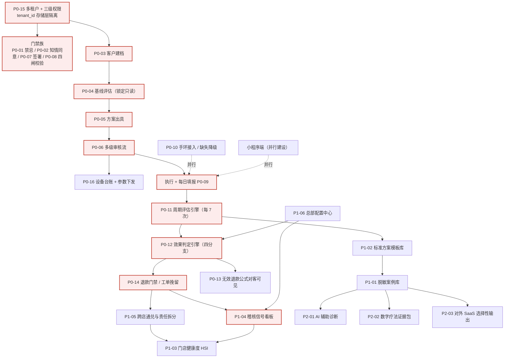
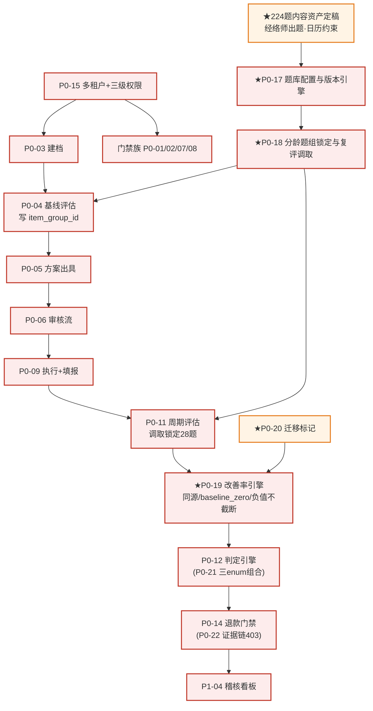

# 调元云 · 连锁健康管理调优 SaaS —— 路线图与优先级排期

| 项目 | 内容 |
|---|---|
| **文档类型** | 路线图 / 里程碑规划 / 优先级排期 |
| **产品名（暂定）** | 调元云 · 连锁健康管理调优 SaaS |
| **日期** | **2026-09-16** |
| **版本** | v1.0 |
| **作者** | 路径（Roadie）· 路线图规划师 |
| **首要输入** | PRD v1.0（析客）+ 上游结论汇编（瑞思/数析/竞析/主理人） |
| **排期性质** | ⚠️ **本文所有季度、里程碑日期、人数、人日、阈值均为规划建议（假设值），未经研发评审与商业确认，不得当作既定事实。** |

> **排期前提（显式假设）**：① 假设研发可在 **2026-10** 启动（PRD 已具备，尚待研发评审 P0 工作量）；② ~~假设 P0 总量 **110~160 人日** 量级可信~~〔**v1.0 时点值 · 已被取代**；**现行全量 P0 合计 ≈165~258 人日（≈9~14 人月）**，见【历史值全局护栏】〕；③ 假设一个"季度"= 约 13 周，有效工程产能按人月 ~18 人日计；④ 假设企业**自用优先**，不对外售卖（竞析结论），故路线图不含"获客/多租户售卖后台"等 SaaS 商业能力，仅保留组织级多租户底座；⑤ 版本节奏 = **按季度分期**。

---

## 1. 分期路线图总表

**分期逻辑**：以「一位客户的可审计服务链路」为轴，先让链路**跑得通**（Phase 0），再让链路**判得准、退得住**（Phase 1），再让连锁**管得住、稽得住**（Phase 2），最后让数据**沉得住、复用得起**（Phase 3）。

| 阶段 | 建议季度（假设） | 主题 | 关键交付（需求编号） | 依赖 | 主要风险 |
|---|---|---|---|---|---|
| **Phase 0** | 2026 Q4 ~ 2027 Q1 | **打通链路** | P0-15 多租户/三级权限 · P0-01 禁忌门禁 · P0-02 知情同意电子签 · P0-03 建档 · P0-04 基线评估 · P0-05 方案出具 · P0-06 审核流 · P0-07 签署门禁 · P0-08 四道闸门校验 · P0-09 每日填报 · P0-10 手环接入/降级 · P0-16 设备台账与参数下发 | 法务协议文本、电子签第三方、华为 Health Kit | 流程过重致门店绕过；设备厂商接口不开放 |
| **Phase 1** | 2027 Q2 | **风控内控** | P0-11 周期评估引擎 · P0-12 效果判定引擎 · P0-13 无效退款公式对客可见 · P0-14 退款工单与挽留 | Phase 0 全部数据底座 | 判定规则主观被质疑；无效退款条款引集中索赔 |
| **Phase 2** | 2027 Q3 | **连锁与稽核** | P1-05 跨店通兑与责任拆分 · P1-04 稽核信号看板 · P1-06 总部配置中心 · P1-03 门店健康度 HSI · P1-02 标准方案模板库 | Phase 1 判定/退款留痕 | 加盟商抵触稽核；跨店拆分口径争议 |
| **Phase 3** | 2027 Q4 ~ 2028 Q1 | **数据资产** | P1-01 脱敏案例库 · P2-01 AI 辅助诊断建议 · P2-02 数字疗法证据包 · P2-03 对外 SaaS 选择性输出（仅判定引擎/设备适配层/脱敏案例库三模块） | Phase 1~2 数据沉淀 + 单独授权合规 | PIPL 单独同意获取难；疗效证据不足 |

### 1.1 各期交付边界与退出标准（做到什么算完成）

**Phase 0 · 打通链路**

- **交付边界**：能对一位真实客户，从进店到"第 7 次服务"，在系统内走完全流程；四道闸门全部为**后端 403 硬阻断**（非前端置灰）；每日填报、手环数据（含缺失降级）落库；设备参数可"一键下发"或**人工降级**留痕。此期**不做**自动判定引擎与退款门禁（评估节点由人工发起并人工填结论）。
  - 🆕 **三端接口契约冻结（含 APP）**（2026-09-16 端形态裁定 · 新增产出）：**小程序 / APP / Web 三端**的接口契约在本期**冻结并版本化**（对应 PRD **T-6**「三端接口契约与版本协同」，**归属 = Phase 0**，不再挂在"待评估"上）。**APP 在本期只冻结契约 + 搭建骨架，不承接 APP 的实际开发量** —— 该量属《端形态增项账》**A1**，另账计（见 AP5 / AP9）。
  - 🔴 **契约冻结不因端形态选型（Q17）未签而延后**（**正文级条款**）：三端契约与"跨端还是原生"是**两件事** —— 选型只影响 **A1 区间**，**不影响契约内容**。**这条防的是一类常见事故：用一个未决的外部签字，去架空一件并不依赖它的内部工作。** 若允许契约等 Q17，Q17 一拖，后端契约与三端联调就被一起架空中。
- **退出标准（Exit）**：① 门店实测走通 ≥10 条完整链路，0 例可绕过闸门；② 禁忌筛查留痕率与协议签署合规率均 = 100%（可导出审计）；③ 数据模型所有业务表 100% 带 `tenant_id` 且跨租户查询被存储层拒绝（渗透测试通过）；④ **三端接口契约已冻结并版本化**，任一端调用均通过契约校验；**后端按角色（非按端）返回字段**，**跨端 403 兜底在小程序 / APP / Web 三端各验一遍**（**含 APP**，对应 AP4-1）。

**Phase 1 · 风控内控**

- **交付边界**：每 7 次自动触发评估、预填三类数据、输出**四分支判定**并落库判定依据+阈值版本；退款做成工单（原因码必填、四种结局强制归档）；首周期双不达标走**不经挽留主动退款**；"有效"公式同时出现在协议与小程序。
- **退出标准**：① 用门店历史数据回测，判定引擎与人工复核结论一致率 ≥ 90%（假设目标值，需校准）；② 退款工单 100% 强制归档，0 例"无原因即结案"；③ 首周期主动止损链路端到端可演示。

**Phase 2 · 连锁与稽核**

- **交付边界**：跨店服务可通兑、业绩按次数占比拆分（允许小数）；6 类稽核信号看板上线且**对门店/加盟商完全不可见**；总部配置中心统一管控阈值/清单/模板且变更留日志、默认不回溯；HSI 排名（<20 结案疗程标"样本不足"）。
- **退出标准**：① ≥1 个加盟店接入并完成跨店服务结算；② 稽核信号可自动生成处置任务；③ 门店侧任一入口无法看到稽核类指标（权限回归测试通过）。

**Phase 3 · 数据资产**

- **交付边界**：结案后可**单独授权**脱敏沉淀为可检索案例库；基于案例库产出 AI 建议（仅建议、不构成诊断）；数字疗法证据包可导出；三模块"行业版"可选择性输出。
- **退出标准**：① 案例库含 ≥N 例脱敏样本（N 由运营定）；② 授权拒绝率、脱敏合规审计通过法务验收；③ 至少 1 个外部试点意向（非强制）。

---

## 2. 优先级排序方法论

**采用「依赖驱动为主 + 合规否决权 + RICE 微调」的混合框架**，而非纯 RICE。原因：本产品 P0 中相当一部分是**合规与门禁项**，它们不产生直接收益，但**不可绕过**——用收益模型排序会把它们排到后面，直接导致合规事故。

**规则一 · 依赖深度定序（拓扑排序）**
凡处于关键路径上的前置节点（如「多租户底座 → 门禁 → 审核流 → 判定引擎 → 退款门禁 → 稽核」），一律先于其下游。上游不交付，下游无法开工——**优先级 = 拓扑位次**，不由收益决定。

**规则二 · 合规/门禁否决权（硬约束，置顶）**
对**四道硬闸门**（禁忌通过 / 知情同意已签 / 调理协议已签 / 方案已确认且在有效期）与**敏感个人信息单独授权 + 租户隔离**类需求，赋予"一票否决式置顶"：不参与 RICE 评分，**无条件进入 Phase 0**。理由：① 它们是安全与法律底线，缺失即违规；② 它们是所有下游数据可信度的前提（没有合规的筛查与授权，判定引擎的数据来源本身不可采信）；③ 事后补做的返工成本远高于前置。

**规则三 · RICE 微调（同期内排序 P1/P2）**
同阶段内、无强依赖关系的项，用 RICE =（Reach × Impact × Confidence）/ Effort 排序：

| 需求 | Reach | Impact | Confidence | Effort | RICE（相对值） | 排序理由 |
|---|---|---|---|---|---|---|
| P0-11 周期评估引擎 | 高 | 高 | 中高 | L | 高 | 唯一"系统主动止损"节点（洞察③） |
| P0-14 退款工单与挽留 | 高 | 高 | 中 | L | 高 | 直接绑定退款成本 |
| P0-12 效果判定引擎 | 高 | 高 | 中 | L | 高 | 护城河核心，但依赖 Phase 0 数据 |
| P1-05 跨店通兑与责任拆分 | 中 | 中高 | 中 | L | 中 | 加盟扩张前提 |
| P1-04 稽核信号看板 | 中 | 高 | 中 | M | 中高 | 8 家竞品全空白（竞析结论） |
| P1-03 门店健康度 HSI | 中 | 中 | 中 | M | 中 | 管理层抓手，对门店为结果指标 |
| P1-01 脱敏案例库 | 低 | 中 | 中 | M | 低 | 依赖 Phase 1~2 数据量 |
| P2-01 AI 辅助诊断 | 低 | 中 | 低 | XL | 低 | 数据资产成熟后才有意义 |
| P2-03 对外 SaaS（选择性输出） | 低 | 中 | 低 | XL | 低 | 竞析明确：客群窄、外售即失守 |

> **结论**：Phase 0 的门禁/合规项由「依赖 + 否决权」直接定序，**不进入 RICE 竞争**；RICE 只用于 Phase 1 之后、无强依赖项的排序与取舍。

---

## 3. 依赖关系图与关键路径

**关键路径（Critical Path，红色节点）**：
`多租户/权限模型（P0-15） → 四道门禁（P0-01/02/07/08） → 建档 → 基线评估 → 方案出具 → 审核流 → 执行+填报 → 周期评估引擎 → 效果判定引擎 → 退款门禁 → 稽核`

**可并行支线（不上关键路径，可压缩总工期）**：

> 📌 **接口契约冻结范围（2026-09-16 端形态裁定 · 与 PRD §11.2 同批）**：契约冻结覆盖 **三端 —— 小程序 / APP / Web**，不再只冻结小程序与 Web。

- **小程序端**：每日填报页面 + 客户确认 + 档案查看，可与后端接口并行开发（接口契约先冻结）。
- **APP 端（调理师 / 经络师）**：执行记录、代录与转介、退款工单（经络师）等作业面，可与后端接口并行开发（**接口契约先冻结**）。**默认技术路线 = 跨端框架**（Flutter / RN；对应 AP9 选项①，8~16 人日，另账计）。**契约冻结不因端形态选型（Q17）未签而延后** —— 选型只影响 A1 区间，不影响契约内容。
- **手环接入（P0-10）**：华为 Health Kit 字段对齐与降级逻辑独立，不阻塞主链路，最迟在 Phase 0 末合入。
- **设备适配层（P0-16）**：与审核流解耦，可先以"人工降级 + 留痕"上线，厂商协议到位后再补自动下发。

> **关键路径含义**：任何关键路径节点延期，Phase 1 判定引擎整期顺延——因此 **P0-15 多租户底座与 P0-06 审核流** 是本项目最需要保护的两个节点（估算最重：均为 L，且被大量下游依赖）。

---

## 4. 里程碑与验收标准（可演示，非"完成开发"）

| 里程碑 | 建议时点（假设） | 可演示的成功标准（Demo-able） |
|---|---|---|
| **M0 底座可用** | 启动后第 4 周 | 演示：两个租户各建 1 店，A 租户账号查询 B 租户客户被**存储层直接拒绝**（403 + 审计日志） |
| **M1 门禁闭环** | 第 8 周 | 演示：一位客户禁忌不通过 → 建档/出方案/下发参数入口全部返回 403 且**给出缺失项名称**；四道闸门逐一验证不可绕 |
| **M2 链路打通** | 第 13 周（Phase 0 末） | 演示：① **完整跑通一位客户从进店到第 7 次服务**，生成评估任务与预填数据；② 设备参数下发或人工降级留痕；③ **三端契约校验 + 跨端 403 复验（含 APP）** —— 小程序 / APP / Web 三端各跑一遍契约校验；**换账号验证 403 兜底在 APP 端同样成立**（后端按角色判定，非前端隐藏） |
| **M3 判定可用** | Phase 1 中段 | 演示：第 7 次服务后系统**自动触发评估**，输出四分支之一，判定依据+阈值版本落库可查 |
| **M4 退款闭环** | Phase 1 末 | 演示：① 客户主动退款 → 原因码必填 → 挽留 → 归档；② 首周期双不达标 → **不经挽留主动退款**并强制归档 |
| **M5 连锁稽核** | Phase 2 中段 | 演示：跨店服务按次数占比拆分业绩；稽核看板对总部可见、**对门店/加盟商不可见**（换账号验证） |
| **M6 数据资产** | Phase 3 | 演示：结案后经**单独授权**脱敏入案例库，可按诊断标签检索并复用 |

---

## 5. 风险登记册

| # | 风险 | 影响 | 概率 | 缓解措施 | 触发信号 | 负责方 |
|---|---|---|---|---|---|---|
| **R1** | **门店嫌流程重，绕过系统线下执行**（用纸质/微信作业） | 高——门禁形同虚设，数据资产归零 | **高** | 移动化 + ≤30 秒极简交互；把门店收益显性化（退款止损、免翻档案）；闸门硬阻断使绕过无法产生执行记录；冷启动 SOP + 四闸门培训；试点期驻店陪跑 | 某店连续 3 天无 `daily_report_submitted`；执行记录与排班量背离 | 运营 + 产品 |
| **R2** | **设备厂商接口不开放，参数下发无法落地** | 中——P0-16 技术可行性受质疑 | **中高** | 先做适配层 + **人工降级**（下发失败转待办 + `device_push_failed` 留痕），厂商协议缺失不阻塞 v1；并行攻关主要厂商 | 适配层联调连续失败；厂商拒提供协议文档 | 研发 + 硬件 |
| **R3** | **无效退款条款引发集中索赔** | 高——现金流与舆情风险 | **中** | 法务共建条款文本；"有效"公式**前置告知**（协议 + 小程序）；判定全程留痕可举证；首周期主动止损避免拖到后期大额赔付；设定退款率/争议率预警线 | 单店退款率 >15%（黄）；争议率 >5%（黄） | 法务 + 运营 |
| **R4** | 判定规则主观，被客户/监管质疑 | 中高——护城河被反噬 | 中 | 门槛制（核心指标为主判据，非加权总分）；**测量不可比即挂起转人工**；人工终审 + 全留痕；阈值用真实数据回测校准 | 人工复核率异常高；判定后投诉上升 | 产品 + 数析 |
| **R5** | 手环/填报依从衰减，评估数据残缺 | 中——判定失真 | 高 | 手环**只进依从性、绝不进效果主判据**；结构性缺失不扣分；调理师代核兜底；评估页显式暴露缺口天数 | 手环有效佩戴率持续下滑；缺口天数超标 | 产品 + 数析 |
| **R6** | 加盟商抵触稽核，认为"被监控" | 中——推行阻力 | 中高 | 稽核信号**对门店不可见**（避免实时被博弈）；对加盟商强调"这套系统帮你们防退款、分润清晰"；把 HSI 与支持政策挂钩而非纯考核 | 加盟店拒绝接入/拒走转店工单 | 运营 + 区域督导 |
| **R7** | 敏感个人信息（健康史/穿戴）合规瑕疵 | 高——法律风险 | 低中 | 单独授权 + 分项勾选（可单独拒绝脱敏）；`tenant_id` 存储层隔离；健康数据不出租户边界；脱敏规则法务共建 | 授权缺失率上升；合规审计提出项 | 法务 + 架构 |
| **R8** | P0 工作量（110~160 人日）被低估〔**v1.0 时点值 · 已被取代**；**现行全量 P0 ≈165~258 人日**。⚠️ **该风险已实际发生并关闭** —— 见附录勘误表 AF2 / 状态表：粗估经自下而上校验后上修，教训已转评审检查项〕 | 中高——整期顺延 | 中 | 第 1 周内完成研发评审校准；关键路径节点（P0-15/P0-06）优先排资源 | 迭代燃尽持续偏离 | 研发负责人 |

---

## 6. 资源需求与团队配置建议（**均为建议值**）

**角色配置建议**：

| 角色 | 建议人数（Phase 0） | 核心职责 | 备注 |
|---|---|---|---|
| 后端 | 3 | 多租户/权限、门禁、审核流状态机、事件溯源、幂等 | 关键路径主力 |
| 前端（Web 管理端） | 2 | 总部/区域/门店三端界面、配置中心 | — |
| 小程序 | 1~2 | 每日填报（≤30 秒）、客户确认、档案查看 | Phase 0 可部分外包/复用 |
| **移动端（iOS / Android）** | **1~2** | 调理师 / 经络师作业面 APP（执行记录、代录与转介、退款工单） | **2026-09-16 端形态裁定 · 授权修订**；默认跨端框架，可复用 1 人 |
| 数据/算法 | 1 | AS 模型、判定引擎、指标口径、回测校准 | Phase 1 需求最重 |
| 测试 | 1~2 | 权限回归、门禁不可绕过性、合规导出 | 权限/闸门必须专项回归 |
| 产品/需求 | 1 | 需求澄清、验收、跨团队协调 | 路径本人可兼任 |
| 架构/安全 | 0.5 | 租户隔离、敏感数据合规 | 可共享 |
| 法务 | 0.5 | 协议/授权文本共建 | 共享，Phase 0 前 2 周密集 |

> **口径说明（2026-09-16 端形态裁定 · 授权修订）**：上表人力编制为**团队配置口径**，属**岗位编制**，**不属于人日估算，不计入锚点句**。

**按期的投入量级（假设）**：Phase 0 ≈ **8~10 人月**（含前端/小程序/测试）；Phase 1 ≈ **3~4 人月**（数据/算法为主）；Phase 2 ≈ **3~4 人月**；Phase 3 ≈ **2~3 人月**（可延展）。

> 📐 **口径（2026-09-16 端形态裁定后澄清 · 非数字改动）**：上列人月为**研发投入量（工作量口径 = 人日 ÷ 18）**，**不是工期**，**不得当作日历时长读**。
> - **工期**以 **§1 分期总表**的"建议季度"为准（Phase 0 = 2026 Q4 ~ 2027 Q1，约两个季度）；
> - **投入量**与**工期**不是一回事 —— 工期还受**并行度**、**外部依赖（法务 4~6 周 / 224 题内容 6~10 周 / 设备厂商协议）**与**测试回归**支配，这三类属**人日之外的关键路径约束**（见附录 A.2「不能用人日衡量的三类」）；
> - ⚠️ 上列数值**未含端形态增项**（APP 开发量记在《端形态增项账》，另账计，见 **AP5 / AP9**）。

**最小可上线团队（MVP）**：**后端 2 + 前端 1 + 小程序 1 + 测试 1 + 产品 1 = 6 人**。此配置可支撑 Phase 0 主链路（门禁 + 审核流 + 填报），但**判定引擎与稽核需在 Phase 1 补 1 名数据/算法**。若要在单季度内交付 Phase 0，建议按上表 **8 人满配**。

---

## 7. 利益相关者沟通要点（三版）

### 7.1 致高管 —— 回报与风险

- **一句话**：我们不是做一套门店管理软件，而是把"无效退款"从**售后话术**变成**可审计的判定规则**，让退款率从"各店口径不一"变成"可度量、可管控"。
- **回报**：① 退款争议率、无效退款触发率可被统一度量与预警（建议阈值：退款率 >15% 黄、争议率 >5% 黄）；② 四道硬门禁使**签署合规率 = 100%、禁忌留痕率 = 100%**，消除安全与合规风险；③ 新店可冷启动，**SOP 不依赖"老员工靠谱"**，支撑加盟扩张可复制；④ 沉淀"长周期（两调优周期 + 基础服务期）+ 三输入判定"的真实数据，是竞品没有的资产，未来可选择性输出三模块。〔**口径已定案：口径①「2 调优周期（= 2×7 = 14 次）+ 基础服务期」，v1.30；原"15~45 次"作废**〕
- **风险**：① 最大风险是**门店绕过系统**，需以移动化 + 极简交互对冲，靠考核而非口号推动；② 中医疗效判定缺循证标准，须**人工终审 + 全程留痕**；③ 无效退款条款可能引发集中索赔，须法务前置。
- **决策请求**：确认 Q1（审核流形态，建议默认 C 阈值触发式）、Q3（首周期不达标判据）、并确认"Phase 1~2 坚定自用、不对外 SaaS"的商业路径。

### 7.2 致工程 —— 技术风险与关键路径

- **关键路径**：多租户/权限 → 门禁 → 审核流 → 执行+填报 → 周期评估 → 判定引擎 → 退款门禁 → 稽核。**P0-15 与 P0-06 是最需保护的两个节点**（均 L，下游依赖最多）。
- **四个必须做对的技术点**：
  1. **租户隔离在存储层**：全部业务数据带 `tenant_id`，**跨租户查询由存储层直接拒绝**，不依赖应用层过滤。
  2. **门禁即后端 403**：四道闸门必须是系统级硬阻断并返回**缺失项名称**，非前端提示；覆盖参数下发与服务次数记录两个动作。
  3. **事件溯源 + 幂等**：判定依据、阈值版本、审核留痕、参数快照**落库且版本不可覆盖**；退款、下发等动作须幂等，避免重试造成重复赔付/重复下发。
  4. **设备适配层 + 人工降级**：厂商无标准协议时，下发失败转待办并记录 `device_push_failed`，**不阻塞流程**。
- **可并行**：小程序端与手环接入（Health Kit 字段 Schema）不上关键路径，接口契约先冻结即可并行。
- **待评审**：P0 工作量 ~~110~160 人日~~〔**v1.0 时点值 · 已被取代**；**现行全量 P0 ≈165~258 人日**〕需第 1 周内校准。

### 7.3 致门店与加盟商 —— 省什么、加不加负担、钱怎么算

- **帮你们省什么**：① 不用再翻纸质档案查"协议签没签、方案确认没"——执行前一键校验，缺什么直接提示；② 客户退款不再靠个人记忆和口头话术，**原因码 + 挽留记录系统化**，责任有据；③ 设备参数按门店台账自动匹配型号，**不用人工抄参数、少出错**；④ 客户跨店都能服务，**业绩不会因为客户换店而丢**。
- **会不会加负担**：客户侧填报**全部点选、≤30 秒完成**，有即时反馈；你们的操作**移动端优先**，不新增复杂的表单。系统会在第 7 次服务时**主动提醒**你该做评估，不用自己数次数。
- **对你们的钱什么影响（关键）**：
  - **业绩归属更公平**：ECC 以结案门店为主计，若 ≥30% 次数在别店完成，按**各店服务次数占比拆分**（允许小数）——早段服务的店也分润，**机制上抑制截客**。
  - **退款成本分摊**：退款损失按各店服务次数占比**分摊**为各店退款成本——这意味着**任何一店夸大疗效都要承担退款成本**，从源头抑制过度承诺。
  - **首周期是止损窗口**：第 7 次评估若不达标，系统会**主动建议终止退款**，避免你们被拖到后期大额赔付。
  - **转店必须走系统工单**：禁止私下转，保护各店权益。
- **请你们配合的一件小事**：不要绕过系统用纸质作业——一旦绕过，门店就没有系统记录，**无法举证、也无法分润**。

---

## 8. 上线策略

**试点门店数量（建议）**：**2~3 家**。太少无法覆盖"直营 vs 加盟""有设备 vs 无设备"的差异，太多则陪跑资源不足。

**选店标准（建议按优先级）**：
1. **1 家直营标杆店**——执行力强、店长配合度高、有真实在服客户（建议 ≥20 结案疗程，满足 HSI 样本护栏）；
2. **1 家加盟店**——验证加盟场景下的跨店、分润与稽核（加盟商是最可能绕过系统的人群，必须早暴露）；
3. （可选）**1 家设备型号较老的店**——验证设备台账映射与人工降级路径。

**灰度与推广节奏（建议）**：
- **第 1 阶段（灰度）**：试点店"新旧并行"——系统记录为准，纸质仅作过渡备份；每周复盘执行率与闸门绕过案例。
- **第 2 阶段（扩面）**：试点验证 M2/M4 里程碑后，按**区域**逐批推广（建议每批 5~8 店），每批配驻店陪跑 + 四闸门培训。
- **第 3 阶段（强制）**：加盟体系扩张时**强制使用**，使系统成为加盟管控的**事实标准**（竞析推荐路径）。

**老店存量客户的数据迁移（建议）**：
1. **按状态分流**：仅对"在服未结案"客户做迁移，已结案客户只迁移**归档索引**（不迁移过程数据）。
2. **迁移字段**：个人基本信息 + 健康史 + 主诉（结构化）+ 已签文书扫描件 + 已完成的**服务次数计数**（用于决定下一个 7 次评估触发点）。
3. **合规前置**：存量客户的**授权补签**必须在上线前完成（健康史属敏感个人信息，无授权不得入库）；对"暂不补签"客户，仅保留最小必要信息并标注来源。
4. **基线不可追溯的处理**：存量客户若**无基线快照**，其效果判定按"数据不足 → 人工复核"处理（不强行补录，避免污染判定数据）。
5. **双人复核**：迁移数据由门店 + 总部各校验一次，迁移差异留台账。

---

## 9. 排期假设与待确认清单（供 team-lead 汇总）

| # | 事项 | 本文取值（假设/建议） | 需谁确认 |
|---|---|---|---|
| A1 | 启动时间 | 2026-10 | 研发负责人 |
| A2 | P0 工作量 | ~~110~160 人日~~〔**v1.0 时点值 · 已被取代**；**现行全量 P0 ≈165~258 人日**〕（该值沿用 PRD、未复核，现已由自下而上拆解取代） | 研发负责人（第 1 周） |
| A3 | 每期时长 | 1 个季度 | 产品负责人 |
| A4 | 最小可上线团队 | 6 人（满配 8 人） | 研发负责人 |
| A5 | 试点门店 | 2~3 家（直营 + 加盟 + 老设备） | 运营 |
| Q1 | 审核流形态 | 建议默认 C（阈值触发式） | 产品负责人 + 法务 |
| Q3 | 首周期"不达标"判据 | 建议"效果与依从双不达标" | 产品负责人 + 数析 |
| Q5 | 设备接口开放度 | 默认先适配层 + 人工降级 | 研发 + 硬件 |
| Q7 | 自用→对外切换时点 | 建议自用跑通 ≥1 完整季度后再评估 | 商业侧 |

> **本文所有数字（季度、里程碑周次、人数、人月、阈值）均为路线图规划建议值，须经研发评审与商业确认后方可作为承诺排期。**

---
---

# 附录：六表落地增量评估（2026-09-16 追加）

> 🧭 **【阅读指引】本附录是「初版 + 历次修订」的修订链**：v1.0 为初版，v1.1~v1.32 为按时间追加的修订节；**历史内容一律保留可追溯、从不删除**。
> ⚠️ **【历史值全局护栏】**：本附录 v1.0~v1.27 中出现的 **`162~251` / `129~193`** 一律为**历史值**（作废序列：`162~251 → 165~256 → 165~258`）。**现行值：正文 P0 19 项 = `132~200`、全量 P0 合计 = `165~258`（≈9~14 人月）**。📌 **读法**：凡某句在陈述**仍然生效的规则**（如「P1 一律不计入 P0 合计」「或有上浮不计入定稿值」），**规则有效、数字随封版走** —— 句中的历史数字按现行 **165~258** 读；凡某句在陈述**该时点的结论**，则整句按快照读，不作替换。
> 🔗 **PRD 侧指针**：本附录最后一次与 PRD 核对为 **v1.18（2026-09-16）**（锚点句与四个数字逐字一致）。**PRD 的现行版本号以其文首为准** —— 此处为**快照**、不随其变动，故不会过期。
>
> 📐 **【元约定索引】—— 约束"本文档如何被读 / 如何被写"，与 PRD 维护说明同构（四条同级）**
> 1. **【数字归属约定】** —— 所有 `≈N~M 人日` 必须紧跟归属说明（**含什么 / 不含什么**）；**禁止未紧跟归属的省略式表述**。见 **AF1**。
> 2. **【口径 ≠ 数据】** —— 长期零实例应判为"**数据未采集到位**"，**不得**判为"风险不存在"（**必须带反向条件**）。见 **AM3②**。
> 3. **【标题 / 表头维护规则】** —— **状态声明不得与内容时点脱节**。三条判据：**①** 带时点的快照型标题须标"已被谁取代"；**②** 内容仍现行的标题无需时点，**且活着的章节不得钉版本号**（必然过期）；**③** **相对时点（本轮 / 本次 / 当前 / 最新）必须锚定绝对时点**。见 **AO1~AO4**。
> 4. **【自证伪优先于溯源】** —— 一个数字若与**自身的构成**不满足**加和 / 包含关系**（例：全量 − 正文 = 增量，而**增量下沿 > 上沿、区间反向**），则**无需查证来源即可判定它不成立**。处置顺序**固定**为：**先记账 → 不动手 → 把矛盾证明摆出来**，**不自行挑选"看起来对"的一组落下**。**来源：2026-09-16 端形态裁定 · AP12 冲突处置**（该组基数后被来源方确认为笔误）。见 **AP12 / AP14**。
>    - **为什么单列**：溯源要成本，**自证伪是零成本的硬证据**。③ 管的是"**别把口径当数据**"，④ 管的是"**数据自己就不成立时，别去讨论它的口径**" —— 二者是**先后关系**，不是并列关系。
>    - **反面教材（就在本文内）**：AP14 #3 记账的「§6 按期人月合计 11~14 vs 全量 P0 9~14，**下沿差 2 人月**」—— 一个数在自己内部就不自洽，却因为"看起来是老数字"而一直留存至今。
>    - **两条边界（与 PRD 同款）**：
>      - **界线** —— 本规则**只约束「状态声明」**（"终稿 / 定稿 / 现行 / 最新"），**不约束「沿革 / 来源标注」**（如"（业务方规则 · v1.9 起；现行值定稿于 v1.15）"属**沿革**，**合法**）。**删掉沿革标注会丢来源**，与本规则的目的正好相反。
>      - **方向** —— 标题的错有**两个方向**：**过度自信**（自称终稿、内容陈旧）与**过度存疑**（自称待定、实则已定）。**两向皆需查。**
> ⚠️ **因此 v1.0 中的数字多为已被取代的历史值**（如 A.1 的 110~160、A.2 的 145~220）。**现行有效值一律以文末终稿节为准：v1.26（现行终值汇总，数字与 v1.25 一致）** —— v1.15 / v1.16 / v1.19 / v1.20 / v1.23 / v1.24 为其前置修订，均属历史记录。研发合计终值 **≈165~258 人日（≈9~14 人月）= 正文 P0 19 项 132~200 + 附录 C.4 增量 33~58，不含 P1/P2**（🔗 跨文档锚点句，**以 v1.25 AM2 / v1.26 为准**）。
>
> ⚠️ **本章为增量追加，不改动正文任何内容。** 正文分期 / 关键路径 / 里程碑 / 风险登记册仍以原文为准，本章在其上叠加「吕老师六份线下作业表单（01 建档 → 02 基线 → 03 方案与审核 → 04 知情同意 → 05 执行与周期评估 → 06 退款与结案）落地」带来的增量。事实来源：PRD 附录 C（C.2/C.4）+ 数析《集成指标规格》。**本章所有时间、人数、人日、周次一律为规划建议（假设值），须经研发评审与业务裁定后生效。**

## A. 工作量合计与量级结论

### A.1 工作包清单

| 工作包 | 类型 | 量级（建议 / 假设） | 依赖 | 备注 |
|---|---|---|---|---|
| 既有 P0 主体（P0-01~16） | 研发 | 110~160 人日 | 法务协议、电子签、Health Kit | 沿用正文，未复核 |
| 六表新增 P0（P0-17~22） | 研发 | 35~60 人日 | **P0-17 依赖 224 题内容资产** | 析客粗估，需研发评审 |
| 既有条目收紧（8 配置 + 6 P0） | 研发 | 不单列（与 P0-19/21 重叠） | 数析 §5.1/§5.2 | 属"改验收标准"，非新增范围 |
| **224 题分龄量表题库** | **内容/业务** | 224 题 + 四级锚点文本；建议 **6~10 周日历**（经络师团队） | 02 表原文 | **非研发人日；P0-17 的硬前置** |
| M1–M5 映射 + 6 审核清单 + 6 原因码 + 6 证据链 + 6 归档 checklist | 内容/业务 | 小，可随题库同期定稿 | 03 / 06 表 | 建议值，一次性 |
| 历史迁移 + 双轨运行 | 研发 + 运营 | 开发含 P0-20（M）；全库扫描一次性 | P0-20 | 打标结果决定试点选店 |
| 《知情同意书》8 章 + 协议文本 | **法务** | 建议 **4~6 周日历**（并行） | 04 表 | **非人日；Q10 口径影响文案** |
| 门店培训（量程 0–4→0–3；05 表 6 观察项→28 题复评） | **培训/运营** | 建议 1~2 周 / 批（每批 5~8 店） | 系统上线前 | **非人日；门店作业方式改变** |
| P1-07 内容资产后台 | 研发 | L（**不含在 35~60 内**） | P0-17 | 可延至 Phase 2 |

### A.2 量级结论

> ⚠️ **【首读警告】A.1 / A.2 为 v1.0 原始估值，已全部被后续修订取代**，此处保留仅供追溯。**现行终值一律以 v1.25 AM2 / v1.26 为准**：**研发合计 ≈165~258 人日（≈9~14 人月）= 正文 P0 19 项 132~200 + 附录 C.4 增量 33~58，不含 P1/P2**（v1.23 的 165~256 与最早的 162~251 均已取代）。

- **研发合计 ≈ 145~220 人日（≈ 8~12 人月，按 18 人日 / 人月）**〔**历史值，已被 v1.15 的 162~251 取代**〕：从"110~160 人日"上移约 **+30%（一个台阶）**，但**未改变"一个季度交付测量地基、两个季度跑通判定"的量级判断**。
- **不能用人日衡量的三类**：① **内容生产**（224 题，经络师出题，**受日历与产能约束，非工程工时**）；② **法务改造**（按周计的日历时间，取决于法务排期与 Q10 口径）；③ **门店培训**（按门店批次计的运营/陪跑成本）。**把这三类折成人日会严重低估排期——它们是"人日之外的关键路径约束"。**

## B. 排期方案（两案并列，不拍板）

**方案甲 · 并入现有 Phase 0/1**（把 P0-17~22 塞进 Phase 0 与 Phase 1）

| 阶段 | 主题 | 关键交付 | 依赖 | 退出标准 |
|---|---|---|---|---|
| Phase 0（**延长**） | 打通链路 + 测量地基 | 原 P0-01~16 **＋ P0-17/18/19/20** | 224 题定稿、法务 | 原标准 ＋「锁定题组 + 同源改善率」可演示 |
| Phase 1 | 风控内控 | P0-11/12/13/14 **＋ P0-21/22** | Phase 0 全部 | 原标准 ＋ 证据链缺项 403 演示 |
| Phase 2 / Phase 3 | 不变 | 不变 | — | 不变 |

- **总工期变化（建议）**：Phase 0 需**延长 3~5 周**；若维持周期不变，则因资源争用导致 **Phase 1 顺延 4~8 周**。
- **不推荐理由**：Phase 0 本已是最重阶段（门禁 + 审核流 + 填报），再叠量程统一与题库引擎会与门禁争抢同一批后端；且 **P0-17 的验收被 224 题内容生产卡死**——内容未定稿则 Phase 0 无法退出，整期顺延。

**方案乙 · 新增 Phase 0.5「量表与测量地基」**（推荐）

| 阶段 | 主题 | 关键交付 | 依赖 | 退出标准 |
|---|---|---|---|---|
| Phase 0 | 打通链路（**不变**） | P0-01~16 | 法务、电子签 | 原标准不变 |
| **Phase 0.5（新增）** | **量表与测量地基** | **P0-17 题库引擎 + P0-18 题组锁定 + P0-19 改善率引擎 + P0-20 迁移标记** | 224 题定稿 | 同一客户基线与复评**自动调取同一 28 题**；状态无变化时 **IR=0%（非 +25%）** |
| Phase 1 | 风控内控 | P0-11/12/13/14 + P0-21/22（前置 = Phase 0.5） | Phase 0 + Phase 0.5 | 原标准 ＋ 三 enum 组合出口演示 |
| Phase 2 / Phase 3 | 不变 | 不变 | — | 不变 |

- **总工期变化（建议）**：**合计 +3~4 周**（Phase 0.5）；因内容生产与研发可并行，且 Phase 0 跨度较宽（正文假设 2 个季度），**实际净增可压缩至 2~3 周**。
- **推荐理由**：① 量程 / 题组是判定引擎的"**测量地基**"，属可独立验收的交付物，独立成阶段有清晰退出标准；② 内容生产是**日历约束**，独立阶段可实现"**内容先行、研发并行**"，不与人日资源争用；③ 把"测量地基冻结"做成对外可演示的里程碑，利于向高管/门店说明"数据为何可信"。
- **风险**：多一个阶段节点；若 224 题内容顺利定稿，Phase 0.5 可压至 2~3 周。

> **本规划师倾向方案乙**，但最终由 team-lead / 业务方结合研发资源与内容产能裁定。

## C. 关键路径是否变化（重点）

**结论：变化，且 P0-17/18/19 确实插入了 P0-11/P0-12 之前，拉长了关键路径。**

- 新增前置链：**224 题内容定稿 → P0-17 题库引擎 → P0-18 题组锁定**，且 **P0-18 同时前置于 P0-04（基线评估须写 `age_group_locked` + `item_group_id`）与 P0-11（复评须调取同源 28 题）**；**P0-19 改善率引擎** 则在 **P0-11 与 P0-12 之间**（判定引擎消费 IR）。
- **新瓶颈节点**：① **内容资产（224 题）定稿**（日历约束，最易滑期）；② **P0-17 题库引擎**（新，M~L）；③ **P0-19 改善率引擎**（新，L）。原两大瓶颈 **P0-15 / P0-06 仍是瓶颈**，不因本增量消失。
- **224 题内容生产是否成为新的关键路径前置项——是。** 排法建议「**内容先行、研发并行**」：立项即启动经络师出题（**建议 6~8 周内分批冻结**：先冻结 M1–M4 常用维度题组，M5 观察项后补），研发同步搭 P0-17 引擎骨架（Schema / 版本管理），**以"题库定稿日"为硬里程碑**；若内容滑期，Phase 0.5 直接顺延，进而拖累 Phase 1。

**更新后关键路径**：`224题内容定稿 → P0-17 → P0-18 → 基线评估(P0-04) → 方案 → 审核流(P0-06) → 执行+填报 → P0-11 周期评估 → P0-19 改善率引擎 → P0-12 判定引擎 → 退款门禁(P0-14) → 稽核(P1-04)`（橙色为内容约束项）。

## D. 里程碑调整

| 里程碑 | 可演示的成功标准（Demo-able） | 相对原方案的变化 |
|---|---|---|
| M0 底座可用 | 两租户各建 1 店，跨租户查询被存储层拒绝（403 + 审计） | 不变 |
| M1 门禁闭环 | 禁忌不通过 → 建档/出方案/下发参数全部 403 且给出缺失项名称 | 不变 |
| M2 链路打通 | 完整跑通一位客户到第 7 次服务，生成评估任务与预填数据 | 不变 |
| **M2.5 量表地基冻结（新增）** | 导入一位客户基线 → 锁定其分龄题组 ID；7 次后复评页**自动调取同一 28 题**；题组 ID 不一致 → 阻断转人工 | **新增**（Phase 0.5 末） |
| M3 判定可用（**改写**） | 自动触发评估，输出 **`effect_verdict` × `adherence_state` × `risk_flag` → `disposition`**；用数析 §6 算例验证"状态无变化 IR=0%（非 +25%）"；变差**保留负值不截断**；阈值版本落库可回放 | 原为"四分支"，改为三 enum 组合 + 同源前置断言 |
| M4 退款闭环（**增强**） | 客户退款 → 原因码必填 → 挽留 → 归档；**证据链 6 项任一缺失 → 403 阻断立案**；`disposition` 5 值 | 增加 C.3 证据链/归档 14 条硬校验演示 |
| M5 连锁稽核 | 跨店按次数占比拆分业绩；稽核看板对总部可见、对门店不可见 | 不变 |
| M6 数据资产 | 结案后经**单独授权**脱敏入库，按诊断标签检索复用 | 不变 |

## E. 新增风险（≥4 条）

| # | 风险 | 影响 | 概率 | 缓解措施 | 触发信号 | 负责方 |
|---|---|---|---|---|---|---|
| **R9** | **内容资产生产成为瓶颈**（224 题需经络师出题定稿，研发做完题库引擎却没题可上） | **高**——直接阻断 P0-17 验收与 Phase 1 上线 | **中高** | 立项即启动出题，**分批冻结**（先 M1–M4 常用维度，M5 后补）；研发并行搭引擎骨架；设"题库定稿日"硬里程碑 | 距 Phase 0/0.5 末 4 周，题库完成率 < 60% | 业务 / 经络师团队 + 产品 |
| **R10** | **历史数据不可迁移比例过高**（旧基线含 4 分题 → `migratable=false` → 在服客户效果不可判定 → 退款争议陡增） | **高**——存量客户无法举证，退款争议上升 | **中高** | 上线前**全库扫描统计 migratable 比例**；`migratable=false` 疗程结案报告显式标注"口径不一致、效果不可比"；该类客户退款按**协商制**而非公式；试点优先选低 4 分题比例门店 | 扫描显示 migratable=false > 30%（黄）/ > 50%（红） | 数析 + 运营 + 法务 |
| **R11** | **门店作业方式改变引发执行抵触**（05 表从 6 观察项改为 28 题复评，操作时长增加） | **中高**——复评执行率下降 → 数据缺失 → 判定失真 | **中高** | 复评 28 题与基线**同题组**（免"另填一套"认知负担）；移动端**自动调取题组、免手选**；培训 + 驻店陪跑计入成本；试点期新旧双轨对照 | 复评题组 ID 不符率高；复评完成率 < 80% | 运营 + 产品 |
| **R12** | **待裁定 Q10/Q11 迟定导致返工**（口径变更触发字段与流程改写） | **中高**——状态机/对客文案返工 | **高** | 设"裁定截止日"（**建议 Phase 0.5 启动前**，最迟 Phase 0 中段）；字段先**双口径双写**（`visible_to_customer` 开关 + `service_phase` 并存档位）；状态机预留配置位 | Phase 0.5 启动时 Q10/Q11 仍未定 | 产品负责人 + 法务 + 业务方 |

> 原有 R1~R8（门店绕过 / 设备接口 / 无效退款索赔 / 判定主观 / 依从衰减 / 加盟抵触 / 敏感信息合规 / P0 低估）**仍然有效**，其中 **R1（门店绕过）与 R5（依从衰减）因 05 表作业量增加而概率上浮**，建议与 R11 一并管理。

## F. 上线策略调整

**结论：试点选店标准需要补一条硬条件。**

在原选店标准（1 直营标杆 + 1 加盟 + 可选 1 老设备）之上，**补充优先级最高的第 0 条**：

1. **优先选"旧基线含 4 分题比例低"的门店**——用 P0-20 扫库结果选店。**理由**：`migratable=false` 比例低 → 存量客户中"可判定样本"多，才能真正验证同源改善率与判定引擎，否则试点店大量客户"效果不可比"，**无法证明系统价值，也无法举证退款**；选高噪声店会污染试点结论。
2. **试点期保留"新题组 vs 旧观察项"双轨至少一个周期**：用于对比 MCID 门槛灵敏度，校准 §1.4 建议值（否则门槛只能凭经验）。
3. **优先有端门店**（小程序可用）：便于对照 `AS_refund`（判定用）与 `AS_ops`（运营用）两口径，避免 4.2 的"同客户两模式结论相反"在试点期即引发合规争议。

其余（2~3 家门店数量、灰度三阶段节奏、老店存量迁移按状态分流）**不变**。

## G. 两口径对照（Q10 / Y1）

| 裁定项 | 口径 A 下的排期（假设） | 口径 B 下的排期（假设） | 差异量级 |
|---|---|---|---|
| **Q10 无效退款** | **存续**：P0-13 全量交付（对客可见公式 + 小程序），P0-14 入口 B 自动直出；Phase 1 基准排期 | **不存在（对内证据链 + 协商制）**：P0-13 降级为"对内判定建议"（不对外宣称）；P0-14 **增协商 + 门店负责人判定审批流**；对外文案整体降调（法务 + 文案重写） | P0-13 减 **≈0.5~1 人周**；P0-14 增协商流 **≈1~2 周**；文案重写为**非人日**成本。**净差 ≈ ±1~2 周** |
| **Y1 / Q11 周期口径** | **2 调优周期 + 基础服务期**：状态机新增"基础服务期"态，"转基础服务"流程**进 Phase 0/1** | **15~45 次并存档位**：需并存两套状态机 / 档位字段，复杂度上升 | 若冻结"2 期"口径，状态机改动 **≈1~2 周**且明确；**未定则状态机返工风险 ≈2~3 周** |

**差异量级结论（建议）**：若在 Phase 0.5 启动前**按默认建议值快速冻结**（Q10 → 口径 B，Y1 → 口径 A），可避免 **≈3~5 周**返工；两处裁定**必须赶在 P0-13/P0-14 与状态机开工前完成**。

---

*本章由路径（Roadie）· 路线图规划师产出，2026-09-16 追加，事实来源为 PRD 附录 C、数析《集成指标规格》与六表原文。**本章全部数字、周次、人日、人月均为规划建议值，须经研发评审、内容产能评估与业务裁定后方可作为承诺排期；正文原有内容未作任何修改。***

---

## 附录 v1.1 修订（量程改判后 · 2026-09-16 追加）

> **背景**：数析将量表量程由 v1.0 的「统一 0–3」**改判回 0–4**（0–4 系 02 表**原生量程**）。本小节是对上方 v1.0 附录的**增量修订**，**v1.0 原文保留可追溯**，roadmap 正文九章未动。所有数字仍为**建议 / 假设值**。

### R1. R10 处置：关闭，残留项拆为 R10b

| 项 | v1.0 登记 | v1.1 处置 | 理由 |
|---|---|---|---|
| **R10** 历史数据不可迁移比例过高 | 影响高 / 概率中高 | **关闭**（触发条件不成立） | 0–4 为 02 表原生量程 → 历史基线**零改造、迁移率 100%**，不存在"4 级真值不可恢复"；该代价是"**选了 0–3 才被制造出来**"的，非客观存在 |
| **R10b**（新增）同源元数据缺失 | — | 影响**低-中** / 概率中 | 残留项 = 旧纸质档案中**题组 ID / 测量人 / 测量时点**缺失比例；属**数据可得性**问题（非系统改造），但影响历史客户"**能否同源举证**" |

- **R10b 缓解**：P0-20b 统一校验并标记（语义由"量程可迁移"改为"**同源元数据可用**"）；缺失者结案报告标注"**基线不可同源对照**"，退款按协商制、不走公式。**负责方：数析 + 运营。**

### R2. P0-20 改述与量级下修（更新 A.1 / A.2）

| 项 | v1.0 值 | v1.1 新值 |
|---|---|---|
| P0-20 名称 | `migratable` 历史数据迁移与标记 | **同源元数据校验与基线可用性标记** |
| P0-20 工作量 | M | **S~M（建议下修 ≈3~5 人日，约半个 M）** |
| A.1 行「历史迁移 + 双轨运行」 | 开发含 P0-20（M） | **同源元数据校验（P0-20b，S~M）+ 上线双轨运行** |
| **A.2 研发合计** | **145~220 人日** | **≈140~215 人日（≈8~12 人月）**，**量级判断不变**（下修为建议值） |
| A.1 题库锚点 | 四级锚点文本 | **五级锚点文本（0–4，anchor_0..anchor_4）**；维度满分 12→**16**、总分 84→**112**（属数析 Q13 口径②，阈值需数析重校准） |

> A.2 的「三类不能用人日衡量」（内容 / 法务 / 门店培训）**不受影响**，其关键路径约束地位不变。

### R3. 方案甲 / 乙结论（**v1.1 时点**）：**仍推荐方案乙**〔现行仍有效 · 见 v1.26：方案乙不变〕

- **结论**：**乙仍然成立、仍推荐**。乙的核心论证是"**内容生产（224 题）是日历约束 + 测量地基需独立可验收**"，P0-20 变轻**只轻微缩小 Phase 0.5 范围，未动摇论证**；关键路径真实瓶颈（224 题定稿 / P0-17 / P0-18 / P0-19）**全部仍在**。
- **净增周次更新**：v1.0「+3~4 周（净增可压至 2~3 周）」→ v1.1「**+2.5~3.5 周（净增可压至 ≈2 周）**」，下修 ≤1 周。
- **不建议改甲**：改甲仍须把 P0-18/19 与 224 题内容塞进 Phase 0，**内容瓶颈 + 资源争用不变**，Phase 1 顺延 4~8 周的风险依旧。
- **Phase 0.5 关键交付更新**：P0-17 题库引擎 + P0-18 题组锁定 + P0-19 改善率引擎 + **P0-20b 同源元数据校验**（原"迁移标记"淡出瓶颈位）。

### R4. C / D / F 自查订正

| 节 | v1.0 写法 | v1.1 订正 |
|---|---|---|
| **C 关键路径** | P0-20 作为橙色约束节点，直接连 IR | **简化**：节点改标签「**P0-20b 同源元数据校验**」、**移出瓶颈高亮集**（不再构成关键路径约束），连线改为指向 **P0-19 的同源断言输入**；**主链与瓶颈不变**（新瓶颈仍为 224 题定稿 / P0-17 / P0-18 / P0-19） |
| **D 里程碑** | 里程碑表**未含**"历史数据迁移完成" | **无需改写**；可选在 M2.5 退出标准补一句"同源元数据缺失者标记为不可同源对照" |
| **F 上线策略** | 优先选 `migratable=false` 比例低门店（**硬标准**） | **撤回该硬标准，回归正文原选店标准**（1 直营标杆 + 1 加盟 + 可选 1 老设备）；另附**软性偏好（非硬条件）**：优先选旧档案中**分龄题组标记 / 测量人 / 测量时点留存较好**的门店，以提升试点期可同源举证样本 |
| **G 两口径** | — | **不受影响**（Q13 量程口径不在 G 节覆盖范围内） |

**F 节理由**：量程改判后迁移率 100%，"4 分题"障碍消失，原硬标准失去依据；残留的**同源元数据缺失**属纸质档案可得性问题、由 P0-20b 统一标记，**不构成选店硬门槛**，故回归原标准、仅保留软性偏好。

**更新后关键路径（v1.1）**：`224题内容定稿 → P0-17 → P0-18 → 基线评估(P0-04) → 方案 → 审核流(P0-06) → 执行+填报 → P0-11 → P0-19 改善率引擎 → P0-12 判定引擎 → P0-14 退款门禁 → P1-04 稽核`（P0-20b 仅作 P0-19 同源断言的旁路输入，不入主链）。

---

*附录 v1.1 由路径（Roadie）· 路线图规划师产出，2026-09-16 追加。全部时间 / 人日 / 周次为**建议值**；v1.0 内容保留可追溯，正文九章未作修改。*

---

## 附录 v1.2 修订（PRD v1.9 同步 · 代录纪律与编号重映射）

> **背景**：PRD 升 **v1.9**，新增硬需求「**退款诉求代录与 24h 回执（代录纪律）**」，且**正文 P0 编号体系发生重排**。本小节为增量修订，v1.0 / v1.1 原文保留可追溯，roadmap 正文九章未动。所有数字仍为**建议 / 假设值**。

### S1. 编号重映射（v1.0 / v1.1 → PRD v1.9）⚠️ 必读

| 本文旧编号（v1.0/v1.1） | PRD v1.9 新编号 | 需求 | 备注 |
|---|---|---|---|
| P0-17 量表题库配置与版本管理引擎 | **P0-20** | 同左 | 锚点已改 **五级（0–4）** |
| P0-18 分龄题组锁定与复评调取 | **P0-21** | 同左 | — |
| **P0-19 改善率计算引擎** | **P0-22** | 同左 | ⚠️ **与正文 P0-19（代录纪律）同名不同物** |
| P0-20 `migratable` 同源元数据标记 | **P0-23** | 同左 | 量级已定为 **S**（与 v1.1 下修判断一致） |
| P0-21 四维枚举落库与组合判定出口 | **P0-24** | 同左 | — |
| P0-22 归档 / 证据链完整性校验 | **P0-25** | 同左 | — |
| — | **（新增）正文 P0-19** | **退款诉求代录与 24h 回执（代录纪律）** | Phase 1，绑定 M4 |
| — | 正文 P0-17 准入向导 / P0-18 题库质量校验 | 已含在正文 19 项内 | 本文不单列 |

> ⚠️ **冲突提示**：PRD v1.9 **正文「P0-19」= 代录纪律**，与本文 v1.0/v1.1 的「P0-19 = 改善率计算引擎」**编号冲突**。**本文自 v1.2 起统一改用 PRD v1.9 编号（P0-20~25），改善率引擎一律改称 P0-22。**
> ⚠️ **口径变更待数析确认**：P0-23 语义由 v1.0 的"`migratable=false` **不计入 ECC**"改为 PRD v1.9 的"仅作定性参考、不作判定依据、**不改动 ECC 计入规则**"。属数据口径调整，**对排期无影响（量级 S 不变）**，但需数析落定。

### S2. 新增工作包：正文 P0-19 代录纪律

| 项 | 内容 |
|---|---|
| 需求 | 退款诉求**门店代录 + 24h 回执**；客户端 / 调理师端**不显示"退款"字样与入口** |
| 类型 | **研发（交互层改造为主，算法不变）** + 门店培训（非人日） |
| 量级 | **≈8~16 人日（M，建议值）**（由正文 114~168 → 122~184 人日反推） |
| 阶段 / 里程碑 | **Phase 1，绑定 M4（不得单独滑动）** |
| 依赖 | P0-15 权限（**代录放权**：门店端可代录、不可审批）、P0-14 二分通路（入口 A = 门店代客录入）、config #38 履约类直退算法（未消耗次数 × 单次均价） |
| **为何不可降级** | 客户端撤入口 = **放弃"客户何时提出退款"的自动时间戳 → 观测权归零**。无 P0-19 则该可见性规则**举证不成立**（C.7.5：中山中院 2026-04 养生预付案——经营者须留存全部凭证，无正当理由拒不提交 → 不利事实认定；**判词原文待法务核实**） |

### S3. A.2 研发合计量级更新

| 项 | v1.1 值 | v1.2 新值 |
|---|---|---|
| 正文 P0 主体 | 110~160 人日（16 项） | **122~184 人日（19 项）**（含 P0-17 准入向导 / P0-18 题库质量校验 / P0-19 代录纪律） |
| 附录 C.4 增量（P0-20~25） | 35~60 人日 | **33~58 人日** |
| **研发合计** | ≈140~215 人日（≈8~12 人月） | **≈155~242 人日（≈9~13 人月）** |
| 量级判断 | 不变 | **仍属"一季度交付测量地基、两季度跑通判定"量级，但已逼近上沿**；建议研发评审优先复核 **P0-22（改善率引擎，L）** 与 **正文 P0-19（代录纪律，M）** |

> 「三类不能用人日衡量」（内容 / 法务 / 门店培训）**不变**；本轮另增**门店培训**一项：代录纪律属**门店作业新增动作**，须计入培训与陪跑成本（非人日）。

### S4. 方案甲 / 乙 与关键路径更新

- **结论：仍推荐方案乙**（Phase 0.5 量表与测量地基）。P0-19 属 **Phase 1 退款链路**，**不影响 Phase 0.5 的范围与论证**；Phase 0.5 净增仍为 **+2.5~3.5 周（可压至 ≈2 周）**。
- **但 Phase 1 需预留 +1~2 周**（P0-19 ≈8~16 人日 + 客户端/调理师端交互层改造 + 权限项），且 **P0-19 与 M4 绑定，不得单独滑动**。
- **关键路径更新（v1.2）**：`224题内容定稿 → P0-20 → P0-21 → 基线评估(P0-04) → 方案 → 审核流(P0-06) → 执行+填报 → P0-11 → P0-22 改善率引擎 → P0-12 判定引擎 → **P0-19 代录入回执（入口 A）** → P0-14 退款门禁 → P1-04 稽核`
- **新瓶颈新增**：**P0-19（Phase 1 段）**；Phase 0/0.5 段瓶颈不变（224 题定稿 / P0-20 / P0-21 / P0-22）。
- Phase 0.5 关键交付同步改用新编号：**P0-20 + P0-21 + P0-22 + P0-23**。

### S5. D 里程碑 M4 验收项更新

| 里程碑 | v1.1 标准 | v1.2 新增 / 改写 |
|---|---|---|
| **M4 退款闭环** | 原因码必填 → 挽留 → 归档；证据链 6 项缺一 → 403 阻断；`disposition` 5 值 | **新增门禁级验收**：**换账号验证**——用**客户账号与调理师账号**登录，确认**任何界面无"退款"字样与入口**（非体验项，是门禁项）；**并演示**：门店代录客户原话 → 24h 内回执 → `requested_at` / `recorded_at` / `recording_delay_h` 落库 → **超时自动升级** + 进总部异常名单 |
| M3 判定可用 | 三 enum 组合 + 同源前置断言 | 不变 |

### S6. 新增风险

| # | 风险 | 影响 | 概率 | 缓解措施 | 触发信号 | 负责方 |
|---|---|---|---|---|---|---|
| **R13** | **客户端不显示退款 → 退款诉求观测权归零**（对应 PRD §11.4 R4） | **中高**——举证站不住 + 总部失去"哪家店在拖、拖了多久"的自动信号 | 中 | 兜底 = **P0-19 代录纪律**（24h 回执 + 原话留痕 + 延迟字段 + 异常名单 + 超时升级）；**与 M4 绑定，不得降级到 P1** | 代录延迟中位数 > 24h；超时升级工单占比上升 | 产品 + 运营 + 法务 |
| **R13b** | **门店代录执行不到位**（拖延不录 / 代客户"改写"原话） | 中高——时间戳与原话失真，代录纪律形同虚设 | **中高** | 客户原话**原样留痕、不可编辑**；延迟进异常名单；纳入 P1-04 稽核看板；**计入门店培训与陪跑** | `recording_delay_h` 异常店集中；原话字段高度雷同 | 运营 + 产品 |

### S7. 排期假设补充（代录可见性 2 项待确认）

- `refund_visibility` 矩阵中 **门店客服 ❓ / 区域督导 ❓** 未定（团队倾向：客服"可见接待与代录、不可审批"，督导 ✅）。
- **假设说明**：本文按"该 2 项走 **config #40 配置化、不改代码**"排期，故**对工期无实质影响（≈0）**；若业务改口要求**代码级权限变更**（非配置），则 P0-15 权限项需 **+0.5~1 周**（建议值）。**建议最迟在 M4 验收前冻结**，避免与 M4 换账号验收冲突。

---

*附录 v1.2 由路径（Roadie）· 路线图规划师产出，2026-09-16 追加，同步 PRD v1.9（析客）。全部时间 / 人日 / 周次为**建议值**；v1.0 / v1.1 内容保留可追溯，正文九章未作修改。*

---

## 附录 v1.3 修订（析客回确认后微调 · 2026-09-16）

> 析客已回确认编号映射无误。本小节**仅微调 v1.2 三处**；v1.0~v1.2 原文保留可追溯，roadmap 正文九章未动。所有数字仍为**建议 / 假设值**。

| 条目 | v1.2 值 | v1.3 新值 | 依据 |
|---|---|---|---|
| **P0-19 量级** | ≈8~16 人日（M） | **≈11~17 人日（M，排期按上沿 17 预留）** | 析客拆分：代录表单 + 三时间戳字段 **3~5**；**超时自动升级（通知通道 + 多级升级链路 + 升级留痕）4~6**；异常名单报表 + 总部稽核视图 **3~4**；换账号可见性校验 **1~2** |
| **P0-23 ECC 口径** | 标注"待数析确认" | **撤回该标注 →「v1.7 已依数析 v1.1 定案」** | 数析 v1.1（行 284 / 413）：0–4 为**原生量程**、迁移率 100%；PRD 行 99 已**取消"不可迁移疗程不计入 ECC"**。v1.0 那句是 0–3 归并假设下的产物，前提已被推翻 |
| **`refund_visibility` 冻结时点** | 最迟 M4 验收前 | **提前至 P0-19 开发启动前**（M4 换账号验证降级为**复核**，不再是首定） | 门店客服 ❓ 不只是"看得见"，而是**能不能代录** → 决定 P0-19 **操作人集合**，影响代录表单权限分支、异常名单行级可见范围、超时升级第一跳 |

**补充条款**：

- **P0-19 返工条款（新增）**：若 `refund_visibility` 在 P0-19 **开工之后**改口，**P0-19 需同步返工**（不仅是 P0-15 的 +0.5~1 周）。
- **编号口径提醒（重要）**：v1.2 的"旧编号 → 新编号"**不是统一的 +3 公式**（PRD v1.6/v1.7 时代 C.4 为 P0-18~23）。后续一律**认「需求名称 + 目标编号 P0-20~25」**，**不得用偏移量推算**。
- **研发合计**：P0-19 细化（8~16 → 11~17）落在大区间容差内，**合计维持 ≈155~242 人日（≈9~13 人月）**；但**排期与资源按上沿预留**，Phase 1 预留 **+1~2 周不变**（偏上沿取）。
- **ECC 分母口径（归数析侧，不影响排期）**：ECC 定义含"**须同源可测**"，而 `migratable=false` = 四要素缺失 = 同源不可证 → 需明确此类疗程**是否因不满足 ECC 前置条件而自然不进 ECC**，避免**分母被重复扣除**（一次因前提出局、一次又被当作"不计入"）。此项已从"待数析确认口径"降级为**数析侧分母表述待办**。

---

*附录 v1.3 由路径（Roadie）· 路线图规划师产出，2026-09-16 追加，依据析客回确认。全部数字为**建议值**；v1.0~v1.2 内容保留可追溯，正文九章未作修改。*

---

## 附录 v1.4 修订（PRD v1.10 同步 · 合计数待裁定 · 2026-09-16）

> PRD v1.10 已落：**正文 P0 编号不变（仍 19 项），本文 P0-20~25 映射继续有效，无需重映射**；R4 拆为 **R4a / R4b** 与本文 **R13 / R13b** 对齐。本小节处理三件事；v1.0~v1.3 保留可追溯，roadmap 正文九章未动。

### T1. 代录 / 审批角色分离：**本文已有，无需新增需求**

- **v1.2 S2「依赖」已写明**：`P0-15 权限（**代录放权**：门店端可代录、不可审批）` —— 即析客所述"**代录者不可审批**"。
- **v1.4 补进 M4 验收**：用**代录账号尝试审批 → 系统应拒绝**（与"换账号验证"并列为**门禁级演示项**）。
- **定位**：该分离是 **R4b（代录执行不到位 / 改写原话）的动机阀门**——缺了它，其余缓解措施可被同一人绕过。与析客判断一致，无需新增需求条目。

### T2. ⚠️ 研发合计**暂不定稿**〔**已于 v1.5 定稿、其后又两次改数 · 现行见 v1.26：≈165~258**〕（待 team-lead 裁定）

| 方案 | 正文 P0 总量 | 附录 C.4 增量 | **研发合计** | 隐含 P0-19 |
|---|---|---|---|---|
| **甲：维持 PRD 现值** | 122~184 | 33~58 | **155~242 人日（≈9~13 人月）** | **≈4~8**（与明细**不符**） |
| **乙：按 11~17 反推修正** | **129~193** | 33~58 | **≈162~251 人日（≈9~14 人月）** | **11~17** |

- **本文建议采乙**。理由：**自下而上的拆解（11~17，析客四块明细）可信度高于自上而下总量隐含的 4~8**；其中「**超时自动升级 4~6 人日**」是硬成本（通知通道 + 多级升级链路 + 升级留痕），**4~8 人日无法覆盖**。
- **排期影响**：合计上沿 242 → **251**（人月 13 → 14），**量级判断、分期结论、方案乙推荐均不变**；Phase 1 预留 **+1~2 周不变**（本就按上沿预留）。
- **状态**：**155~242 暂不视为定稿**；本文按 **162~251 上沿预留**，待 team-lead 裁定后回填。

### T3. 其余同步确认

| 项 | 状态 |
|---|---|
| **编号** | PRD v1.10 正文 19 项编号未变 → 本文 P0-20~25 映射**继续有效，无需重映射** |
| **风险对齐** | PRD §11.4 **R4a = 观测权归零 ↔ 本文 R13**；**R4b = 代录执行不到位 ↔ 本文 R13b**。PRD 表列 5 行而称"Top 4"系 **R4 拆 a/b**，**非编号错误** |
| **冻结时点** | PRD §2.2 注脚 / config #40 / C.5 #40★ **三处已写死「P0-19 开工前」** + 开工后改口则 P0-19 返工 —— **与本文 v1.3 一致** |
| **ECC 分母口径** | 已单列 **PRD v1.11**，**本文保持「v1.7 已依数析 v1.1 定案」现状，不回退** |

---

*附录 v1.4 由路径（Roadie）· 路线图规划师产出，2026-09-16 追加，同步 PRD v1.10（析客）。**研发合计 155~242 / 162~251 为待裁定值**，其余数字为建议值；v1.0~v1.3 内容保留可追溯，正文九章未作修改。*

---

## 附录 v1.5 修订（PRD v1.11 同步 · 合计定稿 + 两项评估 · 2026-09-16）〔**时点快照 · 数字已被取代 · 现行见 v1.26**〕

> PRD v1.11 已落：人日打架了结（team-lead 裁定采方案一）。本小节解除 v1.4 的"待裁定"状态，并评估两项新增。v1.0~v1.4 保留可追溯，正文九章未动。

### U1. 研发合计**定稿**（**v1.5 时点快照 · 已被取代**）：≈162~251 人日（≈9~14 人月）→ **现行 ≈165~258**，见 v1.26

| 项 | 值 | 变化 |
|---|---|---|
| 正文 P0 总量 | **129~193 人日**（19 项） | 122~184 → 129~193（PRD 5 处全改） |
| 附录 C.4 增量（P0-20~25） | **33~58 人日** | 不变 |
| **研发合计** | **≈162~251 人日（≈9~14 人月）** | **v1.4「待裁定」标注解除** |

- **P0-19 明细**（已入 PRD）：代录表单 + 三时间戳 **3~5** / 异常名单与稽核视图 **3~4** / 超时自动升级（通知通道 + 多级链路 + 升级留痕）**4~6** / 换账号可见性校验 **1~2** = **11~17**。
- **量级判断**：仍属"一季度交付测量地基、两季度跑通判定"，但**逼近上沿**。⚠️ **评审须优先复核 P0-22 改善率引擎（L）与正文 P0-19 代录纪律（M）** —— 上沿较 v1.2 又抬 9 人日，该判断**更成立**。

### U2. ECC 口径已定案（v1.11），本文"待确认"全部摘除

| 项 | 定案口径 |
|---|---|
| 分母 | **本期结案且基线创建于上线后的全部疗程**（**含 `migratable=false`，不剔除**）〔v1.14 订正：原"全部已归档结案疗程"为**裸表述**，已按数析 §11 v1.4.1 禁止措辞替换〕 |
| 分子 | `effect_verdict ∈ {E1,E2,E3}` **且** 退款 = 否 |
| `migratable=false` 处理 | → `effect_verdict = NULL` → **自然不入分子**，**无需额外排除规则** |
| 扣减次数 | **只扣一次、扣在分子**（消除 v1.3 所记"分母重复扣除"风险） |
| 存量疗程 | 上线前存量单列 **`legacy` 组**，**不进趋势基线** |
| 月度复盘护栏 | **3 条 → 4 条**（新增「可判定覆盖率」） |

> **P0-23 量级（S）与排期不受影响。**

### U3. 两项新增的排期评估

**结论先行：两项均属 P1（Phase 2），不进 P0 → 研发合计 162~251 不受影响。**

| 项 | 我的结论 | 排期影响 | 条件 / 依据 |
|---|---|---|---|
| **① HSI 7 → 8 项**（加「可判定覆盖率」） | **支持纳入，但分两步实施** | **阻塞风险 ≈0**；开发量并入下项 3~5 人日 | P1-03 **先按 7 项建设 + 预留第 8 项配置位**（config #18 已配置化），**数析回填 8 项归一化权重后开启**，**不改代码**。若等权重再开工 → Phase 2 P1-03 被阻塞 |
| **② 「可判定覆盖率」看板**（ECC 三数同展示 + 黄/红告警） | **支持做，并入 Phase 2 P1-04 稽核看板，不单开阶段** | **+3~5 人日（建议值）**，落在 Phase 2 的 3~4 人月容差内，**总工期不变** | 阈值已进 config #41（**配置化，不改代码**）；**不建议进 Phase 0/1** —— 属度量与稽核，非链路/判定地基，且 Phase 1 已偏紧（P0-19 +1~2 周） |

**HSI 纳入 8 项的理由（判断依据）**：「可判定覆盖率」是**质量护栏**。若只看 ECC，数据质量差的门店（`migratable=false` 多 → `verdict=NULL` → 不入分子）会表现为"**ECC 低**"，但**原因可能是数据不可判、而非效果差**——不区分既冤枉门店、又掩盖真实数据问题。纳入后 HSI 能区分"**效果不好**"与"**数据不可判**"，与本文原「HSI：结案疗程 <20 标'样本不足'」的护栏一脉相承。

**U3 依赖（需数析）**：config #18 的 **8 项归一化权重须数析回填**；建议**在 Phase 2 P1-03 开工前完成**，否则第 8 项无法启用（但**不阻塞 7 项建设**）。

### U4. 待回填 / 待定

| # | 事项 | 责任 | 状态 |
|---|---|---|---|
| U4-1 | P1-03 验收文字「7 项指标」→ **改为 8 项** | **team-lead 确认后由我改**（一句话的事，我的建议：**改**） | 待裁定 |
| U4-2 | config #18 权重（7 → 8 归一化，总和 100） | **数析** | ✅ **已回填（数析 §11.2.1）：ECC 23 / 退款率 18 / 效果类退款触发率 13 / 协议签署合规率 9 / 方案一次审核通过率 9 / 小程序每日填报率 9 / 稽核问题数 9 / 可判定覆盖率 10 = 100** |
| U4-3 | 「可判定覆盖率」看板是否落需求池 | **team-lead + 我**（我的建议：**做，并入 Phase 2 P1-04**） | 待裁定 |

---

*附录 v1.5 由路径（Roadie）· 路线图规划师产出，2026-09-16 追加，同步 PRD v1.11（析客）与数析 §11。**研发合计 ≈162~251 人日已定稿**（仍为建议值，须经研发评审）；v1.0~v1.4 内容保留可追溯，正文九章未作修改。*

---

## 附录 v1.6 修订（PRD v1.12 同步 · HSI 8 项定稿 + 看板落点意见 · 2026-09-16）

> PRD v1.12：**(a) HSI 8 项已按建议落；(b) 看板项未落，待 team-lead 批**。编号不变（**P0 19 / P1 6 / P2 3**），**无需重映射**。v1.0~v1.5 保留可追溯，正文九章未动。

### V1. (a) HSI 8 项 —— **定稿**，关闭 U4-1

| 项 | 定稿内容 |
|---|---|
| P1-03 验收① | `HSI = Σ(权重ᵢ × 归一化指标ᵢ)`，**8 项指标** min-max 归一到 0~100 |
| P1-03 验收② | **分步实施**：先按 7 项建设 + 预留第 8 项配置位（config #18 已配置化），**数析回填权重后开启第 8 项，不改代码** |
| P1-03 验收③ | **纳入理由随需求保留**（只看 ECC → 数据质量差的店表现为"ECC 低"，但原因可能是**数据不可判**而非**效果差**；不区分既冤枉门店、又掩盖真实数据问题） |
| config #18 | 「待路径确认」→「**HSI 7→8 项（v1.12 定稿）+ 分步实施**」；**权重仍须数析归一化回填，PRD 不预设数值** |

- **U4-1 关闭**。若 team-lead 否决，析客 2 分钟回退，本文同步回退（代价极低）。

### V2. (b) 看板落点 —— **落点正确，但有一处可见性冲突须先定**

- **同意**析客拟议落点：**P1-04 验收加一条「ECC 卡片三数同显」** + **config #41 补注「归属 Phase 2」**。
- ⚠️ **冲突（须在落需求前定）**：本文 Phase 2 对 P1-04 的硬约束是「稽核信号看板**对门店 / 加盟商完全不可见**」。若「ECC 卡片三数同显」落进 P1-04，会**默认继承"门店不可见"**。但「**可判定覆盖率**」是**质量信号**——门店若看不到自己的覆盖率，就**无法改进数据质量**，护栏就只剩考核、丢了改进。
- **建议**：验收里**显式写死可见范围**，不要默认继承。推荐写法：**ECC 数 / 分母** 可按权限对门店开放（**仅本店**）；**可判定覆盖率 + 黄红告警** 进 P1-04（对门店不可见）；或整体标注「**本卡片可见性按权限单独配置，不自动继承 P1-04 规则**」。
- **排期结论不变**：**+3~5 人日，归 Phase 2，总工期不变**；**162~251 不受影响**（P1 不计入 P0 合计）。

### V3. §5「禁止只报 ECC 一个数」—— 我的表态：**保持硬约束，不降级**

- 这是**口径 / 披露纪律**，**不是开发项**：它约束"报表怎么出"，**不依赖看板做不做**。
- 若 (b) 被否决而连带降级此句 → 等于**允许报表系统性失真**（数据质量差的店被误读为效果差），**与 V1 的纳入理由自相矛盾**。
- **成本近乎为零**：降级它省不下任何人日，只省掉一句约束。
- **最低替代方案**（若 (b) 不做）：至少要求"报表**同时给出分母**"，用现有报表能力即可实现，**不需要 3~5 人日新开发**。

### V4. 状态汇总

| # | 事项 | 状态 |
|---|---|---|
| U4-1 | P1-03 验收「7 项」→「8 项」+ 分步实施 | ✅ **已定稿（PRD v1.12）** |
| U4-2 | config #18 权重（7→8 归一化，总和 100） | ✅ **已回填（数析 §11.2.1）**（不阻塞 7 项建设） |
| U4-3 | 「可判定覆盖率」看板是否落需求池 | ⏳ **待 team-lead**（我的建议：做，归 Phase 2 P1-04；落点见 V2 须补可见性） |
| — | 研发合计 **≈162~251 人日（≈9~14 人月）** | ✅ **已定稿，不变** |
| — | P0 19 / P1 6 / P2 3 编号 | ✅ **不变，无需重映射** |

---

*附录 v1.6 由路径（Roadie）· 路线图规划师产出，2026-09-16 追加，同步 PRD v1.12（析客）。**除注明定稿项外，全部数字为建议值**；v1.0~v1.5 内容保留可追溯，正文九章未作修改。*

---

## 附录 v1.7 修订（可见性拆法订正 · 2026-09-16）

### W1. 撤回 v1.6 V2 的推荐分法（本文更正）

- v1.6 V2 曾推荐「ECC 数 / 分母 对门店开放 + 覆盖率与告警进 P1-04（门店不可见）」—— **该分法违反数析 §11.2「**无论谁看 ECC，三个数必须同时可见**」**，会在门店侧制造"**只报分子不报分母**"的变体，**正是我们刚花两版立起来的披露纪律所禁止的**。
- **予以撤回**（析客指出，本文漏看该条最后一句）。**根因是我把冲突归给了"可见性"，实际应归给"归属"——拆归属即可解，不必拆数。**

### W2. 采纳新拆法（析客）

| 内容 | 归属 | 可见性 |
|---|---|---|
| **ECC 卡片**（ECC 数 / 分母 / 可判定覆盖率，**三数同显**） | **独立卡片，不并入 P1-04** | 门店 **仅本店、三数全给**；区域 / 总部 全量 + 跨店对比 |
| **覆盖率的黄红告警动作**（告警推送 / 稽核派单 / 进异常名单） | **留在 P1-04** | **对门店与加盟商不可见**（Phase 2 硬约束不动） |

**结果**：三数披露纪律 ✅ / 门店可见自身覆盖率（可改进数据质量）✅ / P1-04「稽核信号对门店不可见」硬约束 ✅ —— **三方同时成立**。

### W3. 排期影响重估（我的更新）

- 原估 **3~5 人日** 的前提是"**并入 P1-04**"（复用其看板框架，且门店不可见、无需门店端入口）。
- **改为独立卡片 + 门店可见后**：
  - 若**门店端已有可挂载容器**（如 P1-03 的 HSI 门店视图）→ **3~5 人日不变**；
  - 若**需新建门店端入口 + 本店行级范围过滤** → **+1~2 人日（≈4~7）**。
- **待确认**：门店端是否已有 HSI / 报表视图（需析客 / P1-03 侧确认）。**两分支均有界，Phase 2 总工期不变**（仍在 3~4 人月容差内）。
- **无论哪种，均不计入 162~251（P0 合计）**，记 **Phase 2** 账。

### W4. 编号与业务政策建议

- **建议编号 P1-08「ECC 报表卡片（三数同显）」**（P1-07 之后顺延），归属 **Phase 2**；请析客落需求时同步我登记，避免两份文件再次对不上。
- **业务政策项（待业务方裁定）**：门店能否见**本店**覆盖率？数析明确"**由业务政策定**"。
  - **可见** → 门店侧开放卡片（**≈4~7 人日**，含入口与本店过滤）
  - **不可见** → **门店侧 ECC 卡片整体不开放**（**不是拆数**），回到 **≈3~5 人日**
  - **两种分支都不破三数同显纪律**；**严禁拆数、严禁静默继承 P1-04 规则**（v1.6 V2 已立为硬约束，此处延续）。

### W5. §5「禁止只报 ECC 一个数」—— 闭环

- 析客已**撤回**降级提议，确认**保持硬约束**；若 (b) 被砍 → **最低替代：报表至少同时给出分母（零开发量，现有报表能力即可）**。✅ 该项闭环。

---

*附录 v1.7 由路径（Roadie）· 路线图规划师产出，2026-09-16 追加，订正 v1.6 V2。**全部数字为建议值**；v1.0~v1.6 内容保留可追溯，正文九章未作修改。*

---

## 附录 v1.8 修订（门店端容器确认 · 成本归属与合并决策 · 2026-09-16）

### X1. 门店端容器：**确认无现成容器 → 排期按 ≈4~7 人日**

析客全文核查三条证据：① **P1-03 HSI 验收只有模型与排名口径**（公式 / 分层线 / <20 标样本不足），**无任何门店端页面或视图验收**，默认总部视角；② **P1-04 明确"对门店与加盟商完全不可见"**，M5 里程碑亦同；③ 全文无"工作台 / 驾驶舱 / 首页 / 门店可见 / 本店"等容器定义。

→ **确认走 +1~2 人日分支**：**P1-08 ECC 卡片 ≈4~7 人日（建议值）**，含**新建门店端入口 + 本店行级范围过滤**。**v1.7 W3 的"待确认"关闭。**

### X2. 相邻问题：**HSI 门店可见性亦未定义 —— 同一容器问题，须合并决策**

- PRD 未定义 HSI 对门店是否可见（"排名"二字暗示总部-only）。
- 若 HSI 亦仅总部 → ECC 卡片是 Phase 2 **唯一**需新建门店端容器的需求，**容器一次性成本全摊在它一个需求头上**；
- 若 HSI 也对门店开放本店视图 → 两者**共用同一容器**，成本摊薄。
- **建议**：把「**HSI 是否对门店开放本店视图**」与「**ECC 卡片是否对门店开放**」**合并为同一个业务政策问题一次问清**（实质是"**门店要不要有自己的数据视图**"）。**分两次问容易得到两个互相矛盾的答案。**

### X3. 我的建议：**把"容器"单列为技术基础项，避免重复计价**

| 项 | 归属 | 量级（建议值） |
|---|---|---|
| **门店端数据视图容器（含本店行级过滤）** | **单列技术基础项，建议 P1-09**，Phase 2 | **≈2~3 人日（一次性）** |
| **P1-08** ECC 卡片三数同显（挂载 + 渲染） | Phase 2；门店开放时依赖 P1-09 | ≈2~3 人日 |
| **P1-03** HSI 门店本店视图（挂载） | Phase 2；若开放则依赖 P1-09 | ≈1~2 人日 |

- **理由**：容器成本若**不单列**，P1-08 与 P1-03 各自报价时会**各计一次容器成本 → 重复计价**；单列后账目清晰，且**谁先建谁受益**（后续需求只承担挂载成本）。
- **合计有界**：仅 ECC 对门店开放 **≈4~6**；ECC + HSI 均开放 **≈5~8**；均不开放 **≈3~5（仅总部侧）**。**三种情形均在 Phase 2 的 3~4 人月容差内，总工期不变。**
- **三项均不计入 162~251（P0 合计）**，记 Phase 2 账。

### X4. 分支与硬约束（确认）

- **门店可见** → **≈4~7 人日**（含新建容器）；**门店不可见** → **卡片整体不开放、绝不拆数**，回 **≈3~5**。
- **「严禁拆数、严禁静默继承 P1-04」** 已由析客写成 **P1-08 的硬约束验收条目**（非注脚）。✅
- 编号 **P1-08「ECC 报表卡片（三数同显）」** 已确认；**P1-09「门店端数据视图容器」为本文新增建议，待析客 / team-lead 采纳**。

---

*附录 v1.8 由路径（Roadie）· 路线图规划师产出，2026-09-16 追加，确认门店端容器结论。**全部数字为建议值**；v1.0~v1.7 内容保留可追溯，正文九章未作修改。*

---

## 附录 v1.9 修订（P1-09 验收补充与成本变量 · 2026-09-16）

> **P1-09「门店端数据视图容器」已被析客采纳**，其提出的四项补充**本文全部接受**。v1.0~v1.8 保留可追溯，正文九章未动。

### Y1. P1-09 验收补充（登记）

| # | 补充 | 性质 | 理由 |
|---|---|---|---|
| **Y1-1** | 容器须支持**按卡片配置可见角色**（谁看哪张卡片为**配置项**，**新增 / 调整卡片不改代码**） | **硬要求（验收条目）** | P1-08（ECC 卡片）与 P1-03（HSI 门店视图）的**可见性可能不同**——业务方完全可能答"**ECC 给门店看、HSI 不给看**"（一个是**改进信号**、一个是**排名考核**）。容器若做成"门店端开了就全开"，任一侧政策翻转都要改代码。**与 config #40 `refund_visibility` 是同一教训，不交两次学费** |
| **Y1-2** | P1-09 排 **Phase 2 最前**（早于 P1-03 与 P1-08 中较早者），**先建容器、后挂卡片** | 顺序约束 | 若 P1-03 先开工则须先垫付容器成本 → P1-09 单列后账又对不上 |
| **Y1-3** | P1-09 为**条件项**：若业务方对「HSI 门店视图」与「ECC 卡片门店可见」**均答"否"** → **P1-09 不做**，回 **≈3~5**（仅总部侧） | 条件项 | 避免建了没人用的基础设施 |
| **Y1-4** | **成本变量（评审待确认）**：「本店行级范围过滤」或可**复用 P0-15 多租户与三级权限（`tenant → region → store`）的存储层隔离与可见范围机制** → 量级或从 **2~3 降至 1~2** | **待研发评审确认** | 正文 §7.2 已定"租户隔离在**存储层**、跨租户查询由存储层直接拒绝"；本文**不预设结论**，须研发核实 P0-15 实现细节 |

### Y2. 量级：两条反向变量大致抵消，P1-09 维持 ≈2~3 人日（建议值）

| 方向 | 变量 | 量级 |
|---|---|---|
| **增** | Y1-1 权限钩子（按卡片配置可见角色的配置面） | **≈ +0.5~1 人日** |
| **减** | Y1-4 复用 P0-15 scope（若证实） | **≈ −1 人日** |
| **净** | 两者方向相反、量级相当 | **P1-09 维持 ≈2~3 人日** |

- **三分支合计（v1.8 X3）不变**：仅 ECC 开放 **≈4~6**；ECC + HSI 均开放 **≈5~8**；均不开放 **≈3~5（仅总部侧）**。
- ⚠️ **上沿风险**：若 Y1-4 **未证实**且 Y1-1 **全量实现** → P1-09 上沿可能到 **≈4**，三分支合计上沿相应 **+1**。**仍在 Phase 2（3~4 人月）容差内，总工期不变。**
- **均不计入 162~251（P0 合计）**。

### Y3. 状态

| 项 | 状态 |
|---|---|
| P1-08 / P1-09 编号 | ✅ 与析客对齐，落需求后一次性核对验收全文 |
| (b) 是否落需求池 | ⏳ **待 team-lead 批**（PRD 仍 v1.12，未动） |
| 业务政策项（门店要不要有自己的数据视图） | ⏳ 待裁定；**P1-09 为该答案的条件项** |
| 研发合计 **≈162~251 人日（≈9~14 人月）** | ✅ 定稿，不变 |

---

*附录 v1.9 由路径（Roadie）· 路线图规划师产出，2026-09-16 追加，接受析客对 P1-09 的四项补充。**全部数字为建议值**；v1.0~v1.8 内容保留可追溯，正文九章未作修改。*

---

## 附录 v1.10 修订（P1-08 / P1-09 验收草稿评审 · 2026-09-16）

> 析客提前提交 P1-08 / P1-09 验收全文草稿供**事前评审**（尚未落 PRD，(b) 待批）。本文为评审意见；v1.0~v1.9 保留可追溯，正文九章未动。

### Z1. 评审结论：草稿**整体通过**，另提 4 条补充

| # | 补充 | 对象 | 理由 |
|---|---|---|---|
| **Z1-1** | **新增卡片未配置 `card_visibility` 时，默认应为「最小可见」（建议仅总部），不得默认全开（fail-closed）** | P1-09 | 与「严禁静默继承」同源：**未配置即全开 = 权限漂移的另一种形式**；遵循最小权限原则 |
| **Z1-2** | **可见性配置变更须留痕**（谁改 / 何时 / 改了什么），对齐 P1-06「变更写变更日志、默认不回溯」 | P1-09 | 权限变更属**审计相关事件**；`card_visibility` 是配置，改动必须可追溯 |
| **Z1-3** | **样本不足（本店结案疗程 <20）时，覆盖率标「样本不足」且不触发黄红告警** | P1-08 | 与本文原护栏一致（"应填天数 <7 标样本不足，不得用于退款门禁"）；否则小店会被**假告警**淹没 |
| **Z1-4** | **`legacy` 组是否计入分母与可判定覆盖率 —— 需数析明确**（见 Z2） | P1-08 | 口径未定会导致**告警系统性失真** |

### Z2. ⚠️ 一个会卡住告警的口径风险（已直接问数析）

- 数析 §11.1（**旧表述，已被 §11 v1.4.1 取代，此处仅作追溯**）：分母 = ~~全部已归档结案疗程~~（含 `migratable=false`，不剔除）；**现行禁止该裸表述**（v1.14）。
- 但 §11 同时规定**上线前存量疗程单列 `legacy` 组、不进趋势基线**。
- **矛盾点**：若 legacy 计入分母，而 legacy 多为元数据缺失（`migratable=false` → 不入分子）→ **上线初期可判定覆盖率会被存量系统性拉低，很可能长期 <80%（红）** → 告警失去意义、且误伤门店。
- **本文建议**：legacy **单列、不计入覆盖率的分子与分母**；或至少**以"不含 legacy 的覆盖率"为主指标**、含 legacy 的作副指标。
- **排期影响**：属**口径问题，不增加人日**；但 P1-08 的**验收标准依赖该答案**，须在 P1-08 开发前定稿。

### Z3. `card_visibility` 是否进主配置表（#42）—— 本文结论：**不进**

- **理由**：① 它是**容器内部的技术配置项**，非业务政策参数——业务方只回答"门店能不能看 ECC 卡片"这类**政策问题**，由总部运营落到配置，**不会直接改 `card_visibility`**；② 进主配置表会**稀释 #40 这类真正需要业务裁定的政策项**，把 config 表膨胀成技术实现清单。
- **但必须在 P1-09 验收里写死两点**：「**配置化（新增 / 调整卡片不改代码）**」+「**变更留痕**」（Z1-2）—— 否则"不编号"就等于没锁死。
- **升格条件**：若业务方将来要求**按门店 / 品牌维度逐个配置**（而非按角色），则升格进主配置表（届时编 #42）。

### Z4. 状态

| 项 | 状态 |
|---|---|
| P1-08 / P1-09 草稿 | ✅ **整体通过**，待析客并入 Z1 补充后按定稿落 |
| `legacy` 是否计入分母 / 覆盖率 | ⏳ **待数析**（影响 P1-08 验收，不增加人日） |
| (b) 是否落需求池 | ⏳ 待 team-lead；PRD 仍 v1.12 |

---

*附录 v1.10 由路径（Roadie）· 路线图规划师产出，2026-09-16 追加，评审析客提交的 P1-08 / P1-09 验收草稿。**全部数字为建议值**；v1.0~v1.9 内容保留可追溯，正文九章未作修改。*

---

## 附录 v1.11 修订（legacy 口径影响面与本文证据 · 2026-09-16）

### AA1. Z1 四条补充已被析客全部接受

| 补充 | 状态 |
|---|---|
| **Z1-1** fail-closed（新卡片未配置 → 默认最小可见） | ✅ 并入 P1-09 验收 |
| **Z1-2** 变更留痕 | ✅ 并入 P1-09 验收 |
| **Z1-3** 样本不足（<20）不触发黄红告警 | ✅ 并入 P1-08 验收 |
| **Z1-4** legacy 是否计入分母 | ⏳ **待数析裁定**，析客不带歧义落盘 |
| `card_visibility` 不进 #42 | ✅ 两把锁已加（配置化 + 变更留痕）；升格条件已写备注 |

### AA2. ⚠️ legacy 的影响面**不止覆盖率** —— 还拖低 ECC，并沿 HSI 传导

- 析客补充：legacy 若在 ECC 分母却不在分子 → **ECC 同样被历史欠账拖低**。
- **本文再加一层**：**ECC 是本文的北极星指标**（正文 §7.1），且 **HSI 8 项中 ECC 权重最高（25）**（config #18）→ legacy 口径未定会沿 **`ECC → HSI（P1-03）→ 门店排名`** 传导。
- **结论**：该口径答案是 **P1-08 与 P1-03 的共同前置**，**不只是 P1-08 的事**。

### AA3. 本文正文 §8 早有证据支持「全排除」（关键）

| 正文依据 | 原文要点 |
|---|---|
| **§8.1 迁移按状态分流** | 仅对"在服未结案"客户做迁移，**已结案客户只迁移「归档索引」，不迁移过程数据** |
| **§8.4 基线不可追溯的处理** | 存量客户若无基线快照 → 按"**数据不足 → 人工复核**"处理，**不强行补录，避免污染判定数据** |

- **推论**：legacy 在**结构上就没有过程数据与基线快照** → **不可能满足 ECC 前置条件「须同源可测」**。把它们留在分母，等于**用一组结构上不可判的数据去充分母**——与 §8.4「避免污染判定数据」的立法精神**直接冲突**。
- **本文支持析客的「全排除」建议**：legacy 排除在**上线后 ECC 与覆盖率的分子与分母之外**，改作**数据资产盘点**单独呈现（数量 + legacy 内部可判定比例）。

### AA4. 截止时点（排期侧）

- 口径答案须在 **Phase 2 的 P1-03 与 P1-08 开工前**定稿；**不阻塞 P1-09（容器）**，容器可先行建设。
- **排期影响：零人日**；三分支（**≈4~6 / ≈5~8 / ≈3~5**）不变；**162~251 不受影响**。

---

*附录 v1.11 由路径（Roadie）· 路线图规划师产出，2026-09-16 追加，记录 legacy 口径影响面与正文 §8 证据。**全部数字为建议值**；v1.0~v1.10 内容保留可追溯，正文九章未作修改。*

---

## 附录 v1.12 修订（legacy 口径裁定与本文更正 · 2026-09-16）

### AB1. 数析裁定（**已定稿，0 人日**）

| 项 | 裁定 |
|---|---|
| **legacy** | **单独成组，不进任何比率的分子与分母**（ECC 趋势、覆盖率均不进）；报表底部显示 legacy 数量，**只展示、不告警** |
| **§11.1「不剔除任何一例」** | 适用范围**显式界定为「本期结案且基线创建于上线后的全部疗程（含 `migratable=false`，不剔除）」**〔v1.14 订正措辞〕—— 该条防的是**清洗当期分母**，不是"必须把历史欠账背进来" |
| **可判定覆盖率** | 改为**期间口径**：`本期结案且基线创建于上线后的疗程中 migratable=true 数 / 同期疗程数`（**天然排除 legacy**，无需额外排除规则）〔v1.14 订正措辞〕 |
| **一主一辅** | 主指标 = **期间覆盖率（上告警）**；副指标 = **累计覆盖率（含 legacy）仅展示、不告警** |
| **样本护栏** | 本期结案 <20 → 标"样本不足"、**不触发黄红告警、不参与 HSI 排名** |

⚠️ **样本护栏例外（数析要求，必须写入 P1-08 验收）**：该护栏**仅适用于门店级**；**全网 / 租户级的聚合覆盖率仍须按总体样本告警**。否则会出现"**每家门店都 <20 → 全网数据质量塌方，却一家门店都不告警**"的**监管盲区**。

### AB2. 本文更正：v1.11 AA2 的「ECC 被拖低」**部分过度**

- 数析澄清：**ECC 本体是绝对计数（`Σ 疗程`），本身没有分母** → **ECC 计数不受 legacy 污染**；受影响的只是**比率视图（有效结案率 / 环比）与可判定覆盖率**。
- **撤回** v1.11 中"北极星 ECC 被拖低"的表述（已向 team-lead 更正）。
- **保留一个待确认点**：HSI 的 ECC 分项（权重 25）**若采用比率而非计数**，legacy 仍会经 HSI 传导到门店排名 → **须确认该分项口径，并同样适用期间口径**。

### AB3. 期间口径优于本文原方案，采纳

- 期间口径的本质是**现行流程的数据质量告警**，能对"**本月数据有没有采全**"作出响应；若用累计口径，会被历史平滑掉，**近期劣化看不出来** —— 等于又造一个"长期红但没信息量"的指标。
- 且**天然排除 legacy**，不需额外写排除规则 —— 比本文原方案一 / 方案二都干净。

### AB4. 状态

| 项 | 状态 |
|---|---|
| legacy 口径 | ✅ **已定稿**（数析 §11 v1.4），**0 人日**，无需等 Phase 2，析客可直接写验收 |
| 全网例外 | ✅ 已按数析要求转达析客，写入 P1-08 验收 |
| 待确认 | HSI 的 ECC 分项为**计数**还是**比率**（数析 / 析客） |
| 三分支（≈4~6 / ≈5~8 / ≈3~5）与 **162~251** | ✅ **均不变** |

---

*附录 v1.12 由路径（Roadie）· 路线图规划师产出，2026-09-16 追加，记录数析 §11 v1.4 裁定并更正 v1.11 的过度表述。**全部数字为建议值**；v1.0~v1.11 内容保留可追溯，正文九章未作修改。*

---

## 附录 v1.13 修订（④ 关闭 · legacy 判定依据精确化 · HSI 重归一 · 2026-09-16）

### AC1. ④ 关闭：HSI 的 ECC 分项为**计数形态** → legacy 传导链**不成立**

- config #18 第 1 项原文 = 「**ECC（绝对量 + 环比）**」：**绝对量** = ECC 计数；**环比** = 本期 ECC 计数 ÷ 上期 ECC 计数（**两个计数之比**）。
- **legacy 进不了 ECC 的 `Σ`**（`effect_verdict = NULL` → 不贡献计数）→ **绝对量与环比均不受 legacy 污染**。
- **结论**：`ECC → HSI → 门店排名` 的 legacy **传导链不成立**；**P1-03 无需改期间口径，HSI 第 1 项不动**。**v1.12 AB2 的待确认点关闭。**

### AC2. legacy 判定依据精确化（数析 §11 v1.4.1，本文照改）

| 项 | 修正前 | 修正后 |
|---|---|---|
| **legacy 判定依据** | （隐含）结案时点 | **`baseline_assessment.created_at < 上线日`（基线创建时点）** |
| **覆盖率分母** | 「本期新增结案疗程」 | **本期结案 且「基线创建于上线后」的疗程** |

- **为何必须改**：按"结案时点"定义时，**"上线前建档、上线后结案"的疗程会漏进当期分母** —— 它们基线无元数据、却结案在本期 → **legacy 污染一点没堵住**（真漏洞）。
- **判定依据为何是基线时点**：决定"能否判定"的是**基线元数据是否经系统采集**，而基线在**疗程开始时**即已固定。

### AC3. ⚠️ 新发现：P1-03 需「权重运行时重归一」能力（待析客确认）

- 数析 §11.2.1 约束 4：首月或上期 ECC = 0 时，**环比项 `applicable=False`、权重重归一**。
- **本文推论**：这使 HSI 的**不适用项在运行时动态变化**（冷启动首月、门店样本不足等），而**不是静态 8 项恒定**。
- **风险**：若 P1-03 仅实现**静态权重**（config #18 一次性归一化），则**不适用项剔除后权重和 ≠ 100 → HSI 在冷启动期系统性偏低 → 门店排名失真**。
- **建议**：P1-03 验收补「**指标不适用时权重运行时重归一**」；可复用数析 AS 模型的 `applicable` / 重归一模式（§4.1）。
- **量级**：待析客评估，本文粗估 **+0.5~1 人日（建议值）**；属 **P1**，**不计入 162~251**。

### AC4. 状态

| 项 | 状态 |
|---|---|
| ④ HSI legacy 传导链 | ✅ **关闭（不成立），P1-03 不改** |
| legacy 判定依据 | ✅ 精确化为**基线时点**，**0 人日**；**析客 P1-08 验收须照改** |
| P1-03 权重运行时重归一 | ⏳ 待析客确认（若需补，≈+0.5~1 人日） |
| 三分支（≈4~6 / ≈5~8 / ≈3~5）与 **162~251** | ✅ **均不变** |
| P1-03 / P1-08 / P1-09 | ✅ 均不阻塞；P1-09 容器可先行 |

---

*附录 v1.13 由路径（Roadie）· 路线图规划师产出，2026-09-16 追加，记录数析 §11 v1.4.1 精确化与 ④ 结论。**全部数字为建议值**；v1.0~v1.12 内容保留可追溯，正文九章未作修改。*

---

# 附录 v1.14 · 终稿状态〔**v1.14 时点快照 · 已被取代 · 现行见 v1.26**〕（team-lead 裁定后 · 2026-09-16）

> **(b) 与 AC3 已由 team-lead 批准**。本节为终稿状态，**不再挂"待 team-lead"**。⚠️ **所有数字仍为建议值，须经研发评审。**

## AD1. (b) 批准 —— P1-08 / P1-09 进需求池，归属 Phase 2

- **采纳理由（team-lead 定）**：**三数同显是「披露纪律」而非增值功能**；其与 **HSI 第 8 项（可判定覆盖率）的纳入理由同源**——砍掉卡片却保留第 8 项会**自相矛盾**。
- **采用拆法（v1.7 W2）**：**ECC 卡片独立**（不并入 P1-04），门店**仅本店、三数全给**；**告警动作**（推送/稽核派单/异常名单）**留在 P1-04，对门店不可见**。
- **v1.6 V2 的旧分法保持「已撤回」状态**（该分法违反数析 §11.2「三数必须同时可见」）。
- ✅ **排期侧确认：该拆法无遗留影响**。P1-04 的"对门店不可见"硬约束未被稀释，卡片与告警动作虽同源但可见性相反，已在验收层写死分离。

## AD2. AC3 批准 —— P1-03 补「权重运行时重归一」，+0.5~1 人日（P1 账）

- 实现上**复用数析 AS 模型的 `applicable` / 重归一模式**（§4.1），不另造规则。
- ⚠️ **本文对三分支的一项订正**：AC3 的重归一**与"门店是否开放数据视图"无关**（它解决的是冷启动期环比项 `applicable=False`），因此**三个分支均需 +0.5~1 人日**，不能只加在"均开放"分支。

## AD3. Phase 2 三分支量级（**锁定，含 AC3 订正**）

| 分支 | 内容 | 量级（建议值） |
|---|---|---|
| **① 仅 ECC 对门店开放** | P1-09 容器 2~3 + P1-08 卡片 2~3 + 重归一 0.5~1 | **≈4.5~7 人日** |
| **② ECC + HSI 均开放** | 上者 + P1-03 HSI 本店视图 1~2 | **≈5.5~9 人日** |
| **③ 均不开放**（仅总部侧） | P1-09 **不做**；P1-08 总部侧 3~5 + 重归一 0.5~1 | **≈3.5~6 人日** |

- **Y1-3 条件项保留**：业务方两项均答"否" → **P1-09 不做**。
- **Y1-4 待研发评审**：P1-09 若证实复用 P0-15 scope，容器 2~3 → **1~2**（未证实，不预设）。

> 💰 **记账规则（显式声明，防止后人误加）**：
> > 🔗 ~~**【跨文档锚点句 · 与 PRD 逐字一致】全量 P0 合计 ≈162~251 人日（≈9~14 人月）= 正文 P0 19 项 129~193 + 附录 C.4 增量 33~58；不含 P1/P2。**~~
> > 🔴 **〔v1.23 改数 → v1.24 再改数，本句已作废两版〕** → **现行锚点句见 v1.25 AM2（终版；v1.24 AL3 同句）**：**全量 P0 合计 ≈165~258 人日（≈9~14 人月）= 正文 P0 19 项 132~200 + 附录 C.4 增量 33~58；不含 P1/P2。**（**PRD 侧须同步更新至该句**，析客维护；**v1.23 的 165~256 与更早的 162~251 均作废**）
> （本文内部称「研发合计」；PRD 侧称「全量 P0 合计」—— **两者为同一数**。）

P1-08 / P1-09 / P1-03 重归一 / HSI 本店视图等一律为 **P1 账**，记 Phase 2，**绝不得计入全量 P0 合计**（**现行 ≈165~258 人日**；`162~251` 为**已作废历史值**，见【历史值全局护栏】）。〔v1.18：上列锚点句与 PRD v1.15 附录 C.4 补注**逐字一致**、互为镜像〕

## AD4. legacy 口径终稿（已定稿，0 人日）

- **落法定性 =「界定总体」**：legacy **自然不在式中**，**不存在"把疗程从分母里拿掉"的动作**——总体从一开始即定义为「本系统流程产出、且本期结案的疗程」，legacy **从一开始就没进池**。
- **规格级禁止措辞**（本文已全文订正三处，见 AD6）：
  > **禁止**「分母 = 全部已归档结案疗程」这类**裸表述**；**必须**写成「**分母 = 本期结案且基线创建于上线后的全部疗程（含 `migratable=false`，不剔除）**」。
- **累计覆盖率（副指标，仅展示不告警）**：
  > `上线至今全部已归档结案疗程中 migratable=true 数 / 上线至今全部已归档结案疗程数`
  > —— 分母**含 legacy 自身**（不按基线时点过滤），legacy 若元数据被补齐亦计入分子 → **天生是欠账清理进度指示器**；归期**累计**不按月。

## AD5. 「收敛趋势图」—— 建议：**不做，延后**（**v1.14 时点决议** · 现行仍有效：延至 Phase 3）

- **差值本身 0 人日，支持**：`累计覆盖率 − 期间覆盖率 = 历史欠账残留量`，两数已在同一卡片（主指标 + 副指标），**写成"同卡片展示差值"即可，不开新项**。
- **收敛趋势图属新增开发，建议延后**（粗估 **+1~2 人日**，建议值），理由：① 差值已能看残留量，趋势图是**锦上添花**；② 其价值在"**欠账清理过程管理**"，属**运营中期**需求，非上线必需；③ Phase 2 容量上沿已因本次增量吃紧；④ 届时数据已积累，实现成本更低。**建议放 Phase 3（数据资产期）或运营看板迭代。**

## AD6. **v1.14 时点**订正的三处（遵守 AD4 禁止措辞）

| 位置 | 原表述 | 订正后 |
|---|---|---|
| U2（v1.5）分母行 | 全部已归档结案疗程 | **本期结案且基线创建于上线后的全部疗程**（含 `migratable=false`，不剔除） |
| Z2（v1.10）引述 | 数析 §11.1：分母 = … | 标注为**旧表述（已被取代，仅作追溯）**并加删除线 |
| AB1（v1.12）两行 | 「当期（上线后）新增结案疗程」/「本期新增结案疗程」 | 统一改为**「本期结案且基线创建于上线后」** |

---

## AD7. 🗂 终稿状态表 · **v1.14 时点快照〔已被取代 · 现行见 v1.26〕**

> 🔴 **现行值（本节标题虽写"终稿"，但它是 v1.14 时点的）**：**P0-19 = 14~24 人日** ／ **正文 P0 合计 = 132~200** ／ **全量 P0 合计 = 165~258（≈9~14 人月）**。**本表内容（129~193 / 162~251）均属历史快照，保留仅作可追溯记录。**

| 项 | 状态 | 截止时点 / 负责方 |
|---|---|---|
| **P0 = 19 项，129~193 人日** | ✅ 定稿（PRD v1.11） | — |
| **研发合计 ≈162~251 人日（≈9~14 人月）** | ✅ 定稿（**仅含 P0**） | 须经研发评审 |
| 方案乙（Phase 0.5）/ Phase 1 +1~2 周 | ✅ 不变 | — |
| **HSI 8 项 + 分步实施**（P1-03） | ✅ 定稿（PRD v1.12，team-lead 未否决） | 先 7 项建设 + 预留第 8 项配置位 |
| **config #18 权重回填**（7→8 归一化，总和 100） | ✅ **已回填（数析 §11.2.1）** | **已完成，不阻塞**（原"Phase 2 P1-03 开工前完成"） |
| **legacy 期间口径 + 基线时点** | ✅ **定稿（0 人日）** | 数析 §11 v1.4.1 |
| **全网例外**（门店级护栏不适用于全网/租户级聚合） | ✅ 定稿，已写入 P1-08 验收 | 析客落 PRD v1.13 |
| **P1-08** ECC 报表卡片（三数同显） | ✅ **已批准**，Phase 2，≈2~3 | 析客落 PRD v1.13 |
| **P1-09** 门店端数据视图容器（条件项） | ✅ **已批准**，Phase 2 最前，≈2~3 | 析客落 PRD v1.13 |
| **P1-03 权重运行时重归一**（AC3） | ✅ **已批准**，+0.5~1，P1 账 | 复用数析 AS §4.1 模式 |
| **Y1-4** 复用 P0-15 scope（容器 2~3 → 1~2） | ⏳ **待研发评审** | 研发评审时核实（未证实，不预设） |
| **Y1-3** 条件项（两项均否 → P1-09 不做） | ✅ 保留 | 随业务政策答案 |
| **业务政策❓ 门店客服可见性** | ⏳ 待业务方 | **冻结时点：P0-19 开工前**（team-lead 指定） |
| **业务政策❓ 区域督导可见性** | ⏳ 待业务方 | 同上 |
| **业务政策❓ 门店数据视图（ECC/HSI 是否开给门店）** | ⏳ 待业务方 | 建议同上（实际阻塞点：**Phase 2 P1-09 开工前**） |
| **Phase 2 三分支**（4.5~7 / 5.5~9 / 3.5~6） | ✅ 锁定（**P1 账，不进 162~251**） | 随业务政策答案取分支 |
| **收敛趋势图** | ❌ **本次不做**（建议延至 Phase 3） | 差值展示 0 人日保留 |

---

*附录 v1.14（终稿状态）由路径（Roadie）· 路线图规划师产出，2026-09-16，依 team-lead 裁定（(b) 与 AC3 批准）。**全部数字为建议值**，须经研发评审与业务裁定；v1.0~v1.13 内容保留可追溯，roadmap 正文九章未作修改。*

---

## 附录 v1.15（PRD v1.13 对齐 · AC3 取上沿 · 2026-09-16）

### AE1. 与 PRD v1.13 逐项对齐（**全部一致**）

| 项 | PRD v1.13 | 本文 | 一致 |
|---|---|---|---|
| P0 | 19 项，**129~193 人日** | 同 | ✅ |
| **P1** | **6 项 → 8 项**（新增 P1-08 / P1-09）；P1-07 在附录 C.4，故正文序列为 01–06、08、09（PRD 已加「编号说明（防误读）」） | 本文同步登记 **P1 = 8**〔**v1.18 时点快照 · 已被取代**；**PRD v1.20 新增 P1-10 → 现行 P1 = 9 项，见 AP13**〕 | ✅ |
| P2 | 3 项 | 同 | ✅ |
| P1-09 顺序约束 | **排 Phase 2 最前，先建容器、后挂卡片** | 与 v1.8 X3「三笔账」配套 | ✅ |
| P1-09 条件项 | 两项均答否 → **不做** | 与 Y1-3 一致 | ✅ |
| config #41 | 补注「归属 Phase 2」+ **全网/租户级仍须按总体样本告警** | 与 AC1 一致 | ✅ |
| 差值同卡片展示 | **0 人日**（已落） | 本文支持 | ✅ |
| 收敛趋势图 | **未落、未进需求池** | 本文建议延至 Phase 3 | ✅ |
| Y1-4 复用 P0-15 scope | 列为「待研发评审核实」 | 若证实 2~3 → 1~2，容器上沿 ≈4 风险消失 | ✅ |
| 口径 | 禁止裸表述 / `legacy = baseline_assessment.created_at < 上线日` / **界定统计总体（非排除规则）** / 两个覆盖率 / 防复发注记入 P1-03 与 config #18 | 本文已全文订正（AD6） | ✅ |

### AE2. AC3 取上沿 **1 人日** —— 三分支**终值**（锁定）

析客建议取上沿（理由：运行时动态重归一比静态多一份每次计算的归一化逻辑，且需覆盖"**任意子集不适用**"的组合单测）。**本文采纳并锁定为固定值 1 人日**，以消除区间不确定性。

| 分支 | v1.14 值（+0.5~1） | **终值（AC3 = 1）** |
|---|---|---|
| ① 仅 ECC 对门店开放 | 4.5~7 | **5~7 人日** |
| ② ECC + HSI 均开放 | 5.5~9 | **6~9 人日** |
| ③ 均不开放（P1-09 不做） | 3.5~6 | **4~6 人日** |

> ⚠️ **条件项口径提醒（防误读）**：PRD 中「回 ≈3~5（仅总部侧）」**仅指 P1-08**；**AC3 = 1 人日不受条件项影响**（P1-03 为无条件建设），故**分支③的 Phase 2 增量实为 4~6**，而非 3~5。

### AE3. 记账与工期（**均不变**）

- **162~251 仅含 P0**；P1-08 / P1-09 / AC3 / HSI 本店视图一律 **P1 账**，**不得计入**。
- **Phase 2 总工期不变**（2027 Q3 一季）。最坏分支 6~9 人日 ≈ **0.33~0.5 人月**，可吸收；建议正文 §6 的 Phase 2 人月表述 **3~4 → 3.5~4.5**（建议值）。

### AE4. 本文状态

**口径与排期侧已全部定案，无待确认项**，仅剩三项**业务政策**（待业务方，冻结时点 **P0-19 开工前**）与 **Y1-4**（待研发评审）。

---

*附录 v1.15 由路径（Roadie）· 路线图规划师产出，2026-09-16，对齐 PRD v1.13（析客）。**全部数字为建议值**，须经研发评审；v1.0~v1.14 内容保留可追溯，roadmap 正文九章未作修改。*

---

## 附录 v1.16（数字归属约定 + 本文自查订正 · 2026-09-16）

### AF1. 【数字归属约定】（本文采纳，与 PRD 侧同文同规）

> 所有 `≈N~M 人日` 形式的数字，**必须紧跟括号注明归属范围**——**既要写「含哪些条目」，也要写「不含哪些」**。
> **禁止**「回 ≈X」「合计 ≈Y」这类省略式表述。

- **为何"含"与"不含"都要写**（析客补充，本文完全认同）：只写"含什么"时，漏掉的那一半仍然会撞车 —— 本次 3~5 的洞正是只写了"回 3~5"（暗含 P1-08 剩多少）、没写"**不含 AC3**"。
- **根因**：需求视角天然**按条目**记账、排期视角天然**按分支**记账，两套账本必然交叉。靠"小心"防不住，只能靠**强制标注**。

### AF2. 本文自查：发现并订正一处**同类缺口**

- **问题**：**A.1 / A.2 是读者最先读到的位置，却仍是 v1.0 原始值（110~160 / 145~220）**，且此前**无任何"已被取代"标记** —— 与析客在 PRD 侧发现的 33~58 缺口属**同一类风险**（漏读/误读历史值）。
- **已订正**：在 A.2 前加【首读警告】，明确"A.1/A.2 为 v1.0 原值、已全部被取代，**现行终值以 v1.15 为准：≈162~251 = 正文 129~193 + C.4 33~58，不含 P1/P2**"，并给 145~220 加〔历史值〕标记。
- **原则**：**保留历史 ≠ 放任误读**。可追溯与防误读必须同时做到——历史值要留，但必须显式标注已被取代并指向终值。

### AF3. 本文 162~251 **已符合**该约定（无需改动）

- v1.14 AD3 记账规则已写明完整推导：**「研发合计 ≈162~251 人日」仅含 P0（正文 19 项 129~193 + 附录 C.4 增量 33~58）；P1-08 / P1-09 / AC3 / HSI 本店视图一律为 P1 账，不得计入。**
- **支持析客请 team-lead 批的两处**：① PRD 的 33~58 补注「与 129~193 相加 = 全量 P0 ≈162~251」；② 上述【数字归属约定】写入 PRD。**这两处能消除"PRD 里从未出现 162~251"的空白** —— 该数此前只存在于本文，读者拿到 129~193 与 33~58 两个数是无法自行判断该不该相加的。

### AF4. 状态

- PRD v1.14 与本文 v1.16：**全量对齐，无偏差、无待办**。
- 待 team-lead 批：析客提交的两处（规则 + 33~58 补注）。
- 待业务方：三项业务政策（门店能否看本店 ECC 覆盖率 / 本店 HSI；P0-19 开工前可见性冻结）。

---

*附录 v1.16 由路径（Roadie）· 路线图规划师产出，2026-09-16，采纳【数字归属约定】并订正本文首读位置的过期值。**全部数字为建议值**；v1.0~v1.15 内容保留可追溯，roadmap 正文九章未作修改。*

---

## 附录 v1.19（正文勘误表 · **零侵入，不改正文一字** · 2026-09-16）

> 按【数字归属约定】与"**可追溯 ≠ 放任误读**"原则，对**正文九章**做全量扫描，发现 **4 处 110~160 人日**已全部被取代。
> ⚠️ 正文受"**不得修改原有章节**"约束，**本节以勘误表形式追加，正文一字未改**。

| 正文位置 | 原表述 | 现状 | 现行值（以 **v1.26** 为准） |
|---|---|---|---|
| **§1 排期前提 ②** | 假设 P0 总量 **110~160 人日** | 已被取代 | **129~193 人日（P0 19 项）** |
| **§5 风险 R8** | P0 工作量（**110~160 人日**）被低估 | 已被取代（**且该风险已实际发生**） | **≈162~251 人日（≈9~14 人月）** |
| **§7.2 致工程 · 待评审** | P0 工作量 **110~160 人日**需第 1 周内校准 | 已被取代 | 同上 |
| **§9 待确认清单 A2** | P0 工作量 **110~160 人日**（沿用 PRD，未复核） | 已被取代 | 同上 |

### 1.2 非人日口径类（**待裁定口径被当作定案值呈现** —— 性质比数值过期更重）

| 位置 | 原表述 | 现状 | 现行口径 / 指针 |
|---|---|---|---|
| **§7.1 致高管 · 回报 ④**（正文） | 沉淀"**15~45 次**长周期 + 三输入判定"的真实数据 | ⚠️ **待业务裁定，非定案值** | 建议口径：**2 调优周期 + 基础服务期**（"15~45 次"作废），见 **附录 G（Y1 / Q11 两口径对照）** |
| **A.1 题库锚点**（附录 v1.0） | **四级**锚点文本 | 已被取代 | **五级锚点（0–4，`anchor_0..anchor_4`）** |
| **A.1 门店培训**（附录 v1.0） | 量程 **0–4 → 0–3** | **方向已反转** | 现为 **05 表 0–3 → 0–4**（须重印 05 表 + 门店培训） |

> 🔴 **§7.1 这条比数值过期更需警惕**：它是**对高管的价值主张**，且是"对外承诺型"表述。若 Y1/Q11 最终裁定为口径①（2 调优周期 + 基础服务期），**"15~45 次"将作废**，而这句话目前**未经任何待裁定标记**——高管读到会当成已定案的业务口径。
> **处置原则与析客 PRD 侧一致：不改默认值（未经业务方裁定不得替其拍板），只标状态并指向裁定项。**
>
> ✅ **建议替换文本（口径中立，可直接用于对外 / 对上材料，无需等 Q11 裁定）**：
> - 原文：沉淀"**15~45 次**长周期 + 三输入判定"的真实数据，是竞品没有的资产
> - **改为**：沉淀"**长周期**（周期口径待业务裁定）+ **三输入判定**"的真实数据，是竞品没有的资产
>
> **去掉具体数值即可脱离 Q11 裁定风险，且不损失原意的说服力** —— 差异化资产是"**三输入判定**"，不是次数区间。

**说明**：正文 110~160 为 **v1.0 初版**取值（对应 P0 **16 项**）；经① 正文扩充至 **19 项**（129~193）与② 六表落地增量（C.4 **P0-20~25，33~58 人日**）后，**全量 P0 合计已为 ≈162~251 人日**。

> 🔴 **R8 状态更新（重要）**：R8 原登记为「P0 工作量（110~160 人日）被低估」风险 —— **该风险已实际发生并被处置**：经 team-lead 裁定采方案一，正文总量由 122~184 修正为 129~193，全量合计 162~251。**建议后续研发评审将 R8 标记为「已实现并关闭」，并将其教训（粗估需自下而上校验）转入评审检查项。**

**附录侧自查结论**：附录所有 `≈N~M 人日` **均已标注归属**（162~251 带完整推导与锚点句；33~58 标"附录 C.4 增量"；三分支标"P1 账，不进 162~251"；P0-19 的 11~17 带四块明细；145~220 / 110~160 已标〔历史值〕）。

**全文自查结论（含非人日口径）**：
- **人日类**：除正文 4 处（上表 1.1）外，无第二处未标归属的洞；
- **非人日口径类**：**正文 §7.1「15~45 次」1 处**（上表 1.2），**性质最重**（对高管承诺型表述 + 待裁定口径被当作定案值）；
- 其余已核干净：量程 0–3 无残留（均指向 0–4 定案）、HSI 早已 7→8 项、禁忌清单 9 vs 4 项差异已登记于 PRD C.6.b（本文不涉）、Q2/Q3 依赖已登记。

> **处置统一原则（与析客 PRD 侧一致）**：**不改默认值**（未经业务方裁定，不得替其拍板），**只标状态 + 指向裁定项**。本文以**零侵入勘误表**实现，正文一字未改。

---

*附录 v1.19 由路径（Roadie）· 路线图规划师产出，2026-09-16，正文全量扫描后追加的**零侵入勘误表**。**roadmap 正文九章未作任何修改**；v1.0~v1.18 内容保留可追溯。*

---

## 附录 v1.20（**分支①锁定 · 终稿状态**〔**v1.20 时点快照 · 数字已被取代 · 现行见 v1.26**〕· 2026-09-16）

> 📌 **版本计数映射**：team-lead 指令中的「出 v1.16 终稿状态」，按**本文附录连续修订链**计为 **v1.20**（团队讨论侧的计数与本文附录计数不同口径；**以本文附录编号为准**，两边靠标题与日期对应）。

### AG1. 业务方裁定（**2026-09-16**）—— 分支依据显式记录

| 裁定项 | 业务方答复 | 来源性质 |
|---|---|---|
| 门店客服可见性（`refund_visibility`） | **完全不可见，不代录（❌）** | ✅ **业务方 2026-09-16 裁定**（非团队推断） |
| 区域督导可见性（`refund_visibility`） | **可见、不审批（✅）** | ✅ **业务方 2026-09-16 裁定** |
| 门店数据视图（ECC 卡片 / HSI 排名） | **ECC 卡片开放（仅本店、三数全给）；HSI 排名不开放** | ✅ **业务方 2026-09-16 裁定** |

**分支判定：命中分支①**（仅 ECC 对门店开放；HSI 本店视图不建，与"仅总部"合流）。
→ **Y1-3 条件项未触发 → P1-09 要做**（为 P1-08 而建），排 **Phase 2 最前**。

| 组成 | 量级 | 归属 |
|---|---|---|
| P1-09 容器（先建） | ≈2~3 | P1 账 |
| P1-08 ECC 卡片（后挂） | ≈2~3 | P1 账 |
| AC3（P1-03 权重运行时重归一，**固定值**） | **1** | P1 账 · 无条件建设 |
| **分支① Phase 2 增量合计** | **5~7 人日**（≈ **0.28~0.39 人月**，按 18 人日/人月） | **不进 162~251** |

> ⚠️ **一个必须同时记账的上沿（诚实登记）**：分支① **5~7 是基准口径**。若 **Y1-4 复用 P0-15 scope 未证实** 且 **P1-09 的 `card_visibility` 权限钩子全量实现**，P1-09 上沿为 **≈4** → 分支①上沿变为 **8 人日（+1）**。
> **建议**：对外报 **5~7**，内部预算按 **5~8** 留 contingency（两者差异仅 1 人日 ≈ 0.06 人月，不影响 Phase 2 工期判断）。**不要只留 5~7 而丢掉这个已知上沿**——否则评审时它会变成一个"没预告过的增量"。

**另两分支保留为反事实备查（不执行）**：② ECC + HSI 均开放 = **6~9**；③ 均不开放（P1-09 不做）= **4~6**（注意：该值**已含 AC3 = 1**，PRD「回 3~5」仅指 P1-08）。

**一处建议（不下调）**：P1-09 验收原写"支持挂载 **≥2 张**卡片"，现实际只挂 **1 张**（HSI 不开放）。**建议维持 ≈2~3，不下调**，理由：① `card_visibility` 按卡片配置是**能力**，与卡片数量无关，成本不随卡片数下降；② 降为 1 张等于为省 ≈0.5 人日而牺牲扩展位，而 HSI 门店视图是被否决、不是被永久取消。**若 team-lead 坚持下调，本文执行但不背书。**

### AG2. 客服不可见的连带：**确认 P0-19 量级不变，但发现一处可能动到 P0 合计的或有项**

**① 范围收敛 → 量级不变（11~17 人日维持）**
- 代录人集合收窄为**经络师 + 门店负责人**（客服不在集合内）→ 权限分支变少；
- 异常名单行级可见三档确定（门店本店 / 区域督导辖区 / 总部全量）→ **比"角色未定"时的通用化实现更少**；
- 超时升级第一跳确定（>24h → 门店负责人 + 区域督导，督导可见性已裁定 → 链路成立）。
- **结论：P0-19 的 11~17 人日不变，甚至可能微降。**但按此前"取上沿"的一贯做法，**建议不下调**——把这点余量留在 (a)(b) 未定的 contingency 里，比现在调小、后面再加更稳。

**② ⚠️ 但这里有一个会碰到 162~251 的新变量（必须在研发评审前说清）**
这三档行级可见范围现在明确落在 **P0-19 的异常名单**上，于是 Y1-4「能否复用 P0-15 的 `tenant→region→store` scope」不再只是 P1 侧问题，而是**扩散到了 P0 侧**：

| 情形 | 后果 | 会计影响 |
|---|---|---|
| P0-15 已提供"**按数据归属的行级过滤**"能力 | P0-19 直接复用 | **0**，162~251 不变 |
| P0-15 只做到"**按角色的菜单/功能可见**"，无行级数据 scope | P0-19 的异常名单需**自建**行级过滤 | **P0-19 +1~2 人日 → 属 P0 账 → 全量 P0 合计上沿 251 → 253** |

> **处置建议**：**不改写 162~251 定稿值**（它是 ✅ 定稿），另登记一笔**或有上浮 +0~2**（⏳ 待研发评审，与 Y1-4 **同一核实动作**核实，不额外开项）。
> 理由：现在改写会把一个"待证实"的变量固化成承诺；但完全不提，就会在研发评审现场变成第 7 个"没预告过的增量"。**提前登记、标注不确定性，是本文一直坚持的做法。**

### AG3. R4c（新增失效模式）—— **路径侧 0 人日，但理由要说准**

> **不是"不需要开发侧动作"，而是"被裁定明确禁止"。** 这一点必须写清楚，否则将来会有人把它当成"顺手加个小入口"。

- 业务方裁定①是「**门店客服完全不可见、不代录**」，因此客服端**不得具备任何与客户退款诉求相关的录入/登记能力**。所谓"客服端无退款字样的转交入口 / 诉求草稿"，**即便文中不出现"退款"二字，实质仍是让客服承接并录入退款诉求 → 直接违反裁定①**。
- 故缓解只能是**非开发手段**（运营/培训投入，不进人日）：话术 SOP（客服接到退款类诉求 → 当面/当场转介经络师或门店负责人，**不记录、不自行转述**，由代录人用**客户原话**录入）、门店培训与陪跑、把"客户直接向经络师/负责人提出"设为默认路径。
- 🔴 **变更触发条款（写死）**：若在 **P0-19 开工后**业务方改口允许客服登记 → **P0-19 +2~4 人日 + 已完工部分返工**（客服端登记表单 / 草稿推送 / `requested_at` 语义改写），并须重走 `refund_visibility` 冻结。**任何此类提议应按"变更业务裁定"处理，不得按"体验优化"处理。**

**R4 家族现已三条，且缓解手段两两不同，不能合并记账：**

| 风险 | 失效模式 | 主要缓解 | 是否耗人日 |
|---|---|---|---|
| R4a（本文 R13）观测权归零 | 结构性，客户端无入口的固有代价 | P0-19 代录纪律 + 24h 回执 | 已在 P0-19 |
| R4b（本文 R13b）代录执行不到位 | 执行性，拖延不录 / 改写原话 | **代录人与审批人角色分离** + 培训陪跑 | 0（运营投入） |
| **R4c 客服环节口头转交失真（新增）** | 多一次口头转介 → 原话失真、延迟 | **话术 SOP + 培训陪跑**（与 R4b 共用同一批培训资源） | **0（运营投入）** |

> 📌 **由此产生一个排期侧判断**：门店培训包现在是 **R4b、R4c、R4d（v1.26 新增登记）以及既有"门店作业方式改变引发执行抵触"** 共 **四条风险** 的共同缓解（原写"三条"，已按 v1.26 订正）。它是**非人日、但不可省略、且不可延后于 P0-19 上线**的关键依赖——建议在排期里与"224 题内容定稿"同等对待，作为**内容/运营侧的两条并行主依赖**。

### AG4. 冻结时点状态：**三项政策已关闭，P0-19 可在该维度上无返工风险地开工**

- `refund_visibility`（config #40）两个待定项（门店客服 / 区域督导）**均已裁定** → 此前挂的"**冻结时点：P0-19 开工前**"条件**已满足**。
- 门店数据视图同批裁定 → P1-09 条件项有确定答案，**不再是 Phase 2 开工的阻塞项**。
- config #40 回填两值（客服 ❌ / 督导 ✅）为**配置项改动，0 人日**，属析客侧动作。
- **但返工条款不撤**：政策若有后续变更，一律按 AG3 的变更触发条款处理。

### AG5. Phase 2 总工期：**不变**

- 分支①增量 **5~7 人日 ≈ 0.28~0.39 人月**；即便取 AG1 记的上沿 **8 人日 ≈ 0.44 人月**，仍远低于 Phase 2 一个季度的容量。
- Phase 2 仍为 **2027 Q3 一季**，不需顺延任何既有需求；建议正文 §6 的 Phase 2 人月表述维持前议 **3~4 → 3.5~4.5**（建议值）。
- P1-09 排 Phase 2 **最前**（先建容器、后挂卡片）→ 该顺序约束已固化，不会把容器成本垫付给 P1-03 或 P1-08。

### AG6. 🗂 **终稿状态表 · v1.20 时点快照〔已被取代 · 现行见 v1.26〕**

> 🔴 **现行值（本节标题虽写"终稿状态"，但它是 v1.20 时点的）**：**P0-19 = 14~24 人日** ／ **正文 P0 合计 = 132~200** ／ **全量 P0 合计 = 165~258（≈9~14 人月）**。
> **本表内容（129~193 / 162~251）属历史快照**，保留仅作该时点可追溯记录（**保留历史 ≠ 放任误读**）。

| 项 | 状态 | 截止时点 / 负责方 |
|---|---|---|
| **P0 = 19 项，129~193 人日** | ✅ 定稿 | PRD v1.14 |
| **全量 P0 合计 ≈162~251 人日（≈9~14 人月）** | ✅ **定稿**（= 正文 129~193 + C.4 增量 33~58，**不含 P1/P2**；跨文档锚点句锁定） | 须经研发评审 |
| **⤷ 或有上浮 +0~2（P0-19 行级 scope 若不能复用 P0-15）** | ⏳ **待研发评审**（与 Y1-4 同一核实动作） | **不改写现行 162~251**，最坏 **164~253** |
| **P1 一律不进 P0 合计**（P1-08 / P1-09 / AC3 / HSI 本店视图） | ✅ 记账规则已写死 | AD3 / AE3 |
| **方案乙（Phase 0.5）/ Phase 1 +1~2 周** | ✅ 不变 | — |
| **HSI 8 项 + 分步实施**（P1-03） | ✅ 定稿 | 先 7 项建设 + 预留第 8 项配置位 |
| **config #18 权重回填**（7→8 归一化，总和 100） | ✅ **已回填（数析 §11.2.1）** | **已完成，不阻塞**（原"Phase 2 P1-03 开工前完成"） |
| **legacy 期间口径 + 基线时点**（`legacy = baseline_assessment.created_at < 上线日`，界定总体非排除规则） | ✅ 定稿（**0 人日**） | 数析 §11 v1.4.1 |
| **全网例外**（门店级 <20 护栏不适用于全网/租户级聚合） | ✅ 定稿，已入 P1-08 验收 | 析客已落 |
| **P1-08** ECC 报表卡片（三数同显，门店仅本店） | ✅ 已批准，Phase 2，≈2~3 | — |
| **P1-09** 门店端数据视图容器 | ✅ **条件项已判定：要做**（Y1-3 未触发），Phase 2 最前，≈2~3（上沿 ≈4） | — |
| **P1-03 权重运行时重归一**（AC3） | ✅ 已批准，**固定值 1 人日**，P1 账 | 复用数析 AS §4.1 模式 |
| **Y1-4** 复用 P0-15 scope | ⏳ **待研发评审**（未证实，不预设） | 影响面已扩至**两处**：P1-09 容器 + **P0-19 异常名单** |
| **Y1-3** 条件项（两项均否 → P1-09 不做） | ❌ **未触发**（已判要做） | 保留作为反事实记录 |
| **业务政策① 门店客服 = 完全不可见（不代录）** | ✅ **已关闭**（业务方 2026-09-16） | config #40 回填 0 人日 |
| **业务政策② 区域督导 = 可见（不审批）** | ✅ **已关闭**（业务方 2026-09-16） | 升级链路第一跳成立 |
| **业务政策③ 门店数据视图 = ECC 开放 / HSI 不开放** | ✅ **已关闭**（业务方 2026-09-16） | 锁定分支① |
| **Phase 2 增量：分支①** | ✅ **锁定 5~7 人日**（基准）；上沿或有 **8** | P1 账，**不进 162~251** |
| **Phase 2 增量：分支② / ③（反事实备查）** | 📎 6~9 / 4~6（③已含 AC3=1） | 不执行 |
| **P0-19 代录纪律**（11~17 人日） | ✅ 量级维持、绑定 M4 不得滑动 | M4 含"换账号验证"门禁项 |
| **R4c 客服环节口头转交失真** | ✅ **已登记**，0 人日，缓解为话术 SOP + 培训陪跑 | ⏳ 细节待瑞思方案 / 析客落 PRD v1.16；**明确禁止开发侧动作** |
| **R8「P0 工作量被低估」** | ✅ **已实现并关闭**（110~160 → 129~193 → 全量 162~251） | 教训转评审检查项：粗估须自下而上校验 + 每阶段关门回头核已登记风险 |
| **门店培训包**（非人日） | ⏳ **待排期确认承担方** | **R4b / R4c / R4d / 门店作业方式改变 四条风险**的共同缓解，不可延后于 P0-19 上线（v1.26 订正：原写"三条"） |
| **224 题分龄量表内容生产**（非人日） | ⏳ **待经络师团队排产** | **仍为全局第一瓶颈**，须内容先行、研发并行 |
| **Y1/Q11 周期口径（15~45 次 待裁定）** | ⏳ **待业务方** | 已入 v1.19 勘误表 1.2；§7.1 对外话术建议改用**口径中立文本** |
| **Q10 无效退款口径** | ⏳ **待业务方** | 见附录 G 两口径对照 |
| **收敛趋势图** | ❌ 本次不做（建议延 Phase 3） | 差值展示 0 人日保留 |
| **本文形态** | ✅ 正文九章**未作任何修改**；附录 v1.0~v1.20 全量可追溯 | — |

> **本文傍训的自查一致性**：本状态表内所有 `≈N~M 人日` 均已标注归属（含什么 / 不含什么），符合 AF1【数字归属约定】。

---

*附录 v1.20（分支①锁定 · 终稿状态）由路径（Roadie）· 路线图规划师产出，2026-09-16，依据 **team-lead 转达的业务方 2026-09-16 三项裁定**。**全部数字为建议值**，须经研发评审与业务裁定；v1.0~v1.19 内容保留可追溯，**roadmap 正文九章未作修改**。*

---

## 附录 v1.21（PRD v1.15 对齐 · **R13c 登记** · 冻结项关闭 · 2026-09-16）

### AH1. 与 PRD v1.15 逐项对齐（**全部一致，无偏差**）

| 项 | PRD v1.15 | 本文 | 一致 |
|---|---|---|---|
| 编号 / 人日 / 合计 | P0 19 / P1 8 / P2 3 / ≈129~193，**不新增需求、不改编号、不改人日** | 同（AG6 状态表） | ✅ |
| `refund_visibility` 门店客服 | **❌ 完全不可见、不代录**（**比团队倾向更严**） | AG1 已记为"业务方 2026-09-16 裁定" | ✅ |
| `refund_visibility` 区域督导 | **✅ 可见（不审批）** | 同 | ✅ |
| P1-09 条件项 | **解除（要做）**，为 P1-08 而建；**P1-03 HSI 门店视图不建** | AG1 判定命中**分支①**，Y1-3 未触发 | ✅ |
| P0-19 代录人集合 | 经络师 / 门店负责人（**客服不在集合内**） | AG2 已据此确认 11~17 人日不变 | ✅ |
| P0-19 异常名单可见范围 | 门店本店 / 督导辖区 / 总部全量 | AG2（并已登记**或有 +0~2**） | ✅ |
| P0-19 超时升级第一跳 | >24h 推门店负责人 + 区域督导（**链路成立**） | 同 | ✅ |
| 锚点句 | 本版**不涉及** 162~251，未新增跨文档数字 | 无需变更 | ✅ |

> 📌 **客服口径比团队倾向更严**这一点值得单独记一笔：团队原倾向是"客服可见接待与代录、不可审批"，业务方定为**完全不可见**。所以凡是按"客服可代录"推演过的设计（含我 v1.2 代录权限分支）都按**更严口径**执行——**严口径覆盖了原假设，不存在反向缺口**。

### AH2. 风险登记册增补：**R13c**（对应 PRD R4c）

| 字段 | 内容 |
|---|---|
| **编号** | **R13c**（本文体系；对应 PRD §11.4 **R4c**） |
| **风险** | **客服环节口头转交失真** —— 客服完全不可见 ⇒ 客户第一句原话往往说给客服 ⇒ 多一次口头转交，原话可能失真或被延迟记录 |
| **影响** | 中：`requested_at` 失真 → 延迟代录被掩盖 → **R13（观测权归零）的兜底失效**；举证时客户原话不可考 |
| **概率** | 中高（客服是门店第一接触点的常态） |
| **缓解措施** | ① 话术 SOP：客服接到退款类诉求 → **当场转介**经络师/门店负责人，**不记录、不自行转述**，由代录人用**客户原话**录入；② 门店培训与陪跑（**与 R13b 共用同一批培训资源**）；③ 默认路径设为"客户直接向经络师提出" |
| **🔴 硬边界** | **禁止开发侧动作**。客服端不得具备任何与客户退款诉求相关的录入/登记能力（含"无退款字样的转交入口/草稿"），详见 AG3 |
| **触发信号** | 抽样发现 `recording_delay_h` 显著偏大 / 退款争议中原话与录入文本不一致率上升 |
| **负责方** | 运营（话术 SOP）+ 瑞思（用户侧缓解）+ 门店培训承担方 |
| **量级** | **0 人日**（运营/培训投入，不进 162~251） |

**为什么 R13 / R13b / R13c 不能合并**（三条不同根，缓解手段两两不同）：

| | R13（PRD R4a） | R13b（PRD R4b） | **R13c（PRD R4c）** |
|---|---|---|---|
| 失效性质 | **结构性**（客户端无入口的固有代价） | **执行性**（拖延不录 / 改写原话） | **传递性 / 接口性**（多一次口头转交） |
| 主要缓解 | P0-19 代录纪律 + 24h 回执 | 代录人与审批人**角色分离** + 培训 | **话术 SOP + 转介路径**（非系统手段） |
| 是否耗人日 | 已在 P0-19（11~17） | 0（运营投入） | **0（运营投入）** |

> ⚠️ **由此得到一条排期硬约束**：**门店培训包不可延后于 P0-19 上线**。它是 R13b、R13c、**R13d（v1.26 登记）** 与既有"门店作业方式改变引发执行抵触"**四条风险的共同缓解**——缺它等于四条兜底同时失效。（原写"三条"，已按 v1.26 订正）它与"224 题内容定稿"并列为**内容/运营侧的两条主依赖**。

### AH3. 冻结时点：**已达成**（AG4 结论正式生效）

- PRD 侧已把"冻结时点（P0-19 开工前）"段标为**【已达成，不再适用】**（原文保留删除线）。
- **本文同状态标记**：`refund_visibility` 两个待定项已由业务方定值（AG1），**冻结条件满足 → P0-19 可无返工风险地开工**。
- 🔴 **但返工条款不随冻结达成而撤销**：政策若在 P0-19 开工后变更 → 一律按 AG3 变更触发条款处理（**P0-19 +2~4 人日 + 已完工部分返工** + 重走冻结）。

### AH4. P1-09 首批卡片变更 —— 一个必须盯住的副作用

PRD 已把首批由"含 P1-03 HSI 门店本店视图"改为"**首批实际挂 P1-08**"（否则与"HSI 不建"矛盾，改得对）。但由此产生两个副作用，请在验收侧补两句：

1. **别顺手删掉挂载能力**：若"支持挂载 **≥2 张**"被一并改成"1 张"，等于**钱照付（仍 2~3 人日）、扩展位没了**。建议保留能力条款：**新增/调整卡片不改代码**。
2. **单卡片下 `fail-closed` 无法演示**：`card_visibility` 的"**新增卡片未配置时默认最小可见**"这条验收，只有 1 张卡时**没法自证**（没有"第二张卡未配置"的场景）。→ 建议验收改为：**用一张测试卡演示**「未配置 → 门店侧不可见」，否则这条硬约束会变成"写了但没验过"。

> 这两条**都不改量级（仍 ≈2~3）**，属保全既有成本收益的动作 —— 我们为 P1-09 付的是**容器与权限能力**的钱，不是"挂一张卡"的钱。

### AH5. 状态

- PRD v1.15 与本文 v1.21：**全量对齐，无偏差**。
- **本文无新增数字、无编号重映射、无需改锚点句**；162~251 ✅ 定稿不变；Phase 2 分支① **5~7（上沿 8）** 不变；Phase 2 总工期不变。
- 仍悬 ⏳：**Y1-4**（待研发评审，影响面已扩至 P0-19）、config #18 权重（待数析）、**Y1/Q11 周期口径**（待业务方，§7.1 对外话术建议用 v1.19 的口径中立文本）、Q10、224 题内容生产、门店培训包承担方。

---

*附录 v1.21 由路径（Roadie）· 路线图规划师产出，2026-09-16，对齐 PRD v1.15（析客）并登记 R13c。**全部数字为建议值**；v1.0~v1.20 内容保留可追溯，**roadmap 正文九章未作修改**。*

---

## 附录 v1.22（PRD v1.15 回执 · **一处待决措辞** · 2026-09-16）

### AJ1. 析客回执 —— 本文 AH4 提出的两条**均已闭环（0 人日）**

| 本文提出 | 析客处置 | 结果 |
|---|---|---|
| P1-09 别顺手删"挂载 ≥2 张"能力 | PRD v1.15 **保留**该能力，并明写"容器保留 ≥2 挂载位以容纳后续卡片"；"新增/调整卡片不改代码"仍在 | ✅ **担心的情形未发生** |
| 单卡片下 fail-closed 无法自证 | 收下，进 v1.16：改为**用一张测试卡演示**「未配置 `card_visibility` → 门店侧不可见」 | ✅ 采纳 |
| R4c = R13c 编号映射 | ✅ 双方确认一致 | ✅ |
| 客服端硬边界 + 变更触发条款 | 原样进 v1.16（R4c 条目 + P0-19 双处），并先提示瑞思 | ✅ |

### AJ2. ⚠️ 一处待决措辞（**⏳ 待 team-lead 定**）—— 冻结条款被一个标记同时覆盖了两条规则

**事实**：PRD v1.15 按 team-lead 原话把该条款标为「**已失效 / 不适用**」。析客自认**标得过重**并已上报请 team-lead 定（未擅自改措辞，做法正确）。

**本文立场（与 AH3 一致）：该条款实为两条性质不同的规则，必须拆开标记。**

| | 规则内容 | 状态 | 能否撤销 |
|---|---|---|---|
| **条款 A · 时点要求** | 政策须在 **P0-19 开工前**定稿 | ✅ **已达成**（业务方 2026-09-16 已裁定） | 可标"不再适用" |
| **条款 B · 返工规则** | 开工后改口 → **P0-19 +2~4 人日 + 已完工部分返工 + 重走 #40 冻结** | ✅ **仍然有效** | 🔴 **不可随 A 一并撤销** |

**为什么这层拆分不是抠字眼**：
- **R13c 的硬边界靠条款 B 才有牙齿** —— "客服端不得具备退款诉求相关录入能力"若失去"+2~4 人日 + 返工"的代价，就退化成一条**没有威慑的建议**；
- 这与 `fail-closed`（默认最小可见）同属一类：**规则失去执行机制，就等于没有规则**。前面踩过两次（只给方向没给边界），这里不能再踩第三次。

**给 team-lead 的最小改法建议（改两个字即可，不必重写整段）**：
> ~~【已失效 / 不适用】~~ → **【条款 A（时点要求）已达成；条款 B（返工规则）继续有效，另行保留】**
（析客已表态：team-lead 一个字即对齐。**改动量 ≈ 一行。**）

**本文处理**：不等该裁定，**AH3 已按"A 达成 / B 仍有效"记录**；若 team-lead 最终采用其他措辞，本文按新措辞同步，但**记录的语义不回退**。

### AJ3. 状态

- PRD v1.15 与本文：**除上项措辞外全量对齐**；析客明确"v1.15 已落定的编号 / 人日 / 合计不必再动"。
- **本文本轮无新增数字、无编号变动**：162~251 ✅ 定稿、**Phase 2 总工期不变**、分支① **5~7（对外）/ 上沿 8（预算）**、P0 19 / P1 8 / P2 3 / 129~193 全不变；或有 **+0~2**（⏳ Y1-4，待研发评审）。
- **R13c（0 人日）缓解细节 ⏳ 待瑞思** → 析客并入 PRD v1.16；**若瑞思方案含任何系统动作（含"客服端中性描述登记"），须先过 AJ2 条款 B 与 AG3 硬边界**。
- 仍悬：Y1-4（待研发评审）、config #18 权重（待数析）、**Y1/Q11 周期口径（待业务方）**、Q10、224 题内容生产、门店培训包承担方。

---

*附录 v1.22 由路径（Roadie）· 路线图规划师产出，2026-09-16，记录 PRD v1.15 回执与冻结条款拆分建议。**全部数字为建议值**；v1.0~v1.21 内容保留可追溯，**roadmap 正文九章未作修改**。*

---

## 附录 v1.23（**冻结措辞定稿 · R13c 分侧定性 · P0-19 改数**〔**时点快照 · 其中 165~256 已被取代 · 现行见 v1.26：165~258**〕· 2026-09-16）

### AK1. 冻结措辞 —— **team-lead 已采纳本文拆分，定稿措辞如下**（AJ2 由 ⏳ → ✅）

> 【**条款 A（时点要求）已达成；条款 B（返工规则）继续有效，另行保留**】
>
> 🔑 **理由（team-lead 采纳本文论证并点名的部分）**：**条款 B 是 R13c 的全部牙齿** —— 没有「+2~4 人日 + 已完工部分返工 + 重走 #40 冻结」的代价撑着，"客服端不得有转交入口"就退化成一句无威慑的建议。**所以"已失效 / 不适用"一次标两条是危险的：条款 A 达成 ≠ 条款 B 可以撤。**

**由此得到一条可复用纪律**：**一个标记不得覆盖两条性质不同的规则。** 规则若与其"执行机制（代价/奖励）"绑在同一句话里，撤销前者会静默带走后者 —— 这与 `fail-closed`、`禁止条款须给正例` 同属一类。**以后凡写"X 已达成 / 已失效"，都要先问：它有没有顺带带走某条还活着的规则？**

### AK2. R13c 定性**再修订** —— 分侧定性，**禁止总标签**

| 侧 | 定性 | 成立条件 / 边界 | 与 24h 计时的关系 |
|---|---|---|---|
| **调理师侧（主链路）** | ✅ **R4c = 已缓解（条件性）** | 条件 = **C1-1′ 落地 + C1-3 转交段独立计时** | **二者缺一 → 计时起点仍不可观测，定性自动退回"未缓解"** |
| **客服侧** | ⚠️ **残余风险（未观测）** —— 🔴 **成立前提**：业务方口径"客户不经客服"成立；**一旦出现"客户先找客服"的可查实例，即自动升回"活跃风险"，无需重走裁定**（v1.25 AM3 完整表述） | 该段不可观测；**不扩散到主链路**；**不得只写"残余风险"四个字** |

> 🔴 **纪律（team-lead 指定）**：**不得把"R4c = 已接受风险"写成全局标签** —— 那会直接推翻业务方刚给出的 **C1-1′ 允许**。**R4c 的主认定性永远是「已缓解（条件性）」。**
>
> 🔴 **并且"已缓解 ≠ 免罚"**：条款 B（返工规则）在"已缓解"之后**依然有效** —— 若日后解除 C1-1′ 或 C1-3，定性即回归"未缓解"，且任何绕开它们的改动仍按返工条款计代价。**缓解是状态，不是豁免。**

### AK3. 客服侧缓解方案（**瑞思 v2，已采纳**）—— **零登记 · 只说一句 · 立即连线**

- 客服听到退款类诉求 → **不许记录、不转述内容**；只对经络师说一句「**X 号客户在等您，人在店里**」；**当场带走或当场连线，不隔夜**。
- **核心洞察（值得引用）**：**客服不传递内容，只传递"有人在等"** —— 既然这段**既不让留痕、又无法校验**，那就让**内容根本不经过客服**，失真便**无从发生**。（这是把"不可观测"从缺陷转化为设计约束，比"想办法把口头内容录下来"干净得多。）
- **0 人日**（运营投入，不计入 165~256）—— 处置方式 = 进**门店培训包**（与 R13b / 门店作业方式改变共用同一批培训资源）。
- 📌 这进一步坐实前述排期硬约束：**门店培训包不可延后于 P0-19 上线**，否则 AK2 客服侧这条残余风险没有兜底。

### AK4. 答复 team-lead 的四件

> ⚠️ **口径说明（诚实标注）**：C1-1′ / C1-3 的原始定义讨论我不在场，以下**按你本封给出的四要素拆解**（中性转交 + 原话必填不可编辑 + 生成转交代办、不生成退款工单 + 全链路无"退款"字样）。**若与你的定义有出入请回一句，我按你的改；但不要因此阻塞 —— 下列区间本就是建议值。**

**④1 C1-1′ 调理师版量级**

| 组成 | C1-3 **复用**现有通道 | C1-3 **不复用** |
|---|---|---|
| 中性转交代办表单（替代退款工单形态）+ 单据类型分支 | 1~2 | 1~2 |
| 原话**必填 + 不可编辑**（append-only 留痕 / 前端只读化） | 0.5~1 | 0.5~1 |
| **C1-3 转交段独立计时**（第二段计时实例 + 独立阈值/第一跳） | 0.5~1 | 1.5~2 |
| 换账号可见性**回归复验**（新增表单上复验"无退款字样"） | 0.5~1 | 0.5~1 |
| **合计** | **2.5~5** | **3.5~6** |

→ **建议报价：取 ≈3~5 人日（假定 C1-3 复用成立，取整取上沿）**；若复用不成立 **+1**（≈4~6）。**属 P0 账，须计入 P0 合计**（见 AK5）。

**④3 C1-3 能否复用现有超时升级通道 —— 判断：大概率可复用，且应强制复用**

- **技术判断**：P0-19 的"超时自动升级"（4~6 人日）核心已是**通知通道 + 多级升级链路 + 升级留痕**。C1-3 只是**同一通道上的第二段计时实例**（阈值不同、第一跳不同：转交段 → 经络师 / 门店负责人），不是第二套机制。
- **不能复用的代价不止钱**：若另建通道，会出现**两套通知逻辑 + 两套升级留痕** → 举证时"升级记录在哪一处"成为争点。这与我们一路在做的事相反：**举证链路要求"同一件事只在一处留痕"**（多处各有一份留痕，本身就消解留痕的证据价值 —— 对方会问"到底以哪份为准"）。
- **建议**：各段计时阈值走 **config 化**（延续 #40 / #41 的教训：将来加段不改代码）。列为 ⏳ 待研发评审核实，但**按可复用排期**（与 Y1-4 同一核实批次）。

**④2 P0-19 新区间 —— 显式改数**

**P0-19：11~17 → **14~22 人日**（+ C1-1′ 调理师版 3~5；若 C1-3 不复用则 15~23）**，并据此改动两处合计（AK5）。

**④4 调理师版是否低于客服版 —— 是，低；但要把口径说准**

1. **通道现成**：调理师端本就高度活跃（执行填报、周期评估填报），有**现成待办/消息通道**可挂载；客服端在"完全不可见"裁定下**零相关能力**，任何入口都是从零新建 + 新增权限分支 + 新增可见性翻转。
2. ⚠️ **但先纠正一个会被误读的比较**：我 AG3 里那个"**客服版 +2~4 人日**"**不是建造成本，是返工罚金**（含已完工部分返工 + 重走冻结）。同口径对比应是：**客服版建造 ≈3~6** vs **调理师版 ≈3~5** —— 调理师版确实更低，但差距**远没有"2~4 vs 3~5"看起来那么大**。这句必须说清，否则有人会误判"改口代价其实不高"。
3. **调理师版还有一层隐性收益**：它把 `requested_at` 的观测点**前移到链路最前端**，同时收窄 R13（观测权归零）的结构性缺口 —— **这份收益客服版给不了**（客服版违反裁定，本就不该存在）。

### AK5. **显式改数** + 🔴 **锚点句首次变更（必须双边同步）**

| 项 | 旧值 | **新值** | 触发 |
|---|---|---|---|
| **P0-19 代录纪律** | 11~17 | **14~22 人日**（不复用则 15~23） | + C1-1′ 调理师版 **3~5** |
| **正文 P0 合计（19 项）** | 129~193 | **132~198 人日** | 同上 |
| 🔗 **全量 P0 合计** | 162~251（≈9~14 人月） | **165~256 人日（≈9~14 人月）** | = **132~198 + C.4 增量 33~58**，不含 P1/P2 |
| 或有上浮（Y1-4） | +0~2 | 保持，最坏上沿 **258** | ⏳ 待研发评审 |

> 🔴 **这是锚点句自建立以来第一次改动**：AD3 / AF3 里与 PRD 逐字锁定的那句必须**两端同步更新**，否则我们刚建立的逐字对账机制立刻失真。**已同步析客（他是 PRD 侧维护人），请他按新数改 PRD 并回我确认。**
>
> ✅ **对工期的影响：无。** ① **人月量级不变**（165~256 ÷ 18 ≈ **9~14 人月**，与旧值同档）；② P0-19 的 +3~5 人日 ≈ **0.17~0.28 人月**，被既有 **Phase 1 +1~2 周预留完全吸收**；③ Phase 2 增量（分支① 5~7 / 上沿 8）为 P1 账，**不受影响**。→ **方案乙、Phase 1 预留、Phase 2 工期全部不变。**

### AK6. 另两处登记（team-lead 已定，**0 人日**）

- **06 表建议改法**（「由接待人立即转介、由经络师记录」）→ 采纳为 **"团队建议"而非结论**，与三处落差**并列但标明性质不同**（落差 = 并列事实，本条 = 团队建议）。不触碰任何裁定，**0 人日**。
- **经营账（会计总账 + 门店成本账）覆盖数据线** → 改由析客落为 **P1-08「经营口径」验收条目**，**不经本文定价、不动 165~256**（P1 账，记 Phase 2）。

### AK7. 状态

- PRD v1.15 与本文：**除 AK5 改数（待析客落 PRD）外全量对齐**。
- **现行终值（以本节为准）**：全量 P0 合计 **≈165~256 人日（≈9~14 人月）** = 正文 P0 19 项 **132~198** + C.4 增量 **33~58**，不含 P1/P2；P0-19 = **14~22**；或有 **+0~2**（⏳ Y1-4）。
- **R4c = R13c：主认定性「已缓解（条件性）」**，条件 = C1-1′ + C1-3；客服侧残余风险由瑞思 v2「零登记·只说一句·立即连线」覆盖，**0 人日、计入门店培训包**。
- **Phase 2 总工期不变**；Phase 1 不受影响（增量被既有预留吸收）。
- 仍悬 ⏳：**C1-3 复用核实**（亦 ⏳ Y1-4 同批，待研发评审）、config #18 权重（待数析）、**Y1/Q11 周期口径（待业务方）**、Q10、224 题内容生产、**门店培训包承担方**（现已是**四条风险**的共同兜底，R4d 计入后由 v1.26 订正）。

---

*附录 v1.23 由路径（Roadie）· 路线图规划师产出，2026-09-16，依 team-lead 裁定（冻结措辞定稿 / R13c 分侧定性 / 采纳瑞思 v2）答复四项问询。**全部数字为建议值**，须经研发评审与业务裁定；v1.0~v1.22 内容保留可追溯，**roadmap 正文九章未作修改**。*

---

## 附录 v1.24（**P0-19 增项回填** · 锚点句改定 · **P0-19 封版声明** · 2026-09-16）

### AL1. 先说一个**版本滞后事实**（不是谁的错，但要处置）

析客 PRD **v1.16 是按我 v1.21 的状态落的**（未收到 v1.23），因此 **PRD v1.16 的锚点句仍是 162~251**。→ **当前两份文档的锚点句已经不一致。**

**处置**：由我一次性给最终数，双方**同批一次改定**（AL3），**不再边改边同步** —— 三次改数的对账成本已经超过收益。

### AL2. P0-19 四个增项 —— **回填价格**（析客按流程未自行估）

| 增项 | 拆解 | 估算 | 账 |
|---|---|---|---|
| **C1-1′ 调理师端中性转交** | 中性转交代办表单（非退款工单）+ 单据类型分支 **1~2**；原话**必填 + 不可编辑**（append-only 留痕 / 前端只读）**0.5~1**；换账号可见性复验 **0.5~1** | **2~4** | **P0** |
| **C1-2 `requested_at` 锚点前移 + `requested_at_source` + 24h 从 `requested_at` 起算** | ⚠️ **其中大半个字段已存在（工作量≈0）**，真正增量只有：① 新增 `requested_at_source` 枚举字段 ② 计时**起算点改绑** ③ 受影响单据的**回归测试** | **0.5~1.5** | **P0** |
| **C1-3 转交段独立计时**（4h 建议值） | 第二段计时实例；**复用**现有超时通道 **0.5~1**；**不复用** → **+1**（已并入上沿） | **0.5~1**（不复用 ≈1.5~2） | **P0** |
| **P0 侧增项小计** | | **3~6.5 → 报 3~7** | **P0** |
| **C1-4 稽核两条** | 进 P1-04 | **0.5~1.5** | **P1（不进 P0 合计）** |

**🔎 防重复计价核对（四笔逐个查过）**：

- **C1-1′ vs 基础 P0-19「代录表单 + 三时间戳」（3~5）** —— 不重复：后者是经络师/门店负责人**直接代录**，前者是**调理师端转交代办**，单据类型与验收路径都不同。
- **C1-2 vs 基础三时间戳** —— **部分重叠**（`requested_at` 字段本体已存在、已计过），故本轮**只计**"新增 source 字段 + 起算改绑 + 回归"，**未重复计本体**。这是本轮唯一需要专门盯的一笔。
- **C1-3 vs 基础「超时自动升级」（4~6）** —— 不同：后者是主链路，C1-3 是**同一通道上的第二段实例**，按复用口径只计挂接成本。
- **C1-4** —— 明确 **P1 账**，不得进 P0 合计。

### AL3. 显式改数（**第三次，也是最后一笔**）

| 项 | v1.23 值 | **v1.24 终版** | 触发 |
|---|---|---|---|
| **P0-19 代录纪律** | 14~22 | **14~24 人日** | 基础 11~17 + 增项 **3~7** |
| **正文 P0 合计（19 项）** | 132~198 | **132~200 人日** | 同上 |
| 🔗 **全量 P0 合计** | 165~256 | **165~258 人日（≈9~14 人月）** | = **132~200 + C.4 增量 33~58**，不含 P1/P2 |
| 或有上浮（Y1-4） | 最坏 258 | 最坏 **260** | ⏳ 待研发评审 |

> 🔗 **现行锚点句（终版，两侧须同步为这一句）**：
> **全量 P0 合计 ≈165~258 人日（≈9~14 人月）= 正文 P0 19 项 132~200 + 附录 C.4 增量 33~58；不含 P1/P2。**
> （作废序列：**162~251 → 165~256 → 165~258**；前两句均已加删除线留存。）

**🛑 P0-19 封版声明（本文主动立的规矩）**：锚点句已连改三次，**再滚动下去，对账成本会超过它带来的准确性收益**。故宣布：

1. **P0-19 基数就此封版（14~24）** —— 后续若还有 C1-x 类新项，**一律单独登记为"待评审增项"并即时报价**，**不再修改基数**；
2. **锚点句必须与 PRD 同批一次完成改动，禁止单边先改** —— 否则"跨文档逐字一致"这条资产会被自己的更新动作磨掉。

### AL4. C1-4 归 P1 —— Phase 2 分支① 随之更新

| 分支 | v1.15/23 值 | **v1.24 值**（+ C1-4 0.5~1.5） |
|---|---|---|
| **① 仅 ECC 开放（执行中）** | 5~7 | **5.5~8.5**（最坏上沿：P1-09 取 4 → **9.5**） |
| ② ECC + HSI 均开放 | 6~9 | 6.5~10.5 |
| ③ 均不开放 | 4~6 | 4.5~7.5 |

→ 最坏 9.5 人日 ≈ **0.53 人月**，仍远低于一季容量 → **Phase 2 总工期不变**（2027 Q3 一季）。

### AL5. 条款 B 泛化 —— 一致，并补一条必须写的话

PRD v1.16 把条款 B 泛化为「**任何新角色（含调理师）登记/转交 → P0-19 +2~4 人日 + 已完工返工 + 重走 #40 冻结**」。**本文确认一致**，并补：

> 泛化之后，**条款 B 恰好也覆盖了 C1-1′ 本身** —— 即 C1-1′ 一旦开工，若再被要求调整角色范围或登记内容，**同样按 +2~4 计**。这才让条款 B 真正成为 **R13c（乃至整个 R4 家族）的牙齿**，而不是只对客服生效。**与 AK1 / AG3 同源，前后一致。**

### AL6. P1-09 两点确认

- fail-closed 改为**「用一张测试卡演示『未配置 → 门店侧不可见』」** ✅ —— 与我 AJ1 的建议一致（单卡片下原验收无法自证）。
- 补「**首批仅挂 ECC 一张，能力不得裁剪**」✅ —— 正是我 AH4 担心的"顺手删挂载能力"，已在 PRD 侧堵住。**0 人日。**

### AL7. 两条元约定已落地

PRD 侧已落【阅读指引】（历史值标注 + 指向正文/卡片）与【数字归属约定】（口径一致性声明后），与本文**顶部【阅读指引】**及 **AF1** 互为镜像。**两边对一次即可，无需再改。**

### AL8. 状态

- **本期唯一实质动作 = P0-19 增项回填 3~7 人日（P0）+ C1-4 0.5~1.5（P1）**，其余均为一致性确认。
- **工期结论仍不变**：① **人月量级不变**（165~258 ÷ 18 ≈ **9~14 人月**）；② **Phase 2 总工期不变**；③ Phase 1 —— **上沿需复核**（见下）。
- ⚠️ **一条必须提前说的 Phase 1 信号**：P0-19 体量已从 11~17 增至 **14~24**（+3~7）。上沿 7 人日 ≈ **0.4 人月**，按 Phase 1 有效产能折算约 **1 周**。既有 **Phase 1 +1~2 周预留仍可吸收**，但已吃掉相当比例 —— **建议研发评审时重新确认该预留是否足够；若同期还有其它 P0 增量，预留可能需上修至 +2~3 周（建议值）。** 列为评审复核项，**本文不自行改写 Phase 1 预留——是否上修交由评审决定，但它必须在评审前被问到，而不是评审后才发现**。
- 仍悬 ⏳：**C1-3 复用核实**（并入 Y1-4 同批，待研发评审）、config #18 权重（待数析）、Y1/Q11 周期口径（待业务方）、Q10、224 题内容生产、门店培训包承担方、**P1-08「经营口径」验收条目的人日（析客侧定价，不经本文）**。

---

*附录 v1.24 由路径（Roadie）· 路线图规划师产出，2026-09-16，回填析客 PRD v1.16 的 P0-19 增项人日并发布「P0-19 封版」规则。**全部数字为建议值**，须经研发评审；v1.0~v1.23 内容保留可追溯，**roadmap 正文九章未作修改**。*

---

## 附录 v1.25（**P0-19 末次合并定价 + 基数锁死** · R13c 补强 · 外部依赖与停车场 · 2026-09-16）

### AM1. 封版 —— team-lead 背书，并补上了更本质的理由

> **这套规则保护的不是数字，是"锚点句"这个机制本身**：只要还允许"新增项不回溯改基数"，两边对账的信任就永远建不起来。**基数与"待评审增项"分成两本账，可以审计** —— 这才是它真正的价值。

（本文 AL3 的封版理由写的是效率；team-lead 这条补充的是**信任与可审计性**，两者都对，后者更根本。一并记录。）

### AM2. **P0-19 末次合并定价** —— 三项一起算，**结论：基数维持 14~24，锚点句无需再改**

**① 形态变化复核 —— 结论是"没降、也没升，只是成本构成变了"（与预期不同，必须说清）**

业务方 **05 表 §二** 原文已有「若客户出现明显不适、症状加重或**要求调整**，应立即备注并反馈经络师」→ 调理师端转交**不是新需求，是把 05 表已有的书面义务搬进系统**；形态由"新建中性转交表单"改为「**复用 05 表 `异常/备注` 列 + 系统识别标记 → 自动路由生成转交代办**」。

| 变化时点的成本迁移 | 估算 |
|---|---|
| ⬇ **省掉**：新建转交代办表单的 CRUD（字段/必填/校验/保存） | −0.5~1 |
| ⬇ **省掉**：新入口带来的菜单/权限面（用户少一条验收路径） | −0.5 |
| ⬆ **新增**：05 表异常/备注列的**结构化标记位**（前端勾选 + 落库） | +0.5~1 |
| ⬆ **新增**：**自动路由规则**（识别标记 → 生成转交代办 + 指派经络师 + `created_by/created_at` 留痕） | +0.5~1.5 |
| ⬆ **保留**：原话**不可编辑**（对既有备注字段施加 append-only 约束 + 编辑权限收口） | 0.5~1 |
| ⬆ **保留**：换账号可见性（无新增入口，只需复验 05 表界面无"退款"字样） | 0.5 |
| **C1-1′ 重算小计** | **2~4** |

→ **省掉的 UI 成本，基本被规则引擎成本抵消。** 所以：**不要按"复用=降价"去对外承诺减免**——复用省的是门店学习成本与 UI 面，不是工时。**这个数按原值保留（2~4），我没有因为"形态简化了"就下调。**

🔴 **但形态变化带来一个新的失效模式（必须登记）**：**一旦漏打标记或规则未命中，转交就静默丢失** —— 本文登记为 **R13d（对应 PRD R4d，见 v1.26）**。这正是 team-lead 把「P1-04 派生查询」放进停车场的对应对象（AM6）。**v1 只保留留痕结构，不做告警 → 该失效模式在 v1 期间不可观测。**

**② `requested_at_claimed` 字段 —— team-lead 判 0 人日，复核意见：计入 C1-2 上沿 +0.5，不单独开项**

- 加一个可空字段本身近乎零成本，**真正的成本不在列，在它的"排除性语义"**：`claimed` **仅留存、不进计时** —— 需要一条**专门的回归断言**（防它某天被误接进 `recording_delay_h` 或 persistence 计算）。这类"防止将来接错"的守卫性测试是每次加 timestamp 都要做的固定功课。
- → **C1-2：0.5~1.5 → 0.5~2（上沿 +0.5）**。**仍属 C1-2 族，不新增条目、不改编号。**

**③ C1-4 归 P1-04 账** —— 已在 v1.24 定，不改。

**✅ 合并定价结果**

| 组成 | v1.24 | **v1.25（末次）** | 变化 |
|---|---|---|---|
| C1-1′（形态重算后） | 2~4 | **2~4** | 构成变、量级不变 |
| C1-2（含 `requested_at_claimed`） | 0.5~1.5 | **0.5~2** | 上沿 +0.5 |
| C1-3 | 0.5~1 | **0.5~1** | 不变 |
| **P0 侧增项合计** | 3~7 | **3~7** | **不变** |
| **P0-19 基数** | 14~24 | **14~24（🔒 锁死）** | **不变** |

> 🎯 **因此锚点句无需第四次改动 —— 仍为 v1.24 那句（165~258）。** 这本身就是封版规则的第一次生效验证：**新信息进来，先在本层吸收；只有当本层吸收不了时才允许动基数。** 本次三项输入全部被增项层吸收，基数纹丝不动。

> 🔗 **现行锚点句（终版 · 与 PRD 同批落）**：
> **全量 P0 合计 ≈165~258 人日（≈9~14 人月）= 正文 P0 19 项 132~200 + 附录 C.4 增量 33~58；不含 P1/P2。**
> 配套：**P0-19 = 14~24**；正文 P0 合计 = **132~200**；或有 +0~2 最坏 **260**；Phase 2 分支① = **5.5~8.5**。

### AM3. R13c 两处补强（team-lead 指定）

**① 客服侧定性已改为全称 + 反向条件（AH2 表格已就地更新）**
> **残余风险（未观测）** —— 成立前提：业务方口径"客户不经客服"成立；**一旦出现"客户先找客服"的可查实例，即自动升回"活跃风险"，无需重走裁定**。
→ **不得只写"残余风险"四个字**（那会把一个"有前提的暂缓"读成"永久接受"）。

**② 【口径 ≠ 数据】必须带反向条件 —— 本文新增为通用检查项**
> **上线后若长期两端零实例，应判为"数据未采集到位"，不得判为"风险不存在"。**
> 否则这条规则会被误用成**免责工具**（"系统里查不到，所以没问题"） —— 这与我们一路在做的事正好相反：在**举证口径**下，**查不到 ≠ 没发生，只等于没留痕**。

**该检查项适用处（至少三处）**：① R13c 客服侧是否升回活跃；② R13b 门店代录执行是否到位；③ **R13d「转交静默丢失」**（见 v1.26）。

### AM4. 对外口径统一（team-lead 指定，**0 人日，但是硬要求**）

调理师端转交**一律表述为**：「**把 05 表已有的『立即反馈经络师』做成可点、可留痕的动作**」——**禁止再说"新增转交待办入口"**。
> 这不只是话术：它直接决定门店侧"你们又加需求"的**阻力大小**。与 AM2① 的事实基础一致 —— 它确实**不是新需求**，是既有书面义务的系统化。

### AM5. 两处**业务方表单**事项 —— 登记为**外部依赖（0 人日，非我方需求）**

| 依赖 | 内容 | 风险 | 负责方 |
|---|---|---|---|
| **05 表 §二** | 该句补一词：「…或提出**调整 / 终止意向**」 | 若不补，系统的"需转介"标记缺少**表单侧依据** —— 门店会问"凭什么勾这个" | 业务方 |
| **06 表 §二** | 建议补一行处置：**客户要求不留原话时怎么记** | ⚠️ **这条不补会直接冲突**："原话必填"遇上"客户要求不留"，门店只能二选一违法：要么违背客户意愿记录，要么违反必填校验 | 业务方 |

> 第二条建议按**高优先级的外部依赖**登记（不是建议条）：它是 AM2 里"原话必填不可编辑"能否落地的**前置条件**。

### AM6. 停车场：P1-04 派生查询

- 登记内容：**服务记录存在 + 无转交 + 后续出现退款诉求 → 转交丢失信号**。
- **v1 只保留留痕结构**（转交代办 `created_by` / `created_at`），**不做告警工作流**。
- ⚠️ 该 parked 项恰好对应 **AM2① 形态变化产生的新失效模式**（漏打标记 / 规则未命中 → 静默丢失）。留痕结构已具备（已在 C1-1′ 自动路由的 2~4 人日内），**将来做查询不需要回改 P0 侧结构** —— 这点请在基础上注明，避免后人以为要动 P0。

### AM7. ⏳ **Phase 1 预留复核 —— 已写成研发评审的明确问项**（非一般待办）

| 问项 | 依据 | 处置权 |
|---|---|---|
| **Phase 1 预留是否仍够？目前为 +1~2 周** | P0-19 由 v1.9 时的 11~17 增至 **14~24**，上沿 **+7 人日 ≈ 0.4 人月 ≈ 约 1 周**，已吃掉该预留的相当比例 | ⏳ **待研发评审**（本文不自行改写） |

> **这不是挂账，是要在评审桌上有位置的一问。** 若同期还有其它 P0 增量，预留可能需上修至 **+2~3 周**（建议值）。

### AM8. 状态

- **P0-19 基数 14~24 已锁死**；后续任何新信息一律按"**待评审增项**"登记，不回改基数。
- **锚点句仍为 165~258（未第四次改动）** —— 封版规则首次验证通过。
- **R13c**：主认定性「已缓解（条件性）」不变；客服侧改为「残余风险（未观测）+ 自动升回条款」；新增【口径 ≠ 数据】反向条件为通用检查项。
- **工期**：Phase 2 不变（分支① 5.5~8.5，最坏 9.5 ≈ 0.53 人月）；**Phase 1 预留转为评审问项**。
- 仍悬 ⏳：C1-3 复用核实（并入 Y1-4 同批）、config #18 权重（待数析）、Y1/Q11（待业务方）、Q10、224 题内容生产、门店培训包承担方、**AM5 两处业务方表单修改**、P1-08 经营口径人日（析客侧定价）。

---

*附录 v1.25 由路径（Roadie）· 路线图规划师产出，2026-09-16，执行 team-lead 指定的 P0-19 末次合并定价并锁死基数。**全部数字为建议值**，须经研发评审；v1.0~v1.24 内容保留可追溯，**roadmap 正文九章未作修改**。*

---

## 附录 v1.26（**R13d 登记与两侧编号对齐** · 2026-09-16）

> 依据 team-lead 2026-09-16 指令：「新登记的『漏打标记 / 规则未命中 → 转交静默丢失』在路线图侧是哪个号？两侧编号必须对齐 —— 编号体系已经踩过一次（P0-19 撞号），不能再来一次。」

### AN1. **编号：PRD R4d ↔ 本文 R13d**

| PRD（析客侧） | 本文（路线图侧） | 名称 | 同族参考 |
|---|---|---|---|
| **R4d** | **R13d** | **转交静默丢失** | R4a=R13 / R4b=R13b / R4c=R13c |

> 📌 **编号规则**：本文 R4 家族用 **R13 / R13b / R13c / R13d** 承接（因 R1~R12 已被本文正文风险登记册占用），**PRD 侧为 R4a~R4d**。两边**按名称而非按序号公式对应**（这正是 P0-19 撞号的教训：不要把"偏移 N"当公式用）。

### AN2. **R13d 完整登记**

| 字段 | 内容 |
|---|---|
| **编号** | **R13d**（对应 PRD **R4d**） |
| **风险** | **转交静默丢失** —— 形态改为"复用 05 表备注列 + 自动路由"后，**一旦漏打标记或路由规则未命中，转交代办就不会生成**，诉求既不进入 P0-19 计时、也不留下任何痕迹 |
| **影响** | **高** —— 这是**唯一会让 R13/R13b/R13c 三者的兜底同时失效的失效模式**：连"发生了转介"都不知道，遑论 24h 回执与原话留存 |
| **概率** | 中（取决于标记是否被门店稳定勾选 —— **属培训/执行面，非技术特征面**） |
| **状态** | 🔴 **未缓解**（team-lead 明确定性，**禁止写成"已缓解"**） |
| **检测手段** | **P1-04**（派生查询：服务记录存在 + 无转交 + 后续出现退款诉求 → 转交丢失信号）—— **已归入停车场，v1 不做告警工作流** |
| **v1 期间的可见性** | 🔴 **不可观测** —— v1 只保留留痕结构（转交代办 `created_by` / `created_at`），无任何主动检测 |
| **缓解措施** | ① **门店培训包**（标记必打的作业纪律 —— 与 R13b/R13c/R11 共用同一批培训资源）；② 留痕结构已在 C1-1′ 成本内，**将来做查询无需回改 P0 侧结构**；③ 标记建议做成**结构化选项**而非自由文本，降低漏打与识别失败率 |
| **触发信号** | 上线后出现"客户主张已告知调理师、但系统无转交代办"的实例（**这与 R13c 的升回条款同属【口径 ≠ 数据】检查项覆盖范围**） |
| **负责方** | 产品（P1-04 派生查询）+ 运营/培训（标记纪律） |
| **量级** | **0 人日**（已含在 C1-1′ 的自动路由成本内；查询属停车场，另行评估） |

### AN3. 连带订正：**门店培训包的共同缓解对象由"三条"扩为"四条"**

- 现集合：**R13b（代录执行不到位）+ R13c（客服口头转交）+ R13d（转交静默丢失）+ 既有"门店作业方式改变引发执行抵触"**。
- 已就地订正本文 AG3 / AG6 状态表 / AH2 / AK7 四处"三条"表述（保留原文并标注 v1.26 订正，符合**保留历史 ≠ 放任误读**）。
- 📌 **排期含义**：培训包的分量不是"顺带的软性动作"，它是**四条兜底的共同支点** —— **缺它等于四条同时失效**，且四条里有一条（R13d）在 v1 期间**连失效了都看不出来**。进一步支持既有判断：**培训包不可延后于 P0-19 上线**，与"224 题内容定稿"并列为内容/运营侧两条主依赖。

### AN4. 状态

- **本轮不改任何数字**：P0-19 **14~24 🔒**、正文 **132~200**、全量 **165~258**、Phase 2 分支① **5.5~8.5** 全部不变；锚点句仍为 v1.24/25 终版句。
- ⏳ **待核对**：析客 PRD **v1.17** 落完后，核对锚点句与四个数字是否与本文 v1.25 **逐字一致**（同批落，单边改会立刻失真）。
- 其余滚动项同 v1.25 AM8（C1-3 复用核实 / config #18 / Y1-Q11 / Q10 / 224 题内容 / 培训包承担方 / AM5 两处业务方表单 / P1-08 经营口径人日）。

---

*附录 v1.26 由路径（Roadie）· 路线图规划师产出，2026-09-16，登记 R13d 并两侧编号对齐。**全部数字为建议值**；v1.0~v1.25 内容保留可追溯，**roadmap 正文九章未作修改**。*

---

## 附录 v1.27（**标题层"快照"标注** · 全文同类扫描 · 2026-09-16）

> **依 team-lead 指令**：**标注必须放在读者会先看到的那一层**。原先把"快照/已被取代"写在**正文里**，堵不住**按目录或标题跳读**的人 —— 他会**在读到标注之前就停下**。
> 📌 **理由一句话**：**一个标题写"终稿"、内容是三版前的数 —— 这是「可追溯 ≠ 放任误读」的最坏形态，因为读者在标记之前就停了。**

### AO1. 处置（**9 处**：8 处标题 + 1 处表头）

| # | 标题 / 表头 | 原表述 | 处置 |
|---|---|---|---|
| 1 | **§v1.14 级标题** | `终稿状态` | → `终稿状态〔v1.14 时点快照 · 已被取代 · 现行见 v1.26〕` |
| 2 | **AD7** | `🗂 终稿状态表` | → `🗂 终稿状态表 · v1.14 时点快照〔已被取代 · 现行见 v1.26〕`；**标题下第一行直接给现行值** |
| 3 | **§v1.20 级标题** | `分支①锁定 · 终稿状态` | → 加 `〔v1.20 时点快照 · 数字已被取代 · 现行见 v1.26〕` |
| 4 | **AG6** | `🗂 终稿状态表（v1.20 · 快照）` | → `🗂 终稿状态表 · v1.20 时点快照〔已被取代 · 现行见 v1.26〕`；**标题下第一行直接给现行值** |
| 5 | **§v1.5 级标题** | `合计定稿 + 两项评估` | → 加 `〔时点快照 · 数字已被取代 · 现行见 v1.26〕` |
| 6 | **U1** | `研发合计定稿：≈162~251` | → `研发合计定稿（v1.5 时点快照 · 已被取代）：≈162~251 → 现行 ≈165~258，见 v1.26`（**标题里带过期数值是最危险的一类**） |
| 7 | **§v1.23 级标题** | `冻结措辞定稿 · … · P0-19 改数` | → 加 `〔时点快照 · 其中 165~256 已被取代 · 现行见 v1.26：165~258〕` |
| 8 | **T2** | `研发合计暂不定稿（待 team-lead 裁定）` | → 加 `〔已于 v1.5 定稿、其后又两次改数 · 现行见 v1.26：≈165~258〕`（标题**自称"待定"，实际早已定**——反向误读） |
| 9 | **正文勘误表表头** | `现行值（以本附录终稿节为准）` | → `现行值（以 **v1.26** 为准）`（"终稿节"是模糊指代，明确到版本号） |

### AO2. 全文扫描结果：含"终稿 / 定稿 / 最新"字样的标题共 **14 处**，另表头 **1 处**

| 类别 | 处数 | 处置 |
|---|---|---|
| **内容时点 ≠ 标题表述（不相符）** | **8** | 已按 AO1 改（标题带时点 + 标被取代 + 指向 v1.26） |
| **内容时点 = 标题表述（相符）** | **6** | **保留不动**（其结论至今仍现行） |
| 合计（标题） | 14 | — |
| 表头 | 1 | AO1 #9 |

**"相符、保留"的 6 处（逐条核对过，现仍有效）**：
| 标题 | 为何相符 |
|---|---|
| `R3. 方案甲 / 乙最新结论：仍推荐方案乙` | 结论至 v1.26 **未变**（方案乙仍推荐、Phase 1 预留仍成立） |
| `§v1.6 · HSI 8 项定稿` | HSI 8 项**仍是现行**（config #18 权重**已回填**（数析 §11.2.1），但"8 项"定案未变） |
| `V1. (a) HSI 8 项 —— 定稿，关闭 U4-1` | 同上 |
| `AB1. 数析裁定（已定稿，0 人日）` | legacy 口径**至今为现行终稿**（AD4 同） |
| `AD4. legacy 口径终稿（已定稿，0 人日）` | 同上 |
| `AK1. 冻结措辞定稿` | 冻结措辞 A/B 拆分**已被 team-lead 采纳为定稿**且未再变更 |

### AO3. 判据（可复用，建议两边共用）

> **只有两种标题是合法的**：① **带时点的**（快照型 —— 必须同时标"已被谁取代"）；② **内容仍现行的**（无需时点）。
> ❌ 非法：**不带时点、却自称"终稿/定稿/最新"** —— 它给读者的暗示是"这就是现在的数"，而事实取决于内容时点。

**为什么这条要写进规则**：前面几轮我们清的都是**正文里的指针漂移**（值对、指向错）；这回是**标题层的权威误读**（值错、标题还更像权威）。**载体不同、机制相同：信息在"读者会先看到的那一层"失真。** 标注的**位置**和信息本身一样重要。

### AO4. 补充扫描（**第四类：相对时点**）—— 自我加码一次

析客反馈提示我又漏了一类：**标题里的"相对时点"**（`本轮 / 本次 / 当前 / 最新`）在**留存型文档里必然过期** —— 它没有绝对参照物，三个月后没人知道"本轮"是哪一轮。**与"不带时点的权威称谓"同病：都让标题无法自我校验。**

**扫出并处置 3 处**：

| 标题 | 原表述 | 处置 |
|---|---|---|
| `R3. 方案甲 / 乙最新结论` | `最新结论`（相对时点） | → `方案甲 / 乙结论（v1.1 时点）` ＋〔现行仍有效 · 见 v1.26：方案乙不变〕 |
| `AD5. 收敛趋势图` | `本文建议：本次不做` | → `建议（v1.14 时点决议）` ＋〔现行仍有效：延至 Phase 3〕 |
| `AD6. …` | `本文本次订正的三处` | → `v1.14 时点订正的三处` |

> 📌 **三条判据至此完整**（建议两边共用）：
> 1. **带时点的快照型标题** —— 合法，但须同时标"已被谁取代"；
> 2. **内容仍现行的标题** —— 合法，无需时点；**但不要给"活着的章节"钉版本号**（`§2.2 · v1.9` 那类会**必然**过期，因为活章节会一直更新）；
> 3. **相对时点（本轮/本次/当前/最新）** —— **非法**。它在留存文档里没有参照物，**写下的那一刻就在衰减**；只能是绝对日期/版本号。**（注：在带版本戳的节内正文里，"本轮/本次"有参照物、可接受；作为标题则不可 —— 因为标题会被目录/链接/检索单独摘出，脱离版本戳后就没有参照物了。这也是本条只针对标题的原因。）**

> 🔴 **本轮改判 1 处（内部一致性）**：`R3` 在 **AO2 首轮被判为「相符、保留」**，本轮**改判为处置**（因"**最新**"属相对时点）。→ **AO2 的"保留 6 处"以本轮为准，实为 5 处**（即 `v1.6 HSI 8 项定稿` / `V1 HSI 定稿` / `AB1 数析裁定定稿` / `AD4 legacy 口径终稿` / `AK1 冻结措辞定稿`）。
>
> 📊 **两轮合计**：共核 **17 处**（**16 标题 + 1 表头**）→ **处置 12 处**、**保留 5 处**。

### AO5. 状态

- **数字未动、编号未动**：P0-19 **14~24 🔒** / 正文 **132~200** / 全量 **165~258** / 分支① **5.5~8.5**；锚点句仍为 v1.25 AM2 终版句，与 **PRD v1.18 逐字一致**。
- 本文**正文九章未作任何修改**；本轮回改**全部落在附录的标题层与表头层**。
- 至此本附录的可读性防线三层齐备：**① 顶部【阅读指引】→ ② 节内正文标注 → ③ 标题层时点标记**（本轮补上的一层，也是读者最先看到的一层）。

---

*附录 v1.27 由路径（Roadie）· 路线图规划师产出，2026-09-16，依 team-lead 指令将"快照"标注提升至标题层并完成全文同类扫描。**全部数字为建议值**；v1.0~v1.26 内容保留可追溯，**roadmap 正文九章未作修改**。*

---

## 附录 v1.28（**端形态裁定 · 回执子项定价 · config #28 处置 · 跨端硬约束** · 2026-09-16）

> **本轮性质**：业务方 2026-09-16 补充「端形态」等五项输入 → 本附录**只做排期影响评估 + 增量登记**，**不回改任何已封版数字**。
> 🛑 **先行声明（读者第一眼就要看到）**：**P0-19 = 14~24 🔒 ／ 正文 P0 = 132~200 🔒 ／ 全量 P0 = 165~258（≈9~14 人月）🔒 ／ Phase 2 分支① = 5.5~8.5 🔒 ／ 或有 +0~2（最坏 260）🔒 —— 五项全部不变；锚点句不变。本轮析出的所有量级**一律进「待评审增项」这本账**。

### AP1. 端形态：一半是既定事实，一半是**实质性增量**

**业务方裁定（2026-09-16）**：客户 = **小程序**｜调理师 / 经络师 = **APP**｜管理员（门店负责人 / 区域督导 / 总部运营）= **Web**。

| 端 | 判定 | 依据 | 增量 |
|---|---|---|---|
| **Web（管理员）** | ✅ **既定事实，非新增** | §6 角色表已列「前端（Web 管理端）**2 人**，总部/区域/门店三端界面」；132~200 / 165~258 已含 | **0** |
| **小程序（客户）** | ✅ **既定事实，非新增** | §3 可并行支线明写「**小程序端**（接口契约先冻结）」（PRD §11.2 同句）；§6 已列「小程序 **1~2 人**」 | **0** |
| **APP（调理师 / 经络师，iOS + Android）** | 🔴 **实质性增量** | 见下三条依据 | **见 AP2 量级** |

**判定为增量的三条依据（缺一不可，逐条可复核）**：
1. **编制里没有它** —— §6 角色配置只有「后端 / 前端（Web 管理端）/ 小程序 / 数据算法 / 测试 / 产品 / 架构 / 法务」，**无 iOS、Android 或任何原生移动端编制**；
2. **并行支线里没有它** —— §3「可并行支线」三项为**小程序端 / 手环接入 / 设备适配层**（PRD §11.2 同），**全篇无「APP / 原生 / iOS / Android / 双端」字样**（本轮全文检索 0 命中）；
3. **调理师操作面此前是「端形态未定价的空位」** —— §7.3 只写了「你们的操作**移动端优先**」，**从未指定端**；PRD §2.2 也只按**角色**定义可见性、未定义端。**一个未被定价的载体，不能被追认为已被包含。**

> ⚖️ **但增量的边界要划准 —— 只算"载体"，不算"页面"**：§6 已含「**门店端界面**」的前端工作量，故调理师 / 经络师**作业面的页面开发不算新钱**（端形态从 Web 换成 APP 属**载体替换**）。真增量 = **原生 APP 载体本身**的工程成本。这一点决定了它是 13~27 而不是 40+。

**量级（登记为待评审增项 A1）**：**≈13~27 人日**

| 子项 | 量级 | 含 / 不含 |
|---|---|---|
| 原生双端工程基线（项目与壳、登录会话、路由导航、通用组件、埋点、崩溃、更新） | **5~9** | 含两端各自工程骨架；**不含**业务页面、**不含**后端 |
| 原生能力接入（推送、相机/扫码、相册、本地通知、权限申请、版本更新） | **3~6** | 含系统权限适配；**不含**第三方推送服务费、**不含**手环（已在 P0-10） |
| 双端适配与兼容（iOS 版本、Android 机型/系统版本/分辨率） | **2~4** | 含主流机型回归；**不含**平板/车机等非常规形态 |
| 上架与分发（开发者账号、证书、iOS 审核应对、企业内测分发） | **1~3 人日** ＋ **2~4 周日历** | **含**一次性流程搭建；**不含**审核等待的日历时间（**非人日，但是排期硬约束**）、**不含**账号年费 |
| 双端测试矩阵（×2 端回归，权限/门禁专项） | **2~5** | 含门禁不可绕过性在双端的复验；**不含**自动化平台搭建 |

> 📌 **技术选型已由 team-lead 于 2026-09-16 裁定** —— **默认跨端框架（Flutter / RN）8~16 人日，原生 13~27 为悲观上限，两条一并上报业务方**。裁定全文、回退条件与三选项对比见 **AP9**，不再在 AP1 重复。

⚠️ **悲观情形（必须登记，避免后面被当成漏项）**：若研发评审认定原 132~200 中「门店端界面」是**按 Web 估的、不可复用**，则 APP 需**重做**作业面 → **追加 16~30 人日**（调理师作业面 10~18 ＋ 经络师作业面 6~12；**不含**后端）。即 **A1 最坏 29~57**。

### AP2. 客户回执子项：**主体属原范围（0）**，仅一项为新增

**范围判断（先判范围，再谈钱）**：P0-19 的名称本身就是「**退款诉求代录与 24h 回执（代录纪律）**」—— **"回执"是它的半个名字**。而 11~17 的四块明细中，「超时自动升级」已明确含**通知通道 4~6**，即**发消息的能力与通道已在原估算内**。故：

| 子项 | 判定 | 量级 | 说明 |
|---|---|---|---|
| 小程序订阅消息通道 | **原范围** | **0** | 已含在「超时自动升级 · 通知通道 4~6」内（通道是**复用**的，不是新建的） |
| 中性文案模板 | **原范围** | **0** | 文案 = **非人日**成本（法务 + 运营），历来不计入人日（与 Q10 文案重写同一处理口径） |
| **一次性订阅授权点（建档 / 签协议时，含授权留痕）** | 🔴 **新增能力** | **1.5~3** | **微信一次性订阅消息必须先取得用户授权**，这是「发一条回执」之外的**独立用户动作 + 独立留痕结构**；原四块明细无对应项。**含**：授权触发点 UI、授权结果字段与留痕落库、授权失败提示。**不含**：模板申请与文案（运营/法务，非人日） |
| 发送留痕进证据链 | **原范围** | **0** | 回执的**固有组成** —— 没有留痕的回执不构成证据，属 11~17 的「三时间戳 + 留痕」范围 |
| 订阅失败 / 额度用尽的兜底（转门店电话 / 当面告知 + 系统留痕） | **原范围** | **0**（系统侧） | 兜底动作**无系统功能**（电话 / 当面 = 纯运营），**话术与纪律计入门店培训包**（与 R13b / R13c / R13d / R11 共用同一批培训资源，已有先例）；「系统留痕」复用发送留痕字段 |

> 🎯 **P0-19 基数 14~24 保持不动** —— 本次唯一新增（1.5~3）**登记为待评审增项 A2，不回填基数**。这正是 v1.25 封版规则第二次生效：**新信息先由增项层吸收，吸收不了才允许动基数。**

### AP3. config #28 处置：**砍半句（承诺保留、呈现取消）**

**team-lead 裁定（2026-09-16）**：config #28 处置 = **承诺保留、呈现取消**。

| 要素 | 裁定 | 说明 |
|---|---|---|
| 「7 个工作日到账」**承诺** | ✅ **保留** | 属**运营承诺层**，与客户端可见性无关；砍掉会凭空制造一个**口径真空** |
| 「小程序内可见退款到账**倒计时**」 | ❌ **取消** | 与 §2.2「客户端不可见」直接矛盾，且本次业务方明令取消 |
| **内部 SLA 计时** | ✅ **保留** | 计时对象由"对客户展示"改为"**内部驱动升级**"，**数据源是同一个** |
| **超时升级逻辑** | ✅ **保留** | 不受影响 |
| **P0-14 的 SLA 口径来源** | ✅ **不变** | 计时仍在、只是不再对客呈现 —— 这是"呈现层取消"而非"口径层取消" |
| **到账告知方式** | 🔁 **改为电话或当面** | 文案**沿用瑞思 R4c 备忘 v2.5 的中性回执模板**（**到账告知话术为 v2.4 新增；优先顺序 v2.5 > v2.4 > v2.3 > v2.2**，历史全保留），**本文不另写一套**（避免两份中性文案打架）。⚠️ **告知时不说"7 个工作日内"，说一个具体日期**（v2.5 裁定：取消客户可见项须配同功能替代物，见纪律 ⑤） |

| 问项 | 结论 |
|---|---|
| 是否有**返工**？ | **0** —— 需求尚在 PRD 阶段、未开工，**无已完工部分可返工**。返工成本只可能来自"已写完的代码"，此处为零。 |
| 是否有**减量**？ | ✅ **有（负增项 −0.5~1.5 人日）** —— 省掉小程序端倒计时组件与 SLA 进度展示。**含**：小程序端倒计时 UI 与 SLA 展示；**不含**：后端 SLA 计时（**按裁定保留**）。 |
| 对其它项的影响？ | ✅ **正向简化** —— 少一处客户端"到账"字样 = **④-2 的隔离面变小**（该收益已计入 A3 的量级区间，不重复计）。 |
| 是否回改基数？ | ❌ **不回改** —— 按封版规则，减量登记为**增项层的负数**，132~200 / 165~258 不动。 |

### AP4. 跨端硬约束：一项已含、两项新增

| # | 硬约束 | 判定 | 量级 | 依据 / 含不含 |
|---|---|---|---|---|
| 1 | **可见性一律服务端判定**（后端 403 兜底，禁止仅靠前端隐藏） | ✅ **已含 → 0** | **0** | Phase 0 交付边界已写「四道闸门全部为**后端 403 硬阻断**（非前端置灰）」，退出标准为「**0 例可绕过**」；§2.2 矩阵本就**按角色**配置（config #40，服务端），非按端 |
| 2 | **小程序代码包内不得含"退款"字样 / 文案资源 / 退款接口**（资源隔离 + 构建期检查） | 🔴 **新增 → 1~3** | **1~3** | 原要求只是"**不显示**"，现要求"**代码包内不得含**"= 多出**资源隔离 + CI 构建期检查**两个动作。**含**：文案与接口资源剥离 0.5~1.5、CI 关键词/接口扫描 1~2；**不含**：服务端 403（已含）、Web/APP 侧隔离（不适用） |
| 3 | **同一 APP 内角色级差异化**（退款能力仅在经络师角色下加载，调理师端不加载） | 🔴 **新增 → 1.5~3** | **1.5~3** | 比"不显示菜单"重一档 —— 要求**模块级条件装载**。**含**：退款模块按角色懒加载/条件装载 1~2、角色能力注册表 0.5~1、启动期不下发退款接口与文案（并入前项）；**不含**：后端角色权限判定（已含）、业务页面本身（AP1 讨论范围） |

⚠️ **#1 的条件式或有（登记不进合计）**：若现有接口是按**端**切分（客户端接口 / 管理端接口各一套）而非按**角色**返回，则三端化后需补**字段级裁剪** → **+1~2**。此条**待研发评审确认后**才可能转为增项，**当前记 0**。

### AP5. 待评审增项登记总表（**第二本账 · 与封版本账分列，可审计**）

| 编号 | 增项 | 量级（人日） | 账 | 状态 |
|---|---|---|---|---|
| **A1** | APP 载体（调理师 / 经络师，iOS + Android） | **8~16（默认·跨端框架）／13~27（悲观上限·原生双端）**；最坏 **29~57**（门店端界面不可复用需按 APP 重做） | 增项账 | ✅ **已入账**；⏳ 待 **Q17** 选型签字 |
| **A2** | 一次性订阅授权点（含授权留痕） | **1.5~3** | 增项账 | ✅ 已入账；⏳ 待研发评审 |
| **A3** | 小程序退款字样/文案资源/接口隔离 + 构建期检查 | **1~3**（选项三下 **2~4**） | 增项账 | ✅ 已入账；⏳ 待研发评审 |
| **A4** | APP 内角色级差异化加载 | **1.5~3**（选项三下 **1~2**） | 增项账 | ✅ 已入账；⏳ 待研发评审 |
| **A5** | config #28 取消客户端倒计时（承诺保留、呈现取消） | **−0.5~−1.5** | 增项账（负数） | ✅ 已裁定 |

**《端形态增项账》合计 —— 三口径并列（对应 AP9 三个选项）**

| 口径 | A1 | A2 | A3 | A4 | A5 | **合计** | 折人月 |
|---|---|---|---|---|---|---|---|
| **选项一（默认·推荐）跨端框架** | 8~16 | 1.5~3 | 1~3 | 1.5~3 | −0.5~−1.5 | **≈10.5~24.5 人日** | ≈0.6~1.4 |
| **选项二（悲观上限）原生双端** | 13~27 | 1.5~3 | 1~3 | 1.5~3 | −0.5~−1.5 | **≈15.5~35.5 人日** | ≈0.9~2.0 |
| **选项三 改走小程序** | 0 | 1.5~3 | **2~4（变重）** | **1~2（平移）** | −0.5~−1.5 | **≈3.5~9 人日** | ≈0.2~0.5 |

> ⚠️ **选项三不是"A1~A3 归零"，这一点必须说清**（team-lead 指令中写的是 A1~A3 归零，与实际不符，已按实质修正）：
> - **A1 归零** ✅（无 APP 即无载体成本）；
> - **A3 反而变重（1~3 → 2~4）** —— 经络师一旦也进小程序，**同一个小程序包里既要给经络师退款能力、又要保证包内无"退款"字样资源**，只能靠**文案资源动态下发 + 按角色装载**；且**构建期检查从"加分项"变成"必需项"**（一旦检查失效，客户端就可能露出退款字样）；
> - **A4 平移（1.5~3 → 1~2）** —— "退款模块仅经络师角色加载"的要求不因端形态改变而消失，只是从 APP 内移到小程序内。
> - 合计 **3.5~9** 与 team-lead 给出的 **3~9** 基本吻合，**但构成不同** —— 记账要按构成记，否则将来复盘会对不上。

**🛑 本账两条硬纪律（team-lead 2026-09-16 立，本文执行）**：
1. **只减不增 · 不得开 A6** —— 后续再发现同类端形态缺口，**一律并入 A1~A5 已有编号**；本账是"端形态一次性转换成本"的**封闭式清单**，若可无限追加，封版就失去意义。
2. **封顶 = 选项二上沿 35.5 人日** —— 已含"门店端界面不可复用需按 APP 重做"的悲观分支（A1 最坏 29~57 时总额 31~65.5）；**若确需突破 35.5，不再并入本账，视为变更业务裁定、另立账并重新走裁定。**

> 📌 **归属声明（遵循【数字归属约定】）**：上表**含** A1~A5 五项各自的工程人日；**不含** ① 已封版的 132~200 / 165~258 / 14~24 / 5.5~8.5 / 或有 +0~2 —— **两者分账，不得相加混报**；**不含** P1/P2；**不含** 内容生产、法务、门店培训三类非人日成本；**不含** iOS 审核与上架等待的**日历时间**（2~4 周，属排期约束而非工时）。

### AP6. 门店现场网络可用 · 不做离线同步 —— 登记为**假设**（不是减量）

| 项 | 结论 |
|---|---|
| 是否构成对已封版数字的**减量**？ | ❌ **不构成，记 0** —— 原估算（132~200 / 165~258）与已封版或有项（+0~2）**本就不含离线同步**。"确认不做"只是**确认了一个原本就不存在的项目**，不能凭它去抵扣任何数字。 |
| 那它值不值得记？ | ✅ **值得，但记在"假设"层** —— **假设 A-1：门店现场网络基本可用。** 它的价值不在省了多少，而在**把失效代价提前钉住**。 |
| **失效代价** | 若假设 A-1 失效（试点店出现常态断网）→ **离线同步（本地队列 + 冲突消解 + 补传留痕 + 幂等重放）≈ +8~15 人日**，且**会牵动证据链口径**（补传时间戳与 `recorded_at` 的关系需重定）。**当前不进任何合计**；若触发，另立增项、由 team-lead 裁定是否计入或有。 |

### AP7. R13c 定性同步 —— 客服侧升级为「**结构性不可观测（客服无端）· 已接受 · 不可缓解**」

> 依 team-lead：析客侧将 PRD **R4c** 客服侧定性升为「结构性不可观测（客服无端）· 已接受 · 不可缓解」，本文 **R13c** 同步该定性（两侧**按名称对应**，R4c ↔ R13c，与 v1.26 AN1 编号规则一致）。

| 字段 | 修订后内容 |
|---|---|
| **客服侧定性** | 🔴 **结构性不可观测（客服无端）· 已接受 · 不可缓解** —— 门店客服**不使用系统、无端**，故客服环节**不存在任何系统观测面**，不是"没做检测"，是"**没有可检测的对象**" |
| **为什么"不可缓解"而非"未缓解"** | 「未缓解」暗示将来可补；**无端 = 观测面本身不存在**，补检测无从补起。**接受它，等于承认这一段是永久盲区，并把它交给门店培训包的话术与转介纪律去兜（非系统手段）** |
| **触发条款** | 任何「**给客服开账号 / 开端**」的提议 = **变更业务裁定** → **触发条款 B**（P0-19 增项 **+2~4 人日 + 已完工部分返工**，须重走 `refund_visibility` 冻结），**一律不得按「体验优化」处理** |
| **主认定性** | **不变** —— 仍为「已缓解（条件性）」（条件 = C1-1′ + C1-3）。客服侧**仅单侧**升级为不可缓解，两者不冲突：主链路有兜底、客服环节无观测面 |

> 📌 **同一份裁定，两个相反方向 —— 这是本轮最值得记住的一点**：端形态裁定**同时**让 ① 客服侧（无端）成为**永久盲区**，② 调理师侧（有端 = APP）**多出一道留痕面** —— 调理师可在 APP 内打**结构化转介标记**（已在 C1-1′ 成本内，0 增量），这**部分缓解了 R13d「转交静默丢失」**。
> **排期含义**：R13d 的兜底**从"只有培训包"变成"培训包 + APP 内结构化标记"**（后者 0 增量）；而 R13c 客服侧的兜底**只剩下培训包一条，且不可再加**。→ **门店培训包的不可替代性再次上升**，与"224 题内容定稿"并列的内容/运营侧两条主依赖地位不变。
>
> ✅ **team-lead 2026-09-16 已认可本条，并钉死措辞**：必须写「**部分缓解**」，**不得写成"解决"**。**R13d 的结构性部分（客户 → 客服 → 门店这一整段链路完全在观测边界外）不可缓解** —— 客服无端 = 这一段**没有可观测的对象**，不是"还没做检测"。本纪律此前为 R13c 客服侧立过，此处对 R13d 重申一次，**两边措辞必须一致**。

### AP8. 状态（**v1.28 定稿**）

- 🛑 **五个封版数字全部未动**：P0-19 **14~24 🔒** / 正文 P0 **132~200 🔒** / 全量 P0 **165~258（≈9~14 人月）🔒** / Phase 2 分支① **5.5~8.5 🔒** / 或有 **+0~2（最坏 260）🔒**。
- ✅ **锚点句不变** —— 仍为 v1.24 / v1.25 AM2 终版句：**全量 P0 合计 ≈165~258 人日（≈9~14 人月）= 正文 P0 19 项 132~200 + 附录 C.4 增量 33~58；不含 P1/P2。** 本轮无任何数字进入该句，**无需双边同批变更**。
- ✅ **四项裁定已闭环**：① 增项入账、第二本账成立（AP5）；② APP 默认跨端、三选项上报（AP9）；③ §6 编制授权修订（AP10，正文九章**唯一一次**改动）；④ #28 砍半句（AP3）。
- ⏳ **仍悬**：**Q17 端形态须业务方开工前签字**（AP11）；**T-2 扫描词表 owner 待研发侧指定**（AP13-3，0 人日但不可空）。
- ✅ **PRD v1.20 对齐已完成**（AP13）
- ✅ **过期数字已处理**（AP14 #8）：**正文九章 `162~251` / `129~193` 命中 0 处**；附录 v1.14 AD3 那句活跃规则已改 **165~258**；其余历史块**不动**，由【历史值全局护栏】统一兜底。：**P1 项数 8 → 9**（增 P1-10）已同步；**P1-10 ≈7~14.5 人日、Phase 2、P1 账**（含 T-4 / T-5 打包）；**T-2 并入 A3、不新开编号**；**§2.5 跨端不豁免硬约束 → A1 前提核对无出入**。
- ✅ **AP12 数字对账警报已关闭** —— team-lead 复核结论＝**指令笔误**，封版五个数字与锚点句**全部维持**（逐字确认见 AP12 关闭结论）。
- ✅ **Phase 0 ≈8~10 人月不上调**（team-lead 裁定，不另行授权改数字）：端形态增项 A1~A5 落在**APP 开发阶段**，Phase 0 只承接**契约冻结 + 骨架搭建**，不承接 APP 实际开发量。
- ⏳ **待析客回执**：PRD **v1.19** 落盘后核对锚点句与五个封版数字**逐字一致**；另请其在 PRD §11.2 并行支线**补上 APP 这条支线**（现状只写"小程序端"，与路线图不一致）。本文【阅读指引】的 PRD 指针仍写 v1.18（快照），**待 v1.19 落盘后再更新**。
- 其余滚动项同 v1.25 AM8 / v1.26 AN4（C1-3 复用核实 / Q10 / 224 题内容 / 培训包承担方 / AM5 两处业务方表单 / P1-08 经营口径人日）。**config #18 权重已于 2026-09-19 回填（数析《指标规格》§11.2.1，8 项合计 100；PRD v1.26 已同步），本项闭环。**
- 🆕 **Y1/Q11 周期口径** —— 已从滚动待办**摘除**：2026-09-19 业务方授权"按团队推荐"冻结**口径①「2 调优周期（= 2×7 = 14 次）+ 基础服务期」**（"15~45 次"作废），**0 人日**，本项闭环（见 v1.30）。
- 🆕 **P0-27 文书模板可编辑：已登记（待评审增项 · Phase 0 · ≈4~6 人日）** —— PRD 附录 C.4 新增 P0-27，**不进任何封版基数**（另账，见 v1.30）。

### AP9. 端形态技术选型裁定与**回退条件**（正文级条款，非脚注）

**team-lead 裁定（2026-09-16）**：**默认跨端框架（Flutter / RN），8~16 人日；原生双端 13~27 作为悲观上限；两条一并上报业务方。**

**裁定理由**：业务方原话是"调理师和经络师端是 **APP**"—— 措辞指向**端形态**（能上架安装的独立应用），**并未指定必须原生**。跨端框架的产物**就是可上架的 APP**，措辞满足。

| 选项 | 量级 | 端形态 | 代价 / 风险 | 备注 |
|---|---|---|---|---|
| **① 跨端框架（默认·推荐）** | **8~16 人日** | ✅ 仍是 APP（可上架、有独立图标） | 框架自身风险；个别原生插件需二次开发 | **立项默认值** |
| **② 原生双端** | **13~27 人日** | ✅ APP | 无框架风险，成本最高 | 悲观上限，账封顶 **35.5** |
| **③ 改走小程序**（**必须如实列出，不得藏**） | **3~9 人日**（本文精算 **3.5~9**，见 AP5） | ❌ 与业务方原话不符，**需业务方明确改口** | **推送触达弱于 APP**、**无独立图标**、现场高频使用时切换成本高；且 **A3 变重**（经络师与客户同包，需文案动态下发 + 构建期检查升为必需项） | 最省，但**不是"零代价"** |

🔴 **回退条件（本条为正式条款，与选项并列，不是脚注）**：
> 本 APP 的**原生能力集中在三项 —— 推送到达、扫码核销、拍照存证**（其余均为表单 + 列表）。
> **若任一项在跨端框架下不达标** —— 特别是**推送到达率若要求 ≥95%**（需接第三方厂商推送并做**厂商通道适配**，这是跨端方案最常见也最容易低估的一处） —— **则回退到原生区间上沿**（A1 由 8~16 切换为 **13~27**，账总额由 10.5~24.5 回到 **15.5~35.5**）。
> **回退不新增编号** —— 只切 A1 区间，仍受 AP5 封顶（35.5）约束；**若回退后仍超 35.5，视为变更业务裁定、另立账**。

### AP10. §6 编制表授权修订 —— **记账（正文九章唯一一次改动）**

> 📌 **登记**：**本次为唯一一次授权改动 roadmap 正文九章**，原因：**端形态裁定导致编制缺口**（§6 原编制表内**无 iOS / Android 或任何原生移动端岗位**）。此后不再以此为由开第二次口子。

**授权范围（严格限定，已执行）**：

| 允许的动作 | 实际落地 |
|---|---|
| 加**一行** | `移动端（iOS / Android）｜1~2 人｜调理师 / 经络师作业面 APP（执行记录、代录与转介、退款工单）｜2026-09-16 端形态裁定 · 授权修订；默认跨端框架，可复用 1 人` |
| 加**一句**口径说明 | 「上表人力编制为**团队配置口径**，属**岗位编制**，**不属于人日估算，不计入锚点句。**」（置于表格下方） |
| 标注来源 | 表格备注列已标「**2026-09-16 端形态裁定 · 授权修订**」 |

**未做的事（纪律）**：§6 其余内容**一字未动**；**不顺手修正任何旧表述**（如"Phase 0 ≈ 8~10 人月"未随增项上调）——发现问题**记账到附录、不夹带**。📌 由此新增一条待办：**Phase 0 人月量级是否随增项上调，属正文改动，须另行授权**（本文记 ⏳，不动手）。

### AP11. **Q17 端形态待签项** —— 同步进业务方确认清单

> **与既有 Q10~Q16 并列，编号 Q17**。⚠️ Q10~Q16 的**签字载体是 `ruling-sheet-2026-09-16.md`（业务规则裁定单）**，路线图内并无该清单 —— 故 Q17 **已同步写入裁定单**（业务方实际圈选处），路线图侧留存同款条目以便排期对账。

| 字段 | 内容 |
|---|---|
| **编号 / 名称** | **Q17** —— 调理师与经络师端，走 APP 还是小程序？ |
| **三选项报价** | ① 跨端框架 APP **8~16 人日**（**默认·推荐**）｜② 原生双端 APP **13~27 人日**｜③ 改走小程序 **3~9 人日**（与贵方原话"APP"不符，需明确改口；代价：推送触达弱于 APP、无独立图标、现场高频切换成本高） |
| **默认推荐** | **① 跨端框架，8~16 人日** —— 产物仍是**可上架安装的独立 APP**，满足"APP"这一端形态要求，且成本最低 |
| **回退条件**（须一并知晓） | 本 APP 原生能力集中在**推送到达 / 扫码核销 / 拍照存证**三项；**任一项在跨端框架下不达标（尤其推送到达率若要求 ≥95%，需接第三方厂商推送并做厂商通道适配）→ 回退到原生 13~27**。此条已写入路线图 AP9 正文级条款 |
| **不选会阻塞什么** | 决定移动端岗位编制与 Phase 0 投入量级；**未签字即开工 = 按默认选项①立项** |
| **签字要求** | 🔴 **开工前必须签字；逾期未签，按默认选项①（跨端框架 8~16）立项，不再回溯** —— 与 Q10 / Q11 同款处理（迟定可致返工，见风险 **R12**） |

> 📌 **为什么必须签字而不是内部定了就算**：**这是唯一一条"贵方措辞决定成本量级（8~16 / 13~27 / 3~9，相差约 3 倍）"的问项**。措辞与选项的对应关系（"APP"是否允许跨端实现）**只有贵方能裁定**；我们给出报价与默认，但**不代替贵方决定措辞边界**。

### AP12. 🔴 **数字对账警报** —— team-lead v1.28 指令中出现另一组基数，**本文暂不落值**

> **这不是请示，是记账。** 依【封版纪律】，遇到与已封版数字冲突的新数值，**先记账、不动手**，由来源方确认后再动。

**冲突事实**：team-lead 2026-09-16 裁定指令中，封版基数写作「**P0-20 项 146~224 / P0-19 14~24 / 全量 150~226 / 分支① 5.5~8.5**」；而本文**现行封版**（v1.24 / v1.25 定，且**已与 PRD v1.18 逐字镜像**）为「正文 P0 **19 项 132~200** / P0-19 **14~24** / 全量 **165~258 = 132~200 + C.4 增量 33~58** / 分支① **5.5~8.5**」。

| # | 冲突点 | 说明 |
|---|---|---|
| 1 | **项数 19 → 20** | 本文**无第 20 项的来源记录**（P0-19 之后的编号未再扩展） |
| 2 | **正文区间 132~200 → 146~224** | 差值恰为 **+14~+24 = P0-19 的量级** → 两种可能：**(a)** 把 P0-19 **重复计了一次**（P0-19 本就含在 19 项内）；**(b)** 确有新第 20 项，但**未见来源与命名**。**两者本文均无法自行判定** |
| 3 | 🔴 **全量 150~226 与正文 146~224 不满足加和关系** | 若 全量 = 正文 + C.4 增量，则 C.4 = **4~2** —— **下沿增量 > 上沿增量，区间反向，数学上不可能**。且 150~226 的**上沿比现行 165~258 更小**，与"项数增加 + 正文区间变大"的方向**完全相反** |

**处置**：
1. ❌ **本轮不落值** —— 132~200 / 165~258 / 14~24 / 5.5~8.5 / 锚点句**全部保持现行**；
2. ⏳ ~~登记待复核，来源方 = team-lead~~ → ✅ **已复核、已关闭**（见下）；
3. 🔗 ~~若确为新封版基数，必须双边同批~~ → **本条不再适用**；
4. 📌 **分支① 5.5~8.5 两边一致，无冲突**。

> ✅ **AP12 关闭结论（team-lead 2026-09-16 复核）**：
> **该组数值（P0-20 项 146~224 / 全量 150~226）系指令笔误，无任何来源，不是新封版基数。** 现行封版**全部维持**，team-lead 已逐字确认：正文 P0 **19 项 ≈132~200 人日** 🔒 ／ P0-19 **14~24** 🔒 ／ 全量 P0 **≈165~258（≈9~14 人月）** 🔒 ／ Phase 2 分支① **5.5~8.5** 🔒 ／ 或有 **+0~2（最坏 260）** 🔒 ／ **锚点句不变**。
> **"未落值"这一处置被判为正确**，三条判据均获认可 —— 其中**第 3 条（区间反向）被点名为硬证据：不需要争论来源就能判定不成立**。
>
> 🗂 **本条作为"本次冲突与处置"的痕迹永久保留，不删除** —— 它是可追溯资产，不是废账：**它记录了"为什么这组数不能落"，也记录了"遇到同类情况该怎么办"**（先记账、不动手、把矛盾证明摆出来，不自己挑一个"看起来对"的落下去）。

### AP13. **P1 8 → 9 项同步 · P1-10 定价 · T-2/4/5 打包 · §2.5 呼应**（2026-09-16 · PRD v1.20 对齐）

#### AP13-1. P1 项数 **8 → 9**（跨文档一致项）

| 项 | 值 | 说明 |
|---|---|---|
| **P1** | **9 项**（P1-01~06、08、09、**10**） | 析客 PRD **v1.20** 新增 **P1-10「客户回执与订阅授权（覆盖率可观测）」**；P1-07 在附录 C.4（不在正文序列） |
| **P0 / P2** | **19 项 / 3 项** | **均不变** |
| **对封版数字的影响** | **0** | P1 一律不计入 P0 合计（既有硬约束，AD3 / AE3 已写死）→ **132~200 / 165~258 / 14~24 / 5.5~8.5 / 或有 +0~2 全部不动，锚点句不变** |

- 同步动作：正文无"P1 项数"表述（分期总表逐项列出、不给总数），故**只需订正一处**——附录 v1.18 的「P1 = 8」已加 **〔v1.18 时点快照 · 已被取代 · 现行 9 项见 AP13〕**（保留历史 ≠ 放任误读）。
- ⚠️ **README 的「计数口径」行仍写 P1 8 项** —— README 归 team-lead 维护，**本文不代为修改**，已列入你的跨文档核对清单。

#### AP13-2. **P1-10 定价（含 T-4 / T-5 打包）**

**归属：Phase 2** —— 采纳析客建议，理由两条：① **覆盖率是运营观测类指标**，须在 P0-19 上线、产生真实回执数据后才有统计意义；② 与 **P1-08 同处卡片区**，同期做可复用同一容器/卡片挂载（P1-09 之后、与 P1-08 同期）。

| 子项 | 量级 | 含 / 不含 |
|---|---|---|
| 状态位可见化（`已推送 / 未授权（转线下） / 推送失败`）：字段与状态机 + 经络师端可见 + **客服端不出现**（按角色，非前端隐藏） | **1.5~3** | **含**状态枚举与角色级渲染；**不含**P0-19 的单条证据留痕（见分工） |
| 聚合统计 + **两个覆盖率指标同卡片**（送达率 = 已推送 /（已推送+未授权+推送失败）；授权覆盖率 = 1 − 未授权占比） | **2~4** | **含**按店 / 按人 / 按时间窗聚合；**沿用 P1-08「三数同显」教训**——两指标必须同卡片，避免"只看一个率"的误读 |
| 与 P0-19 证据链**接驳**（只取用其留痕字段，不重建） | **0.5~1** | **含**字段引用与口径对齐；**不含**P0-19 侧任何工作 |
| **T-4** 订阅消息模板与额度治理（模板版本管理 + 额度监控 / 阈值告警） | **1.5~3** | **含**模板版本留痕 + 额度用尽告警；**不含**模板申请与文案（运营/法务，非人日） |
| **T-5** 订阅失败转线下的**留痕与稽核取数**（含可导出） | **1~2** | **含**转线下记录的字段与稽核导出；**不含**线下动作本身（电话 / 当面 = 运营） |
| 测试与口径校准（两率口径与真实数据回测） | **0.5~1.5** | **含**权限回归（客服端不出现）；**不含**长期运维 |
| **P1-10 合计（含 T-4 + T-5）** | **≈7~14.5 人日（≈0.4~0.8 人月）** | **P1 账**，**不进锚点句**、**不计入 165~258** |

🔴 **分工已写死，防重复计价**：**P0-19 只管单条证据留痕**（发送时间 / 模板 ID / 到达状态随工单落库）｜**P1-10 只管状态位可见化 + 聚合统计 + 覆盖率指标**。**两者不得重叠计价** —— 若研发评审发现 P0-19 的 14~24 已隐含状态位，则 P1-10 相应下调，**但 P0-19 基数 14~24 不动**（封版规则）。

✅ **回溯风险已解决（2026-09-16，team-lead 定位根因 + 派析客改 P0-19 验收）：不需要提前本项、不动 14~24。**
> - **根因不在 Phase 归属，在 P0-19 的留痕定义**：「**未授权」= 推送事件根本没发生** —— 若留痕只记"发送时间 / 模板 ID / 到达状态"，未授权时**根本不会产生一条记录**（它不是"发送失败"，是"**没有这个事件**"），于是 P1-10 的分母缺一块，**覆盖率会系统性偏高且偏高得看不出来**。
> - **解法（零成本）**：P0-19 回执留痕改为**三态全覆盖、三态都落库**，「未授权」是**独立留痕记录**（在尝试发送前、判定无授权额度时即落一条），**不是"到达状态"的一个取值**。属**字段级**改动，**不动 14~24**；数据自 Phase 1 起就在库里，P1-10 上线可直接聚合历史。
> - 📌 **登记目的**：避免研发评审把这条**已解决项**当成未决问题重提一遍。本文**不提前 P1-10 的 Phase 归属**（仍 Phase 2）、**不调整 ≈7~14.5**。

⚠️ ~~一条必须记账的回溯风险（本文只提示、不动手）~~ → ✅ **已关闭，见上**。原提示保留备查：状态位若 Phase 2 才落库，Phase 1 期间的「未授权（转线下）」本会没有数据、覆盖率只能从启用日起算；**现已由 P0-19 三态留痕在源头解决，无需提前本项、无需动 P0-19 基数 14~24。**

#### AP13-3. **T-2 归属判断：属端形态增项账 → 并入 A3（不新开编号）**

| 问项 | 结论 |
|---|---|
| T-2（小程序资源隔离的**构建期检查**）是否属增项账？ | ✅ **是** —— 它就是 **A3** 的后半段（"CI 关键词 / 接口扫描"），不是新东西 |
| 是否调 A3 区间？ | ❌ **不调** —— 扫描词表的**五类来源**（i18n / 枚举 / 常量 / 报错文案 / 埋点名）属 A3 既有的"CI 扫描 1~2"**实现细节**，**在上沿内吸收**。遵循"只减不增"，**不新开 A6、不调封顶 35.5** |
| **扫描词表与维护责任归属（owner）** | 🔴 **当前是空位** —— 属**组织事项，0 人日**，但**必须指定**（析客建议研发侧 owner，本文同意）。**已登记为待办**：不指定 owner = 构建期检查会在第一次加新文案后静默失效，而**失效是看不见的** |
| 长期维护 | **非一次性增项**，属运维责任，**不进本账** |

📌 **为什么"0 人日"也要记账**：**空位本身不花钱，但空位没人填就会有代价** —— 与 R13d「转交静默丢失」同型：**构建期检查失效同样是静默的**。

#### AP13-4. **§2.5 呼应：跨端不豁免三条硬约束 —— A1 估算前提核对结论：无出入**

析客新增 §2.5 明确：**「同一个代码库」≠「同一套能力」，不得把跨端做成"谁装谁可见"，X-3（角色级装载）必须显式实现。**

**核对结论：A1 的估算前提与此完全一致，无需修订。** 两条证据：
1. **A1 只算载体** —— 工程基线 / 原生能力 / 双端适配 / 上架分发 / 双端测试，**不含**任何能力隔离；
2. **X-3 = A4 独立计价**，且 A4 在**跨端口径下仍为 1.5~3、未归零** —— 即**我从未假设"跨端 → 免 X-3"**。

> 📌 **纪律（与"复用 ≠ 降价"同一条，建议两边共用）**：**跨端省的是「载体开发量」，不省「角色级能力隔离」。** 一套代码只意味着 A4 **只需实现一次**（这是 A4 不按端翻倍、也只有 1.5~3 的原因），**不意味着 A4 可以不做**。

### AP14. 本轮记账（2026-09-16 裁定后 · **只记账、不夹带正文改动**）

| # | 事项 | 性质 | 处置 |
|---|---|---|---|
| 1 | **README 协作纪律** | 纪律 | **README 由 team-lead 统一维护**，本文此后**不再改动**（前次 3 行并入 team-lead 批次，内容正确、流程不当）。**裁定单归属瑞思、路线图归属我**的边界不变，跨界改动仍走"先同步负责人、再动" |
| 2 | **§6 按期人月口径** | ✅ 已澄清（正文一处，**非数字改动**） | **8~10 人月 = 研发投入量（人日 ÷ 18），不是工期**；工期以 §1 分期总表的"建议季度"为准（Phase 0 = 2026 Q4 ~ 2027 Q1）；并注明**不含端形态增项** |
| 3 | ⚠️ **交叉核对新发现**：§6 按期人月合计（Phase 0+Phase 1 = **11~14**）与全量 P0（**9~14**）**下沿差 2 人月** | 记账 · **不回改** | 属 v1.0 遗留的**自上而下**估值，未经复核；按封版纪律**不回改正文**，⏳ **待研发评审**（建议与 C1-3 复用核实 / Y1-4 同批）。**本期只记账、不夹带修正** |
| 4 | §3「可并行支线」仍只写「**小程序端**」，未含 APP | ✅ **已授权、已落**（2026-09-16） | 已加「接口契约冻结范围 = **三端**」口径行 + **APP 端支线**（默认技术路线＝跨端框架）；**与 PRD §11.2 同批**、措辞一致 |
| 5 | §4 里程碑 **M2**（第 13 周 · Phase 0 末）未含"三端契约冻结"演示项 | ✅ **已授权、已落**（2026-09-16） | M2 增演示 ③：**三端契约校验 + 跨端 403 复验（含 APP）**，换账号验证 403 兜底在 APP 端同样成立 |
| 6 | PRD **T-6**「三端接口契约与版本协同」归属 | ✅ 已落（Phase 0 交付边界） | **归属 = Phase 0**，已写入 §1.1；**本文不另立编号、沿用 PRD T-6** —— 避免编号体系再膨胀（**P0-19 撞号的教训**：两边按名称对应，不搞"偏移 N"公式） |
| 7 | 「契约冻结不因 Q17 未签而延后」 | ✅ **已提为正文级**（team-lead 指定） | 由附注提升为 §1.1 交付边界下的**独立正文级条款**（标 🔴），与「三端接口契约冻结（含 APP）」并列 —— **放在备注里等于没写** |
| 8 | **过期数字扫描（team-lead 指令）**：`162~251` / `129~193` | ✅ 已处理（**正文 0 处**） | 扫描结论：**正文九章命中 0 处** —— team-lead 所指那句在**附录 v1.14 AD3**（非正文）。① **该句改**：`绝不得计入 162~251` → `绝不得计入全量 P0 合计（现行 ≈165~258）`；② 其余 ≈30 处均在附录历史块，按"保留历史 ≠ 放任误读"**不动**，改由**【历史值全局护栏】**（阅读指引层）统一兜底 |
| 9 | ⚠️ **正文九章的 `110~160`（同类过期数字）** | ✅ **已授权、已落**（2026-09-16） | 命中 4 处（**§1 排期前提 ② / §5 风险 R8 / §7.2 致工程待评审 / §9 待确认清单 A2**）**全部加时点标注**（删线保留原值 + 指向现行 165~258），**不改数字**；R8 另加「**风险已实际发生并关闭**」。⚠️ **这四处属前提章与价值主张章，是业务方与高管最先读到的一层** —— 与附录历史值不是一个危险等级 |

> 📌 **一条值得写下来的判据（AP12 换来的）**：**当一个数"看起来对"但与其自身构成不满足加和关系时，不需要追溯来源就能判定它不成立** —— 区间反向是**自证伪**的。以后遇到同类情况：**先记账、不动手、把矛盾证明摆出来**，不自己挑一个"看起来对"的落下去。
> ✅ **本判据已于 2026-09-16 由 team-lead 升格为【第四条全队规则】【自证伪优先于溯源】，入【元约定索引】**（与【数字归属约定】/【口径 ≠ 数据】/【标题·表头维护规则】同级），**来源标注 = 2026-09-16 端形态裁定 · AP12 冲突处置**。

---

*附录 v1.28 由路径（Roadie）· 路线图规划师产出，2026-09-16，依 team-lead 指令评估端形态等五项补充输入对排期的影响，并按 2026-09-16 裁定定稿（含 AP12 冲突处置与关闭）。**全部数字为建议值**，须经研发评审与业务裁定；v1.0~v1.27 内容保留可追溯；**roadmap 正文九章按授权修订六处**：**§1.1** Phase 0 产出（新增「三端接口契约冻结（含 APP）」+ **Q17 不延后正文级条款** + 退出标准 ④）、**§3** 可并行支线（三端契约冻结范围 + APP 支线）、**§4** M2 演示 ③、**§6** 编制表（加一行 + 一句）、**§6** 人月口径澄清（**非数字改动**）、**§1 / §5 / §7.2 / §9 四处 `110~160` 加时点标注**（**删线保留原值、不改数字**），**其余一字未动**。**封版五值与锚点句零变动**。**过期数字订正 1 处**（附录 v1.14 AD3 的**活跃规则句**：`绝不得计入 162~251` → `绝不得计入全量 P0 合计（现行 ≈165~258）` —— **规则不变、数字随封版走**；其余 ≈30 处历史值不动，由【历史值全局护栏】兜底）。**新增数字 2 处**（均为 **P1 账**：**P1-10 ≈7~14.5 人日**、**T-2 判 0 人日**）。**编号改动 0 处**（新增的 **P1-10** 与 **T-2 / T-4 / T-5** 一律**沿用 PRD 编号**，本文不另立号 —— 与 T-6 同款处理）。**计数口径同步：P1 8 项 → 9 项**（P0 19 / P2 3 不变）。另：**【元约定索引】新增第四条全队规则**。*

---

## 附录 v1.29（**config #18 权重回填闭环 · 状态收口** · 2026-09-16）

> **本轮性质**：**纯状态收口，零人日变化、零封版数字变化、零编号变化**。config #18「权重待数析」这一滚动待办**已不成立** —— 数析已在《指标规格》**§11.2.1** 给出 8 项归一化权重，PRD 侧亦已回填。

### AQ1. 闭环事实（来源可复核）

- **权威依据**：数析《集成指标规格》**§11.2.1**（HSI 8 项归一化权重表）——
  `ECC 23 / 退款率 18 / 效果类退款触发率 13 / 协议签署合规率 9 / 方案一次审核通过率 9 / 小程序每日填报率 9 / 稽核问题数 9 / 可判定覆盖率 10` = **合计 100**。
- **下游已同步**：PRD **v1.26** config #18 已回填（对照用）。
- **结论**：「`config #18 权重` 待数析」**闭环**，从现行滚动待办清单中摘除。

### AQ2. 本轮改动（**仅现行节**，历史轮快照一律不动）

| # | 位置 | 处置 |
|---|---|---|
| 1 | **AP8 状态（v1.28 定稿节）** | 从滚动待办清单**摘除 `config #18`**，行末补收口说明「已于 2026-09-19 回填（数析 §11.2.1，8 项合计 100；PRD v1.26 已同步），本项闭环」 |
| 2 | **AO2 全文扫描结果** | `HSI 8 项仍是现行`一行的权重状态：`config #18 权重待数析` → `config #18 权重已回填（数析 §11.2.1）`；**原论点「8 项定案未变」保持不变** |
| 3 | **【阅读指引】修订链区间** | `v1.1~v1.28` → `v1.1~v1.29`（本节即 v1.29） |
| 4 | **本附录** | 新增本 v1.29 收口记录 |

> 📌 **历史轮快照（AH5 / AJ3 / AK7 / AL8 / AM8 / AN4 六处「状态」节）一律保留原样**（其中仍写「config #18 权重（待数析）」）—— 那是 v1.2x 当时的状态快照，**历史不可篡改**，正是本附录「历史内容一律保留可追溯、从不删除」纪律的体现。**A 类快照的"待数析"是当时事实，与现行状态并存不冲突。**

### AQ3. 状态

- ✅ **config #18 权重回填闭环**（来源数析 §11.2.1）；**历史轮快照保留不动**。
- 🛑 **封版五值与锚点句零变动**：P0-19 **14~24 🔒** / 正文 P0 **132~200 🔒** / 全量 P0 **165~258（≈9~14 人月）🔒** / Phase 2 分支① **5.5~8.5 🔒** / 或有 **+0~2（最坏 260）🔒** —— **本轮零人日、零数字、零编号改动**。

---

*附录 v1.29 由路径（Roadie）· 路线图规划师产出，2026-09-16，依 team-lead 指令对 config #18 权重回填做**状态收口**。**零人日 / 零封版数字 / 零编号变动**；仅现行节（AP8 / AO2 / 阅读指引）更新，**历史轮快照（AH5 / AJ3 / AK7 / AL8 / AM8 / AN4）一律保留不动**。来源：数析《集成指标规格》§11.2.1。*

---

## 附录 v1.30（**两项待裁定定案 · P0-27 新增增项 · §7.1 口径更正 · 封版五值零变动** · 2026-09-16）

> **本轮性质**：**两项长期待裁定项收口（均 0 人日）+ 一项业务方新增要求登记为待评审增项（≈4~6 人日，另账）+ 一处正文口径更正**。与 **PRD v1.28 同批落盘**。

### AR1. 两项待裁定 → **已定案**（业务方 2026-09-19 授权"按团队推荐"）

| # | 待裁定项 | 定案结论 | 人日 | 归属 |
|---|---|---|---|---|
| 1 | **P0-13 置信度四项合成口径** | 定案 **`verdict.confidence` = 0–1 连续分（另附三档展示）**；四项合成 = 同源状态 / 题组完成度 / 依从样本量 / MCID 裕度（**PRD config #45 新增口径**；《指标规格》§10.2 仅给四项**定性方向**，**权重 0.25/0.25/0.50 与分段、三档界系新增，已由《指标规格》§10.4 定案（规格 v1.5）**） | **0** | **口径细化**，属 **P0-13 / P0-22 既有范围**；挂 **config #45**（PRD 侧） |
| 2 | **config #2 周期口径（Y1 / Q11）** | 定案 **口径①「2 调优周期（= 2×7 = 14 次）+ 基础服务期」**；**"15~45 次"作废、不并存门店档位**；结案判据复用既有 `plan.planned_sessions` | **0** | **纯口径同步**（不改状态机结构 —— "基础服务期"结构项已存在） |

> 📌 **两项均 0 人日的依据**：① 置信度 —— 字段已存在（PRD 数据模型 `verdict.confidence`；DDL 已按 `decimal(4,3) 0–1` 建成），四项合成全部吃既有数据（同源状态 / 题组完成度 / 依从样本量 / MCID 裕度），**只定死算法、不新增采集与实体**，且"所有业务数字不得硬编码"（PRD 硬性要求）→ 定死阈值 = 填 config 默认值，非开发量；② 周期口径 —— `service_phase` 枚举（含"基础服务期"）已建，"转基础服务"已是 `service_phase='基础服务期' + 配置`，本项是**业务制度口径替换**（改配置值 + 话术），**不引状态机/疗效窗开发**。
> ⚠️ **本裁定消掉的是返工风险**：见 **附录 G（L412）**"未定则状态机返工风险 ≈2~3 周" —— 定死口径① = 取"不并存两套状态机"路线，**该风险归零**；附录 G 那句"≈1~2 周"是 v1.0 假设（当时假设需新增"基础服务期态"），已被现行 DDL / 14 态设计取代。

### AR2. 新增待评审增项：**P0-27 文书/协议文本模板管理与后台编辑**

> **业务方 2026-09-19 原话**：「这些协议，须知在管理员后台都可修改」；经追问明确 —— **「管理员」= 超级管理员（管理员端）**；**可改边界 = 全文完全自由编辑**。

| 项 | 结论 |
|---|---|
| **登记编号** | **PRD 附录 C.4 新增 P0-27**（对应路线图本项登记） |
| **Phase 归属** | 🟢 **Phase 0 依赖项** —— **P0-02「知情同意电子签」与 P0-07「签署门禁」均在 Phase 0**，故**文本编辑能力必须在 Phase 0 具备**，否则 Phase 0 的协议/知情同意书文本无处维护、改一次要发版（**排期缺口，本项即为补齐**）。承载"完整配置中心"的 **P1-06 在 Phase 2，不承担此依赖**。 |
| **量级** | **≈4~6 人日**（最小可用 = 模板实体 + 超管 CRUD + 版本表 + 签署快照接入 + 超管权限；**富文本排版 / diff / 回滚 / 合规关键词校验延至 P1-06**，不计入本数） |
| **账本** | **第三本账（另立条目，不并入《端形态增项账》A1~A5）** —— 该账硬规"**只减不增 · 禁开 A6**"、封顶 **35.5**；P0-27 属**文书配置能力**，不在端形态转换成本口径内 → **必须另账**，否则将突破端形态账封顶。 |
| **配置项** | **config #46**（PRD 侧）；**文本模板纳管可并入 P1-06 的"模板库"**（不新开 P1 编号，防双算） |
| **边界纪律（必须随登记）** | ① **"全文自由编辑"须受既有合规约束**：协议文本不得出现绝对化/承诺性表述（Non-goals #9），且 `agreement.refund_clause_snapshot` **必须快照** → 口径 = "文本可自由编辑，但**不得绕过快照与合规校验**"；若坚持零校验，**合规责任须业务方书面承担**（我方仍执行，但须留痕说明）。② 实现上**复用 P0-06 既有"版本不可覆盖 + 变更留痕"与 config 纪律**，不做独立后台模块，避免与 P1-06 重复计价。 |

### AR3. §7.1 致高管 · 回报 ④ —— 正文口径更正（**正文九章本轮唯一改动**）

> 依 team-lead 裁定：**L196 属必要口径更正、非新增内容**，故本轮在正文内改。原句"15~45 次长周期"为**对外承诺型表述**（曾于 L1176 标为"比数值过期更需警惕、未标待裁定"），周期口径已定案，故必须同步。

| 项 | 内容 |
|---|---|
| **位置** | **§7.1 致高管 · L196**（正文九章） |
| **原短语** | `沉淀"15~45 次长周期 + 三输入判定"的真实数据，是竞品没有的资产` |
| **改为** | `沉淀"长周期（两调优周期 + 基础服务期）+ 三输入判定"的真实数据，是竞品没有的资产` |
| **标注变更** | 原"⚠️ 待业务裁定"类标注 → **已定案（口径①，v1.30）** |
| **边界** | **只改该短语 + 其标注，L196 其余不动**；正文九章其余部分**一字未改** |

> 📌 **与 v1.19 勘误表（1.2 / L1172 / L1176~1183）的关系**：该勘误表当时按"**不改默认值、只标状态 + 指向裁定项**"原则，给出**口径中立替换句**（"长周期（周期口径待业务裁定）"）。本轮业务方已裁定 → 勘误表所指对象**已闭环**，正文同步为**具体口径①**（比中立句更进一层，因裁定已到）。**勘误表原文保留不动**（历史快照，其"待裁定"为当时事实）。

### AR4. 状态

- 🛑 **封版五值与锚点句零改动**：P0-19 **14~24 🔒** / 正文 P0 **132~200 🔒** / 全量 P0 **165~258（≈9~14 人月）🔒** / Phase 2 分支① **5.5~8.5 🔒** / 端形态账封顶 **35.5 🔒**；**锚点句不变** —— 仍为 v1.24 / v1.25 AM2 终版句：**全量 P0 合计 ≈165~258 人日（≈9~14 人月）= 正文 P0 19 项 132~200 + 附录 C.4 增量 33~58；不含 P1/P2。** 本轮无任何数字进入该句，**无需双边同批变更**。
- ✅ **两项待裁定闭环**（AR1，均 0 人日）：P0-13 置信度合成（config #45）／config #2 周期口径（口径①）。
- ✅ **一项新增加项登记**（AR2）：**P0-27 ≈4~6 人日 · Phase 0 · 第三本账 · 不进任何封版基数**。
- ✅ **一处正文口径更正**（AR3）：§7.1 L196（正文九章本轮唯一改动）。
- ⏳ **仍悬**：**Q17 端形态须业务方开工前签字**（AP11）；**T-2 扫描词表 owner 待研发侧指定**（AP13-3）；其余滚动项同 v1.25 AM8 / v1.26 AN4 / v1.29 AQ2（C1-3 复用核实 / Q10 / 224 题内容 / 培训包承担方 / AM5 两处业务方表单 / P1-08 经营口径人日）。
- 📌 **历史轮快照（AH5 / AJ3 / AK7 / AL8 / AM8 / AN4 六处「状态」节）一律保留原样**（其中仍写「Y1/Q11 周期口径（待业务方）」）—— 那是 v1.2x 当时的状态快照，**历史不可篡改**，正是本附录「历史内容一律保留可追溯、从不删除」纪律的体现。**A 类快照的"待业务方"是当时事实，与现行状态并存不冲突。**

---

*附录 v1.30 由路径（Roadie）· 路线图规划师产出，2026-09-16，依 team-lead 指令收口两项待裁定（P0-13 置信度合成 / config #2 周期口径，均 0 人日）、登记业务方新增"协议/须知后台可编辑"为待评审增项 **P0-27**（≈4~6 人日 · Phase 0 · 另账），并同步 §7.1 口径更正。**封版五值与锚点句零变动**；正文九章仅改 §7.1 L196 一处短语；**历史轮快照（AH5 / AJ3 / AK7 / AL8 / AM8 / AN4）一律保留不动**。与 PRD v1.28 同批落盘。*

---

## 附录 v1.31（**AR1 出处更正 · 归账纠偏** · 2026-09-16）

> **本轮性质**：**纯出处更正**（应独立复核查出）。AR1 第 1 行原把"四项合成口径"记到《指标规格》§10.2 账上，属**出处过度引用**；本轮更正为 **PRD config #45 新增口径**。**零数字变化、零人日变化、零编号变化**。

### AS1. AR1 第 1 行出处更正

| 项 | 内容 |
|---|---|
| **原表述（v1.30）** | 四项合成 = 同源状态 / 题组完成度 / 依从样本量 / MCID 裕度（**数析《指标规格》§10.2**） |
| **更正后（v1.31）** | 四项合成 = 同源状态 / 题组完成度 / 依从样本量 / MCID 裕度（**PRD config #45 新增口径**；**《指标规格》§10.2 仅给四项定性方向**，**权重 0.25/0.25/0.50 与分段、三档界系新增，待数析复核确认**） |
| **更正理由** | **《指标规格》§10.2（L490–499）只给四项的"定性方向"**（同源状态 = 同源1 / 缺元数据0.5 / 不可比0挂起；题组完成度 = 答题数/28；依从样本量 = 应填天数 ≥7 才有置信；MCID 裕度 = 越接近门槛置信越低），并明写"输出建议三档（高/中/低）**或** 0–1 分；**门槛建议值待校准**"。**§10.2 从未给出权重 0.25/0.25/0.50、从未给出分段函数、从未给出三档界 0.75/0.45。** 这三样只出现在 **PRD config #45**，且属**新增口径**（正由数析复核中）。→ 在路线图里注"（数析《指标规格》§10.2）"是**把 PRD 才有的东西记到了《指标规格》账上**，须纠偏。 |
| **边界** | ① **只改 AR1 第 1 行的括号出处**，AR1 第 2 行（config #2 周期口径）与 AR2~AR4 **不动**；② **0 人日结论不变**（出处更正不改口径细化性质）。 |

### AS2. 状态

- 🛑 **封版五值与锚点句零改动**：P0-19 **14~24 🔒** / 正文 P0 **132~200 🔒** / 全量 P0 **165~258（≈9~14 人月）🔒** / Phase 2 分支① **5.5~8.5 🔒** / 端形态账封顶 **35.5 🔒**；**锚点句不变**（仍为 v1.24 / v1.25 AM2 终版句）。
- ✅ **需求计数 / 人日零变动**：AR1 的 **0 人日**不变；**P0-27 ≈4~6 人日**（AR2）不变；P0 19 项 / P1 9 项 / P2 3 项不变。
- ✅ **仅现行节 2 处更新**：AR1 第 1 行（L2182）+【阅读指引】修订链区间（L268）；其余一律不动。
- 📌 **历史轮快照（AH5 / AJ3 / AK7 / AL8 / AM8 / AN4）一律保留不动**。
- ✅ **同批待办已结案（数析复核已出）**：AR1 提到的 **m 分段函数缺陷**已由数析复核确认并修复 —— **原三段式两端点左右极限不连续（Δ=3 处跳变 0.850 / Δ=−3 处跳变 1.000），性质为拼接错误**；已替换为 **连续单谷式**（**Δ=3 为谷底**，谷底值 m=0.150 → C=0.387 低档，**与"挂起 C=0"明确区分**），落 **《指标规格》§10.4**（规格 **v1.5**），PRD 侧 **config #45** 同步（原 config #36 置信度字段撞号 → 由 #45 承接）。**公式细则不在此复制**（以《指标规格》§10.4 为唯一权威源），路线图侧 0 行口径正文改动，见 v1.32 附录 **AT1 / AT2**。

---

*附录 v1.31 由路径（Roadie）· 路线图规划师产出，2026-09-16，依 team-lead 独立复核意见对 AR1 第 1 行做**出处更正**（四项合成口径归 PRD config #45 新增口径，《指标规格》§10.2 仅给定性方向）。**纯出处更正 · 零数字 / 零人日 / 零编号变动**；仅 AR1 第 1 行与【阅读指引】区间更新，**历史轮快照（AH5 / AJ3 / AK7 / AL8 / AM8 / AN4）一律保留不动**。*

---

## 附录 v1.32（**m 分段函数复核结案 · 归账闭环** · 2026-09-16）

> **本轮性质**：**纯结账**（结清 v1.31 附录 AS2 留下的 ⏳ 预留位）。数析已对 AR1 提到的 **m 分段函数缺陷**出具复核结论并落盘，本轮把 **"待复核"** 结账为 **"已定案"**。**零数字变化、零人日变化、零编号变化、零封版值变化**。

### AT1. AR1 第 1 行"待复核"→"已定案"（L2182）

| 项 | 内容 |
|---|---|
| **原表述（v1.31）** | …**权重 0.25/0.25/0.50 与分段、三档界系新增，待数析复核确认**） |
| **结账后（v1.32）** | …**权重 0.25/0.25/0.50 与分段、三档界系新增，已由《指标规格》§10.4 定案（规格 v1.5）**） |
| **边界** | **只改 AR1 第 1 行括号末句的复核状态词**；AR1 其余（0 人日 / 归属 / config #45）、AR2~AR4 全部不动。 |

### AT2. AS2 ⏳ 预留登记 → 结账为结论

> **结论要点（细则以《指标规格》§10.4 为唯一权威源，本路线图不复制公式）**：

- **缺陷确认**：数析复核确认 **m 分段函数原三段式两端点左右极限不连续** —— **Δ=3 处跳变 0.850 / Δ=−3 处跳变 1.000**，**性质为拼接错误**（非设计取整）。
- **修复口径**：替换为 **连续单谷式**（**Δ=3 为谷底**，谷底值 m=0.150 → C=0.387 低档，**与"挂起 C=0"明确区分**）；**具体函数式以《指标规格》§10.4 为唯一权威源，本路线图不复制公式**（避免与 §10.4 双写）。
- **落盘位置**：**《指标规格》§10.4**（规格 **v1.5**）；PRD 侧 **config #45** 同步（**原 config #36 置信度字段撞号 → 由 #45 承接**）。
- **路线图侧动作**：**0 行口径正文改动** —— 公式与分段细则**不在路线图复制**（避免与 §10.4 双写），此处仅作**结账登记**。

### AT3. 状态

- 🛑 **封版五值与锚点句零改动**：P0-19 **14~24 🔒** / 正文 P0 **132~200 🔒** / 全量 P0 **165~258（≈9~14 人月）🔒** / Phase 2 分支① **5.5~8.5 🔒** / 端形态账封顶 **35.5 🔒**；**锚点句不变** —— 仍为 v1.24 / v1.25 AM2 终版句：**全量 P0 合计 ≈165~258 人日（≈9~14 人月）= 正文 P0 19 项 132~200 + 附录 C.4 增量 33~58；不含 P1/P2。** 本轮无任何数字进入该句，**无需双边同批变更**。
- ✅ **需求计数 / 人日零变动**：AR1 的 **0 人日**不变；**P0-27 ≈4~6 人日**（AR2）不变；P0 19 项 / P1 9 项 / P2 3 项不变。
- ✅ **仅现行节 2 处更新**：AR1 第 1 行（L2182）+ AS2 ⏳ 行（L2249）；另【阅读指引】修订链区间（L268）`v1.1~v1.31` → `v1.1~v1.32`。其余一律不动。
- 📌 **历史轮快照（AH5 / AJ3 / AK7 / AL8 / AM8 / AN4 六处「状态」节）一律保留不动**。
- ✅ **本批 ⏳ 预留位已清零**：v1.31 AS2 的"同批待办（m 函数）"**本轮结案**，无残留占位。

---

*附录 v1.32 由路径（Roadie）· 路线图规划师产出，2026-09-16，依 team-lead 指令结清 v1.31 AS2 的 ⏳ 预留位：数析 m 函数复核已出（确认原三段式两端点不连续、性质为拼接错误），已替换为连续单谷式并落《指标规格》§10.4（规格 v1.5）、PRD config #45 同步。**纯结账 · 零数字 / 零人日 / 零编号变动**；**路线图侧未复制 m 公式**（细则以 §10.4 为唯一权威源）；仅 AR1 第 1 行 + AS2 ⏳ 行 +【阅读指引】区间更新，**历史轮快照（AH5 / AJ3 / AK7 / AL8 / AM8 / AN4）一律保留不动**。与 PRD 同批落盘。*
