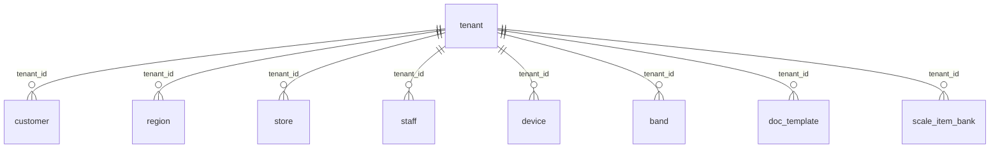
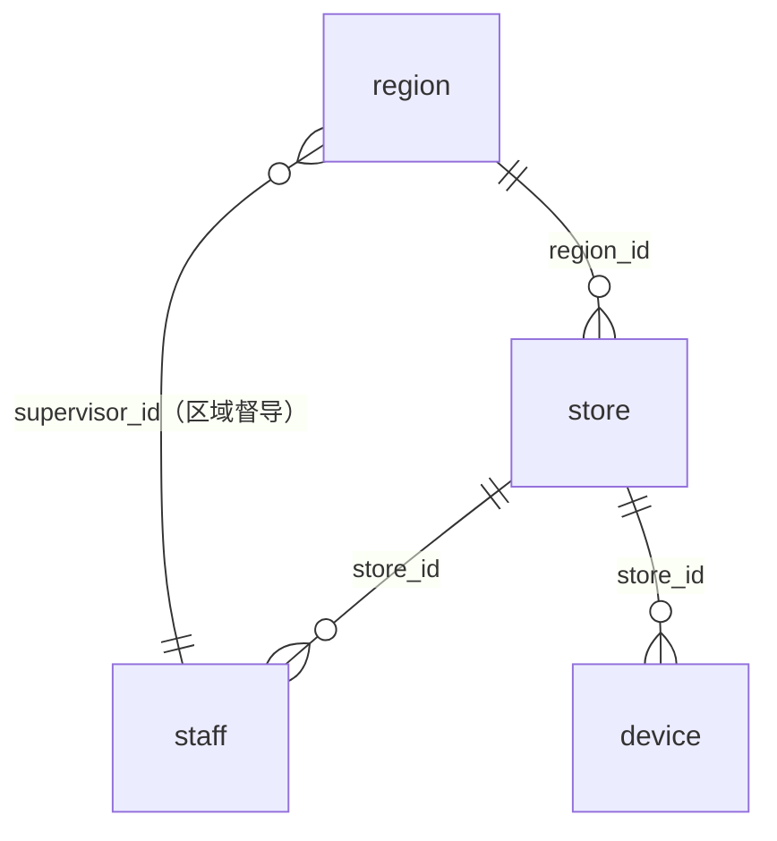
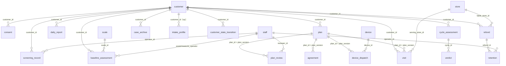
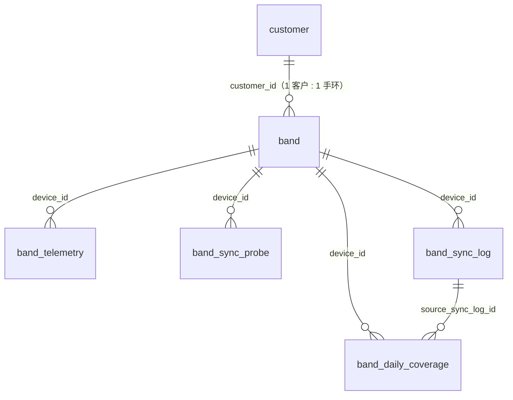
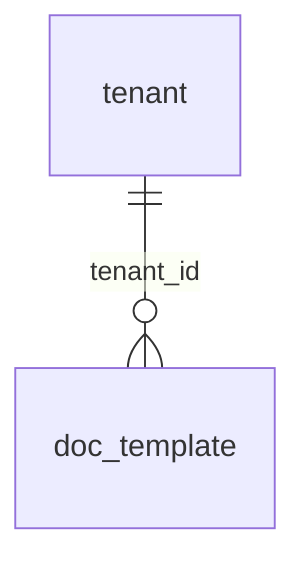

# 上医智养堂 · 后端实体关系图（ER）/ S1-2 交付件

> **版本**：2026-09-24 · 对应迁移链 `V1…V5`（Flyway 至 `v5`）
> **权威实体清单**：PRD §8（22 实体）；扩展见 `_work/data-dict-entities-ddl-2026-09-19.md`
> **本图来源**：**由真实库反向导出**（`diaoyuanyun_dev`，`information_schema` + `pg_constraint`），
> 非手工编造 —— 图上的每一条边都对应库中一条已生效的 `FOREIGN KEY`。
> **配套交付**：DDL 与迁移脚本入仓（`dy-app/src/main/resources/db/migration/V1..V5`）。

---

## 〇、实体账目（先对齐数字，再画图）

**业务表全量 = 30 张**（另含 3 张非业务/支撑表：`audit_log` · `schema_migration` · `flyway_schema_history`）。

| 分组 | 张数 | 实体 |
|---|---|---|
| **§8 权威实体** | **22** | `tenant` `region` `store` `staff` `device` `customer` `screening_record` `consent` `agreement` `scale` ★ `baseline_assessment` `plan` `plan_review` `device_dispatch` `visit` `daily_report` `band_telemetry` `cycle_assessment` `verdict` `refund` `retention` `case_archive` |
| **★ 扩展实体**（未入 §8，见字典 §2.23~2.25） | **3** | `intake_profile`（到店信息）· `scale_item_bank`（题库内容资产）· `customer_state_transition`（14 态状态机） |
| **手环域**（§8 的 `band_telemetry` 之外的补全） | **4** | `band`（手环主实体）· `band_sync_probe` · `band_sync_log` · `band_daily_coverage` |
| **文书域** | **1** | `doc_template`（文书模板：编辑/上传双来源） |
| **合计** | **30** | |

> 🛑 **显式列出，不默默改**（硬纪律）：
> 开发清单 S1-2 预留口径为「★3 实体 + 手环 3 表 = 全量 **28**」。
> 实际落库为 **30**，比预留多 **2** 张，差异**逐项列明**而非静默改动：
> ① **`band`** —— 手环**主实体**本身。V2 已建；三张手环同步表（`band_sync_*` / `band_daily_coverage`）
>    均以 `device_id → band(band_id)` 为 FK 靶点，缺它则 FK 悬空。
> ② **`doc_template`** —— 文书模板实体（`_work/doc-template-upload-capability-spec-2026-09-23.md` 明列 6 类文书、
>    编辑/上传双来源、≤10MB、SHA-256 去重）。原清单未预留，属**内容侧补全项**。
> 两项**均非凭空新增**，来源与理由均在 V5 的适配说明段（§9 A-x）与本表登记。

**非业务表（3 张，均为登记豁免）**：
`audit_log`（全局单链哈希，`tenant_id NOT NULL` 但**不启 RLS** —— 见待裁定单 **T-09**）·
`schema_migration`（我方元数据版本表）· `flyway_schema_history`（Flyway 自带）。

---

## 一、隔离主干（`tenant_id` 外键骨架）

**每张业务表 100% 带 `tenant_id` 外键 → `tenant(id)`**，且全部 `ENABLE`+`FORCE ROW LEVEL SECURITY`
+ 双 `NULLIF` fail-closed 策略（`USING` 与 `WITH CHECK` 同表达式）。

> 上图为**隔离主干**（7 条代表性边）。实际 **29 张租户表**逐表均有同一条 `tenant_id → tenant(id)` 边
> （总数见第三节）。图略其余 22 条同构边以保可读性。

---

## 二、业务关系图（按域分组）

### 2.1 组织域（region → store → staff / device）

- `region.supervisor_id → staff(staff_id)`：**区域督导**（条件 FK，V5 §8 中 DO 块闭合）。
- `region` **不产生业务数据**，仅汇总/督导授权（字典 §2.2）。

### 2.2 客户旅程域（筛查 → 同意 → 评估 → 方案 → 执行 → 判定 → 收口）

**要点（对应硬纪律）**：
- **`plan` 的 FK 是复合键**：`(plan_id, version)` —— 支撑「**判定依据版本不可覆盖**」，
  四张下游表（`plan_review` / `agreement` / `device_dispatch` / `visit`）全部指向 `plan(plan_id, version)`（V5 §8 闭合）。
- `customer.tenant_id` 归 **tenant 不归 store**；`owner / serving` 分离（U1）。
- `verdict.cycle_id → cycle_assessment(cycle_id)`：判定依据与阈值版本随周期评估落库。
- `retention.refund_id → refund(refund_id)`：挽留挂在回款单上（入口 B 不经挽留）。

### 2.3 手环域（band → 遥测 / 同步）

- **四张下游表 FK 靶点统一为 `band(band_id)`** —— 一个手环实体，四路数据（遥测/探测/同步/日覆盖）。
- `band_telemetry` 为**长表 `metric` 化**（F-2 定案=方案 A），`gap_reason` 7 值 CHECK，**缺失不补 0**。
- `band_sync_log.fail_stage` 仅契约 7 值；`band_daily_coverage.gap_reason` 仅 7 值（均有 `@Test` 守）。

### 2.4 文书域

- `doc_template`：`doc_type` 6 值 CHECK · `source_type` ∈ {编辑, 上传} · `mime_type` 3 值 ·
  `file_size ≤ 10485760`(10MB) · `file_hash CHAR(64)`(SHA-256) ·
  版本化唯一键 `(tenant_id, doc_type, version)` + **部分唯一索引**保证「**同租户同类型仅一个活跃版本**」·
  `ck_doc_template_content_or_file` CHECK 拒「既无内容又无文件」的残缺表单。

---

## 三、RLS 覆盖实测（真库）

在 `diaoyuanyun_dev`（Flyway 已至 `v5`）实测：

| 指标 | 值 |
|---|---|
| 业务表 | **30**（+3 支撑表 = 33 张 relation） |
| 启用 RLS（`relrowsecurity=t`） | **29** |
| 强制 RLS（`relforcerowsecurity=t`） | **29** |
| 未启 RLS | **3 张**：`audit_log` · `schema_migration` · `tenant`（+ Flyway 自带 `flyway_schema_history`） |

**未启 RLS 的逐项豁免说明**（3 项，全部登记在案）：
- `audit_log` —— 全局单链哈希，启用行级 RLS 会破坏链式校验（**T-09** 已登记读隔离缺口，🟡 P1，不阻塞）。
- `schema_migration` —— 我方元数据版本表（`NON_TENANT_TABLES` 登记项）。
- `tenant` —— **隔离根宿主表**（`TENANT_HOST_TABLES` 登记项）；其行即租户本身。

> `flyway_schema_history` 为 Flyway 自带表，不属业务面。

**三源交叉核对门禁**：`RlsCoverageGateTest` 强制
「迁移脚本文本 == `ISOLATION_TESTS` 登记表 == 真库 `information_schema`」三方一致，
且每个登记类必须 `Class.forName` 可加载 + **≥5 个 `@Test`**。
V5 的 24 张表已全部登记 → **29 张租户表 100% 有计划内隔离测试**。

---

## 四、S1-2 验收四项对照

| 验收项 | 状态 | 证据 |
|---|---|---|
| ① ER 图 + DDL + 迁移脚本入仓 | ✅ | **本文档**（ER，真库反向导出）+ `V1..V5` 迁移脚本 + 字典 DDL 规格 |
| ② 22 实体全覆盖 | ✅ | §8 的 **22 实体全部落库**；另扩展 8 张（★3 + 手环 4 + `doc_template`）→ **全量 30**，差异已显式登记（见 §〇） |
| ③ 所有业务表 100% 带 `tenant_id` 外键 | ✅ | **30/30**；真库实测 29 张启 RLS+FORCE（3 项豁免登记，见 §三） |
| ④ 迁移脚本连跑 2 次幂等、无报错 | ✅ | 全新库连跑 `V1→V5` **两遍 10/10 OK**；Flyway 二次启动 `Schema "public" is up to date. No migration necessary.` |

**④ 触发的一处真实缺陷修复**：V1 第 2 轮曾报
`错误: 用于表"customer"的策略"tenant_isolation"已经存在 (42710)`
（`CREATE POLICY` 无 `IF NOT EXISTS`）→ 已补 `DROP POLICY IF EXISTS tenant_isolation ON customer;` 守卫，
两轮复跑全绿。该修复使 V1 文件字节变化，已同步 Flyway `checksum`（dev 库 `version=1 → 1857458243`），
避免 `FlywayValidateException`。